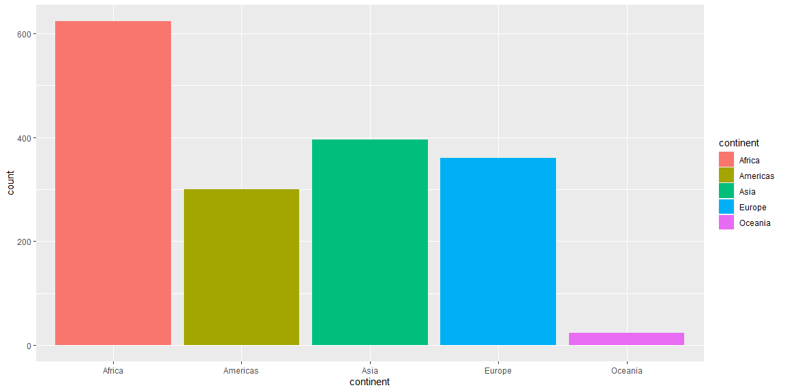
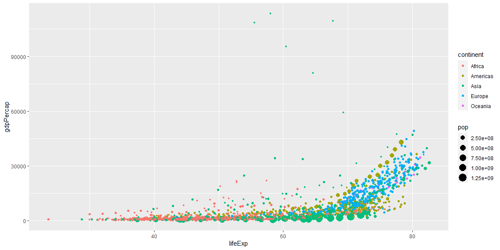

```r
# Use this R-Chunk to import all your datasets!
data <- gapminder
```

## Background

Hans Rosling is one of the most popular data scientists on the web. His original TED talk (Links to an external site.) set a new bar for data visualization. We are going to create some graphics using his formatted data as our weekly case study.

## Data Wrangling


```r
# Use this R-Chunk to clean & wrangle your data!
glimpse(data)
```

```
## Rows: 1,704
## Columns: 6
## $ country   <fct> Afghanistan, Afghanistan, Afghanistan, Afghanistan, Afgha...
## $ continent <fct> Asia, Asia, Asia, Asia, Asia, Asia, Asia, Asia, Asia, Asi...
## $ year      <int> 1952, 1957, 1962, 1967, 1972, 1977, 1982, 1987, 1992, 199...
## $ lifeExp   <dbl> 28.801, 30.332, 31.997, 34.020, 36.088, 38.438, 39.854, 4...
## $ pop       <int> 8425333, 9240934, 10267083, 11537966, 13079460, 14880372,...
## $ gdpPercap <dbl> 779.4453, 820.8530, 853.1007, 836.1971, 739.9811, 786.113...
```

## Data Visualization

Pick one quantitative variable and create a chart that summarizes the distribution.

I chose to look at the life expectancy for each continent. While the maximum life expectancy is very similar, the median life expectancy varies a lot from continent to continent. Asia has the highest maximum life expectancy but one of the lowest median life expectancies recorded.  

```r
# Use this R-Chunk to plot & visualize your data!
ggplot(data = data) + 
  stat_summary(
    mapping = aes(x = lifeExp, y = continent),
    fun.min = min,
    fun.max = max,
    fun = median
  )
```

<!-- -->

Pick one qualitative variable and create a chart that summarizes the distribution.  

This chart helps explain why Oceania has a very low spread in the above chart. There are very few countries there. Seeing how many countries there are in each continent gives more context when looking at data on the continental scale.

```r
# Use this R-Chunk to plot & visualize your data!
ggplot(data = data) +
  geom_bar(mapping = aes(x = continent,
                         fill = continent))
```

<!-- -->

Pick any two variables and create a chart that summarizes the bivariate distribution (the relationship between the two).  

This chart looks at the relationship between gdp per capita and life expectancy. I also included colors by continent and the size of the point is dependent on the population of the country. There is a clear trend between the two variables! I think it's interesting to note the higher life expectancy in many asian countries despite the lower gdp per capita and the lower life expectancy in African countries despite having a higher gdp per capita.  

```r
# Use this R-Chunk to plot & visualize your data!
ggplot(data = data) +
  geom_point(mapping = aes(x = lifeExp,
                           y = gdpPercap,
                         color = continent,
                         size = pop))
```

<!-- -->

Recreate the graphic shown below (get them to match as closely as you can)  

```r
# Use this R-Chunk to plot & visualize your data!
data %>% filter(country != "Kuwait") %>%
ggplot() +
  geom_point(mapping = aes(x = lifeExp,
                           y = gdpPercap,
                           size = pop / 100000,
                           color = continent)) +
  scale_y_continuous(trans = "sqrt") +
  facet_grid(~ year) +
  labs(x = "Life Expectancy", y = "GDP per capita", color = "Continent", size = "Population (100k)")
```

<!-- -->

```r
ggsave("plot.png", width = 19, device = "png", units = "in")
```

## Conclusions
