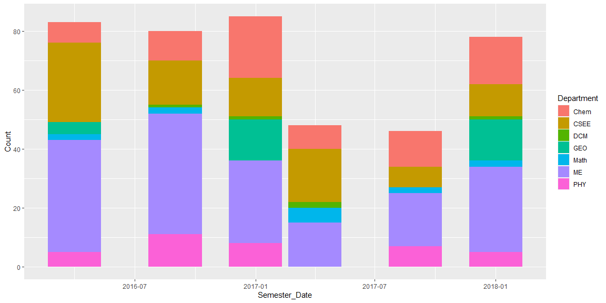
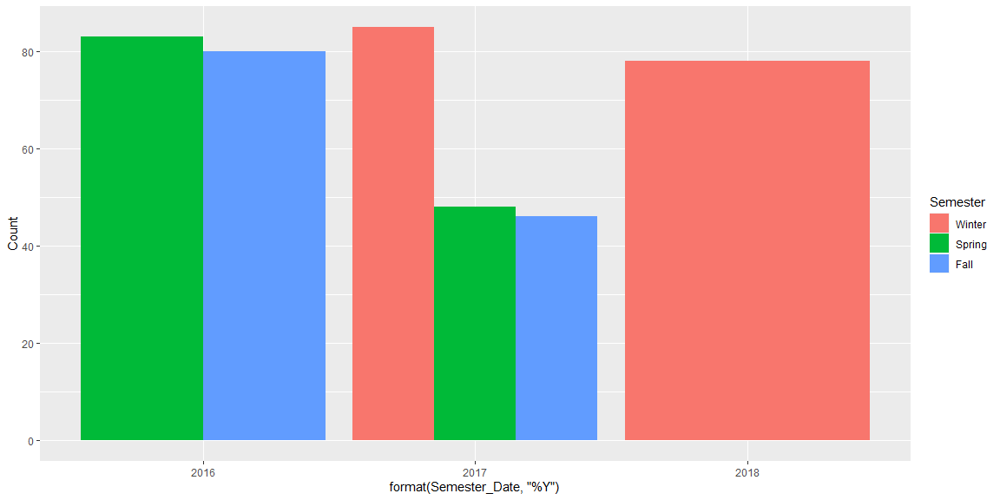
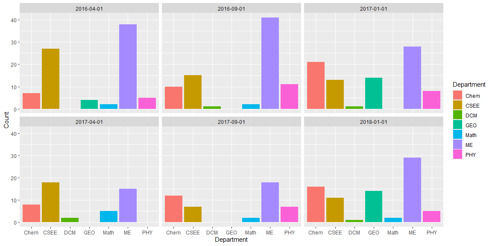

Study the code below and run it one line at a time to see the output. Include the code in your final report. Add a detailed comment to each line that explains what that particular line/function is doing.  


```r
library(readr) #loading readr library for read_csv
library(ggplot2) #loading ggplot2 library for ggplot

#Read a csv file from github, format values in each column
rcw <- read_csv("https://byuistats.github.io/M335/data/rcw.csv", 
                col_types = cols(Semester_Date = col_date(format = "%m/%d/%y"),
                                 Semester = col_factor(levels = c("Winter", "Spring", "Fall"))))
head(rcw) #display the first few rows of rcw
```

```
## # A tibble: 6 x 5
##    Year Semester Semester_Date Count Department
##   <dbl> <fct>    <date>        <dbl> <chr>     
## 1  2016 Spring   2016-04-01        7 Chem      
## 2  2016 Fall     2016-09-01       10 Chem      
## 3  2017 Winter   2017-01-01       21 Chem      
## 4  2017 Spring   2017-04-01        8 Chem      
## 5  2017 Fall     2017-09-01       12 Chem      
## 6  2018 Winter   2018-01-01       16 Chem
```

```r
#Show a graph using the data from rcw with x as the semester date, y as the count, and colored according to department. Overlay a line and point graph using this data
ggplot(data = rcw, 
       mapping = aes(x = Semester_Date, 
                     y = Count, 
                     color = Department)) +
  geom_line() +
  geom_point()
```

<!-- -->
  
[ ] Create your own chart to show R&CW attendance trends over time. Use at least one new function you learned from the Doing Readings.  
-Practice using the help files for functions you don't understand (such as ?geom_line() and ?geom_col())  
-There are examples at the end of every help file that you may find useful  


```r
# compare the total rcw entities for each conference and differentiate by depeartment
ggplot(data = rcw) +
  geom_bar(mapping = aes(x = Semester_Date,
                         y = Count,
                         fill = Department), stat = "identity")
```

<!-- -->

```r
# compare the total by sememster for each year
ggplot(data = rcw) +
  stat_summary(mapping = aes(x = format(Semester_Date, '%Y'),
                         y = Count,
                         fill = Semester),
           position = "dodge",
           geom = "bar",
           fun = "sum")
```

<!-- -->

```r
#compare the department by representation for each sememster, I decided to use facet instead of dodge because it was more readable.
ggplot(data = rcw) +
  geom_bar(mapping = aes(x = Department,
                         y = Count,
                         fill = Department),
           stat = "identity") + 
  facet_wrap(~ Semester_Date)
```

<!-- -->
  
[ ] Write a short description of the trends you see in the graphs.  
The RCW conference had less entities in spring and fall of 2017. It would be interesting to see if this trend continues for 2018 and future years. The ME department had the most entities for almost every conference except for Spring 2017 where CSEE had the most. ME, CSEE, and CHEM consistently had a lot of representation while the other departments struggled more.


