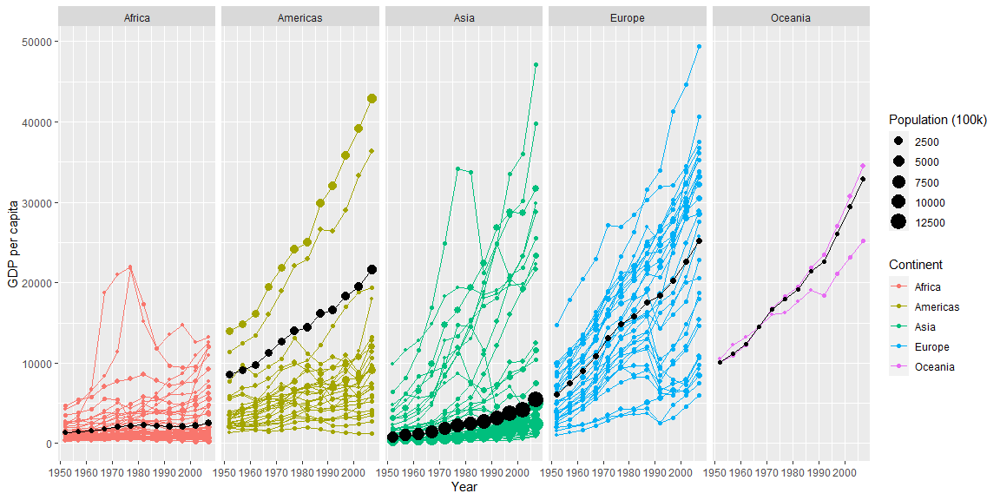
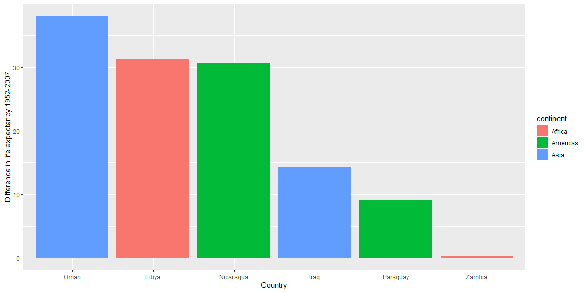

```r
# Use this R-Chunk to import all your datasets!
gapminder
```

```
## # A tibble: 1,704 x 6
##    country     continent  year lifeExp      pop gdpPercap
##    <fct>       <fct>     <int>   <dbl>    <int>     <dbl>
##  1 Afghanistan Asia       1952    28.8  8425333      779.
##  2 Afghanistan Asia       1957    30.3  9240934      821.
##  3 Afghanistan Asia       1962    32.0 10267083      853.
##  4 Afghanistan Asia       1967    34.0 11537966      836.
##  5 Afghanistan Asia       1972    36.1 13079460      740.
##  6 Afghanistan Asia       1977    38.4 14880372      786.
##  7 Afghanistan Asia       1982    39.9 12881816      978.
##  8 Afghanistan Asia       1987    40.8 13867957      852.
##  9 Afghanistan Asia       1992    41.7 16317921      649.
## 10 Afghanistan Asia       1997    41.8 22227415      635.
## # ... with 1,694 more rows
```

```r
glimpse(gapminder)
```

```
## Rows: 1,704
## Columns: 6
## $ country   <fct> Afghanistan, Afghanistan, Afghanistan, Afghanistan, Afgha...
## $ continent <fct> Asia, Asia, Asia, Asia, Asia, Asia, Asia, Asia, Asia, Asi...
## $ year      <int> 1952, 1957, 1962, 1967, 1972, 1977, 1982, 1987, 1992, 199...
## $ lifeExp   <dbl> 28.801, 30.332, 31.997, 34.020, 36.088, 38.438, 39.854, 4...
## $ pop       <int> 8425333, 9240934, 10267083, 11537966, 13079460, 14880372,...
## $ gdpPercap <dbl> 779.4453, 820.8530, 853.1007, 836.1971, 739.9811, 786.113...
```

## Background

_Place Task Background Here_

## Data Wrangling


```r
# Use this R-Chunk to clean & wrangle your data!
data = filter(gapminder, country != "Kuwait") %>%
  group_by(continent, year) %>%
  mutate(mean_gdp_percontinent = weighted.mean(gdpPercap, pop)) %>%
  ungroup()
```

## Data Visualization


```r
# Use this R-Chunk to plot & visualize your data!
ggplot(data) +
  geom_point(mapping = aes(x = year,
                           y = gdpPercap,
                           size = pop / 100000,
                           group = country,
                           color = continent)) +
  geom_line(mapping = aes(x = year,
                           y = gdpPercap,
                           group = country,
                           color = continent)) +
  geom_line(mapping = aes(x = year,
                           y = mean_gdp_percontinent)) +
  geom_point(mapping = aes(x = year,
                           y = mean_gdp_percontinent,
                           size = pop / 100000)) +
  facet_grid(~ continent) +
  labs(x = "Year", y = "GDP per capita", color = "Continent", size = "Population (100k)")
```

<!-- -->

```r
data %>%
  filter(continent %in% c("Africa", "Americas", "Asia")) %>%
  group_by(country) %>%
  filter(year == c(1952, 2007)) %>%
  mutate(lifeExp_dif = abs(lifeExp - lag(lifeExp))) %>%
  ungroup() %>%
  group_by(continent) %>%
  filter(lifeExp_dif %in% range(lifeExp_dif, na.rm = TRUE)) %>%
  ungroup() %>%
  ggplot(aes(x = reorder(country, -lifeExp_dif), y = lifeExp_dif, fill = continent)) + 
  geom_bar(stat = "identity") +
  labs(y = "Difference in life expectancy 1952-2007", x = "Country")
```

<!-- -->

## Conclusions
