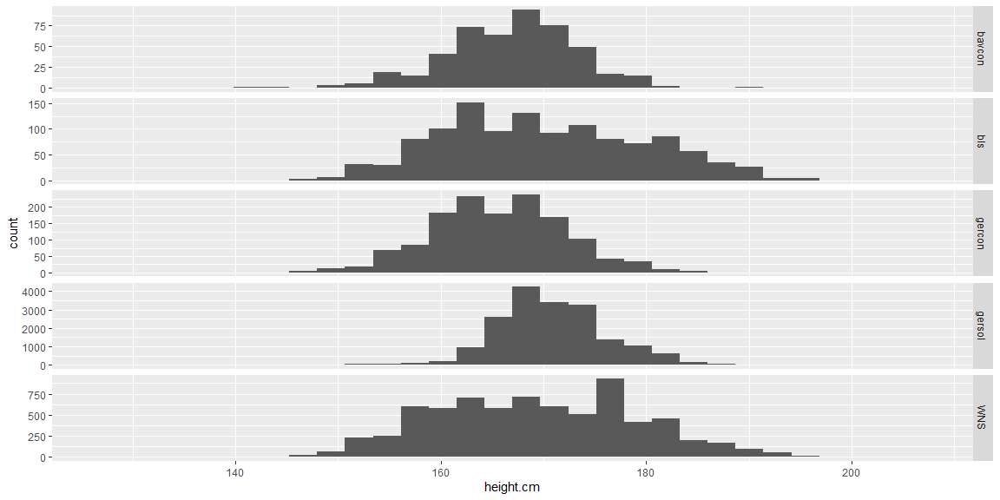
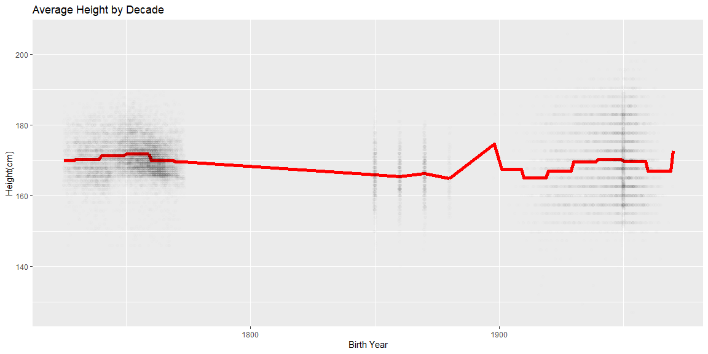

```r
# Use this R-Chunk to import all your datasets!
dat_gercon <- read_dta("https://byuistats.github.io/M335/data/heights/germanconscr.dta")

dat_bavcon <- read_dta("https://byuistats.github.io/M335/data/heights/germanprison.dta")

url_heights_se <- "https://byuistats.github.io/M335/data/heights/Heights_south-east.zip"
zip_file <- tempfile()
unzip_dir <- tempfile()
downloader::download(url_heights_se, zip_file, mode = "wb")
unzip(zipfile = zip_file, exdir = unzip_dir)
file_name <- list.files(unzip_dir, pattern = "DBF")
file_name
```

```
## [1] "B6090.DBF"
```

```r
dat_dbf <- read.dbf(file = file.path(unzip_dir, file_name))

dat_bls <- read_csv("https://github.com/hadley/r4ds/raw/master/data/heights.csv")

dat_nsheight <- read_sav("http://www.ssc.wisc.edu/nsfh/wave3/NSFH3%20Apr%202005%20release/main05022005.sav")
```

## Background

The Scientific American argues (Links to an external site.) that humans have been getting taller over the years. As the data scientists that we are becoming, we would like to find data that validates this concept. Our challenge is to show different male heights across the centuries.

This project is not as severe as the two quotes below, but it will give you a taste of pulling various data and file formats together into “tidy” data for visualization and analysis. 

“Classroom data are like teddy bears and real data are like a grizzly bear with salmon blood dripping out its mouth.” - Jenny Bryan (Links to an external site.)
“Up to 80% of data analysis is spent on the process of cleaning and preparing data” - Hadley Wickham (Links to an external site.)
 

## Data Wrangling


```r
# Use this R-Chunk to clean & wrangle your data!
gercon <- dat_gercon %>%
  mutate(birth_year = bdec) %>%
  rename(height.cm = height) %>%
  mutate(height.in = height.cm/2.54) %>%
  mutate(study_id = "gercon") %>%
  select(birth_year, height.cm, height.in, study_id) %>%
  glimpse(width = 60)
```

```
## Rows: 1,382
## Columns: 4
## $ birth_year <dbl> 1850, 1850, 1850, 1850, 1850, 1850, ...
## $ height.cm  <dbl> 169.62, 156.47, 172.45, 168.22, 166....
## $ height.in  <dbl> 66.77953, 61.60236, 67.89370, 66.228...
## $ study_id   <chr> "gercon", "gercon", "gercon", "gerco...
```

```r
bavcon <- dat_bavcon %>%
  mutate(birth_year = bdec) %>%
  rename(height.cm = height) %>%
  mutate(height.in = height.cm/2.54) %>%
  mutate(study_id = "bavcon") %>%
  select(birth_year, height.cm, height.in, study_id) %>%
  glimpse(width = 60)
```

```
## Rows: 477
## Columns: 4
## $ birth_year <dbl> 1850, 1850, 1850, 1850, 1850, 1850, ...
## $ height.cm  <dbl> 156, 168, 161, 159, 175, 173, 173, 1...
## $ height.in  <dbl> 61.41732, 66.14173, 63.38583, 62.598...
## $ study_id   <chr> "bavcon", "bavcon", "bavcon", "bavco...
```

```r
gersol <- dat_dbf %>%
  mutate(birth_year = GEBJ) %>%
  mutate(height.cm = CMETER) %>%
  mutate(height.in = height.cm/2.54) %>%
  mutate(study_id = "gersol") %>%
  select(birth_year, height.cm, height.in, study_id) %>%
  glimpse(width = 60)
```

```
## Rows: 18,247
## Columns: 4
## $ birth_year <int> 1733, 1737, 1750, 1734, 1734, 1737, ...
## $ height.cm  <dbl> 177.55, 165.39, 172.68, 172.68, 176....
## $ height.in  <dbl> 69.90157, 65.11417, 67.98425, 67.984...
## $ study_id   <chr> "gersol", "gersol", "gersol", "gerso...
```

```r
bls <- dat_bls %>%
  mutate(birth_year = 1950) %>%
  rename(height.in = height) %>%
  mutate(height.cm = height.in * 2.54) %>%
  mutate(study_id = "bls") %>%
  select(birth_year, height.cm, height.in, study_id) %>%
  glimpse(width = 60)
```

```
## Rows: 1,192
## Columns: 4
## $ birth_year <dbl> 1950, 1950, 1950, 1950, 1950, 1950, ...
## $ height.cm  <dbl> 189.0381, 166.4654, 161.6182, 160.29...
## $ height.in  <dbl> 74.42444, 65.53754, 63.62920, 63.108...
## $ study_id   <chr> "bls", "bls", "bls", "bls", "bls", "...
```

```r
wns <- dat_nsheight %>% 
  filter(RT216I >= 0,RT216I <= 11) %>%
  mutate(birth_year = DOBY + 1900) %>%
  mutate(height.in = (RT216F * 12) + RT216I) %>%
  mutate(height.cm = height.in * 2.54) %>%
  mutate(study_id = "WNS") %>%
  select(birth_year, height.cm, height.in, study_id) %>%
  glimpse(width = 60)
```

```
## Rows: 7,252
## Columns: 4
## $ birth_year <dbl> 1940, 1940, 1912, 1961, 1954, 1954, ...
## $ height.cm  <dbl> 152.40, 170.18, 165.10, 167.64, 157....
## $ height.in  <dbl> 60, 67, 65, 66, 62, 71, 64, 67, 69, ...
## $ study_id   <chr> "WNS", "WNS", "WNS", "WNS", "WNS", "...
```

```r
height_dat <- bind_rows(gercon, bavcon, gersol, bls, wns)
```

## Data Visualization


```r
# Use this R-Chunk to plot & visualize your data!
ggplot(data = height_dat, aes(x=height.cm)) +
  geom_histogram() + 
  facet_grid(rows = vars(study_id), scales = "free_y")
```

<!-- -->

```r
#find average height for each decade
height_dat <- height_dat %>%
  mutate(decade = floor(birth_year/10)*10) %>%
  group_by(decade) %>%
  mutate(avg_height = mean(height.cm)) %>%
  ungroup()

ggplot(data = height_dat, aes(x = birth_year)) +
  geom_line(aes(y=avg_height), color = "red", size = 2) + 
  geom_jitter(aes(y=height.cm), alpha = .005) + 
  labs(x = "Birth Year", y = "Height(cm)", title = "Average Height by Decade")
```

<!-- -->

## Conclusions
Based on the data gathered, there does not seem to be any significant change in height over the years. It is interesting to see that there was a greater diversity in height in the 1950s than other years. This may account for the claim that the average height is increasing.
