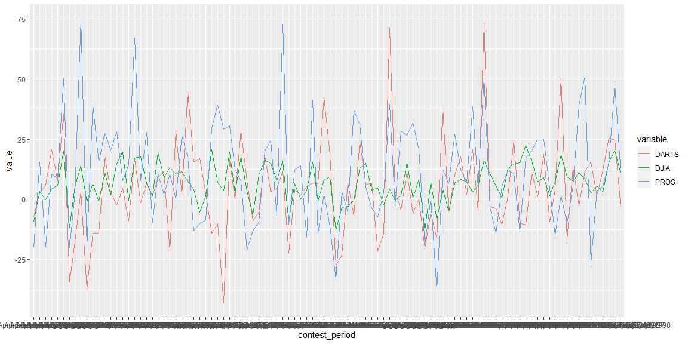

-- Notes  
Each variable must have its own column.  
Each observation must have its own row.  
Each value must have its own cell.  
  
Sometimes column names are values, use pivot_longer() to make these into rows  
eg. pivot_longer(c(`1999`, `2000`), names_to = "year", values_to = "cases")  
  
If an observation is scattered accross multiple rows (a column name is a value) use pivot_wider.  
eg. pivot_wider(names_from = type, values_from = count)  

seperate columns using separate()  
eg. separate(rate, into = c("cases", "population"), sep = "/")  
unite eg. unite(new, century, year, sep = "")  


```r
# Use this R-Chunk to import all your datasets!
stocks <- read_rds(url("https://github.com/byuistats/data/blob/master/Dart_Expert_Dow_6month_anova/Dart_Expert_Dow_6month_anova.RDS?raw=true")) 
```

## Background

In 1973 Princeton University professor Burton Malkiel said (Links to an external site.),

A blindfolded monkey throwing darts at a newspaper’s financial pages could select a portfolio that would do just as well as one carefully selected by experts.

In 1990 the Wall Street Journal took Burton up on his challenge. They ran this challenge until 2002 and pitted random dart throwing selections to expert picks. 

We have access to stock return data through 1998. Open the dataset and get familiar with it. The "PROS" rows contain returns that professional investors were able to achieve at that date. The "DARTS" rows contain returns of stocks that were selected by monkeys randomly throwing darts. The "DJIA" are returns for stocks in the Dow Jones Industrial Average. The Dow Jones Industrial Average is a group of 30 stocks for large companies with stable earnings. This "index" of stocks is one of the oldest, most closely watched indices in the world and is designed to serve as a proxy, or indicator, of the United States economy in general. (learn about about "the Dow". (Links to an external site.))

We want to look at the returns for each six-month period of the year in which the returns were reported. Your plot should highlight the tighter spread of the DJIA as compared to the other two selection methods (DARTS and PROS). We also need to tidy the data in order to display a table of the DJIA returns with months on the rows and years in the columns (i.e. pivot wider on the data).

## Data Wrangling


```r
# Use this R-Chunk to clean & wrangle your data!
tidy_stocks <- stocks %>%
  separate(contest_period, into = c("start", "end"), sep = "-") %>%
  mutate(end = str_replace_all(end, c("Dec." = "December", "Febuary" = "February"))) %>%
  mutate(end = str_replace_all(end, c("Decembermber" = "December")))

tidy_stocks <- subset (tidy_stocks, select = -start) %>%
  separate(end, into = c("month", "year"), sep = "(?<=[A-Za-z])(?=[0-9])") %>%
  pivot_wider(names_from = year, values_from = value) %>%
  filter(variable == "DJIA")

tidy_stocks[order(match(tidy_stocks$month, month.name)), ]
```

```
## # A tibble: 12 x 11
##    month variable `1990` `1991` `1992` `1993` `1994` `1995` `1996` `1997` `1998`
##    <chr> <chr>     <dbl>  <dbl>  <dbl>  <dbl>  <dbl>  <dbl>  <dbl>  <dbl>  <dbl>
##  1 Janu~ DJIA       NA     -0.8    6.5   -0.8   11.2    1.8   15     19.6   -0.3
##  2 Febr~ DJIA       NA     11      8.6    2.5    5.5    3.2   15.6   20.1   10.7
##  3 March DJIA       NA     15.8    7.2    9      1.6    7.3   18.4    9.6    7.6
##  4 April DJIA       NA     16.2   10.6    5.8    0.5   12.8   14.8   15.3   22.5
##  5 May   DJIA       NA     17.3   17.6    6.7    1.3   19.5    9     13.3   10.6
##  6 June  DJIA        2.5   17.7    3.6    7.7   -6.2   16     10.2   16.2   15  
##  7 July  DJIA       11.5    7.6    4.2    3.7   -5.3   19.6    1.3   20.8    7.1
##  8 Augu~ DJIA       -2.3    4.4   -0.3    7.3    1.5   15.3    0.6    8.3  -13.1
##  9 Sept~ DJIA       -9.2    3.4   -0.1    5.2    4.4   14      5.8   20.2  -11.8
## 10 Octo~ DJIA       -8.5    4.4   -5      5.7    6.9    8.2    7.2    3     NA  
## 11 Nove~ DJIA      -12.8   -3.3   -2.8    4.9   -0.3   13.1   15.1    3.8   NA  
## 12 Dece~ DJIA       -9.3    6.6    0.2    8      3.6    9.3   15.5   -0.7   NA
```

## Data Visualization


```r
# Use this R-Chunk to plot & visualize your data!
ggplot(stocks, mapping = aes(x=contest_period, y=value, group = variable)) +
  geom_line(mapping = aes(color = variable))
```

<!-- -->

## Conclusions
DJIA was more consistent than DARTS and PROS. The others had extreme variateions while DJIA remained more moderate.
