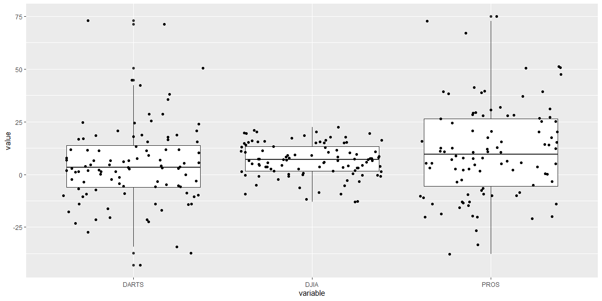

```r
# Use this R-Chunk to import all your datasets!
rds <- read_rds(url("https://github.com/byuistats/data/blob/master/Dart_Expert_Dow_6month_anova/Dart_Expert_Dow_6month_anova.RDS?raw=true"))

xlsx_file <- tempfile()
download("https://github.com/byuistats/data/blob/master/Dart_Expert_Dow_6month_anova/Dart_Expert_Dow_6month_anova.xlsx?raw=true",mode="wb", destfile=xlsx_file)
xlsx <- read_xlsx(xlsx_file)

dta <-read_dta("https://github.com/byuistats/data/blob/master/Dart_Expert_Dow_6month_anova/Dart_Expert_Dow_6month_anova.dta?raw=true")

sav <- read_sav("https://github.com/byuistats/data/blob/master/Dart_Expert_Dow_6month_anova/Dart_Expert_Dow_6month_anova.sav?raw=true")

csv <- read_csv("https://github.com/byuistats/data/blob/master/Dart_Expert_Dow_6month_anova/Dart_Expert_Dow_6month_anova.csv?raw=true")

all.equal(c(csv, dta, rds, sav, xlsx), csv)
```

```
## [1] "Attributes: < names for current but not for target >"             
## [2] "Attributes: < Length mismatch: comparison on first 0 components >"
## [3] "Length mismatch: comparison on first 3 components"
```

## Background

Data formats are varied and differ by domains and software. We could spend weeks on the different formats and file types that companies and governments use to store their data. We will practice with a few standard formats that are often used for storing data. In the future, you will most likely have to do some research to figure out other formats (but you can do it with R or Python). We have a challenge to read in the five formats of the DOW data (Links to an external site.) from the previous task and checking that they are all identical using all.equal(). One final note, your R script should do all the work. That is your script should download the files and/or read directly from the web location of the file.

## Data Wrangling


```r
# Use this R-Chunk to clean & wrangle your data!
```

## Data Visualization


```r
# Use this R-Chunk to plot & visualize your data!
ggplot(data = csv, mapping = aes(y = value, x = variable)) +
  geom_boxplot() + 
  geom_jitter()
```

<!-- -->

## Conclusions
