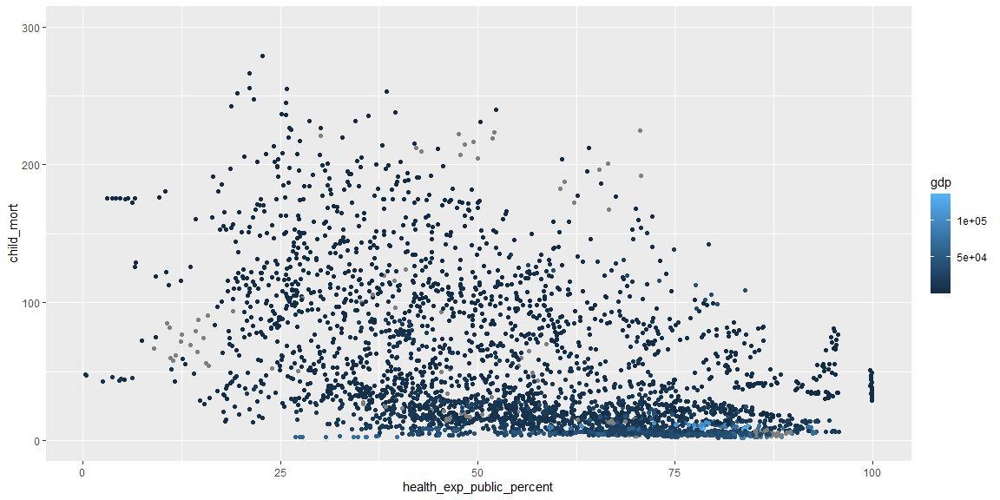
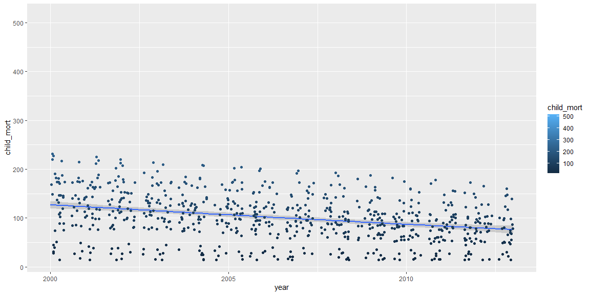
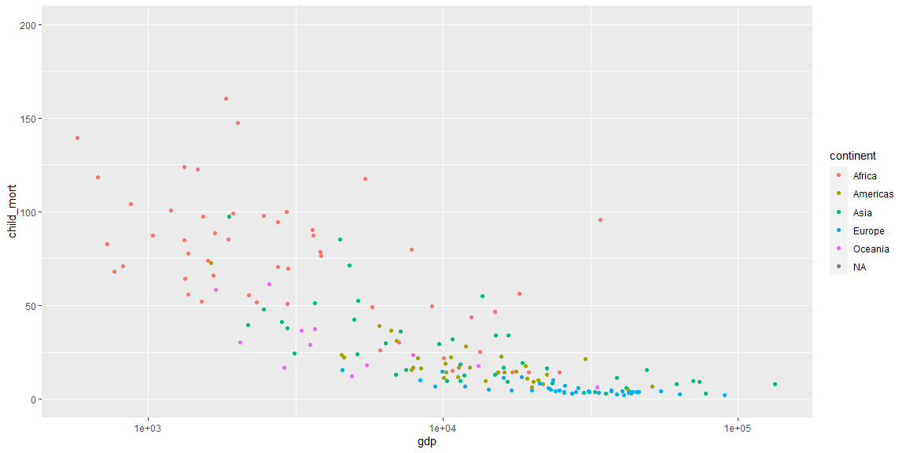
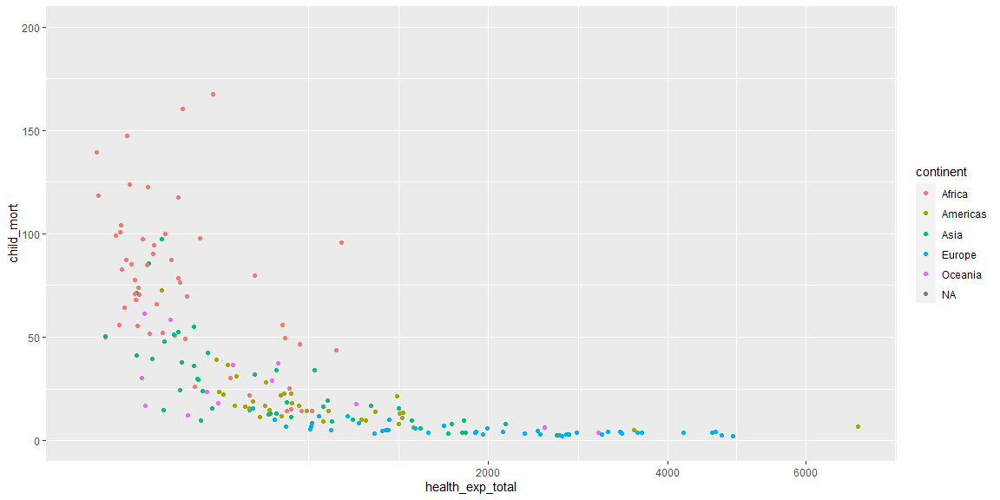
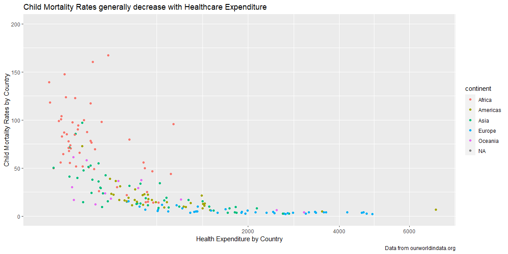

```r
# Use this R-Chunk to import all your datasets!
healthcare <- financing_healthcare
```

## Background

The Our World in Data (Links to an external site.) website publishes articles and graphics that provide insight into world data. Once again, we are going to build visualizations in R using their data. This time we will use the financing_healthcare dataset in the ourworldindata package.

## Data Exploration


```r
# Use this R-Chunk to clean & wrangle your data!
healthcare %>%
  ggplot(mapping = aes(y=child_mort, x = health_exp_public_percent, color = gdp)) +
  geom_jitter() +
  ylim(0,300)
```

<!-- -->

```r
healthcare %>%
  filter(continent == "Africa") %>%
  ggplot(mapping = aes(y = child_mort, x = year, color = child_mort)) +
  geom_smooth() +
  geom_jitter() +
  xlim(2000, 2013)
```

<!-- -->

```r
healthcare %>%
  filter(year == "2013") %>%
  ggplot(mapping = aes(y = child_mort, x = gdp, color = continent)) +
  geom_jitter() +
  ylim(0,200) +
  scale_x_continuous(trans = 'log10')
```

<!-- -->

```r
healthcare %>%
  filter(year == "2013") %>%
  ggplot(mapping = aes(y = child_mort, x = health_exp_total, color = continent)) +
  geom_jitter() +
  ylim(0,200) +
  scale_x_continuous(trans = 'sqrt')
```

<!-- -->

## Visualization fro Presentation


```r
# Use this R-Chunk to plot & visualize your data!
healthcare %>%
  filter(year == "2013") %>%
  ggplot(mapping = aes(y = child_mort, x = health_exp_total, color = continent)) +
  geom_jitter() +
  ylim(0,200) +
  scale_x_continuous(trans = 'sqrt') +
  labs(title = "Child Mortality Rates generally decrease with Healthcare Expenditure", caption = "Data from ourworldindata.org",
       x = "Health Expenditure by Country",
       y = "Child Mortality Rates by Country")
```

<!-- -->

## Conclusions
This graphic shows a clear relation between the total health expenditure in a country and the child mortality rates in that country. Countries that struggle with high child mortality rates could benefit from monetary aid!
