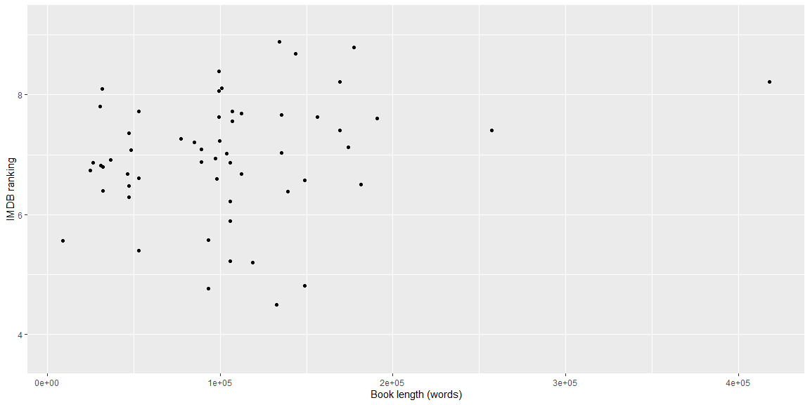

```r
# Use this R-Chunk to import all your datasets!
adaptations <- read_csv("Books into Movies.csv")
## https://www.kaggle.com/padmanabh275/books-into-movies

movies <- read_csv("IMDb movies.csv")
##https://www.kaggle.com/stefanoleone992/imdb-extensive-dataset?select=IMDb+movies.csv

books <- read_csv("books.csv")
##https://www.kaggle.com/jealousleopard/goodreadsbooks

book_length <- read_csv("book length movie length raw data - scatter.csv")
##https://www.overthinkingit.com/2013/08/12/book-word-count-movie-length-2/
```

## Background

_Place Task Background Here_

## Data Wrangling


```r
# Use this R-Chunk to clean & wrangle your data!
book_length %>%
  glimpse() %>%
  ggplot(mapping = aes(y = `IMDB ranking`, x = `Book length (words)`)) +
  geom_jitter()
```

```
## Rows: 72
## Columns: 10
## $ Group                               <chr> NA, NA, NA, NA, NA, NA, NA, NA,...
## $ Title                               <chr> "A Message to Garcia", "Valley ...
## $ `Movie Year`                        <dbl> 1936, 1967, 1956, 2006, 1972, 1...
## $ `Movie Length (minutes)`            <dbl> 77, 123, 92, 99, 175, 124, 101,...
## $ `IMDB ranking`                      <dbl> 6.2, 5.4, 6.4, 4.7, 9.2, 8.2, 6...
## $ `Book Year`                         <dbl> 1899, 1966, 1951, 1993, 1969, 1...
## $ `Book length (words)`               <dbl> NA, NA, NA, NA, NA, NA, NA, NA,...
## $ `Movie Length (seconds)`            <dbl> 4620, 7380, 5520, 5940, 10500, ...
## $ `Words in book per second of movie` <dbl> 0.000000, 0.000000, 0.000000, 0...
## $ `Wikipedia best sellers?`           <chr> "y", "y", "y", "y", "y", "y", "...
```

<!-- -->

## Data Visualization


```r
# Use this R-Chunk to plot & visualize your data!
```

## Conclusions
