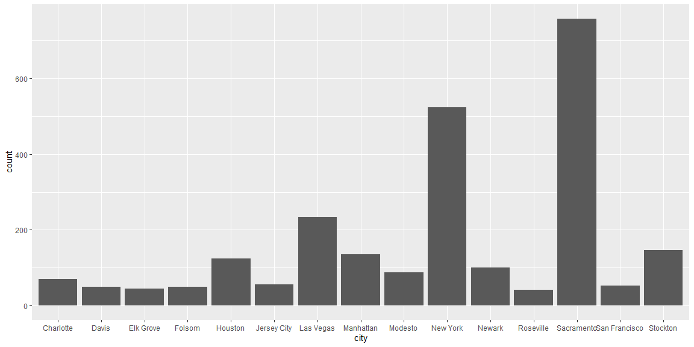
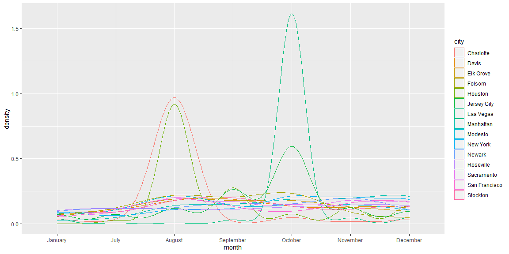
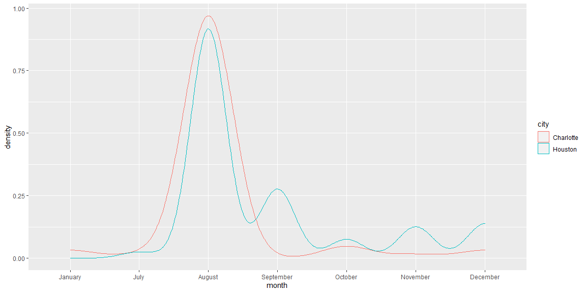

```r
# Use this R-Chunk to import all your datasets!
ABC7 <- read_csv("https://storybench.org/reinventingtv/abc7ny.csv")
KCRA <- read_csv("https://storybench.org/reinventingtv/kcra.csv")
headlines <- full_join(ABC7, KCRA)

city_names <- substr(us.cities$name, 1, nchar(us.cities$name) - 3) %>%
  str_flatten(collapse = "|")
```

## Background

You are working for management consulting agency A.T. Kearney which produces the Global Cities report (Links to an external site.). They have put you on a team in charge of developing a new report - the USA Cities report - which identifies the most influential cities in the United States.

Your manager would like to explore using the frequency with which a city appears in news headlines as a contributing factor to their city rankings. You find data from two major news outlets: one in California (KCRA) and one in New York (ABC7NY). The data spans July 18, 2017 - Jan 16, 2018. You will use the headlines to find which cities are mentioned most in the news.

Specifically, you should identify the 15 cities with the highest headline count overall. You are curious if these cities have sustained headlines over time or if there was a singular event that spiked the headline count. You will also use headline counts to compare individual cities.

After completing the tasks, you might like to run this code again with updated information. Make sure you are writing reproducible code that would work with a larger, more up-to-date dataset.

Resources

## Data Wrangling


```r
# Use this R-Chunk to clean & wrangle your data!
headlines_city <- headlines %>%
  select(headline, datetime) %>%
  mutate(month = sapply(strsplit(datetime, " "), '[', 1)) %>%
  mutate(month = ordered(month, levels = c("January", "February", "March", "April", "May", "June", "July", "August", "September", "October", "November", "December"))) %>%
  mutate(city = str_extract(headline,city_names)) %>% 
  filter(!is.na(city)) %>% 
  mutate(contains_sandy = str_detect(headline,"(?<!Superstorm )Sandy(?! Kenyon)(?! Hook)")) %>%
  mutate(contains_moore = str_detect(headline,"(?<!Brian )(?!Roy )Moore")) %>%
  subset((contains_sandy == TRUE & contains_moore == TRUE) | (city != "Sandy" & city != "Moore"))

headlines_count_15 <- headlines_city %>% 
  group_by(city) %>% 
  summarise(
    count = n()
  ) %>%
  arrange(desc(count)) %>%
  slice(seq_len(15))

headlines_city_15 <- right_join(headlines_city, headlines_count_15)
```

## Data Visualization


```r
# Use this R-Chunk to plot & visualize your data!
ggplot(headlines_city_15, aes(x = city)) +
  geom_bar()
```

<!-- -->
These results make sense to me. I filtered out mentions of Sandy and Moore as these where related to events and not cities.

```r
ggplot(headlines_city_15, aes(x = month, group = city, color = city)) +
  geom_density()
```

<!-- -->
There was a huge spike in Las Vegas in October. Looking at the news this correlates to a shooting that happened at that time.The spike in Charlotte at the time correlates to a white nationalist rally. August in Houston had a lot of floods.

```r
headlines_city %>%
  filter(city %in% c('Houston', 'Charlotte')) %>%
  ggplot(aes(x=month, group = city, color = city)) +
  geom_density()
```

<!-- -->
## Conclusions
Houston and Charlotte both had major events occur during August. Houston was hit by floods while Charlottesville was home to a violent white nationalist rally.
