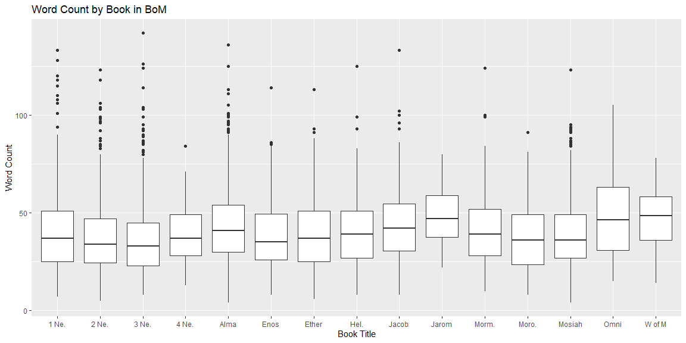

```r
# Use this R-Chunk to import all your datasets!
Scriptures <- read_csv("lds-scriptures.csv")
```

## Background

In 1978 Susan Easton Black penned an article (Links to an external site.) in the Ensign titled Names of Christ in the Book of Mormon which claims "even statistically, he is the dominant figure of the Book of Mormon".  Similar to Susan Black, we are going to use our string skills to count words and occurrences in the New Testament and in the Book of Mormon.

What is the average verse length (number of words) in the New Testament compared to the Book of Mormon?
How often is the word "Jesus" in the New Testament compared to the Book of Mormon?
What does the distribution of verse word counts look like for each book in the Book of Mormon?

## Data Wrangling
### BoM Average Verse Length

```r
# Use this R-Chunk to clean & wrangle your data!
BoM <- filter(Scriptures, volume_id == 3)
BoM_mean <- mean(sapply(strsplit(as.character(BoM$scripture_text), "[[:space:]]+"), length))

BoM_mean
```

```
## [1] 40.41838
```
### New Testament Average Verse Length

```r
NT <- filter(Scriptures, volume_id == 2)
NT_mean <- mean(sapply(strsplit(as.character(NT$scripture_text), "[[:space:]]+"), length))

NT_mean
```

```
## [1] 22.66935
```
### Number of "Jesus" mentions in BoM

```r
BoM_Jesus <- sum(str_count(BoM$scripture_text, "Jesus"))

BoM_Jesus
```

```
## [1] 184
```
### Number of "Jesus" mentions in NT

```r
NT_Jesus <- sum(str_count(NT$scripture_text, "Jesus"))

NT_Jesus
```

```
## [1] 976
```

## Data Visualization


```r
# Use this R-Chunk to plot & visualize your data!
BoM <- BoM %>%
  group_by(book_title) %>%
  mutate(word_count = sapply(strsplit(as.character(scripture_text), "[[:space:]]+"), length))
 
ggplot(BoM, aes(y = word_count, x = book_short_title)) +
  geom_boxplot() +
  labs(x = "Book Title", y = "Word Count", title = "Word Count by Book in BoM")
```

<!-- -->

## Conclusions
While all the books have similar mean word counts, the range from book to book varies significantly. This could be used as evidence that there were different authors of each book. The script was not split into verses by its original authors, but the fact that the verses added later show differences in writing style still points to more authors than just Joseph Smith.
