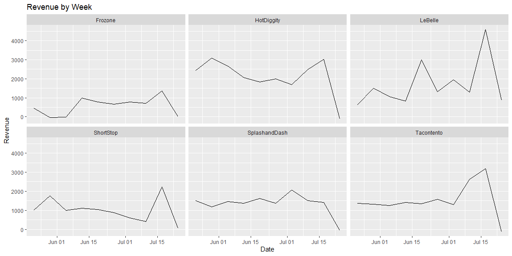
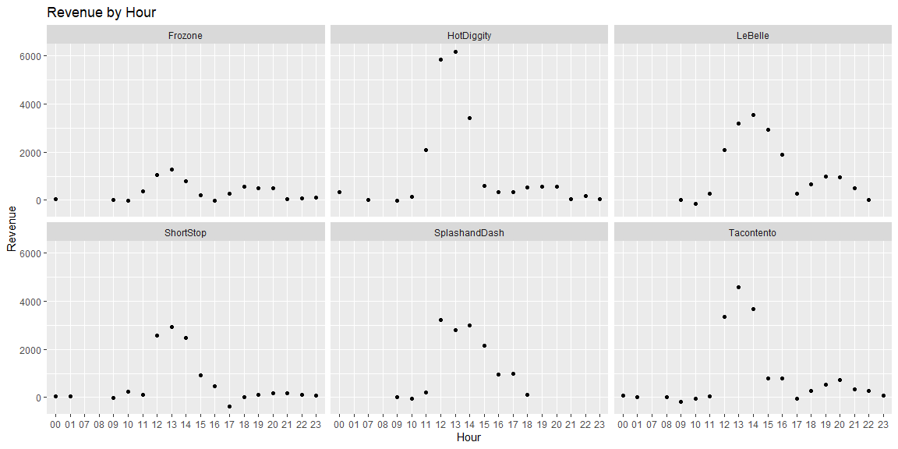
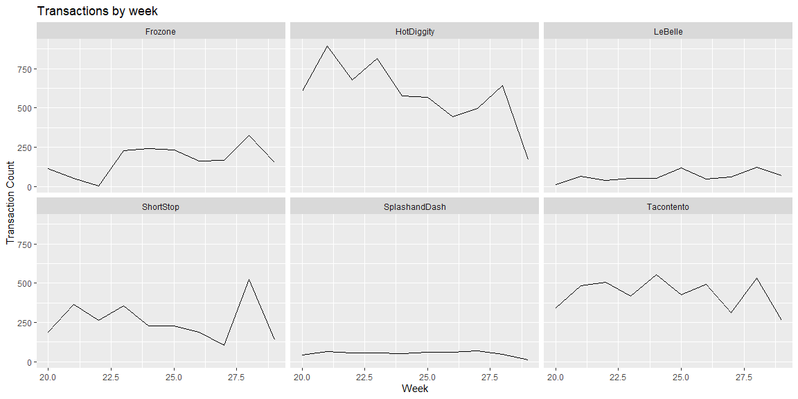

```r
# Use this R-Chunk to import all your datasets!
sales <- read_csv("https://byuistats.github.io/M335/data/sales.csv")
```

## Background

We have transaction data for a few businesses that have been in operation for three months. Each of these companies has come to your investment company for a loan to expand their business. Your boss has asked you to go through the transactions for each business and provide daily, weekly, and monthly gross revenue summaries and comparisons. Your boss would like a short write up with tables and visualizations that help with the decision of which company did the best over the three month period. You will also need to provide a short paragraph with your recommendation after building your analysis.

## Data Wrangling


```r
# Use this R-Chunk to clean & wrangle your data!
sales <- sales %>%
  mutate(Time = ymd_hms(Time)) %>%
  mutate(Time = with_tz(Time, "US/Mountain")) %>%
  filter(Name != "Missing") %>%
  filter(Time >= ymd("2016-05-16"))

sales_hourly <- sales %>%
  mutate(hour = ceiling_date(Time, "hour"),
         hours = format(hour, format = "%H")) %>%
  group_by(Name, hours) %>%
  mutate(hourly_total = sum(Amount)) %>%
  ungroup()

sales_daily <- sales %>%
  mutate(day = date(ceiling_date(Time, unit = "day"))) %>%
  group_by(Name, day) %>%
  summarise(daily_total = sum(Amount)) %>%
  ungroup()

sales_weekly <- sales %>%
  mutate(week = date(ceiling_date(Time, unit = "week"))) %>%
  group_by(Name, week) %>%
  summarise(weekly_total = sum(Amount)) %>%
  ungroup()

sales_monthly <- sales %>%
  mutate(month = date(ceiling_date(Time, unit = "month"))) %>%
  group_by(Name, month) %>%
  summarise(monthly_total = sum(Amount)) %>%
  ungroup()

sales_count <- sales %>%
  group_by(week(Time), Name) %>%
  summarise(count=n())
```

## Data Visualization


```r
# Use this R-Chunk to plot & visualize your data!
ggplot(sales_weekly, aes(x = week, y = weekly_total)) +
  geom_line() +
  facet_wrap(~Name) +
  labs(title = "Revenue by Week", x = "Date", y = "Revenue")
```

<!-- -->

```r
ggplot(sales_hourly, aes(x = hours, y = hourly_total)) +
  geom_point() +
  facet_wrap(~Name) +
  labs(title = "Revenue by Hour", x = "Hour", y = "Revenue")
```

<!-- -->

```r
ggplot(sales_count, aes(x = `week(Time)`, y = count)) +
  geom_line() +
  facet_wrap(~Name) +
  labs(title = "Transactions by week", x = "Week", y = "Transaction Count")
```

<!-- -->

## Conclusions
In my opinion HotDiggity and LeBelle performed the best out of the six companies. Both had consistently high weekly revenue. HotDiggity had the most transactions which probably needed more employees to run, but if the hours where shortened to only the most busy (11-4) it would still be successful and profitable.
