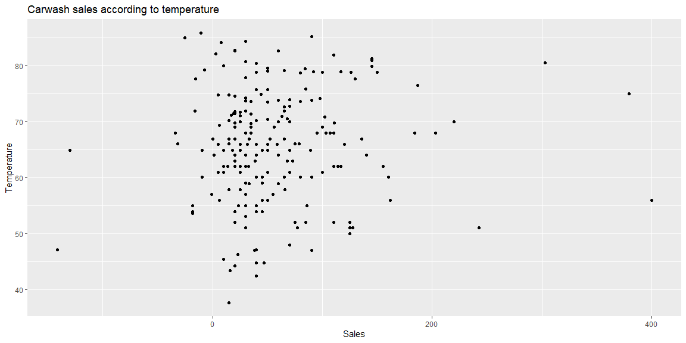

```r
# Use this R-Chunk to import all your datasets!
carwash <- read_csv("https://byuistats.github.io/M335/data/carwash.csv")
```

## Background

_Place Task Background Here_

## Data Wrangling


```r
# Use this R-Chunk to clean & wrangle your data!
carwash <- carwash %>%
  mutate(time = force_tz(time, tzone = "MST")) %>%
  mutate(hour = ceiling_date(time, unit = "hours")) %>%
  group_by(hour) %>%
  mutate(salesPerHour = sum(amount)) %>%
  select(hour, salesPerHour) %>%
  distinct()
  
weather <- riem_measures(station = "RXE", date_start = "2016-05-13", date_end = "2016-07-08") %>%
  select(valid, feel) %>%
  mutate(hour = ceiling_date(valid, unit = "hours")) %>%
  na.omit(hour)

sales_weather <- inner_join(weather, carwash, by = "hour")
```

## Data Visualization


```r
# Use this R-Chunk to plot & visualize your data!

sales_weather %>%
  ggplot(aes(x = salesPerHour, y = feel)) +
  geom_jitter() +
  labs(x = "Sales", y = "Temperature", title = "Carwash sales according to temperature")
```

<!-- -->

## Conclusions
