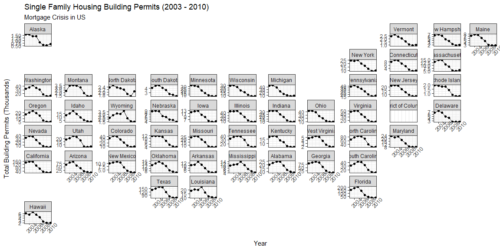
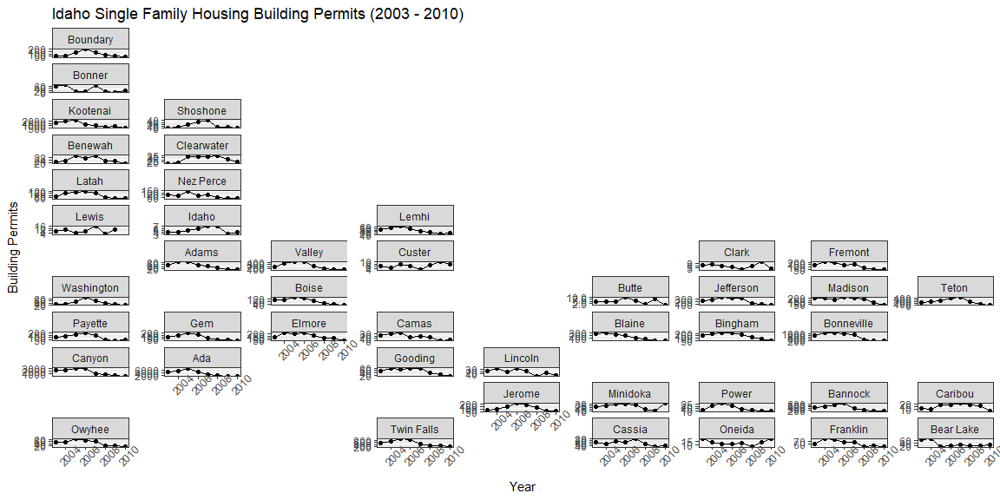
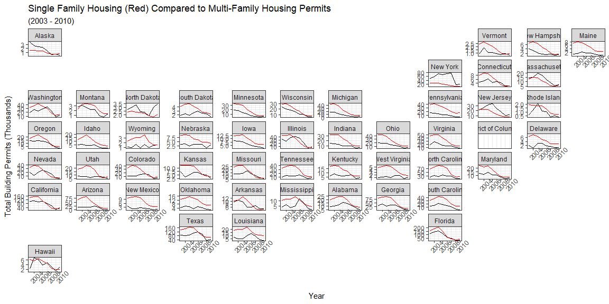

```r
# Use this R-Chunk to import all your datasets!
permits <- permits
state_data <- us_states() %>% filter(jurisdiction_type == "state")
county_data <- us_counties()
```

## Background

You have been asked to support a story for the local paper (that has a web presence) that looks back on the housing collapse and the early effects of residential construction. You have data on residential building permits from 1980 through 2010 for each county in the United States. Your colleague that is writing the article would like a few maps and graphics that highlight the single family building permit patterns across your state as well as the patterns in the US.

Remember the big story is the collapse of new building permits at the initial stages of the mortgage crisis (Links to an external site.). Make sure your graphics highlight the collapse in a clear and honest manner.
## Data Wrangling


```r
# Use this R-Chunk to clean & wrangle your data!
permits_single <- permits %>%
  filter(variable == "Single Family") %>%
  filter(year >= 2003)

state_permits <- permits_single %>%
  group_by(state, year) %>%
  summarize(total_permits = sum(value),
            StateAbbr = StateAbbr,
            year = year) %>%
  unique()

state_data_single <- state_data %>%
  mutate(state = as.integer(statefp)) %>%
  left_join(state_permits)

idaho_counties <- county_data %>% 
  filter(state_abbr == "ID") %>%
  mutate(county = as.integer(countyfp))
idaho_permits <- permits_single %>% filter(StateAbbr == "ID")

idaho_counties <- idaho_counties %>% left_join(idaho_permits)

permits_all <- permits %>%
  filter(!(variable %in% c("All Permits", "Single Family"))) %>%
  filter(year >= 2003)
state_permits_all <- permits_all %>%
  group_by(state, year) %>%
  summarize(total_permits = sum(value),
            StateAbbr = StateAbbr,
            year = year) %>%
  unique()
state_data_all <- state_data %>%
  mutate(state = as.integer(statefp)) %>%
  left_join(state_permits_all)
```

## Data Visualization


```r
# Use this R-Chunk to plot & visualize your data!
ggplot(state_data_single, aes(x = year, y = total_permits/1000)) +
  geom_point() + geom_line() +
  facet_geo(~name, grid = "us_state_grid2", scales = "free_y") +
  labs(title = "Single Family Housing Building Permits (2003 - 2010)",
       subtitle = "Mortgage Crisis in US",
       y = "Total Building Permits (Thousands)",
       x = "Year") +
  theme_bw() +
  theme(axis.text.x = element_text(angle = 45)) #I saw Dawn do this!
```

<!-- -->

```r
ggplot(idaho_counties, aes(x = year, y = value)) +
  geom_point() + geom_line() +
  facet_geo(~name, grid = "us_id_counties_grid1", scales = "free_y") +
  labs(title = "Idaho Single Family Housing Building Permits (2003 - 2010)",
       y = "Building Permits",
       x = "Year") +
  theme_bw() +
  theme(axis.text.x = element_text(angle = 45)) #I saw Dawn do this!
```

<!-- -->

```r
ggplot(state_data_all, aes(x = year, y = total_permits/1000)) +
  geom_line() +
  geom_line(data = state_data_single, color = "red") +
  facet_geo(~name, grid = "us_state_grid2", scales = "free_y") +
  labs(title = "Single Family Housing (Red) Compared to Multi-Family Housing Permits",
       subtitle = "(2003 - 2010)",
       y = "Total Building Permits (Thousands)",
       x = "Year") +
  theme_bw() +
  theme(axis.text.x = element_text(angle = 45)) #I saw Dawn do this!
```

<!-- -->

## Conclusions
In the first graph the decline in single family housing permits is clear in all states from about 2005 to 2008.I chose to free the y axis because we aren't as concerned about numbers as we are the overall pattern. The pattern isn't quite as obvious in the Idaho graph because of the smaller size, but if you look closely there is a definite drop in housing permits.

I found the third graph to be the most interesting. I compared the permits for single family housing to those of multi-family housing. While multi-family housing permits appear to also have been affected, the decline seemed to follow behind the single-family permit or was not as drastic as the single family permit decline. I would be interested in looking at data after 2010 to see if multi-family permits began to increase in popularityafter the mortgage crisis.
