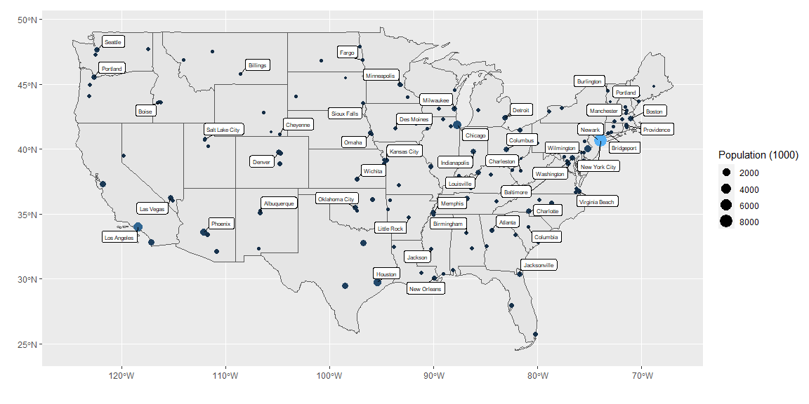

```r
# Use this R-Chunk to import all your datasets!
state_data <- us_states()
top_cities <- us_cities()
```

## Background

_Place Task Background Here_

## Data Wrangling


```r
# Use this R-Chunk to clean & wrangle your data!
state_data <- state_data %>%
  filter(jurisdiction_type != "territory") %>%
  filter(!(state_abbr %in% c("AK", "HI")))

top_3cities <- top_cities %>%
  filter(!(state_abbr %in% c("AK", "HI"))) %>%
  group_by(state_name) %>%
  slice_max(order_by = population, n = 3)

top_city <- top_3cities %>%
  group_by(state_name) %>%
  slice_max(order_by = population, n = 1)
```

## Data Visualization


```r
# Use this R-Chunk to plot & visualize your data!
ggplot() +
  geom_sf(data = state_data) +
  geom_sf(data = top_3cities, aes(size = (population/1000), color = population/1000)) +
  geom_label_repel(data = top_city, aes(label = city, geometry = geometry), stat = "sf_coordinates", size = 2, min.segment.length = 0) +
  guides(color = FALSE) +
  labs(size = "Population (1000)", x = "", y = "")
```

<!-- -->

## Conclusions
