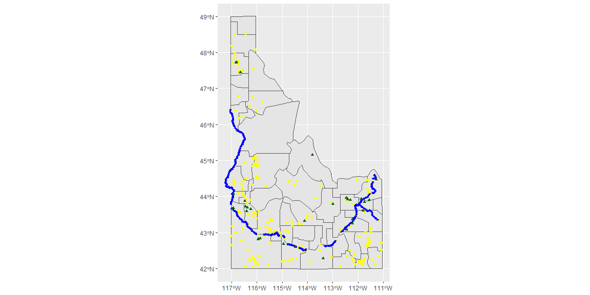

```r
# Use this R-Chunk to import all your datasets!
my_get_shp_data <- function(URL){
  df <- tempfile(); uf <- tempfile()
  download(URL, df, mode = "wb")
  unzip(df, exdir = uf)
  my_data <- read_sf(uf)
  file_delete(df); dir_delete(uf) 
  my_data
}

shape <- my_get_shp_data("https://byuistats.github.io/M335/data/shp.zip") %>%
  filter(StateName == "Idaho")
well <- my_get_shp_data("https://opendata.arcgis.com/datasets/1abb666937894ae4a87afe9655d2ff83_1.zip") %>%
  filter(Production > 5000)
dam <- my_get_shp_data("https://opendata.arcgis.com/datasets/e163d7da3b84410ab94700a92b7735ce_0.zip") %>%
  filter(SurfaceAre > 50)
water <- my_get_shp_data("https://research.idwr.idaho.gov/gis/Spatial/Hydrography/streams_lakes/c_250k/hyd250.zip") 
```

## Background

_Place Task Background Here_

## Data Wrangling


```r
# Use this R-Chunk to clean & wrangle your data!
water_tidy <- water %>%
  filter(FEAT_NAME %in% c("Snake River", "Henrys Fork"))
```

## Data Visualization


```r
# Use this R-Chunk to plot & visualize your data!
ggplot() +
  geom_sf(data = well) +
  geom_sf(data = shape) +
  geom_sf(data = dam, color = "yellow") +
  geom_sf(data = water_tidy, color = "blue", size = 1.5) +
  geom_sf(data = well, color = "dark green", shape = 17)
```

<!-- -->

```r
ggsave("wells.png")
```

## Conclusions
