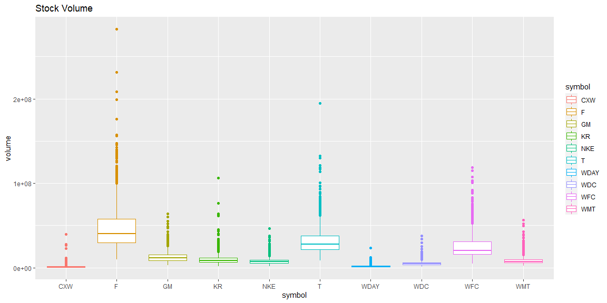

```r
# Use this R-Chunk to import all your datasets!
tickers_today <- c("CXW", "F", "GM", "KR", "WDC", "NKE","T", "WDAY", "WFC", "WMT")
my_stocks <- tq_get(tickers_today,
                    get = "stock.prices",
                    from = today() - years(5))
```

## Background

Your data science income has ballooned, and you need to find somewhere to invest $25,000 that you have saved over the last year. You have a savvy investment friend that is kind enough to tell you about ten stocks he has been watching during the last year. You will need to visualize the performance of these stocks over the last five years to help in the conversation with your friend.

However, your friend is not going to tell you the stock symbols until the beginning of your half-hour meeting with him (he is a busy friend). You need to program an .Rmd file that will automatically build a suite of visualizations for any stocks he gives you.

Your visualizations should use both library(dygraphs) and library(ggplot2). In real life, you might use one or the other, but this task is built to help you move from ts and xts to tidy objects for visualization.
## Data Wrangling


```r
# Use this R-Chunk to clean & wrangle your data!
my_stocks_pivoted <- my_stocks %>% pivot_wider(id_cols = date, 
                                 names_from = symbol, 
                                 values_from = adjusted) 
my_stocks_top3 <- my_stocks_pivoted %>%
  mutate(top_3 = (WDAY + WMT + NKE)/3) %>%
  tk_xts()

my_stocks_pivoted <- my_stocks_pivoted %>% tk_xts()
```

## Data Visualization


```r
# Use this R-Chunk to plot & visualize your data!
my_stocks_pivoted %>% dygraph(main = "Stock Performance last 5 years") %>%
  dyHighlight() %>%
  dyLegend()
```

<!--html_preserve--><div id="htmlwidget-2035993ed9a22bbf3591" style="width:1152px;height:576px;" class="dygraphs html-widget"></div>
<script type="application/json" data-for="htmlwidget-2035993ed9a22bbf3591">{"x":{"attrs":{"title":"Stock Performance last 5 years","labels":["day","CXW","F","GM","KR","WDC","NKE","T","WDAY","WFC","WMT"],"retainDateWindow":false,"axes":{"x":{"pixelsPerLabel":60}},"highlightCircleSize":3,"highlightSeriesBackgroundAlpha":0.5,"highlightSeriesOpts":[],"legend":"auto","labelsDivWidth":250,"labelsShowZeroValues":true,"labelsSeparateLines":false,"hideOverlayOnMouseOut":true},"scale":"daily","annotations":[],"shadings":[],"events":[],"format":"date","data":[["2016-03-29T00:00:00.000Z","2016-03-30T00:00:00.000Z","2016-03-31T00:00:00.000Z","2016-04-01T00:00:00.000Z","2016-04-04T00:00:00.000Z","2016-04-05T00:00:00.000Z","2016-04-06T00:00:00.000Z","2016-04-07T00:00:00.000Z","2016-04-08T00:00:00.000Z","2016-04-11T00:00:00.000Z","2016-04-12T00:00:00.000Z","2016-04-13T00:00:00.000Z","2016-04-14T00:00:00.000Z","2016-04-15T00:00:00.000Z","2016-04-18T00:00:00.000Z","2016-04-19T00:00:00.000Z","2016-04-20T00:00:00.000Z","2016-04-21T00:00:00.000Z","2016-04-22T00:00:00.000Z","2016-04-25T00:00:00.000Z","2016-04-26T00:00:00.000Z","2016-04-27T00:00:00.000Z","2016-04-28T00:00:00.000Z","2016-04-29T00:00:00.000Z","2016-05-02T00:00:00.000Z","2016-05-03T00:00:00.000Z","2016-05-04T00:00:00.000Z","2016-05-05T00:00:00.000Z","2016-05-06T00:00:00.000Z","2016-05-09T00:00:00.000Z","2016-05-10T00:00:00.000Z","2016-05-11T00:00:00.000Z","2016-05-12T00:00:00.000Z","2016-05-13T00:00:00.000Z","2016-05-16T00:00:00.000Z","2016-05-17T00:00:00.000Z","2016-05-18T00:00:00.000Z","2016-05-19T00:00:00.000Z","2016-05-20T00:00:00.000Z","2016-05-23T00:00:00.000Z","2016-05-24T00:00:00.000Z","2016-05-25T00:00:00.000Z","2016-05-26T00:00:00.000Z","2016-05-27T00:00:00.000Z","2016-05-31T00:00:00.000Z","2016-06-01T00:00:00.000Z","2016-06-02T00:00:00.000Z","2016-06-03T00:00:00.000Z","2016-06-06T00:00:00.000Z","2016-06-07T00:00:00.000Z","2016-06-08T00:00:00.000Z","2016-06-09T00:00:00.000Z","2016-06-10T00:00:00.000Z","2016-06-13T00:00:00.000Z","2016-06-14T00:00:00.000Z","2016-06-15T00:00:00.000Z","2016-06-16T00:00:00.000Z","2016-06-17T00:00:00.000Z","2016-06-20T00:00:00.000Z","2016-06-21T00:00:00.000Z","2016-06-22T00:00:00.000Z","2016-06-23T00:00:00.000Z","2016-06-24T00:00:00.000Z","2016-06-27T00:00:00.000Z","2016-06-28T00:00:00.000Z","2016-06-29T00:00:00.000Z","2016-06-30T00:00:00.000Z","2016-07-01T00:00:00.000Z","2016-07-05T00:00:00.000Z","2016-07-06T00:00:00.000Z","2016-07-07T00:00:00.000Z","2016-07-08T00:00:00.000Z","2016-07-11T00:00:00.000Z","2016-07-12T00:00:00.000Z","2016-07-13T00:00:00.000Z","2016-07-14T00:00:00.000Z","2016-07-15T00:00:00.000Z","2016-07-18T00:00:00.000Z","2016-07-19T00:00:00.000Z","2016-07-20T00:00:00.000Z","2016-07-21T00:00:00.000Z","2016-07-22T00:00:00.000Z","2016-07-25T00:00:00.000Z","2016-07-26T00:00:00.000Z","2016-07-27T00:00:00.000Z","2016-07-28T00:00:00.000Z","2016-07-29T00:00:00.000Z","2016-08-01T00:00:00.000Z","2016-08-02T00:00:00.000Z","2016-08-03T00:00:00.000Z","2016-08-04T00:00:00.000Z","2016-08-05T00:00:00.000Z","2016-08-08T00:00:00.000Z","2016-08-09T00:00:00.000Z","2016-08-10T00:00:00.000Z","2016-08-11T00:00:00.000Z","2016-08-12T00:00:00.000Z","2016-08-15T00:00:00.000Z","2016-08-16T00:00:00.000Z","2016-08-17T00:00:00.000Z","2016-08-18T00:00:00.000Z","2016-08-19T00:00:00.000Z","2016-08-22T00:00:00.000Z","2016-08-23T00:00:00.000Z","2016-08-24T00:00:00.000Z","2016-08-25T00:00:00.000Z","2016-08-26T00:00:00.000Z","2016-08-29T00:00:00.000Z","2016-08-30T00:00:00.000Z","2016-08-31T00:00:00.000Z","2016-09-01T00:00:00.000Z","2016-09-02T00:00:00.000Z","2016-09-06T00:00:00.000Z","2016-09-07T00:00:00.000Z","2016-09-08T00:00:00.000Z","2016-09-09T00:00:00.000Z","2016-09-12T00:00:00.000Z","2016-09-13T00:00:00.000Z","2016-09-14T00:00:00.000Z","2016-09-15T00:00:00.000Z","2016-09-16T00:00:00.000Z","2016-09-19T00:00:00.000Z","2016-09-20T00:00:00.000Z","2016-09-21T00:00:00.000Z","2016-09-22T00:00:00.000Z","2016-09-23T00:00:00.000Z","2016-09-26T00:00:00.000Z","2016-09-27T00:00:00.000Z","2016-09-28T00:00:00.000Z","2016-09-29T00:00:00.000Z","2016-09-30T00:00:00.000Z","2016-10-03T00:00:00.000Z","2016-10-04T00:00:00.000Z","2016-10-05T00:00:00.000Z","2016-10-06T00:00:00.000Z","2016-10-07T00:00:00.000Z","2016-10-10T00:00:00.000Z","2016-10-11T00:00:00.000Z","2016-10-12T00:00:00.000Z","2016-10-13T00:00:00.000Z","2016-10-14T00:00:00.000Z","2016-10-17T00:00:00.000Z","2016-10-18T00:00:00.000Z","2016-10-19T00:00:00.000Z","2016-10-20T00:00:00.000Z","2016-10-21T00:00:00.000Z","2016-10-24T00:00:00.000Z","2016-10-25T00:00:00.000Z","2016-10-26T00:00:00.000Z","2016-10-27T00:00:00.000Z","2016-10-28T00:00:00.000Z","2016-10-31T00:00:00.000Z","2016-11-01T00:00:00.000Z","2016-11-02T00:00:00.000Z","2016-11-03T00:00:00.000Z","2016-11-04T00:00:00.000Z","2016-11-07T00:00:00.000Z","2016-11-08T00:00:00.000Z","2016-11-09T00:00:00.000Z","2016-11-10T00:00:00.000Z","2016-11-11T00:00:00.000Z","2016-11-14T00:00:00.000Z","2016-11-15T00:00:00.000Z","2016-11-16T00:00:00.000Z","2016-11-17T00:00:00.000Z","2016-11-18T00:00:00.000Z","2016-11-21T00:00:00.000Z","2016-11-22T00:00:00.000Z","2016-11-23T00:00:00.000Z","2016-11-25T00:00:00.000Z","2016-11-28T00:00:00.000Z","2016-11-29T00:00:00.000Z","2016-11-30T00:00:00.000Z","2016-12-01T00:00:00.000Z","2016-12-02T00:00:00.000Z","2016-12-05T00:00:00.000Z","2016-12-06T00:00:00.000Z","2016-12-07T00:00:00.000Z","2016-12-08T00:00:00.000Z","2016-12-09T00:00:00.000Z","2016-12-12T00:00:00.000Z","2016-12-13T00:00:00.000Z","2016-12-14T00:00:00.000Z","2016-12-15T00:00:00.000Z","2016-12-16T00:00:00.000Z","2016-12-19T00:00:00.000Z","2016-12-20T00:00:00.000Z","2016-12-21T00:00:00.000Z","2016-12-22T00:00:00.000Z","2016-12-23T00:00:00.000Z","2016-12-27T00:00:00.000Z","2016-12-28T00:00:00.000Z","2016-12-29T00:00:00.000Z","2016-12-30T00:00:00.000Z","2017-01-03T00:00:00.000Z","2017-01-04T00:00:00.000Z","2017-01-05T00:00:00.000Z","2017-01-06T00:00:00.000Z","2017-01-09T00:00:00.000Z","2017-01-10T00:00:00.000Z","2017-01-11T00:00:00.000Z","2017-01-12T00:00:00.000Z","2017-01-13T00:00:00.000Z","2017-01-17T00:00:00.000Z","2017-01-18T00:00:00.000Z","2017-01-19T00:00:00.000Z","2017-01-20T00:00:00.000Z","2017-01-23T00:00:00.000Z","2017-01-24T00:00:00.000Z","2017-01-25T00:00:00.000Z","2017-01-26T00:00:00.000Z","2017-01-27T00:00:00.000Z","2017-01-30T00:00:00.000Z","2017-01-31T00:00:00.000Z","2017-02-01T00:00:00.000Z","2017-02-02T00:00:00.000Z","2017-02-03T00:00:00.000Z","2017-02-06T00:00:00.000Z","2017-02-07T00:00:00.000Z","2017-02-08T00:00:00.000Z","2017-02-09T00:00:00.000Z","2017-02-10T00:00:00.000Z","2017-02-13T00:00:00.000Z","2017-02-14T00:00:00.000Z","2017-02-15T00:00:00.000Z","2017-02-16T00:00:00.000Z","2017-02-17T00:00:00.000Z","2017-02-21T00:00:00.000Z","2017-02-22T00:00:00.000Z","2017-02-23T00:00:00.000Z","2017-02-24T00:00:00.000Z","2017-02-27T00:00:00.000Z","2017-02-28T00:00:00.000Z","2017-03-01T00:00:00.000Z","2017-03-02T00:00:00.000Z","2017-03-03T00:00:00.000Z","2017-03-06T00:00:00.000Z","2017-03-07T00:00:00.000Z","2017-03-08T00:00:00.000Z","2017-03-09T00:00:00.000Z","2017-03-10T00:00:00.000Z","2017-03-13T00:00:00.000Z","2017-03-14T00:00:00.000Z","2017-03-15T00:00:00.000Z","2017-03-16T00:00:00.000Z","2017-03-17T00:00:00.000Z","2017-03-20T00:00:00.000Z","2017-03-21T00:00:00.000Z","2017-03-22T00:00:00.000Z","2017-03-23T00:00:00.000Z","2017-03-24T00:00:00.000Z","2017-03-27T00:00:00.000Z","2017-03-28T00:00:00.000Z","2017-03-29T00:00:00.000Z","2017-03-30T00:00:00.000Z","2017-03-31T00:00:00.000Z","2017-04-03T00:00:00.000Z","2017-04-04T00:00:00.000Z","2017-04-05T00:00:00.000Z","2017-04-06T00:00:00.000Z","2017-04-07T00:00:00.000Z","2017-04-10T00:00:00.000Z","2017-04-11T00:00:00.000Z","2017-04-12T00:00:00.000Z","2017-04-13T00:00:00.000Z","2017-04-17T00:00:00.000Z","2017-04-18T00:00:00.000Z","2017-04-19T00:00:00.000Z","2017-04-20T00:00:00.000Z","2017-04-21T00:00:00.000Z","2017-04-24T00:00:00.000Z","2017-04-25T00:00:00.000Z","2017-04-26T00:00:00.000Z","2017-04-27T00:00:00.000Z","2017-04-28T00:00:00.000Z","2017-05-01T00:00:00.000Z","2017-05-02T00:00:00.000Z","2017-05-03T00:00:00.000Z","2017-05-04T00:00:00.000Z","2017-05-05T00:00:00.000Z","2017-05-08T00:00:00.000Z","2017-05-09T00:00:00.000Z","2017-05-10T00:00:00.000Z","2017-05-11T00:00:00.000Z","2017-05-12T00:00:00.000Z","2017-05-15T00:00:00.000Z","2017-05-16T00:00:00.000Z","2017-05-17T00:00:00.000Z","2017-05-18T00:00:00.000Z","2017-05-19T00:00:00.000Z","2017-05-22T00:00:00.000Z","2017-05-23T00:00:00.000Z","2017-05-24T00:00:00.000Z","2017-05-25T00:00:00.000Z","2017-05-26T00:00:00.000Z","2017-05-30T00:00:00.000Z","2017-05-31T00:00:00.000Z","2017-06-01T00:00:00.000Z","2017-06-02T00:00:00.000Z","2017-06-05T00:00:00.000Z","2017-06-06T00:00:00.000Z","2017-06-07T00:00:00.000Z","2017-06-08T00:00:00.000Z","2017-06-09T00:00:00.000Z","2017-06-12T00:00:00.000Z","2017-06-13T00:00:00.000Z","2017-06-14T00:00:00.000Z","2017-06-15T00:00:00.000Z","2017-06-16T00:00:00.000Z","2017-06-19T00:00:00.000Z","2017-06-20T00:00:00.000Z","2017-06-21T00:00:00.000Z","2017-06-22T00:00:00.000Z","2017-06-23T00:00:00.000Z","2017-06-26T00:00:00.000Z","2017-06-27T00:00:00.000Z","2017-06-28T00:00:00.000Z","2017-06-29T00:00:00.000Z","2017-06-30T00:00:00.000Z","2017-07-03T00:00:00.000Z","2017-07-05T00:00:00.000Z","2017-07-06T00:00:00.000Z","2017-07-07T00:00:00.000Z","2017-07-10T00:00:00.000Z","2017-07-11T00:00:00.000Z","2017-07-12T00:00:00.000Z","2017-07-13T00:00:00.000Z","2017-07-14T00:00:00.000Z","2017-07-17T00:00:00.000Z","2017-07-18T00:00:00.000Z","2017-07-19T00:00:00.000Z","2017-07-20T00:00:00.000Z","2017-07-21T00:00:00.000Z","2017-07-24T00:00:00.000Z","2017-07-25T00:00:00.000Z","2017-07-26T00:00:00.000Z","2017-07-27T00:00:00.000Z","2017-07-28T00:00:00.000Z","2017-07-31T00:00:00.000Z","2017-08-01T00:00:00.000Z","2017-08-02T00:00:00.000Z","2017-08-03T00:00:00.000Z","2017-08-04T00:00:00.000Z","2017-08-07T00:00:00.000Z","2017-08-08T00:00:00.000Z","2017-08-09T00:00:00.000Z","2017-08-10T00:00:00.000Z","2017-08-11T00:00:00.000Z","2017-08-14T00:00:00.000Z","2017-08-15T00:00:00.000Z","2017-08-16T00:00:00.000Z","2017-08-17T00:00:00.000Z","2017-08-18T00:00:00.000Z","2017-08-21T00:00:00.000Z","2017-08-22T00:00:00.000Z","2017-08-23T00:00:00.000Z","2017-08-24T00:00:00.000Z","2017-08-25T00:00:00.000Z","2017-08-28T00:00:00.000Z","2017-08-29T00:00:00.000Z","2017-08-30T00:00:00.000Z","2017-08-31T00:00:00.000Z","2017-09-01T00:00:00.000Z","2017-09-05T00:00:00.000Z","2017-09-06T00:00:00.000Z","2017-09-07T00:00:00.000Z","2017-09-08T00:00:00.000Z","2017-09-11T00:00:00.000Z","2017-09-12T00:00:00.000Z","2017-09-13T00:00:00.000Z","2017-09-14T00:00:00.000Z","2017-09-15T00:00:00.000Z","2017-09-18T00:00:00.000Z","2017-09-19T00:00:00.000Z","2017-09-20T00:00:00.000Z","2017-09-21T00:00:00.000Z","2017-09-22T00:00:00.000Z","2017-09-25T00:00:00.000Z","2017-09-26T00:00:00.000Z","2017-09-27T00:00:00.000Z","2017-09-28T00:00:00.000Z","2017-09-29T00:00:00.000Z","2017-10-02T00:00:00.000Z","2017-10-03T00:00:00.000Z","2017-10-04T00:00:00.000Z","2017-10-05T00:00:00.000Z","2017-10-06T00:00:00.000Z","2017-10-09T00:00:00.000Z","2017-10-10T00:00:00.000Z","2017-10-11T00:00:00.000Z","2017-10-12T00:00:00.000Z","2017-10-13T00:00:00.000Z","2017-10-16T00:00:00.000Z","2017-10-17T00:00:00.000Z","2017-10-18T00:00:00.000Z","2017-10-19T00:00:00.000Z","2017-10-20T00:00:00.000Z","2017-10-23T00:00:00.000Z","2017-10-24T00:00:00.000Z","2017-10-25T00:00:00.000Z","2017-10-26T00:00:00.000Z","2017-10-27T00:00:00.000Z","2017-10-30T00:00:00.000Z","2017-10-31T00:00:00.000Z","2017-11-01T00:00:00.000Z","2017-11-02T00:00:00.000Z","2017-11-03T00:00:00.000Z","2017-11-06T00:00:00.000Z","2017-11-07T00:00:00.000Z","2017-11-08T00:00:00.000Z","2017-11-09T00:00:00.000Z","2017-11-10T00:00:00.000Z","2017-11-13T00:00:00.000Z","2017-11-14T00:00:00.000Z","2017-11-15T00:00:00.000Z","2017-11-16T00:00:00.000Z","2017-11-17T00:00:00.000Z","2017-11-20T00:00:00.000Z","2017-11-21T00:00:00.000Z","2017-11-22T00:00:00.000Z","2017-11-24T00:00:00.000Z","2017-11-27T00:00:00.000Z","2017-11-28T00:00:00.000Z","2017-11-29T00:00:00.000Z","2017-11-30T00:00:00.000Z","2017-12-01T00:00:00.000Z","2017-12-04T00:00:00.000Z","2017-12-05T00:00:00.000Z","2017-12-06T00:00:00.000Z","2017-12-07T00:00:00.000Z","2017-12-08T00:00:00.000Z","2017-12-11T00:00:00.000Z","2017-12-12T00:00:00.000Z","2017-12-13T00:00:00.000Z","2017-12-14T00:00:00.000Z","2017-12-15T00:00:00.000Z","2017-12-18T00:00:00.000Z","2017-12-19T00:00:00.000Z","2017-12-20T00:00:00.000Z","2017-12-21T00:00:00.000Z","2017-12-22T00:00:00.000Z","2017-12-26T00:00:00.000Z","2017-12-27T00:00:00.000Z","2017-12-28T00:00:00.000Z","2017-12-29T00:00:00.000Z","2018-01-02T00:00:00.000Z","2018-01-03T00:00:00.000Z","2018-01-04T00:00:00.000Z","2018-01-05T00:00:00.000Z","2018-01-08T00:00:00.000Z","2018-01-09T00:00:00.000Z","2018-01-10T00:00:00.000Z","2018-01-11T00:00:00.000Z","2018-01-12T00:00:00.000Z","2018-01-16T00:00:00.000Z","2018-01-17T00:00:00.000Z","2018-01-18T00:00:00.000Z","2018-01-19T00:00:00.000Z","2018-01-22T00:00:00.000Z","2018-01-23T00:00:00.000Z","2018-01-24T00:00:00.000Z","2018-01-25T00:00:00.000Z","2018-01-26T00:00:00.000Z","2018-01-29T00:00:00.000Z","2018-01-30T00:00:00.000Z","2018-01-31T00:00:00.000Z","2018-02-01T00:00:00.000Z","2018-02-02T00:00:00.000Z","2018-02-05T00:00:00.000Z","2018-02-06T00:00:00.000Z","2018-02-07T00:00:00.000Z","2018-02-08T00:00:00.000Z","2018-02-09T00:00:00.000Z","2018-02-12T00:00:00.000Z","2018-02-13T00:00:00.000Z","2018-02-14T00:00:00.000Z","2018-02-15T00:00:00.000Z","2018-02-16T00:00:00.000Z","2018-02-20T00:00:00.000Z","2018-02-21T00:00:00.000Z","2018-02-22T00:00:00.000Z","2018-02-23T00:00:00.000Z","2018-02-26T00:00:00.000Z","2018-02-27T00:00:00.000Z","2018-02-28T00:00:00.000Z","2018-03-01T00:00:00.000Z","2018-03-02T00:00:00.000Z","2018-03-05T00:00:00.000Z","2018-03-06T00:00:00.000Z","2018-03-07T00:00:00.000Z","2018-03-08T00:00:00.000Z","2018-03-09T00:00:00.000Z","2018-03-12T00:00:00.000Z","2018-03-13T00:00:00.000Z","2018-03-14T00:00:00.000Z","2018-03-15T00:00:00.000Z","2018-03-16T00:00:00.000Z","2018-03-19T00:00:00.000Z","2018-03-20T00:00:00.000Z","2018-03-21T00:00:00.000Z","2018-03-22T00:00:00.000Z","2018-03-23T00:00:00.000Z","2018-03-26T00:00:00.000Z","2018-03-27T00:00:00.000Z","2018-03-28T00:00:00.000Z","2018-03-29T00:00:00.000Z","2018-04-02T00:00:00.000Z","2018-04-03T00:00:00.000Z","2018-04-04T00:00:00.000Z","2018-04-05T00:00:00.000Z","2018-04-06T00:00:00.000Z","2018-04-09T00:00:00.000Z","2018-04-10T00:00:00.000Z","2018-04-11T00:00:00.000Z","2018-04-12T00:00:00.000Z","2018-04-13T00:00:00.000Z","2018-04-16T00:00:00.000Z","2018-04-17T00:00:00.000Z","2018-04-18T00:00:00.000Z","2018-04-19T00:00:00.000Z","2018-04-20T00:00:00.000Z","2018-04-23T00:00:00.000Z","2018-04-24T00:00:00.000Z","2018-04-25T00:00:00.000Z","2018-04-26T00:00:00.000Z","2018-04-27T00:00:00.000Z","2018-04-30T00:00:00.000Z","2018-05-01T00:00:00.000Z","2018-05-02T00:00:00.000Z","2018-05-03T00:00:00.000Z","2018-05-04T00:00:00.000Z","2018-05-07T00:00:00.000Z","2018-05-08T00:00:00.000Z","2018-05-09T00:00:00.000Z","2018-05-10T00:00:00.000Z","2018-05-11T00:00:00.000Z","2018-05-14T00:00:00.000Z","2018-05-15T00:00:00.000Z","2018-05-16T00:00:00.000Z","2018-05-17T00:00:00.000Z","2018-05-18T00:00:00.000Z","2018-05-21T00:00:00.000Z","2018-05-22T00:00:00.000Z","2018-05-23T00:00:00.000Z","2018-05-24T00:00:00.000Z","2018-05-25T00:00:00.000Z","2018-05-29T00:00:00.000Z","2018-05-30T00:00:00.000Z","2018-05-31T00:00:00.000Z","2018-06-01T00:00:00.000Z","2018-06-04T00:00:00.000Z","2018-06-05T00:00:00.000Z","2018-06-06T00:00:00.000Z","2018-06-07T00:00:00.000Z","2018-06-08T00:00:00.000Z","2018-06-11T00:00:00.000Z","2018-06-12T00:00:00.000Z","2018-06-13T00:00:00.000Z","2018-06-14T00:00:00.000Z","2018-06-15T00:00:00.000Z","2018-06-18T00:00:00.000Z","2018-06-19T00:00:00.000Z","2018-06-20T00:00:00.000Z","2018-06-21T00:00:00.000Z","2018-06-22T00:00:00.000Z","2018-06-25T00:00:00.000Z","2018-06-26T00:00:00.000Z","2018-06-27T00:00:00.000Z","2018-06-28T00:00:00.000Z","2018-06-29T00:00:00.000Z","2018-07-02T00:00:00.000Z","2018-07-03T00:00:00.000Z","2018-07-05T00:00:00.000Z","2018-07-06T00:00:00.000Z","2018-07-09T00:00:00.000Z","2018-07-10T00:00:00.000Z","2018-07-11T00:00:00.000Z","2018-07-12T00:00:00.000Z","2018-07-13T00:00:00.000Z","2018-07-16T00:00:00.000Z","2018-07-17T00:00:00.000Z","2018-07-18T00:00:00.000Z","2018-07-19T00:00:00.000Z","2018-07-20T00:00:00.000Z","2018-07-23T00:00:00.000Z","2018-07-24T00:00:00.000Z","2018-07-25T00:00:00.000Z","2018-07-26T00:00:00.000Z","2018-07-27T00:00:00.000Z","2018-07-30T00:00:00.000Z","2018-07-31T00:00:00.000Z","2018-08-01T00:00:00.000Z","2018-08-02T00:00:00.000Z","2018-08-03T00:00:00.000Z","2018-08-06T00:00:00.000Z","2018-08-07T00:00:00.000Z","2018-08-08T00:00:00.000Z","2018-08-09T00:00:00.000Z","2018-08-10T00:00:00.000Z","2018-08-13T00:00:00.000Z","2018-08-14T00:00:00.000Z","2018-08-15T00:00:00.000Z","2018-08-16T00:00:00.000Z","2018-08-17T00:00:00.000Z","2018-08-20T00:00:00.000Z","2018-08-21T00:00:00.000Z","2018-08-22T00:00:00.000Z","2018-08-23T00:00:00.000Z","2018-08-24T00:00:00.000Z","2018-08-27T00:00:00.000Z","2018-08-28T00:00:00.000Z","2018-08-29T00:00:00.000Z","2018-08-30T00:00:00.000Z","2018-08-31T00:00:00.000Z","2018-09-04T00:00:00.000Z","2018-09-05T00:00:00.000Z","2018-09-06T00:00:00.000Z","2018-09-07T00:00:00.000Z","2018-09-10T00:00:00.000Z","2018-09-11T00:00:00.000Z","2018-09-12T00:00:00.000Z","2018-09-13T00:00:00.000Z","2018-09-14T00:00:00.000Z","2018-09-17T00:00:00.000Z","2018-09-18T00:00:00.000Z","2018-09-19T00:00:00.000Z","2018-09-20T00:00:00.000Z","2018-09-21T00:00:00.000Z","2018-09-24T00:00:00.000Z","2018-09-25T00:00:00.000Z","2018-09-26T00:00:00.000Z","2018-09-27T00:00:00.000Z","2018-09-28T00:00:00.000Z","2018-10-01T00:00:00.000Z","2018-10-02T00:00:00.000Z","2018-10-03T00:00:00.000Z","2018-10-04T00:00:00.000Z","2018-10-05T00:00:00.000Z","2018-10-08T00:00:00.000Z","2018-10-09T00:00:00.000Z","2018-10-10T00:00:00.000Z","2018-10-11T00:00:00.000Z","2018-10-12T00:00:00.000Z","2018-10-15T00:00:00.000Z","2018-10-16T00:00:00.000Z","2018-10-17T00:00:00.000Z","2018-10-18T00:00:00.000Z","2018-10-19T00:00:00.000Z","2018-10-22T00:00:00.000Z","2018-10-23T00:00:00.000Z","2018-10-24T00:00:00.000Z","2018-10-25T00:00:00.000Z","2018-10-26T00:00:00.000Z","2018-10-29T00:00:00.000Z","2018-10-30T00:00:00.000Z","2018-10-31T00:00:00.000Z","2018-11-01T00:00:00.000Z","2018-11-02T00:00:00.000Z","2018-11-05T00:00:00.000Z","2018-11-06T00:00:00.000Z","2018-11-07T00:00:00.000Z","2018-11-08T00:00:00.000Z","2018-11-09T00:00:00.000Z","2018-11-12T00:00:00.000Z","2018-11-13T00:00:00.000Z","2018-11-14T00:00:00.000Z","2018-11-15T00:00:00.000Z","2018-11-16T00:00:00.000Z","2018-11-19T00:00:00.000Z","2018-11-20T00:00:00.000Z","2018-11-21T00:00:00.000Z","2018-11-23T00:00:00.000Z","2018-11-26T00:00:00.000Z","2018-11-27T00:00:00.000Z","2018-11-28T00:00:00.000Z","2018-11-29T00:00:00.000Z","2018-11-30T00:00:00.000Z","2018-12-03T00:00:00.000Z","2018-12-04T00:00:00.000Z","2018-12-06T00:00:00.000Z","2018-12-07T00:00:00.000Z","2018-12-10T00:00:00.000Z","2018-12-11T00:00:00.000Z","2018-12-12T00:00:00.000Z","2018-12-13T00:00:00.000Z","2018-12-14T00:00:00.000Z","2018-12-17T00:00:00.000Z","2018-12-18T00:00:00.000Z","2018-12-19T00:00:00.000Z","2018-12-20T00:00:00.000Z","2018-12-21T00:00:00.000Z","2018-12-24T00:00:00.000Z","2018-12-26T00:00:00.000Z","2018-12-27T00:00:00.000Z","2018-12-28T00:00:00.000Z","2018-12-31T00:00:00.000Z","2019-01-02T00:00:00.000Z","2019-01-03T00:00:00.000Z","2019-01-04T00:00:00.000Z","2019-01-07T00:00:00.000Z","2019-01-08T00:00:00.000Z","2019-01-09T00:00:00.000Z","2019-01-10T00:00:00.000Z","2019-01-11T00:00:00.000Z","2019-01-14T00:00:00.000Z","2019-01-15T00:00:00.000Z","2019-01-16T00:00:00.000Z","2019-01-17T00:00:00.000Z","2019-01-18T00:00:00.000Z","2019-01-22T00:00:00.000Z","2019-01-23T00:00:00.000Z","2019-01-24T00:00:00.000Z","2019-01-25T00:00:00.000Z","2019-01-28T00:00:00.000Z","2019-01-29T00:00:00.000Z","2019-01-30T00:00:00.000Z","2019-01-31T00:00:00.000Z","2019-02-01T00:00:00.000Z","2019-02-04T00:00:00.000Z","2019-02-05T00:00:00.000Z","2019-02-06T00:00:00.000Z","2019-02-07T00:00:00.000Z","2019-02-08T00:00:00.000Z","2019-02-11T00:00:00.000Z","2019-02-12T00:00:00.000Z","2019-02-13T00:00:00.000Z","2019-02-14T00:00:00.000Z","2019-02-15T00:00:00.000Z","2019-02-19T00:00:00.000Z","2019-02-20T00:00:00.000Z","2019-02-21T00:00:00.000Z","2019-02-22T00:00:00.000Z","2019-02-25T00:00:00.000Z","2019-02-26T00:00:00.000Z","2019-02-27T00:00:00.000Z","2019-02-28T00:00:00.000Z","2019-03-01T00:00:00.000Z","2019-03-04T00:00:00.000Z","2019-03-05T00:00:00.000Z","2019-03-06T00:00:00.000Z","2019-03-07T00:00:00.000Z","2019-03-08T00:00:00.000Z","2019-03-11T00:00:00.000Z","2019-03-12T00:00:00.000Z","2019-03-13T00:00:00.000Z","2019-03-14T00:00:00.000Z","2019-03-15T00:00:00.000Z","2019-03-18T00:00:00.000Z","2019-03-19T00:00:00.000Z","2019-03-20T00:00:00.000Z","2019-03-21T00:00:00.000Z","2019-03-22T00:00:00.000Z","2019-03-25T00:00:00.000Z","2019-03-26T00:00:00.000Z","2019-03-27T00:00:00.000Z","2019-03-28T00:00:00.000Z","2019-03-29T00:00:00.000Z","2019-04-01T00:00:00.000Z","2019-04-02T00:00:00.000Z","2019-04-03T00:00:00.000Z","2019-04-04T00:00:00.000Z","2019-04-05T00:00:00.000Z","2019-04-08T00:00:00.000Z","2019-04-09T00:00:00.000Z","2019-04-10T00:00:00.000Z","2019-04-11T00:00:00.000Z","2019-04-12T00:00:00.000Z","2019-04-15T00:00:00.000Z","2019-04-16T00:00:00.000Z","2019-04-17T00:00:00.000Z","2019-04-18T00:00:00.000Z","2019-04-22T00:00:00.000Z","2019-04-23T00:00:00.000Z","2019-04-24T00:00:00.000Z","2019-04-25T00:00:00.000Z","2019-04-26T00:00:00.000Z","2019-04-29T00:00:00.000Z","2019-04-30T00:00:00.000Z","2019-05-01T00:00:00.000Z","2019-05-02T00:00:00.000Z","2019-05-03T00:00:00.000Z","2019-05-06T00:00:00.000Z","2019-05-07T00:00:00.000Z","2019-05-08T00:00:00.000Z","2019-05-09T00:00:00.000Z","2019-05-10T00:00:00.000Z","2019-05-13T00:00:00.000Z","2019-05-14T00:00:00.000Z","2019-05-15T00:00:00.000Z","2019-05-16T00:00:00.000Z","2019-05-17T00:00:00.000Z","2019-05-20T00:00:00.000Z","2019-05-21T00:00:00.000Z","2019-05-22T00:00:00.000Z","2019-05-23T00:00:00.000Z","2019-05-24T00:00:00.000Z","2019-05-28T00:00:00.000Z","2019-05-29T00:00:00.000Z","2019-05-30T00:00:00.000Z","2019-05-31T00:00:00.000Z","2019-06-03T00:00:00.000Z","2019-06-04T00:00:00.000Z","2019-06-05T00:00:00.000Z","2019-06-06T00:00:00.000Z","2019-06-07T00:00:00.000Z","2019-06-10T00:00:00.000Z","2019-06-11T00:00:00.000Z","2019-06-12T00:00:00.000Z","2019-06-13T00:00:00.000Z","2019-06-14T00:00:00.000Z","2019-06-17T00:00:00.000Z","2019-06-18T00:00:00.000Z","2019-06-19T00:00:00.000Z","2019-06-20T00:00:00.000Z","2019-06-21T00:00:00.000Z","2019-06-24T00:00:00.000Z","2019-06-25T00:00:00.000Z","2019-06-26T00:00:00.000Z","2019-06-27T00:00:00.000Z","2019-06-28T00:00:00.000Z","2019-07-01T00:00:00.000Z","2019-07-02T00:00:00.000Z","2019-07-03T00:00:00.000Z","2019-07-05T00:00:00.000Z","2019-07-08T00:00:00.000Z","2019-07-09T00:00:00.000Z","2019-07-10T00:00:00.000Z","2019-07-11T00:00:00.000Z","2019-07-12T00:00:00.000Z","2019-07-15T00:00:00.000Z","2019-07-16T00:00:00.000Z","2019-07-17T00:00:00.000Z","2019-07-18T00:00:00.000Z","2019-07-19T00:00:00.000Z","2019-07-22T00:00:00.000Z","2019-07-23T00:00:00.000Z","2019-07-24T00:00:00.000Z","2019-07-25T00:00:00.000Z","2019-07-26T00:00:00.000Z","2019-07-29T00:00:00.000Z","2019-07-30T00:00:00.000Z","2019-07-31T00:00:00.000Z","2019-08-01T00:00:00.000Z","2019-08-02T00:00:00.000Z","2019-08-05T00:00:00.000Z","2019-08-06T00:00:00.000Z","2019-08-07T00:00:00.000Z","2019-08-08T00:00:00.000Z","2019-08-09T00:00:00.000Z","2019-08-12T00:00:00.000Z","2019-08-13T00:00:00.000Z","2019-08-14T00:00:00.000Z","2019-08-15T00:00:00.000Z","2019-08-16T00:00:00.000Z","2019-08-19T00:00:00.000Z","2019-08-20T00:00:00.000Z","2019-08-21T00:00:00.000Z","2019-08-22T00:00:00.000Z","2019-08-23T00:00:00.000Z","2019-08-26T00:00:00.000Z","2019-08-27T00:00:00.000Z","2019-08-28T00:00:00.000Z","2019-08-29T00:00:00.000Z","2019-08-30T00:00:00.000Z","2019-09-03T00:00:00.000Z","2019-09-04T00:00:00.000Z","2019-09-05T00:00:00.000Z","2019-09-06T00:00:00.000Z","2019-09-09T00:00:00.000Z","2019-09-10T00:00:00.000Z","2019-09-11T00:00:00.000Z","2019-09-12T00:00:00.000Z","2019-09-13T00:00:00.000Z","2019-09-16T00:00:00.000Z","2019-09-17T00:00:00.000Z","2019-09-18T00:00:00.000Z","2019-09-19T00:00:00.000Z","2019-09-20T00:00:00.000Z","2019-09-23T00:00:00.000Z","2019-09-24T00:00:00.000Z","2019-09-25T00:00:00.000Z","2019-09-26T00:00:00.000Z","2019-09-27T00:00:00.000Z","2019-09-30T00:00:00.000Z","2019-10-01T00:00:00.000Z","2019-10-02T00:00:00.000Z","2019-10-03T00:00:00.000Z","2019-10-04T00:00:00.000Z","2019-10-07T00:00:00.000Z","2019-10-08T00:00:00.000Z","2019-10-09T00:00:00.000Z","2019-10-10T00:00:00.000Z","2019-10-11T00:00:00.000Z","2019-10-14T00:00:00.000Z","2019-10-15T00:00:00.000Z","2019-10-16T00:00:00.000Z","2019-10-17T00:00:00.000Z","2019-10-18T00:00:00.000Z","2019-10-21T00:00:00.000Z","2019-10-22T00:00:00.000Z","2019-10-23T00:00:00.000Z","2019-10-24T00:00:00.000Z","2019-10-25T00:00:00.000Z","2019-10-28T00:00:00.000Z","2019-10-29T00:00:00.000Z","2019-10-30T00:00:00.000Z","2019-10-31T00:00:00.000Z","2019-11-01T00:00:00.000Z","2019-11-04T00:00:00.000Z","2019-11-05T00:00:00.000Z","2019-11-06T00:00:00.000Z","2019-11-07T00:00:00.000Z","2019-11-08T00:00:00.000Z","2019-11-11T00:00:00.000Z","2019-11-12T00:00:00.000Z","2019-11-13T00:00:00.000Z","2019-11-14T00:00:00.000Z","2019-11-15T00:00:00.000Z","2019-11-18T00:00:00.000Z","2019-11-19T00:00:00.000Z","2019-11-20T00:00:00.000Z","2019-11-21T00:00:00.000Z","2019-11-22T00:00:00.000Z","2019-11-25T00:00:00.000Z","2019-11-26T00:00:00.000Z","2019-11-27T00:00:00.000Z","2019-11-29T00:00:00.000Z","2019-12-02T00:00:00.000Z","2019-12-03T00:00:00.000Z","2019-12-04T00:00:00.000Z","2019-12-05T00:00:00.000Z","2019-12-06T00:00:00.000Z","2019-12-09T00:00:00.000Z","2019-12-10T00:00:00.000Z","2019-12-11T00:00:00.000Z","2019-12-12T00:00:00.000Z","2019-12-13T00:00:00.000Z","2019-12-16T00:00:00.000Z","2019-12-17T00:00:00.000Z","2019-12-18T00:00:00.000Z","2019-12-19T00:00:00.000Z","2019-12-20T00:00:00.000Z","2019-12-23T00:00:00.000Z","2019-12-24T00:00:00.000Z","2019-12-26T00:00:00.000Z","2019-12-27T00:00:00.000Z","2019-12-30T00:00:00.000Z","2019-12-31T00:00:00.000Z","2020-01-02T00:00:00.000Z","2020-01-03T00:00:00.000Z","2020-01-06T00:00:00.000Z","2020-01-07T00:00:00.000Z","2020-01-08T00:00:00.000Z","2020-01-09T00:00:00.000Z","2020-01-10T00:00:00.000Z","2020-01-13T00:00:00.000Z","2020-01-14T00:00:00.000Z","2020-01-15T00:00:00.000Z","2020-01-16T00:00:00.000Z","2020-01-17T00:00:00.000Z","2020-01-21T00:00:00.000Z","2020-01-22T00:00:00.000Z","2020-01-23T00:00:00.000Z","2020-01-24T00:00:00.000Z","2020-01-27T00:00:00.000Z","2020-01-28T00:00:00.000Z","2020-01-29T00:00:00.000Z","2020-01-30T00:00:00.000Z","2020-01-31T00:00:00.000Z","2020-02-03T00:00:00.000Z","2020-02-04T00:00:00.000Z","2020-02-05T00:00:00.000Z","2020-02-06T00:00:00.000Z","2020-02-07T00:00:00.000Z","2020-02-10T00:00:00.000Z","2020-02-11T00:00:00.000Z","2020-02-12T00:00:00.000Z","2020-02-13T00:00:00.000Z","2020-02-14T00:00:00.000Z","2020-02-18T00:00:00.000Z","2020-02-19T00:00:00.000Z","2020-02-20T00:00:00.000Z","2020-02-21T00:00:00.000Z","2020-02-24T00:00:00.000Z","2020-02-25T00:00:00.000Z","2020-02-26T00:00:00.000Z","2020-02-27T00:00:00.000Z","2020-02-28T00:00:00.000Z","2020-03-02T00:00:00.000Z","2020-03-03T00:00:00.000Z","2020-03-04T00:00:00.000Z","2020-03-05T00:00:00.000Z","2020-03-06T00:00:00.000Z","2020-03-09T00:00:00.000Z","2020-03-10T00:00:00.000Z","2020-03-11T00:00:00.000Z","2020-03-12T00:00:00.000Z","2020-03-13T00:00:00.000Z","2020-03-16T00:00:00.000Z","2020-03-17T00:00:00.000Z","2020-03-18T00:00:00.000Z","2020-03-19T00:00:00.000Z","2020-03-20T00:00:00.000Z","2020-03-23T00:00:00.000Z","2020-03-24T00:00:00.000Z","2020-03-25T00:00:00.000Z","2020-03-26T00:00:00.000Z","2020-03-27T00:00:00.000Z","2020-03-30T00:00:00.000Z","2020-03-31T00:00:00.000Z","2020-04-01T00:00:00.000Z","2020-04-02T00:00:00.000Z","2020-04-03T00:00:00.000Z","2020-04-06T00:00:00.000Z","2020-04-07T00:00:00.000Z","2020-04-08T00:00:00.000Z","2020-04-09T00:00:00.000Z","2020-04-13T00:00:00.000Z","2020-04-14T00:00:00.000Z","2020-04-15T00:00:00.000Z","2020-04-16T00:00:00.000Z","2020-04-17T00:00:00.000Z","2020-04-20T00:00:00.000Z","2020-04-21T00:00:00.000Z","2020-04-22T00:00:00.000Z","2020-04-23T00:00:00.000Z","2020-04-24T00:00:00.000Z","2020-04-27T00:00:00.000Z","2020-04-28T00:00:00.000Z","2020-04-29T00:00:00.000Z","2020-04-30T00:00:00.000Z","2020-05-01T00:00:00.000Z","2020-05-04T00:00:00.000Z","2020-05-05T00:00:00.000Z","2020-05-06T00:00:00.000Z","2020-05-07T00:00:00.000Z","2020-05-08T00:00:00.000Z","2020-05-11T00:00:00.000Z","2020-05-12T00:00:00.000Z","2020-05-13T00:00:00.000Z","2020-05-14T00:00:00.000Z","2020-05-15T00:00:00.000Z","2020-05-18T00:00:00.000Z","2020-05-19T00:00:00.000Z","2020-05-20T00:00:00.000Z","2020-05-21T00:00:00.000Z","2020-05-22T00:00:00.000Z","2020-05-26T00:00:00.000Z","2020-05-27T00:00:00.000Z","2020-05-28T00:00:00.000Z","2020-05-29T00:00:00.000Z","2020-06-01T00:00:00.000Z","2020-06-02T00:00:00.000Z","2020-06-03T00:00:00.000Z","2020-06-04T00:00:00.000Z","2020-06-05T00:00:00.000Z","2020-06-08T00:00:00.000Z","2020-06-09T00:00:00.000Z","2020-06-10T00:00:00.000Z","2020-06-11T00:00:00.000Z","2020-06-12T00:00:00.000Z","2020-06-15T00:00:00.000Z","2020-06-16T00:00:00.000Z","2020-06-17T00:00:00.000Z","2020-06-18T00:00:00.000Z","2020-06-19T00:00:00.000Z","2020-06-22T00:00:00.000Z","2020-06-23T00:00:00.000Z","2020-06-24T00:00:00.000Z","2020-06-25T00:00:00.000Z","2020-06-26T00:00:00.000Z","2020-06-29T00:00:00.000Z","2020-06-30T00:00:00.000Z","2020-07-01T00:00:00.000Z","2020-07-02T00:00:00.000Z","2020-07-06T00:00:00.000Z","2020-07-07T00:00:00.000Z","2020-07-08T00:00:00.000Z","2020-07-09T00:00:00.000Z","2020-07-10T00:00:00.000Z","2020-07-13T00:00:00.000Z","2020-07-14T00:00:00.000Z","2020-07-15T00:00:00.000Z","2020-07-16T00:00:00.000Z","2020-07-17T00:00:00.000Z","2020-07-20T00:00:00.000Z","2020-07-21T00:00:00.000Z","2020-07-22T00:00:00.000Z","2020-07-23T00:00:00.000Z","2020-07-24T00:00:00.000Z","2020-07-27T00:00:00.000Z","2020-07-28T00:00:00.000Z","2020-07-29T00:00:00.000Z","2020-07-30T00:00:00.000Z","2020-07-31T00:00:00.000Z","2020-08-03T00:00:00.000Z","2020-08-04T00:00:00.000Z","2020-08-05T00:00:00.000Z","2020-08-06T00:00:00.000Z","2020-08-07T00:00:00.000Z","2020-08-10T00:00:00.000Z","2020-08-11T00:00:00.000Z","2020-08-12T00:00:00.000Z","2020-08-13T00:00:00.000Z","2020-08-14T00:00:00.000Z","2020-08-17T00:00:00.000Z","2020-08-18T00:00:00.000Z","2020-08-19T00:00:00.000Z","2020-08-20T00:00:00.000Z","2020-08-21T00:00:00.000Z","2020-08-24T00:00:00.000Z","2020-08-25T00:00:00.000Z","2020-08-26T00:00:00.000Z","2020-08-27T00:00:00.000Z","2020-08-28T00:00:00.000Z","2020-08-31T00:00:00.000Z","2020-09-01T00:00:00.000Z","2020-09-02T00:00:00.000Z","2020-09-03T00:00:00.000Z","2020-09-04T00:00:00.000Z","2020-09-08T00:00:00.000Z","2020-09-09T00:00:00.000Z","2020-09-10T00:00:00.000Z","2020-09-11T00:00:00.000Z","2020-09-14T00:00:00.000Z","2020-09-15T00:00:00.000Z","2020-09-16T00:00:00.000Z","2020-09-17T00:00:00.000Z","2020-09-18T00:00:00.000Z","2020-09-21T00:00:00.000Z","2020-09-22T00:00:00.000Z","2020-09-23T00:00:00.000Z","2020-09-24T00:00:00.000Z","2020-09-25T00:00:00.000Z","2020-09-28T00:00:00.000Z","2020-09-29T00:00:00.000Z","2020-09-30T00:00:00.000Z","2020-10-01T00:00:00.000Z","2020-10-02T00:00:00.000Z","2020-10-05T00:00:00.000Z","2020-10-06T00:00:00.000Z","2020-10-07T00:00:00.000Z","2020-10-08T00:00:00.000Z","2020-10-09T00:00:00.000Z","2020-10-12T00:00:00.000Z","2020-10-13T00:00:00.000Z","2020-10-14T00:00:00.000Z","2020-10-15T00:00:00.000Z","2020-10-16T00:00:00.000Z","2020-10-19T00:00:00.000Z","2020-10-20T00:00:00.000Z","2020-10-21T00:00:00.000Z","2020-10-22T00:00:00.000Z","2020-10-23T00:00:00.000Z","2020-10-26T00:00:00.000Z","2020-10-27T00:00:00.000Z","2020-10-28T00:00:00.000Z","2020-10-29T00:00:00.000Z","2020-10-30T00:00:00.000Z","2020-11-02T00:00:00.000Z","2020-11-03T00:00:00.000Z","2020-11-04T00:00:00.000Z","2020-11-05T00:00:00.000Z","2020-11-06T00:00:00.000Z","2020-11-09T00:00:00.000Z","2020-11-10T00:00:00.000Z","2020-11-11T00:00:00.000Z","2020-11-12T00:00:00.000Z","2020-11-13T00:00:00.000Z","2020-11-16T00:00:00.000Z","2020-11-17T00:00:00.000Z","2020-11-18T00:00:00.000Z","2020-11-19T00:00:00.000Z","2020-11-20T00:00:00.000Z","2020-11-23T00:00:00.000Z","2020-11-24T00:00:00.000Z","2020-11-25T00:00:00.000Z","2020-11-27T00:00:00.000Z","2020-11-30T00:00:00.000Z","2020-12-01T00:00:00.000Z","2020-12-02T00:00:00.000Z","2020-12-03T00:00:00.000Z","2020-12-04T00:00:00.000Z","2020-12-07T00:00:00.000Z","2020-12-08T00:00:00.000Z","2020-12-09T00:00:00.000Z","2020-12-10T00:00:00.000Z","2020-12-11T00:00:00.000Z","2020-12-14T00:00:00.000Z","2020-12-15T00:00:00.000Z","2020-12-16T00:00:00.000Z","2020-12-17T00:00:00.000Z","2020-12-18T00:00:00.000Z","2020-12-21T00:00:00.000Z","2020-12-22T00:00:00.000Z","2020-12-23T00:00:00.000Z","2020-12-24T00:00:00.000Z","2020-12-28T00:00:00.000Z","2020-12-29T00:00:00.000Z","2020-12-30T00:00:00.000Z","2020-12-31T00:00:00.000Z","2021-01-04T00:00:00.000Z","2021-01-05T00:00:00.000Z","2021-01-06T00:00:00.000Z","2021-01-07T00:00:00.000Z","2021-01-08T00:00:00.000Z","2021-01-11T00:00:00.000Z","2021-01-12T00:00:00.000Z","2021-01-13T00:00:00.000Z","2021-01-14T00:00:00.000Z","2021-01-15T00:00:00.000Z","2021-01-19T00:00:00.000Z","2021-01-20T00:00:00.000Z","2021-01-21T00:00:00.000Z","2021-01-22T00:00:00.000Z","2021-01-25T00:00:00.000Z","2021-01-26T00:00:00.000Z","2021-01-27T00:00:00.000Z","2021-01-28T00:00:00.000Z","2021-01-29T00:00:00.000Z","2021-02-01T00:00:00.000Z","2021-02-02T00:00:00.000Z","2021-02-03T00:00:00.000Z","2021-02-04T00:00:00.000Z","2021-02-05T00:00:00.000Z","2021-02-08T00:00:00.000Z","2021-02-09T00:00:00.000Z","2021-02-10T00:00:00.000Z","2021-02-11T00:00:00.000Z","2021-02-12T00:00:00.000Z","2021-02-16T00:00:00.000Z","2021-02-17T00:00:00.000Z","2021-02-18T00:00:00.000Z","2021-02-19T00:00:00.000Z","2021-02-22T00:00:00.000Z","2021-02-23T00:00:00.000Z","2021-02-24T00:00:00.000Z","2021-02-25T00:00:00.000Z","2021-02-26T00:00:00.000Z","2021-03-01T00:00:00.000Z","2021-03-02T00:00:00.000Z","2021-03-03T00:00:00.000Z","2021-03-04T00:00:00.000Z","2021-03-05T00:00:00.000Z","2021-03-08T00:00:00.000Z","2021-03-09T00:00:00.000Z","2021-03-10T00:00:00.000Z","2021-03-11T00:00:00.000Z","2021-03-12T00:00:00.000Z","2021-03-15T00:00:00.000Z","2021-03-16T00:00:00.000Z","2021-03-17T00:00:00.000Z","2021-03-18T00:00:00.000Z","2021-03-19T00:00:00.000Z","2021-03-22T00:00:00.000Z","2021-03-23T00:00:00.000Z","2021-03-24T00:00:00.000Z","2021-03-25T00:00:00.000Z","2021-03-26T00:00:00.000Z"],[22.835661,22.609846,22.616903,22.6663,22.249952,21.868887,22.257008,21.86183,21.918283,22.200556,22.348745,22.503992,22.37697,22.341686,22.511053,22.440479,22.045307,21.487823,21.586617,21.678354,21.904171,22.002968,21.995911,21.466652,21.882999,21.939453,22.257008,23.569569,23.548391,23.562508,23.760092,23.456659,23.463713,23.477827,23.597794,23.040308,22.6663,22.518108,22.878002,22.835661,23.223787,23.336693,23.640131,23.753042,23.710701,23.640131,23.957687,24.20467,24.21879,24.331697,24.261129,24.310522,24.239952,24.098824,23.724812,23.745989,23.88006,23.922403,24.105881,24.25407,24.211733,24.486944,24.268185,24.282295,24.592793,24.886675,25.101707,24.184231,24.026539,24.026539,23.295418,23.238075,23.331255,23.660976,24.033705,23.653807,23.703987,23.668146,23.453114,23.266747,22.965698,23.094717,23.252413,23.015877,22.836678,22.693319,22.972868,23.324089,22.836678,22.241749,20.865528,20.542973,20.456966,20.069899,19.754517,19.632666,19.496475,19.345947,19.173922,19.510811,12.593862,13.676201,13.876901,13.188789,12.90208,13.002427,12.550854,12.034774,11.482849,11.418339,11.210474,11.504353,11.504353,11.475681,11.518689,11.102955,11.131626,11.009773,11.482849,11.611871,11.554529,11.898582,11.325159,11.25348,11.712222,11.396834,11.439843,10.59404,10.465019,10.286384,10.323599,10.479905,10.420361,10.241724,10.174739,10.010988,10.010988,9.973773,10.688312,10.591553,10.584109,10.680869,10.829732,10.465019,10.197066,10.412916,10.211953,10.241724,10.144964,9.936559,9.810025,10.755301,10.465019,10.331042,10.532007,10.837175,10.688312,10.561778,15.116963,14.744807,14.469415,15.481677,15.19884,15.370029,14.789471,15.057421,15.831504,16.449282,16.739565,16.374853,16.598146,16.575819,16.903311,17.722055,17.357346,17.268024,17.736938,18.064438,18.622675,18.444038,18.548239,18.890625,18.451481,18.257957,17.863478,17.960232,18.049551,17.558306,17.483877,17.751829,17.982567,17.982567,18.490074,18.52795,18.861244,18.830942,18.4522,18.74004,19.156656,20.05806,20.345901,20.217127,20.618595,20.997334,21.080654,20.838263,21.254877,21.466972,22.459267,22.118404,22.345648,22.065376,22.012352,21.997206,22.269896,22.171429,22.33807,22.292624,22.042656,22.322924,23.474289,23.3228,24.019674,24.678684,24.799885,24.762005,24.822607,25.799753,26.133043,25.754307,26.534508,26.102743,25.527063,26.019421,25.693705,26.072449,24.671108,24.148449,23.9818,24.209051,24.110573,24.171173,24.148449,24.496889,24.73171,25.0347,24.784735,24.027252,24.496889,24.648386,24.049978,23.898479,23.762135,23.936354,24.143629,24.120598,23.821201,23.936354,24.051506,24.489088,24.512117,24.604237,25.625257,25.387276,25.471722,25.863235,25.625257,25.609903,25.75576,26.108892,26.208694,26.446674,26.676981,26.822842,26.446674,26.277788,25.855562,25.226063,25.034142,25.694347,26.108892,25.916977,25.855562,25.187679,25.540813,25.97839,26.247078,23.598572,23.583218,24.059183,23.345236,22.523817,22.54685,23.314533,23.099579,22.661999,22.070885,22.439371,22.923012,22.715734,22.66968,22.232098,22.930691,24.274132,23.521807,23.22241,22.608261,22.293512,21.518154,21.725426,21.241789,21.272493,21.717749,21.779167,21.986439,21.318556,21.602594,21.392183,21.493494,21.485697,21.797424,21.322041,21.431149,21.064869,20.96356,21.805218,21.664944,22.116945,22.335148,22.132532,22.545568,22.623501,22.49881,22.210461,22.358532,21.719496,21.563635,21.220734,21.587011,21.454529,20.597281,21.041491,21.197357,20.231001,20.519352,19.888103,19.794588,20.254385,20.231001,20.231001,19.708862,19.163342,19.030859,19.015274,19.475067,19.42831,19.311413,19.365965,19.708862,20.332312,20.636244,20.885628,20.846661,20.550522,20.885628,20.589489,20.947973,20.464798,20.293352,20.215418,20.114103,20.332312,20.49597,19.942659,20.145279,19.82576,19.895895,20.09852,19.856932,20.332312,20.457003,21.201469,20.718359,20.552044,20.544125,20.742119,20.330286,20.496601,20.552044,20.575802,20.559958,20.544125,20.369886,21.066835,20.852999,20.583721,20.68668,20.369886,19.593737,19.459105,19.601658,19.760059,19.364063,19.53038,19.411579,19.498701,19.427423,19.688778,19.791737,20.59956,20.449081,19.49078,19.300703,18.152327,18.350321,18.5404,18.382,18.382,18.255283,18.374083,18.215683,18.302801,18.564159,18.492878,18.619598,18.382,18.334478,17.803848,17.732574,17.867208,17.859291,17.487057,17.281141,17.24946,17.241541,17.487057,17.843452,17.582094,17.384098,17.534576,17.708813,17.74049,17.708813,17.708813,18.160816,18.201176,18.451389,18.233459,18.346457,19.00832,18.112387,17.515097,18.249603,18.01553,18.193104,17.934814,17.741096,18.03167,18.104315,17.950954,18.217316,18.386818,19.395752,18.61282,18.402958,18.733889,18.459461,18.007458,17.256809,16.724092,16.441593,16.078377,16.255945,16.320517,17.159954,17.482811,17.329453,17.200312,17.168024,17.458599,17.490879,17.846027,17.644243,16.780594,16.780594,17.208382,17.200312,17.184166,17.523169,17.563528,17.119596,17.36981,17.700741,17.555452,17.272953,17.216452,17.345596,16.77252,16.76445,16.925877,16.514235,15.7313,15.55373,15.666732,16.191374,16.100643,15.671732,16.348095,16.925474,17.02445,17.098684,17.181168,17.007957,16.867737,16.570797,16.455322,16.735765,16.884228,16.859486,16.777002,16.711018,16.628534,16.562548,16.75226,16.900726,17.073944,16.628534,16.859486,16.900726,17.379128,17.717308,17.832781,17.214163,16.966715,17.148178,17.214163,17.065693,16.917227,17.304893,16.950216,17.0327,17.370878,17.255402,17.395626,17.329638,17.395626,17.667818,17.882273,17.750299,17.874025,17.849279,17.775043,17.60183,17.651321,17.684315,17.700811,17.667818,17.230658,17.478109,17.69256,17.370878,17.511099,18.129719,18.58338,19.317476,19.647404,19.127766,18.962797,19.556671,20.069113,19.800293,19.993502,20.228724,19.993502,19.968304,20.144718,20.598351,20.682362,20.867174,20.774765,20.379938,20.413536,20.673956,20.640356,20.715961,20.631956,20.816767,21.085588,21.261999,21.488819,21.539223,21.530819,21.640028,21.337608,21.65683,21.673634,21.497219,21.186398,21.312407,21.077187,20.791567,20.472343,20.909174,21.228399,21.261999,21.446817,21.312407,20.976377,20.984781,21.320807,21.598028,21.564423,21.808044,21.749239,21.36281,21.572826,21.63163,20.993181,20.741163,20.615154,20.85877,21.11919,21.194798,21.438416,21.413214,21.295605,21.665232,21.077187,20.640356,20.489141,20.203522,20.295927,20.809101,20.620937,20.663702,20.552515,20.141975,20.005133,20.484095,20.655148,20.364351,20.013685,19.132742,19.175505,19.628807,19.774204,19.671572,19.979475,20.013685,20.347248,20.390013,20.697914,20.304482,20.184742,20.193295,19.209717,19.278141,19.397881,19.979475,18.636679,18.807732,18.970236,18.687992,19.423536,19.278141,18.867601,18.602463,18.320219,18.303114,18.17482,18.14916,18.439959,18.74786,18.277458,18.74786,18.824839,18.773521,19.064316,18.337326,18.961681,18.918919,18.722202,18.576807,18.362982,18.397198,17.969551,17.037292,17.18269,16.053713,16.438589,15.74581,15.138557,15.51488,15.08724,15.506329,15.620215,15.225986,15.339878,15.690303,15.918077,16.426197,16.653973,16.899269,17.074484,16.557606,16.794144,17.16209,17.056961,17.074484,16.724058,16.732819,16.811665,16.794144,16.855467,17.19713,17.144569,17.407387,17.083244,17.494995,17.573837,17.459953,17.643927,17.766575,17.775335,17.530037,17.600122,17.521276,17.819138,17.933025,18.6952,18.958021,19.308447,19.24712,18.922979,18.800329,18.555031,18.213367,18.458664,18.292212,17.451189,17.179613,17.065722,17.311022,17.074484,16.846706,16.820425,16.7591,16.7591,16.706537,16.618931,17.074484,16.811665,16.802904,17.109528,16.978115,17.293499,17.427906,17.669834,17.616072,17.786318,17.974485,18.216415,18.198496,17.875925,18.225378,18.162653,18.234337,18.458347,18.126812,18.395622,18.512108,18.234337,18.368742,18.422503,18.225378,18.422503,18.31498,18.646513,18.933245,18.583792,19.085571,19.166214,18.55691,18.288097,19.345423,19.60527,19.435026,19.354383,19.55151,19.829279,19.784479,19.856161,20.06225,20.01745,19.981607,20.00849,19.721756,19.452944,19.488789,19.623194,19.2827,19.390224,19.372303,19.820322,20.411705,20.716358,21.083733,21.262938,21.504869,21.325663,21.460068,21.567591,21.415266,21.325663,20.044331,19.883043,19.372303,18.521069,18.673395,19.002924,18.490324,18.490324,18.4354,18.545242,18.4354,17.977718,17.70311,16.650444,16.641291,16.412449,15.991382,16.119534,15.561162,15.222476,14.883794,15.414704,15.021098,14.462727,14.810565,14.838025,15.167556,15.5337,15.158401,15.195017,15.378087,15.963923,16.229376,16.494831,16.192762,16.156147,16.265991,15.725927,15.753386,16.174456,16.064611,15.890693,15.854078,15.817463,15.268246,15.76254,15.240785,15.579469,15.634392,15.515394,15.771696,15.908998,15.918152,15.835769,16.11038,16.384987,16.751133,16.531445,16.302603,16.384987,16.073763,16.018845,15.863232,15.890693,15.606929,15.826618,16.558908,16.320913,16.220221,16.220222,15.253392,14.906084,15.093819,15.412967,15.262779,14.849764,14.652643,14.173923,14.586936,14.708963,14.46491,14.371043,14.596323,14.389815,14.568164,14.971791,15.20646,14.915471,14.859151,14.643257,14.52123,14.52123,14.324109,14.746511,15.150138,14.896698,14.624483,14.953018,15.159526,14.962404,14.924858,14.66203,14.774671,14.502456,14.511843,14.417975,14.371043,14.164535,14.145761,14.164535,14.361655,14.455523,14.220855,14.00496,14.033121,14.173923,13.94864,14.126988,14.427362,14.324109,14.164535,14.399202,14.943631,15.056273,15.694568,15.994943,16.03249,16.370411,16.257771,16.276543,16.576918,16.445505,16.285931,16.314089,16.210836,15.526958,15.49806,15.430635,15.392107,14.987559,15.026088,15.295786,15.642542,15.825552,15.989298,15.604014,15.594381,15.54622,15.729231,15.632909,15.623277,15.950768,15.81592,15.81592,15.363211,15.459531,15.77739,16.201204,16.220469,15.979666,16.162676,16.326422,16.750233,16.278261,16.230101,16.326422,16.143412,16.576855,16.759867,16.220469,15.26689,15.536588,15.180201,14.265151,15.488428,15.13204,15.931506,15.738863,15.565485,14.255519,14.159197,12.743278,10.431572,11.65485,10.171505,11.38515,8.803746,9.603211,9.535786,8.408829,9.757324,9.892175,10.739799,10.999866,11.52,11.17,10.08,9.78,8.98,9.6,9.48,10.34,11.26,12.02,12.48,11.96,11.39,11.64,11.42,11.1,11.1,10.93,11.16,11.84,12.5,13.21,13.12,12.16,11.72,11.81,11.54,11,12.33,11.65,11,10.33,10.05,10.24,11.62,11.06,11.43,11.58,11.48,12.23,13.07,12.56,12.03,12.55,12.2,12.97,12.93,13.79,13.96,14.16,13.22,11.96,12.38,12.5,12.52,10.43,10.19,9.84,10.1,9.73,9.35,9.45,9.02,9.53,9.36,9.4,9.53,9.26,9.17,9.25,8.8,9.25,9.12,9.11,9.42,9.24,9.14,8.83,9.16,9.16,9.17,8.91,8.84,8.91,9.04,8.79,8.91,8.92,9.21,9.14,8.74,8.74,8.98,9.16,9.9,9.68,9.87,10.05,9.59,9.37,9.31,9.25,9.66,9.54,9.21,9.43,9.35,9.31,9.41,9.48,9.53,9.49,9.5,9.4,9.06,9.03,9.13,9.15,9.13,8.93,8.57,8.22,8.21,8,8,8.04,8.25,8.16,8,8.18,8.31,8.03,7.98,7.91,7.99,7.92,7.89,7.72,7.82,7.94,7.76,7.64,7.66,6.85,6.73,6.62,6.41,6,5.92,6.32,6.41,7.19,7.51,6.46,6.18,6,6.22,6.38,6.58,6.23,6.6,6.72,6.81,6.71,6.82,6.8,7.09,7.79,7.84,7.68,7.09,7.46,7.64,7.71,7.86,7.59,7.85,7.71,7.55,7.53,7.86,7.76,7.55,7.55,7.4,7.2,6.45,6.73,6.98,7.03,6.83,6.78,6.55,6.7,6.73,6.93,6.85,6.69,6.52,6.86,6.87,7.1,7.34,7.28,6.71,6.77,6.77,6.65,6.26,7.29,6.94,7.11,7.23,7.29,6.92,7.24,7.19,7.63,7.96,7.85,7.62,7.73,7.62,7.6,6.95,7.19,7.59,7.51,7.73,8.23,7.18,7.59,7.42,7.67,7.79,7.74,8.15,8.31,8.54,8.33,8.52,9.09,9.09,9.31,9.25,9.22,9.01,8.48,8.51,8.63,8.92],[10.390799,10.508875,10.626953,10.31208,10.075926,10.052311,10.09167,9.855514,9.879128,9.965721,10.083799,10.280594,10.304208,10.186131,10.430157,10.579721,10.737159,10.74503,10.713542,10.689926,10.823749,10.871499,11.213721,10.791914,10.839666,10.688452,10.59295,10.600907,10.696409,10.600907,10.736203,10.600907,10.624782,10.52132,10.600907,10.45765,10.473568,10.417858,10.497443,10.449692,10.577031,10.760079,10.712329,10.70437,10.736203,10.433773,10.513361,10.378063,10.489487,10.648657,10.632741,10.553153,10.425817,10.330312,10.218892,10.354189,10.44173,10.553153,10.680492,10.52132,10.489487,10.664576,9.964214,9.677702,9.860751,9.988091,10.004008,10.123388,9.868711,10.004008,10.147264,10.417858,10.561112,10.70437,10.728243,10.815787,10.799873,10.863541,10.863541,10.935168,11.078426,11.014757,11.006797,11.151623,11.135532,10.226344,10.186113,10.041287,9.606809,9.75968,9.719453,9.807957,9.799911,9.904508,9.856231,9.904508,9.9206,10.001058,9.928647,9.968874,9.9206,9.968874,9.944737,9.993011,9.896462,10.033242,9.96083,10.033242,10.09761,10.13784,10.009105,10.05738,10.194161,10.218298,10.242435,9.96083,10.218298,9.96083,9.767728,9.743589,9.743589,9.743589,9.655085,9.727498,9.799911,9.791863,9.663128,9.638993,9.727498,9.630947,9.711407,9.735544,9.816004,10.041287,9.968874,9.888415,9.751635,9.647038,9.622901,9.58267,9.58267,9.558534,9.566579,9.663128,9.630947,9.671175,9.807957,9.653179,9.677618,9.563574,9.54728,9.563574,9.457671,9.286604,9.245872,9.237725,9.433235,9.351772,9.433235,9.726494,10.003464,9.82425,9.807958,9.775372,9.669472,9.579865,9.604302,9.685764,9.69391,9.807958,9.710204,9.710204,9.742787,10.125656,9.97088,10.133801,10.231556,10.638864,10.614423,10.728472,10.443356,10.402627,10.207117,10.247848,10.288578,10.313017,10.410771,10.296725,10.101216,10.150093,10.093071,9.979024,9.962733,9.88127,10.255995,10.728472,10.402627,10.39448,10.288578,10.467794,10.321165,10.255995,10.288578,10.272288,10.272288,10.288842,10.2309,10.189513,10.437836,10.586829,10.239177,10.338505,10.239177,10.2309,10.19779,10.16468,10.396448,10.363338,10.214345,10.247454,10.247454,10.35506,10.396448,10.470943,10.454391,10.379891,10.413003,10.504054,10.487501,10.396448,10.321951,10.479222,10.371616,10.504054,10.479222,10.470943,10.363338,10.313674,10.371616,10.346782,10.371616,10.379891,10.38817,10.470943,10.512331,10.330228,10.16468,9.701144,9.742534,9.659759,9.618369,9.485932,9.643203,9.668035,9.668035,9.634925,9.469376,9.411435,9.320382,9.32866,9.29555,9.312105,9.336938,9.29555,9.196221,9.336938,9.345326,9.38727,9.622163,9.513107,9.588609,9.630551,9.731221,9.622163,9.622163,9.580219,9.160768,9.286604,9.22788,9.345326,9.336938,9.362105,9.261436,9.236269,9.160768,9.177547,9.177547,9.026546,9.051711,9.118823,9.311771,9.269825,9.194325,9.110435,9.169157,9.294994,9.328549,9.571828,9.521495,9.437607,9.328549,9.286604,9.311771,9.336938,9.462772,9.454384,9.412437,9.429215,9.412437,9.429215,9.328549,9.261436,9.336938,9.261436,9.378882,9.294994,9.30338,9.370494,9.38727,9.697664,9.479552,9.378882,9.445995,9.513107,9.546661,9.622163,9.731221,9.798333,9.848665,9.857055,9.924166,9.941157,9.796715,9.592794,9.575801,9.397369,9.499331,9.490834,9.533318,9.303906,9.346388,9.286912,9.303906,9.278414,9.252925,9.278414,9.150965,9.150965,9.269919,9.210443,9.176455,9.040507,8.972536,8.981031,9.049005,9.099985,9.099985,9.193448,9.167959,9.210443,9.295408,9.371881,9.643774,9.652271,9.771225,9.686256,9.652271,9.694755,9.847696,9.873184,9.822205,9.873184,9.881683,9.958153,9.949656,9.958153,10.060114,10.14508,10.136583,10.153578,10.162074,10.17057,10.272532,10.48495,10.450964,10.40848,10.45946,10.48495,10.527433,10.518936,10.298023,10.238545,10.298023,10.425473,10.357498,10.391485,10.408689,10.357078,10.48611,10.357078,10.554929,10.374282,10.408689,10.554929,10.623746,10.683961,10.632349,10.606541,10.460303,10.374282,10.357078,10.331271,10.460303,10.339873,10.322669,10.357078,10.331271,10.434497,10.425896,10.382884,10.408689,10.417291,10.503314,10.804394,10.769984,10.821597,10.864608,10.692563,10.649552,10.778586,10.847403,10.821597,10.8388,10.864608,10.718369,10.821597,10.890413,10.916221,10.942027,10.864608,10.821597,10.8388,10.752779,10.821597,10.744176,10.890413,10.976439,11.165686,11.354935,11.311922,11.251708,11.208695,11.320525,11.380741,11.268913,10.477509,10.382884,10.322669,10.339873,10.288259,10.36568,9.952772,10.02159,9.801238,9.748354,9.669026,9.624957,9.439862,9.0256,9.483932,9.483932,9.193069,9.281209,9.431047,9.334092,9.466303,9.483932,9.35172,9.36935,9.342908,9.36935,9.431047,9.598516,9.35172,9.35172,9.069672,9.166625,9.325278,9.36935,9.36935,9.35172,9.457488,9.528003,9.50156,9.713098,9.757168,9.827681,9.704285,9.686653,9.783608,9.475119,9.307652,9.545631,9.545631,9.572072,9.765981,9.572072,9.827681,9.986334,10.003963,9.854123,9.915821,10.092102,10.074474,9.968706,9.942263,10.030404,10.030404,9.986334,9.789824,9.66477,9.86128,9.789824,9.923807,10.209641,10.263235,10.039927,10.057794,10.013129,10.0042,10.147115,10.129251,10.066726,9.879146,10.013129,9.995266,9.986335,10.022063,10.182844,10.236438,10.120317,10.281099,10.290033,10.218573,10.379354,10.281099,10.218573,10.316831,10.316831,10.459747,10.486544,10.566935,10.691988,10.74558,10.808107,10.74558,10.817039,10.73665,10.62053,10.611596,10.709852,10.62053,10.602664,10.459747,10.406152,10.272168,10.290033,10.20071,10.075657,9.888079,9.914875,9.816618,9.870214,9.879146,10.0042,10.048861,9.888079,9.870214,9.807687,9.691567,9.700499,9.70943,9.66477,9.565134,9.483612,9.57419,9.528902,8.958256,8.994487,9.121297,9.094123,8.967312,8.985428,9.094123,9.085064,9.130355,9.103181,8.976371,8.822386,8.568765,8.604998,8.559706,8.614056,8.650288,8.804271,8.931081,8.777096,8.72275,8.768039,9.048834,9.066948,9.030718,8.786155,8.586881,8.577824,8.595939,8.541593,8.396666,8.496303,8.432898,8.460072,8.487244,8.559706,8.650288,8.67746,8.858618,8.885792,8.922024,8.686519,8.50536,8.396666,8.360434,8.37855,8.441955,8.333261,8.269855,8.287971,8.260797,8.387608,8.106812,7.989059,7.980003,7.826019,7.980003,7.970944,7.934714,7.708267,7.699208,7.754531,7.920503,7.542458,8.289328,8.280106,8.556725,8.722695,8.805681,8.565945,8.648931,8.787239,8.796461,8.851785,8.722695,8.648931,8.750357,8.796461,8.796461,8.584388,8.34465,8.529062,8.353872,8.399974,8.418415,8.667371,8.556725,8.676593,8.63971,8.676593,8.851785,8.464518,8.316989,8.132576,7.855958,7.874399,7.966605,7.837517,7.855958,7.837517,7.809855,7.671545,7.616223,7.422589,7.035324,7.238178,7.238178,7.201295,7.053765,7.28428,7.173633,7.450252,7.643884,7.717649,8.040372,7.994267,8.132576,8.289328,8.151017,7.643884,7.708428,7.911282,7.837517,7.689988,7.929724,8.169458,7.985046,8.077253,8.171064,8.255496,8.180448,8.161684,8.20859,8.180448,7.795816,7.870865,7.814578,7.936534,7.889627,7.89901,8.011583,8.283641,8.386833,8.171064,8.171064,8.217972,8.330546,8.236733,8.227353,8.246116,8.264878,8.227353,8.049109,7.955296,7.89901,8.077252,8.039727,8.002203,7.889627,7.908391,8.039727,8.161684,7.983441,8.152303,8.011583,7.983441,8.217972,8.086635,8.227353,8.236733,8.424358,8.452501,8.565078,8.668272,8.677652,8.724559,8.640128,8.752703,8.80899,8.865276,8.752703,8.780846,8.912184,8.95909,8.912184,9.05516,9.121881,8.959842,9.922548,9.836762,9.960675,9.817699,9.855827,9.922548,9.884421,9.893953,9.855827,9.722382,9.893953,9.608002,9.760509,9.874889,9.913016,9.808168,9.798635,9.760509,9.503152,9.388772,9.369707,9.322048,9.255326,9.283922,9.074224,9.160008,9.455493,9.322048,9.293454,9.302985,9.360175,9.455493,9.388772,9.588937,9.512683,9.579405,9.627065,9.569874,9.569874,9.522215,9.484088,9.379239,9.445961,9.722382,9.750978,9.674723,9.646129,9.722382,9.722382,9.722382,9.665193,9.636596,9.712851,9.998802,9.93208,10.017866,9.846294,9.779572,9.722382,9.69336,9.83847,9.993254,9.248356,9.25803,9.287052,9.238682,9.219334,9.006506,8.977483,8.929112,9.170962,9.219334,9.248356,9.141941,8.987157,8.958136,8.706611,8.571175,8.667914,8.735632,8.667914,8.745307,8.745307,8.484109,8.532478,8.474435,8.706611,8.8227,8.871069,8.803351,8.900091,9.035527,9.035527,9.229008,9.112919,9.112919,9.103246,9.141941,8.996831,8.977483,8.948462,8.803351,8.871069,8.861395,8.813025,8.900091,8.842048,8.784003,8.861395,8.60987,8.329324,8.426064,8.455086,8.397042,8.261606,8.280955,8.338999,8.493782,8.532478,8.774328,8.774328,8.813025,8.987157,8.878997,8.918327,9.055987,8.456188,8.574182,8.46602,8.495519,8.397191,8.446355,8.741339,8.849499,8.869164,8.770837,8.741339,8.888829,8.928161,8.888829,8.662676,8.64301,8.800335,8.800335,8.75117,8.584013,8.564348,8.741339,8.849499,8.859331,8.947826,8.908496,8.859331,8.741339,8.800335,8.780669,8.869164,8.859331,8.918327,8.957659,9.164147,9.075652,9.232977,9.232977,9.380468,9.252643,9.321471,9.282141,9.31164,9.291973,9.203478,9.095318,9.144482,9.262475,9.055987,9.006823,9.095318,9.095318,9.105151,9.095318,9.085485,9.134649,9.036321,9.016656,9.006823,9.055987,9.006823,8.987158,8.849499,8.741339,8.820001,8.86,8.84,8.82,8.98,9.18,8.31,8.25,8.11,8.06,8.1,8.24,8.25,8.1,8.06,8,8.03,7.89,7.57,7.23,7.21,6.97,6.96,7.2,6.97,7.08,6.74,6.49,5.9,6.26,5.9,5.35,5.63,5.01,5.01,4.5,4.47,4.33,4.01,4.95,5.39,5.25,5.19,5.03,4.83,4.4,4.36,4.24,4.53,4.71,5.03,5.37,5.16,5.29,5.03,4.94,5.12,4.98,4.77,4.77,4.89,4.87,5.17,5.38,5.26,5.09,4.92,4.86,4.97,4.87,4.87,5.24,5.12,4.98,4.72,4.89,4.9,5.31,5.3,5.49,5.63,5.65,5.84,6.03,5.85,5.71,5.87,5.9,6.19,6.57,7.34,7.53,7.24,6.81,6.13,6.46,6.5,6.55,6.33,6.33,6.23,6.28,6.15,5.95,6.03,5.91,6.01,6.08,5.98,6.05,6.19,6.12,6.09,5.84,6.1,6.06,6.36,6.74,6.86,6.8,6.66,6.68,6.84,6.98,6.88,6.93,7.01,6.92,6.74,6.61,6.69,6.86,6.96,6.93,6.86,7.09,7.23,7.11,7.03,7.04,6.98,6.89,6.87,6.84,6.66,6.98,6.94,6.82,6.91,6.94,6.82,6.83,6.95,6.82,6.9,7.03,6.97,6.91,7,7.12,7.04,7.02,7.28,7.23,6.87,6.78,6.64,6.66,6.51,6.69,6.6,6.66,6.75,6.89,7.02,6.98,7.23,7.35,7.25,7.67,7.76,7.57,7.62,7.67,7.59,7.74,7.85,8.21,8.16,8.03,7.92,7.7,7.9,7.73,7.71,7.88,7.64,7.99,7.79,8.2,8.38,8.33,8.21,8.54,8.8,8.75,8.82,8.82,8.74,8.86,9.45,9.08,9.09,9.08,9.24,9.2,9.21,9.34,9.22,9.25,9.45,9.12,9.02,8.91,9.15,9.04,9.08,8.95,8.93,8.79,8.99,8.86,8.89,8.82,8.86,8.79,8.52,8.65,8.84,9.06,9,9.3,9.78,9.78,10.17,9.83,10.02,10.86,11.53,11.52,11.29,11.19,10.79,10.72,10.53,10.83,10.86,11.2,11.37,11.51,11.56,11.93,11.76,11.45,11.45,11.54,11.48,11.43,11.58,11.7,11.62,12.27,11.76,11.7,11.98,12.55,12.17,11.93,12.27,12.65,12.57,12.91,12.81,13.37,13.2,12.49,12.69,12.49,12.83,12.85,12.21,12.14,12.32,12.3],[26.334299,26.165436,26.53694,25.726389,25.245125,24.991831,25.278898,24.839861,24.797638,24.932732,25.084707,25.988129,25.937468,25.802378,26.435619,26.992865,27.178616,27.575449,27.170174,26.975983,27.178616,27.153286,27.389698,26.849333,26.807117,26.384958,25.827707,25.785496,26.1401,25.988129,26.469389,26.241423,26.325855,25.768606,25.895252,25.861481,25.962801,25.599743,25.81082,25.827707,26.216097,26.722687,26.418732,26.503159,26.410284,25.51531,25.54908,24.991831,25.321117,25.523752,25.284334,25.104774,24.848249,24.865353,24.651583,24.67724,24.814049,24.993614,25.352737,25.23303,25.070572,25.4981,24.241152,23.522894,23.719561,24.08724,24.198397,24.702888,24.08724,24.283905,24.574627,25.361292,25.763174,26.165058,26.190704,26.301867,26.310419,26.395922,26.720844,26.926064,27.3878,27.498957,27.413452,27.49041,27.37925,26.498533,26.968822,26.763597,25.592161,25.857229,25.942734,26.336069,26.404476,26.566935,26.720844,27.148378,26.994471,27.242435,27.11418,27.233887,26.977365,27.216787,27.250992,27.27664,27.174034,26.968822,26.960268,27.199686,27.079975,27.293745,27.191137,27.498957,27.464752,27.594551,27.438795,26.37447,26.980186,26.772511,26.57349,26.92827,26.798471,27.447451,27.386877,27.784922,28.027208,27.793571,27.516674,27.343615,27.603205,27.23978,27.490713,27.72435,27.836836,28.278143,28.148346,27.98394,27.819534,27.594551,27.412836,27.265734,27.577246,27.309,27.170553,27.559937,27.473408,27.72435,28.537735,27.343615,27.326305,27.109983,27.101328,27.343615,27.23978,27.213818,26.885,26.962877,27.707039,27.456102,26.789816,28.321407,29.437649,28.797323,28.927122,28.754061,28.918461,28.555038,28.563688,29.255941,29.299198,29.636667,29.46361,29.91357,29.878952,31.523035,30.640423,30.561695,30.675409,31.751287,31.856243,32.940857,32.451038,32.678455,31.445141,31.698797,31.812511,31.838749,32.022434,31.856243,31.217722,31.217722,31.086515,30.74539,30.736641,30.474236,30.74539,32.442291,31.830006,31.480127,31.497618,32.669716,33.194527,32.809658,32.660957,32.63472,32.774666,32.625973,32.372311,32.057426,32.36356,33.483166,32.818405,32.372311,31.777525,32.022434,31.611332,31.25271,31.777525,32.214863,30.701658,30.736641,30.684164,30.762878,31.069021,32.57349,32.43354,32.389809,32.556004,33.072063,33.098305,32.58223,32.2761,32.599728,32.223614,32.739685,33.02832,33.43943,33.159534,32.818405,32.933273,32.544476,32.544476,32.579823,32.659348,32.774231,32.765388,32.102654,31.5548,30.529774,30.388397,30.27352,30.538612,30.671152,31.422255,31.404575,31.289705,31.245525,30.193991,30.282351,30.04377,30.185162,29.787519,30.017262,29.973083,29.990757,29.504753,29.955408,29.76984,29.85821,30.132137,29.822861,29.964249,30.034939,30.379553,30.520939,30.609301,30.220505,29.336859,29.584284,29.292679,29.84054,30.017262,30.27352,30.247009,30.140976,29.707991,29.884718,29.531263,28.647619,28.691801,28.91272,29.089439,29.354536,29.336859,28.806675,29.221983,29.628456,29.981922,30.423738,30.441416,30.450253,30.423738,30.68285,30.477352,30.68285,30.986645,30.834745,30.924099,30.915167,30.63818,30.69179,30.736465,30.495224,30.548832,30.557766,30.843683,30.566696,30.897295,31.14747,31.210016,31.781864,31.281502,31.156412,31.218958,31.442327,31.629969,31.719315,32.040977,32.478794,32.5056,32.550262,32.586014,32.532402,32.228607,32.005234,31.781864,31.826538,32.112453,31.960562,32.148197,31.058119,31.111736,31.067057,31.513815,31.540609,31.621029,31.522741,31.16535,31.210016,31.692511,31.755053,31.94269,31.272558,31.120665,31.19215,31.540609,31.710386,31.737188,31.808662,31.728241,31.737188,32.005234,32.648556,33.381229,33.265076,33.658211,33.315228,33.396461,33.712364,34.199776,34.488609,35.012127,35.093361,34.8316,34.930889,35.093361,35.291939,35.580761,36.375061,36.338951,36.627792,36.627792,36.447269,38.044888,39.218273,39.516136,39.579311,40.554131,40.915176,40.806862,41.041538,40.518021,41.41161,41.303291,40.635368,40.725624,40.933224,41.167904,40.752708,41.953167,40.725624,40.842964,40.29237,39.146061,38.794048,38.92944,38.451054,38.216377,38.035854,37.638714,38.008778,38.008778,38.505207,39.326584,38.812103,38.685734,39.353661,39.606396,40.508999,40.590233,39.976463,40.129906,39.868149,40.545101,39.543209,38.893333,38.622547,38.857227,38.631577,38.044888,38.272587,38.272587,37.9538,37.826283,37.707878,37.170498,37.298019,38.390999,38.700676,38.728004,38.400105,38.272587,38.072212,37.625912,37.689667,37.33445,38.072212,39.001244,40.203526,40.085114,40.27639,40.121544,39.165192,40.249065,40.139767,40.249065,40.103336,39.948494,39.301815,39.429329,39.511299,40.221741,39.310921,39.611496,39.183407,38.891941,38.627808,38.646023,37.343552,36.013763,38.126858,38.609589,37.115849,37.762527,38.254375,37.707878,38.081322,38.117744,37.425522,37.134071,36.942799,37.261574,37.261574,37.8354,36.587574,35.840702,34.419827,34.09193,34.374287,34.547344,34.374287,34.815926,34.815926,34.806732,34.972336,34.67791,34.82513,34.907928,34.052254,33.941849,34.576706,33.445004,32.359303,33.11377,32.083282,32.63533,33.435806,32.902153,33.98785,34.990742,34.963139,34.668713,34.806732,35.947628,35.883221,35.726807,35.634796,36.039635,36.085644,35.81881,34.751522,34.604309,34.67791,34.898735,35.064354,35.193161,34.641113,33.803837,33.509411,33.306995,33.26099,33.776226,33.435806,33.426601,33.371399,34.190273,33.941849,33.702629,33.98785,34.990742,35.239166,34.76992,35.045956,35.22076,34.82513,35.321972,35.239166,34.392693,34.806732,39.287521,39.74757,40.281219,39.940784,40.419224,40.846157,41.068909,41.625774,41.003941,41.254528,40.43779,40.753349,40.790478,39.221966,38.934254,38.163921,38.284573,37.690582,38.061829,37.467834,37.607052,36.567577,36.660381,36.168484,36.632538,36.344818,36.89241,37.20797,36.474751,36.446915,36.530441,36.716072,37.152275,37.00378,36.484043,36.567577,36.446915,36.641815,34.943378,34.10807,34.832001,34.961933,35.184685,34.470036,33.987419,35.017624,34.896969,34.878407,34.952652,34.813438,33.959576,33.56049,33.597614,33.356304,33.681141,33.764675,34.126637,34.256573,33.532646,33.105713,33.365585,34.980503,34.637096,34.451477,33.746113,33.458393,33.040745,32.753033,32.255783,31.814821,31.777292,31.683474,31.955553,32.133812,32.490337,32.856239,32.931293,33.522366,33.850746,33.137703,32.602917,31.477062,31.645945,31.589645,31.589645,32.086903,31.242508,31.89926,32.133812,32.011845,32.133812,30.632673,30.58576,30.313681,29.825809,30.135416,30.341825,29.957159,29.159676,29.272261,29.403612,30.135416,28.671804,30.022833,30.632673,31.083014,31.467682,34.329227,34.216648,33.803833,34.010242,34.207264,34.601311,34.310467,33.494221,33.484837,33.710018,33.053261,33.353493,33.541134,33.475456,32.921909,33.353493,33.710018,35.323738,34.423054,34.666992,34.488728,35.605202,36.07431,34.263557,33.846405,32.888844,32.632858,32.888844,33.827442,33.287033,33.277554,32.860401,33.087936,33.116386,32.49065,31.267626,30.689297,31.779591,32.196747,32.158821,31.713224,31.89336,30.575533,31.599455,32.575977,33.002617,33.353401,32.926765,35.249557,35.704636,35.600349,35.714115,36.273479,36.605312,36.169197,35.714115,36.178677,36.633751,36.463097,36.47258,37.060394,36.994022,36.766479,36.908699,37.259487,37.837807,36.643238,36.690636,36.624275,37.003498,36.97506,36.870773,37.060394,37.477543,37.875732,37.56287,37.913658,38.05587,38.027428,37.923141,37.430138,37.477543,37.212078,37.240524,36.662193,36.422825,36.37495,36.978168,36.978168,37.150509,36.413246,36.451546,36.365376,36.643047,35.427036,35.762154,34.890846,35.18766,35.302563,35.053616,35.484489,35.522785,36.154728,36.202602,36.757942,37.140938,37.284561,37.399464,37.207966,37.581383,37.657982,38.021824,37.887779,37.973953,38.289925,38.586742,37.820755,38.13673,38.031403,37.447334,37.993107,38.309067,37.29414,37.102634,36.623894,37.150509,36.470695,36.891991,36.585594,35.98238,36.279202,35.005741,35.465336,35.781303,35.790882,35.427036,35.398315,35.55151,34.038681,33.636536,33.626961,33.368435,33.310989,33.339718,31.922632,32.267326,34.211025,34.316353,34.055058,34.345383,34.84861,35.032486,34.519577,34.858288,34.509899,34.974415,35.516357,35.593781,35.767975,35.729259,35.767975,36.464748,36.900238,37.08411,37.287334,37.50024,37.103466,36.929272,37.258308,36.997013,36.851849,36.871208,37.190559,37.945404,38.090569,38.158314,37.897018,37.858307,38.206699,38.57444,39.397026,39.561546,39.435738,39.455093,39.367996,39.126057,39.03896,38.855087,38.497021,37.75185,37.819603,38.119598,38.806702,38.332504,37.606697,37.75185,35.990555,35.293777,35.806683,36.155075,35.767975,35.922806,36.058296,34.896999,35.080872,34.732479,35.264744,35.719585,35.89378,35.719585,37.006691,37.857082,37.905952,38.687923,38.687923,38.570625,38.189419,37.98415,36.371338,37.426998,37.319477,36.92849,36.527733,36.400665,35.941254,36.273594,36.762325,36.576607,36.635254,35.296131,33.898361,34.191601,34.123177,33.966785,33.116394,33.370529,33.878811,34.768299,34.699879,35.442749,35.823963,35.374325,35.354778,35.12019,35.491623,35.784866,35.012669,35.911934,35.814186,37.348797,37.055561,36.322464,37.114208,37.524746,37.368351,37.554066,37.62249,37.798431,37.847305,37.720234,36.351791,35.970581,36.058548,35.794636,35.560051,34.484837,33.888588,34.533714,35.002895,35.100639,35.325455,35.18861,35.071316,34.729202,34.993114,34.884445,35.111671,34.953602,34.686855,34.815289,35.664921,35.220348,35.674805,35.872395,36.86034,36.81094,36.801064,36.326847,36.139141,36.040344,36.119381,36.000824,36.158894,36.929497,35.882271,35.408058,34.726376,34.232399,34.657219,34.232399,34.558422,34.726376,34.726376,35.121552,35.170948,34.568302,34.489265,34.459629,33.896496,33.007343,33.23457,33.195053,32.92831,32.987583,33.313606,33.955772,34.607819,33.916256,33.224693,33.837219,34.588058,35.062275,34.864685,34.341072,33.995289,34.499142,34.864685,34.232399,32.6912,31.36735,31.614336,30.339882,30.132414,31.041327,30.152174,31.150002,30.1,28.690001,24.690001,27.120001,26,23.040001,24.709999,21,20.32,16.799999,17.709999,18.139999,17.6,21.110001,21.49,22.559999,21.379999,21.32,20.780001,19.26,18.190001,18.040001,19.549999,21.299999,23.129999,24.059999,23.01,22.98,21.66,20.870001,22.48,22.379999,21.24,21.299999,21.52,21.950001,22.450001,22.18,23.780001,22.290001,20.9,20.75,21.26,21.889999,22.440001,23.93,22.799999,22.559999,21.459999,22.309999,22.629999,24.809999,24.690001,25.48,25.799999,25.98,27.4,27.790001,26.68,25.879999,26.940001,27.41,29.07,29.16,30.610001,30.68,29.860001,28.75,26.5,27.959999,27.77,27.780001,27.16,27.09,26.59,26.370001,26.25,25.280001,25.23,24.459999,25.299999,25.299999,24.959999,25.24,25.73,25.129999,24.940001,23.42,24.389999,24.860001,25.639999,26.879999,26.85,26.450001,26.01,26.15,26.299999,26.76,26.25,25.700001,26.33,25.889999,25.200001,24.889999,25.639999,25.799999,26.33,26.620001,26.719999,27.98,28.52,28.030001,27.549999,27.860001,30.01,29.84,29.219999,28.83,28.559999,30.309999,29.690001,29.48,29.690001,30.02,29.629999,29.790001,30.959999,29.48,30,32.380001,31.950001,30.17,30.459999,31.18,31.58,31.790001,31.92,31.5,30,29.440001,29.34,29.110001,29,29.440001,28.74,29.59,30.379999,30.459999,30.959999,30.4,31.620001,32.209999,32.16,32.209999,31.870001,31.67,32.59,33.450001,33.349998,35.599998,35.77,37.41,36.830002,35.82,34.889999,34.09,34.889999,34.529999,34.549999,35.349998,35.240002,37.139999,37.470001,38.959999,41.080002,40.560001,39.32,41.189999,42.130001,41.98,42.720001,42.82,43.040001,44.77,46.459999,45.459999,45.060001,43.84,44.68,44.580002,44.09,44.400002,44.310001,43.799999,44.43,42.869999,41.919998,41.619999,41.66,41.419998,42.029999,41.009998,41.209999,40.900002,42.450001,41.580002,41.66,41.57,41.84,41.639999,40.509998,41.66,42.98,43.32,43.060001,45.009998,47.82,48.73,51.529999,49.970001,54.84,55.860001,55.080002,55.400002,53.389999,52.040001,49.34,51.040001,50.68,51.509998,52.720001,54.25,54.130001,54.41,56.880001,56.060001,54.880001,53.5,53.599998,53.459999,52.889999,52.16,52.57,51.98,51.110001,52.900002,50.599998,51.330002,52.540001,54.110001,52.669998,51.830002,53.75,54.98,54.650002,56.830002,56.330002,59.259998,57.939999,57.119999,60.049999,59.27,59.82,58.099998,56.16,55.810001,56.599998,56.52],[34.497894,34.552319,34.697453,34.760963,34.497894,34.670242,35.450375,34.624886,34.461605,33.717766,33.708698,34.343678,33.62706,33.481915,33.273273,32.86507,33.518208,33.082775,32.27544,33.354919,33.019283,32.937634,32.583858,32.103085,32.13937,31.930738,31.74931,31.676737,31.341105,32.511292,31.96702,31.580332,31.744106,31.71681,31.625832,31.352884,31.270994,31.689512,31.498457,31.662216,32.317303,31.7896,32.380985,32.490185,32.535656,33.136154,33.154346,32.981483,32.772217,33.017876,33.227135,33.281723,33.490993,32.881405,32.535656,32.490185,32.27182,32.007965,31.580332,31.36198,31.134521,31.54394,31.971575,33.318119,32.799522,33.163448,33.47279,33.254429,33.964104,34.191563,33.955006,34.446327,34.155174,34.018696,34.100578,33.936806,33.400009,33.06337,32.945095,33.117962,32.717636,32.735825,32.562958,33.136154,32.362793,31.298283,31.107225,30.943455,29.669691,30.206493,29.615103,29.678789,29.396736,29.378538,29.569611,29.496552,29.752247,29.889229,29.313906,29.113003,29.64266,29.779646,30.007944,29.450891,30.126665,29.916626,29.843567,29.523951,29.3687,29.213459,29.18606,29.679195,29.834433,28.601608,28.592476,28.775118,28.208929,28.263721,28.044552,28.537683,28.382435,28.117613,28.391569,28.163275,28.081081,27.807117,27.469234,27.304857,27.250065,26.939571,27.103952,26.738667,26.482969,26.336857,26.820854,26.482969,26.528631,27.496628,28.464628,28.428097,28.55595,28.154139,27.980633,28.318518,28.236326,28.09021,28.473761,28.227198,28.21806,28.32765,28.546818,28.291119,28.117613,29.423494,28.32765,28.236326,28.528549,28.21806,29.487419,30.129047,30.724844,31.751457,31.9531,30.889843,30.724844,30.660686,30.734013,30.67902,30.889843,31.054829,30.853168,30.339865,29.606577,30.578188,30.523193,30.184048,30.312366,30.825672,31.33897,31.87978,31.366476,31.549799,31.824778,32.96138,32.94305,32.888042,32.530579,32.273922,32.063103,32.154762,32.237259,31.788116,31.705626,31.632292,30.908169,30.468193,30.440693,30.349035,30.174873,30.422361,30.312366,30.724844,31.256487,31.93478,31.99894,31.403145,31.247318,30.734013,30.605686,30.67902,30.926504,30.578188,30.798174,31.128157,30.651518,31.256487,31.183153,30.880672,30.321533,30.101551,30.697357,30.688185,30.550192,30.421406,30.82616,31.221725,31.286121,31.479303,30.56859,30.347816,30.623789,29.639486,29.253117,29.492298,28.213625,27.256916,27.017738,26.502592,26.677374,26.520994,26.511791,26.392204,26.401405,26.530188,26.971748,27.183325,26.852158,26.61298,26.640579,26.916552,26.769365,26.61298,26.71417,26.990141,26.861359,27.128134,27.045341,27.312115,26.962547,27.146532,27.468494,27.772068,27.201727,27.468494,27.569685,27.597288,27.4317,27.551291,27.330509,27.551291,27.726072,27.450098,27.468494,27.735271,27.275318,26.695772,26.511791,27.045341,26.879755,26.999344,26.603785,26.723368,27.634085,28.105118,27.264639,26.913675,26.618122,26.414932,26.867493,26.996796,27.042974,26.895205,26.904438,27.006035,27.199995,27.486309,27.504778,27.938868,27.828033,27.791094,27.53249,27.440125,27.892691,28.428379,27.735678,28.003521,27.966579,22.683594,20.587023,20.910278,20.670145,20.66091,20.836393,20.873339,20.882572,21.030348,21.56604,21.464437,21.53833,21.750755,21.455202,21.362843,21.390551,20.882572,20.901045,21.058056,21.168894,21.252014,21.122707,20.827152,21.187359,21.482912,21.482912,21.455202,21.870829,21.907768,22.120197,22.424986,22.646648,22.720535,22.74824,22.221792,22.28644,22.508108,22.28644,22.110958,21.769226,21.811012,21.894579,21.458174,21.439602,21.226042,21.226042,20.99391,21.300322,21.318892,19.591841,20.186094,20.167524,20.251089,20.613216,20.306805,20.817492,20.826775,20.938196,21.142475,19.554697,19.814684,20.037529,20.176809,19.740406,20.028246,19.907541,19.619696,19.313282,18.77474,18.709742,18.514757,18.746883,18.784021,18.81188,18.626175,18.533321,19.090439,19.062584,19.22043,19.155434,18.839735,19.062584,19.294714,19.498987,19.777544,18.979015,19.016155,19.192577,19.396851,19.517559,19.823973,19.93539,19.619696,19.331856,19.099722,19.164721,19.22043,19.406134,19.666122,19.963249,19.805403,19.786829,20.288233,20.38109,20.501793,20.557505,20.562172,20.179319,20.804958,21.860149,21.664053,21.271852,21.608021,21.458612,21.64538,22.000217,22.765928,24.147947,23.970528,25.100416,24.484114,24.661531,24.77359,24.913654,24.820278,24.58683,24.923,24.185301,24.698889,25.212473,25.165785,25.511288,25.726061,26.379717,25.959509,25.875469,25.819441,25.632681,26.426409,26.006199,25.193794,25.511288,26.118256,25.931496,26.136929,26.22097,26.277,26.379717,26.771912,27.136091,27.752396,27.668354,27.369541,27.528286,28.256647,28.835598,29.265146,28.788908,28.350025,28.209953,27.397551,26.585155,27.145433,26.986681,25.744738,25.828779,25.399231,26.258327,26.638201,27.004011,26.910212,25.784653,25.709614,25.531404,25.718996,26.12232,25.578299,25.437607,25.756514,25.653341,26.253633,26.272394,24.602816,21.554428,22.586191,22.501774,22.520538,21.985895,22.164106,22.220387,21.723263,21.957756,21.995277,21.938995,21.835825,22.389225,22.014032,22.154728,22.45488,21.835825,22.126595,22.586191,22.332943,22.295425,22.079693,22.004656,22.023415,22.135969,22.257904,22.67061,22.726889,23.055174,22.679991,22.623711,23.25215,23.805548,24.040039,24.040039,23.936865,23.627335,23.22401,23.027035,22.389225,22.642471,22.492395,22.595572,22.848824,22.848824,23.045794,23.314484,23.333338,23.512463,23.851854,23.465326,23.352196,23.286203,23.163639,23.154215,23.201353,23.097649,23.550173,22.93738,23.022226,23.333338,23.484179,23.267347,23.550173,23.908424,24.078119,24.21953,24.521219,24.66263,24.398661,24.521219,24.502361,24.681486,27.085526,27.99058,27.651186,27.340073,27.349501,26.8027,26.821554,26.604721,27.057249,26.962969,27.453203,27.104382,27.12324,26.369028,26.350178,26.444447,26.387882,26.793272,26.529299,26.510445,26.529299,26.670712,26.359602,26.661285,27.000677,27.057249,28.018858,27.340073,27.047817,28.037716,28.216839,28.197987,28.282833,28.857916,28.11314,28.414822,28.179132,28.842169,28.472761,28.917948,29.694649,29.742004,29.704117,30.064053,30.603958,29.552565,29.543095,29.467319,29.060026,29.401016,29.836725,30.215603,30.272436,30.840754,30.660788,30.073524,29.732534,30.054579,27.070908,26.332092,27.317179,27.743422,27.355066,27.639229,28.36857,28.046522,27.715004,27.838139,27.468733,27.57292,27.23193,27.544508,27.828669,27.260351,27.535032,27.800253,26.445759,26.265789,25.328066,25.498562,26.047935,25.763779,25.849024,25.915329,26.104767,26.502592,26.928829,26.474176,26.521534,26.123713,26.739389,28.501177,28.188604,27.781309,28.576954,28.993721,29.202105,29.666229,29.694649,29.732534,29.713591,29.723064,28.819193,28.571817,28.77162,29.076078,28.153185,28.096096,28.248327,28.134153,28.581333,28.781137,28.885796,28.219784,28.31493,27.24931,28.124638,27.753576,27.392029,27.820177,28.305414,28.31493,28.115124,27.515717,27.163677,26.859222,26.335928,26.069523,25.308369,26.383501,26.050493,26.240784,26.164669,25.97438,26.021952,26.3169,26.564276,27.078053,26.68796,27.097084,27.049509,26.925819,27.230284,27.306398,27.525232,28.000954,27.896294,27.820177,27.315912,26.754564,26.849707,26.716509,26.887762,26.954369,26.706991,26.754564,26.925819,26.916307,26.811649,26.478645,26.21224,27.192226,27.553772,27.687622,28.203897,28.251701,27.486847,27.32432,27.266954,27.582457,27.649382,28.490719,28.041367,26.788923,27.381681,27.649382,27.190472,24.484808,23.394892,23.586107,23.404457,23.643475,23.66259,23.289728,23.47138,23.261044,22.935984,23.251484,23.270605,23.088951,23.394892,23.203684,23.366215,23.519184,23.404457,22.716091,22.75433,22.639603,22.849937,22.811695,22.888178,23.882484,24.609093,24.542173,24.350958,24.446568,24.417885,24.647339,24.379641,24.111942,24.446568,24.637779,23.901609,24.446568,24.647339,24.456123,24.647339,24.609093,24.580416,24.637779,24.169306,24.245792,24.695141,24.274471,24.274473,24.236019,23.707266,23.284267,23.140062,23.361176,23.072763,22.620926,22.803585,22.707449,22.140242,21.899902,21.92874,22.072947,22.717058,22.467108,22.784357,23.005474,23.447701,23.707266,23.678425,23.668812,23.322721,23.418859,23.015081,22.726675,22.236378,21.380762,21.226944,21.005831,20.602055,20.563602,20.871239,20.76549,20.61167,20.717419,20.909695,20.957762,20.871239,20.813559,20.919308,21.044283,21.226944,21.111582,20.803942,20.823172,20.852011,20.054081,20.015625,20.419399,20.323259,20.650126,20.602055,20.602055,20.342491,20.68858,21.380762,21.073126,21.419218,22.976629,22.44788,22.419037,22.178698,22.159468,21.404364,21.520535,21.93681,22.256277,22.178831,22.595106,22.914577,22.546705,23.156597,22.38213,22.759682,22.914577,22.924255,23.243727,23.872978,24.037554,23.911705,24.386065,24.99596,24.753939,24.7733,25.392876,25.150854,24.831385,24.415108,24.99596,24.860426,24.899151,24.986277,24.947556,24.957237,24.91851,24.957237,24.7733,24.250534,23.805216,23.998833,24.047235,23.679359,23.747129,23.079151,23.476065,23.330854,23.534153,23.727768,23.650322,23.175957,23.340532,24.056919,24.182766,24.134363,24.473194,24.521597,23.843935,23.950428,23.853619,24.192448,24.192448,26.941809,26.1383,26.002768,26.157661,25.760748,26.1383,26.196383,26.206123,26.050308,26.303507,26.167168,25.894493,26.001617,26.342461,26.293768,26.332724,26.517752,26.624876,27.014412,26.673567,26.917027,26.098999,26.770952,27.111797,27.141014,27.28709,27.462381,27.355255,27.569504,27.949303,27.588982,28.007732,28.241457,28.134333,28.33884,28.134333,28.007732,28.299885,28.231718,27.910347,27.949303,28.046684,27.842178,27.676624,27.696106,27.618196,27.676624,28.08564,27.550026,27.345522,27.413689,27.666889,27.627937,27.696106,27.452642,27.588982,27.588982,26.731998,26.829382,26.157431,26.274292,26.673567,27.345522,27.316303,27.228657,27.403948,27.696106,27.939566,28.037493,27.645773,29.095144,28.928661,29.163694,29.682726,29.643555,29.055971,28.15501,27.773083,27.54784,29.065765,28.732801,30.319273,32.777328,31.376923,30.603273,31.925329,29.956932,28.517355,30.074448,30.456379,32.317055,33.208225,33.472633,31.112509,30.436792,29.526037,27.361774,28.399837,28.527145,29.036385,29.496658,29.868792,30.94603,31.62175,31.954714,31.200649,30.378033,30.417204,30.681616,31.425888,31.36713,31.288786,31.269199,31.269199,31.50423,31.641338,32.199543,32.277885,32.591259,31.690302,30.867685,30.955824,31.298578,31.856783,32.130989,32.101608,32.003677,32.650021,33.031948,32.855675,33.394295,32.252945,31.987286,31.741301,31.249342,31.780657,31.603552,31.849531,30.865614,32.744904,31.544519,32.095516,31.967606,32.469402,32.154552,32.577637,31.957766,32.47924,32.39069,32.046318,32.174229,31.741301,31.564199,32.006962,32.282459,31.298538,31.721628,31.554358,31.583874,32.292301,32.252945,32.154552,33.581234,33.305737,33.030239,32.961365,33.187668,33.13847,31.898727,32.233265,32.902328,32.744904,33.689468,33.227024,33.187668,33.305737,33.600914,34.230625,34.594673,34.565159,34.151909,34.201103,34.663548,34.545479,33.856735,34.230625,34.535637,34.820976,34.525803,34.466763,34.673389,34.466763,33.709141,34.05352,34.211769,35.003021,35.60635,35.843727,35.823944,35.527222,35.517334,35.665699,35.685478,35.972305,35.764603,34.914005,35.289848,35.012913,36.199791,35.715149,35.082146,34.24144,34.795319,34.36013,33.994175,32.480904,32.362217,31.66987,32.154514,32.846855,33.094124,33.371063,32.916092,33.064453,33.163361,33.331501,33.400734,33.539204,33.647999,33.697456,34.152424,33.578766,33.657894,33.915051,34.073299,34.251331,34.419472,33.469971,33.608437,33.697456,33.509533,32.965549,32.965549,32.283089,32.401779,32.797405,31.986374,31.808338,31.907244,31.857794,31.709435,32.381996,31.739105,32.362217,32.807293,30.670914,31.570963,31.739105,31.858461,31.967873,32.127014,31.729158,31.86841,32.584553,32.266266,32.853104,32.514927,32.146908,32.256321,32.823269,32.833214,32.117069,30.714621,30.416227,30.784246,31.13237,31.042852,31.042852,31.172157,31.13237,31.022961,30.804138,30.833979,30.704676,30.635048,30.724567,31.221889,31.361141,31.221889,31.291513,31.381033,31.589909,31.957928,31.729158,32.037498,31.649586,31.460604,31.589909,31.351194,31.818676,32.962517,33.51952,33.439945,32.892891,33.032143,33.380268,34.384857,36.871471,38.542473,35.190521,34.315235,33.51952,32.922729,33.778126,33.270859,32.972466,33.101765,33.410107,33.43,33.400002,33.950001,33.66,34.369999,33.84,34.02,33.59,33.029999,32.75,32.41,32.209999,32.889999,32.560001,33.25,34.09,34.439999,34.740002,34.459999,35.240002,34.939999,35.459999,35.869999,35.82,35.279999,34.689999,35.400002,36.189999,36.639999,35.709999,36.490002,37.23],[41.700275,40.235279,41.1945,40.636402,40.34864,38.48251,38.997002,37.715122,37.584324,38.569698,38.342979,39.066757,36.468124,35.308331,35.779221,36.032112,37.741283,37.802326,38.072647,37.793606,38.840031,40.182953,40.165524,35.639698,35.622253,34.322941,34.532223,33.250343,32.500404,32.23008,33.459633,32.038231,31.706854,30.904594,31.01796,32.046951,33.538116,33.459633,34.497341,35.282169,36.869251,38.499943,38.700508,39.232452,40.584087,41.534592,42.188614,41.65667,41.87468,43.374569,42.956001,42.005493,40.854412,40.357357,40.461994,40.339916,40.479439,40.627697,41.517147,42.615902,42.162449,44.307632,41.717724,36.782059,38.465069,40.220287,41.684448,40.987659,39.444118,40.096802,42.037262,43.527882,43.642544,45.724117,45.874062,45.64473,45.565357,45.971088,45.159618,45.75058,45.556534,46.218056,45.926979,47.399975,47.135353,47.364681,41.904953,40.634834,39.735172,39.497032,39.073662,40.061523,39.999779,39.938042,38.076973,38.712029,39.082485,40.431976,40.379059,39.45293,40.405514,41.10231,40.696587,41.014107,40.052711,40.961189,41.393383,41.525688,41.543324,41.164051,40.855347,41.428665,41.940235,47.011883,47.161816,45.503613,46.138672,46.191593,45.856422,46.994236,48.458401,48.184963,47.999744,49.507999,49.45507,49.331593,50.284176,51.915928,51.604572,51.835873,52.013783,52.360722,52.209488,52.698761,51.64016,52.191696,52.716549,50.368057,50.199036,49.17601,48.784599,47.307903,48.028458,47.681519,47.912819,47.210049,47.610355,47.708206,50.279099,53.001217,52.67207,51.987095,50.919601,49.104855,49.051476,48.944733,51.30212,50.937389,51.133095,50.563763,52.387402,52.912258,53.116867,52.956738,52.307335,54.202148,54.415649,54.433445,54.300003,54.789272,55.394199,55.750023,56.630707,54.807076,56.354939,55.234058,56.799721,61.514515,60.713886,60.233509,58.970303,60.402531,59.753136,60.393627,59.762039,60.811741,61.336575,61.576763,62.439671,62.581997,62.421867,62.009727,61.310875,60.880817,62.206829,63.201378,63.210342,63.058014,64.384033,63.470146,64.016685,63.389526,63.613518,64.169014,65.620468,64.213799,65.073929,65.091866,68.102287,71.695114,70.306366,71.247147,70.978348,71.43528,70.924583,70.987305,70.897705,70.727463,70.826027,69.060982,69.930077,69.311852,70.306366,68.460678,68.102287,68.048531,67.116745,67.107773,66.722511,66.830017,66.883781,68.18293,68.881783,70.171974,68.3442,69.473129,68.810104,68.810104,68.496506,66.534355,67.197372,67.824547,67.824547,68.738426,69.114746,68.872833,68.469627,65.602554,67.134651,68.263557,70.046539,70.395966,72.178932,73.378006,75.505692,74.405785,74.054192,74.820503,74.559044,75.81221,76.785919,76.434303,77.579277,75.920418,75.280304,75.875343,74.712326,74.6492,76.100723,74.928696,77.326851,78.327576,76.281036,77.272751,80.301987,79.066856,78.697235,80.437218,80.392151,81.789574,81.050285,80.130692,80.725723,80.851936,80.82489,80.256912,80.202827,76.830994,77.633369,78.129242,79.319283,79.364372,80.869972,80.4823,81.14946,82.303467,81.194534,82.573921,82.510803,80.617546,81.086342,81.077339,82.060036,77.543228,78.111206,81.185532,79.157005,78.715256,78.543945,79.914314,79.54467,82.069069,81.365829,84.151665,83.538605,82.808319,84.9114,83.080276,80.315475,77.314964,78.330238,78.067368,78.810692,80.922813,83.170921,85.328384,84.122749,85.609406,85.727242,85.455299,85.645653,86.126106,85.953865,85.772568,84.983925,84.267792,83.3069,77.024895,77.160873,77.659439,76.481003,76.607918,73.580208,73.398895,73.734306,73.417038,71.785362,72.428955,75.084999,75.982422,77.822617,74.767723,75.420395,76.018677,78.547798,80.052597,81.086006,81.811195,82.092216,81.648018,81.856522,80.016327,81.956238,81.13131,81.185715,80.152306,78.865089,79.209541,80.478638,77.722885,77.768227,80.242943,80.841225,81.512039,78.293991,77.496269,78.393707,78.040161,78.212402,80.424248,79.047684,78.765083,76.021065,75.66552,76.89624,76.194275,76.440422,76.823288,78.409538,78.054008,78.181625,80.041367,79.157074,78.199883,77.944603,77.926369,78.774185,80.214569,80.123398,79.576431,81.481743,79.412338,78.208969,81.381462,81.354118,80.770668,79.321175,80.086952,78.48246,79.421448,79.886383,81.062386,80.624809,83.487335,82.375145,83.150024,83.232086,82.849182,84.189293,84.699814,84.581299,78.901817,79.211777,73.842255,71.891365,72.347176,70.296005,71.617867,70.979729,71.42643,74.270737,74.024582,74.544212,76.239853,75.337341,74.407471,76.230736,76.795952,75.455856,73.687279,73.550537,72.930634,73.805786,73.970917,72.952705,74.649712,75.833038,75.374367,75.851364,74.70475,73.95256,74.218575,75.447754,76.245804,76.942947,78.117096,79.254547,78.520706,79.107765,80.116798,79.777397,80.713043,82.189896,80.217705,79.878304,81.621178,80.401161,78.199646,74.713913,77.282349,76.787025,73.466393,73.925041,75.530304,76.108215,76.438446,77.548355,77.887779,79.309586,78.584908,78.456505,81.767944,81.841331,79.979195,79.841621,80.052582,80.951553,82.510941,86.042542,87.390961,89.179703,91.317024,94.353264,94.399132,94.665146,93.775368,97.646362,94.628471,95.096268,94.334915,92.491158,84.703293,86.473686,84.556526,83.744904,85.100685,82.997826,84.123039,85.322029,83.495865,80.950317,81.67894,83.67112,82.66581,83.468208,82.942497,83.486664,84.270607,84.574966,82.55513,82.60125,80.240166,79.714439,79.244072,81.079453,74.595673,72.66806,73.590378,70.805016,70.998703,71.275398,72.419037,71.69043,72.354477,72.898636,72.677299,74.817024,76.532509,80.258598,79.797455,78.164986,79.806671,81.042564,81.623604,80.664413,79.640663,79.769775,79.806671,77.021332,79.197968,78.257202,79.225616,78.137299,76.182022,76.200478,76.550949,75.739326,76.421837,76.135925,74.337433,74.033066,74.254417,73.986954,74.604904,73.488914,72.059341,72.409836,71.293839,71.414513,71.860107,72.444923,71.35881,71.906517,72.342827,73.967354,74.338684,72.58419,73.196861,73.818825,72.806976,73.32682,73.131874,71.906517,71.145309,70.903946,69.724998,70.207718,71.563034,66.030342,65.009209,65.120605,64.266579,63.60746,63.087624,63.403252,62.892677,62.242874,61.370255,60.144897,59.615765,60.330551,59.365116,60.395538,59.996361,59.430096,60.23772,59.430096,58.808132,59.235157,59.847832,60.033497,58.845268,58.743156,58.706017,55.921104,55.707588,53.646755,53.553917,52.959808,51.038219,52.514221,53.006222,52.876263,53.08049,53.934528,54.203743,55.744724,56.366692,55.624039,55.401249,54.714306,54.564507,54.807938,54.321087,54.040211,54.639412,53.000977,52.570301,52.102184,50.950592,50.697807,50.679081,50.941231,51.025494,52.486042,52.205162,52.270706,52.93544,51.830662,52.111542,49.003197,50.56673,41.37278,38.901085,38.732563,40.324184,44.078541,44.696465,45.276932,45.782509,45.436092,44.527935,42.814606,40.689323,41.840908,42.177952,43.750847,43.629131,42.234131,42.767792,43.910011,44.32196,44.864983,45.57653,45.080326,42.617989,42.496277,43.413803,40.296097,40.820396,39.350483,39.004066,38.947899,38.358063,37.412453,36.307678,35.811474,36.251511,34.247936,34.350925,33.611286,32.824841,34.575623,35.012207,34.869846,35.088139,36.312473,33.835327,35.268467,36.521275,36.170105,37.764587,37.783577,37.992371,36.122654,35.761997,35.904362,34.61359,37.204628,35.648106,35.705048,38.096779,40.963051,41.760292,40.384102,41.598949,42.699902,44.60759,45.414318,44.996716,45.556679,43.525616,44.332344,43.592052,44.854351,45.262466,45.537697,45.224499,45.556679,45.993267,44.78791,46.970844,48.745647,48.3755,46.069195,47.739605,49.03038,49.932022,48.157207,45.670578,44.598091,45.063148,47.132187,46.648144,46.496288,45.158062,45.651588,45.831921,45.442791,44.768929,49.144268,45.926834,45.452278,44.683517,43.070049,43.904964,46.121803,47.321396,48.348244,49.912506,49.327106,49.941296,49.509445,48.08913,48.645733,48.780094,49.739761,49.768555,52.100555,52.254105,53.156193,52.023777,52.254105,51.764668,50.814594,48.866463,48.434612,49.058395,48.751301,47.753242,48.751301,47.56131,45.306084,44.81665,44.547943,44.010525,41.256268,42.830132,43.655453,43.27158,42.830132,40.258213,41.69772,40.488529,39.816765,39.327332,37.983791,38.060562,37.868629,35.718964,35.584614,37.561535,36.371544,36.457912,35.45026,36.448315,36.860973,34.778492,35.834129,34.864861,34.807278,36.573074,37.273632,38.04137,38.42524,39.375313,39.44249,42.321503,43.243649,46.155678,48.194099,46.912807,46.534237,47.097237,48.407646,49.970436,52.455372,52.668915,53.678421,53.037773,49.980145,49.980145,51.329384,50.9217,53.688129,54.338482,55.678017,55.299454,54.843231,54.154057,54.930592,52.309769,53.882267,52.795101,51.203194,52.008862,51.280849,53.581356,52.668915,52.581558,53.969624,52.833935,52.474785,53.571648,55.571243,54.542324,54.697628,55.250916,53.028072,53.037773,51.115837,51.872963,53.464874,55.59066,55.78479,57.590252,60.133423,60.414921,60.909962,60.444038,62.414516,62.80278,62.705711,61.142929,62.03595,61.696213,60.812893,58.900665,59.201572,57.83292,59.259811,59.98782,58.716236,57.891159,56.871952,55.153851,56.583622,57.357262,56.789276,54.370415,55.359505,56.152733,57.141819,58.052559,59.560677,58.228832,58.385521,56.926373,57.386639,57.641258,56.456314,58.287594,59.962185,61.431129,61.489883,60.872932,50.580547,52.715408,53.82201,53.018986,52.607689,52.137627,50.942886,50.913509,51.452122,49.963593,49.336845,49.297672,48.484856,46.536064,47.49577,46.849434,47.4566,48.729679,47.70142,49.366222,49.28788,47.49577,46.722126,46.457718,46.408756,48.063763,47.064884,48.220451,50.012554,52.617477,53.175674,55.330124,56.054802,56.04501,57.553123,59.844673,61.401749,60.941479,61.499676,60.843552,61.088375,62.155804,64.771545,63.774597,62.550629,66.785164,67.752487,67.73275,67.061546,68.236153,68.315117,65.807961,67.782104,67.377403,67.900551,67.782104,70.012878,68.621109,65.798096,67.525467,65.896797,66.094215,64.653091,66.37059,67.545204,67.229347,67.811714,66.163307,67.140503,68.02887,69.440376,68.680336,68.354607,67.426758,68.660591,68.167061,66.11396,62.738174,58.760281,58.849117,54.456654,54.841614,59.263687,56.193901,58.375324,56.963814,54.022346,46.787125,49.30415,44.556343,38.604313,41.27927,32.839821,33.609737,28.812576,30.934776,30.648525,33.925598,39.946728,41.091728,43.717335,41.703712,42.947418,41.081856,38.169998,38.400002,38.209999,43.310001,42.860001,45.34,45.049999,43.759998,44.77,42.650002,41.080002,42.32,39.549999,37.830002,39.93,39.389999,40.689999,43.09,44.700001,47.73,46.080002,40.48,39.669998,40.34,40.630001,41.849998,44.200001,42.389999,40.98,39.25,40.34,39.209999,42.380001,41.740002,42.98,42.689999,42.419998,45.07,46.009998,43.619999,44.369999,43.080002,44,45.439999,45.98,48.459999,48.529999,47.830002,46.849998,42.349998,42.950001,42.93,44.470001,43.709999,42.82,44.389999,45.110001,43.509998,42.25,42.57,40.869999,41.990002,44.150002,42.450001,42.439999,42.950001,41.720001,42.799999,42.32,42.310001,41.849998,42.049999,44.07,43.799999,43.41,43.580002,44.169998,43.959999,46.16,42.849998,43.73,42.849998,42.419998,42.759998,43.099998,43.900002,44.759998,44.470001,37.299999,36.990002,37.360001,36.98,36.77,35.740002,35.740002,35.599998,34.709999,34.450001,34.099998,33.709999,34.540001,34.310001,34.299999,35.240002,37.84,38.419998,37.34,38.860001,37.709999,38.16,36.450001,36.549999,36.25,37.369999,38.939999,37.779999,38.779999,38.279999,37.209999,36.09,36.470001,38.919998,37.529999,38.470001,38.619999,39.32,36.549999,36.330002,35.959999,36.57,36.259998,37.549999,38.700001,38.119999,38.32,37.849998,37.73,38,37.939999,40.919998,41.41,42.060001,42.939999,41.720001,40.490002,40.32,38.810001,38.110001,37.73,37.029999,37.48,37.509998,39.150002,39.810001,41.48,41.27,40.599998,39.310001,41.470001,43.580002,42.720001,42.490002,42.610001,42.419998,44.48,45.84,45.259998,45.849998,44.880001,47.27,47.720001,48.48,51.75,51.139999,52.419998,51.099998,51.610001,51.09,51.139999,53.580002,53.02,53.459999,53.189999,52.209999,49.720001,49.93,49.919998,50.060001,48.290001,49.529999,55.389999,52.23,53.060001,53.41,54.740002,51.82,51.560001,49.900002,49.470001,50.369999,51.209999,51.990002,51.82,53.509998,50.709999,51.279999,52.060001,53.189999,52.650002,56.43,57.59,57.91,57.700001,59.259998,59.740002,62.119999,61.689999,60.389999,63.959999,65.57,66.660004,67.300003,68.709999,68.879997,67.860001,67.150002,70.529999,67.790001,68.529999,72.209999,69.540001,69.669998,63.490002,68.07,68.860001,69.330002,66.580002,68.690002,68.470001,68.599998,69.769997,71.300003,69.169998,70.580002,70.330002,65.459999,63.66,64.050003,67.279999],[58.150372,58.670506,58.131462,58.244942,56.712936,56.429218,57.034462,57.025005,56.192799,54.774265,55.370049,56.344112,56.258999,56.268452,56.334648,56.325207,56.381943,56.816952,56.202255,55.994209,56.306278,56.050938,55.360603,55.738865,56.353565,56.287365,55.899628,55.029606,55.256573,55.530819,55.984749,53.913681,54.840466,54.197399,54.03664,53.998806,53.072021,53.942062,53.412472,52.949089,53.516499,52.949089,52.807243,53.138226,52.220917,51.946663,51.719028,50.694714,51.500885,50.789547,51.330162,52.107899,52.269131,52.079445,51.330162,51.510372,50.713673,50.941307,51.557796,51.946655,51.756973,51.330162,49.87904,49.215122,50.353264,52.288097,52.354496,52.743347,52.354496,52.923561,53.03738,53.796146,53.900467,55.067066,55.000671,55.474899,54.886856,54.763561,54.782528,54.782528,54.052231,53.805622,54.194496,53.464176,52.914082,52.591606,52.639034,52.553665,52.088928,51.927689,51.96563,52.970985,53.094296,52.895107,52.288097,53.805622,53.540051,53.843559,53.947899,53.928921,54.260872,55.863762,55.636135,56.546654,57.115723,56.186241,55.958603,55.607685,55.010155,54.668716,55.67688,55.182304,54.602135,54.896976,53.422783,52.623871,53.270611,52.661915,52.433655,52.757019,52.481201,52.262455,52.186363,52.633385,52.699955,52.452679,51.739361,52.633385,50.645603,49.608913,50.07494,50.093956,49.589882,49.570869,49.485268,49.257004,49.257004,49.28553,49.87521,49.485268,49.095322,48.534176,48.71489,49.266514,49.352112,49.237976,49.333092,48.553196,49.428204,49.352112,49.475758,47.725746,47.193138,47.28825,47.297752,47.516514,48.420048,48.581738,48.619778,47.92548,48.286896,47.75428,47.678192,48.201302,49.066795,48.600761,48.771954,49.180912,48.829014,49.000214,48.51516,48.153744,47.621132,48.346558,48.165203,49.491997,48.27021,49.730621,49.205639,49.367912,49.196098,49.921524,49.434727,48.957458,48.604294,48.537476,49.434727,49.921524,49.768799,49.549274,48.957458,48.699745,48.737926,48.518387,49.616077,50.656517,50.646969,51.458313,50.952415,50.694702,50.293789,50.016979,50.513336,51.210136,50.847412,50.522884,50.780609,50.818783,51.019226,51.410587,51.210136,50.771053,50.666069,50.494244,50.608795,50.398792,49.978802,50.398792,50.408337,51.429672,52.794647,53.663265,53.539177,53.882797,54.064159,53.730072,54.169151,54.751415,55.591396,54.780056,55.22868,55.066406,54.560513,55.314583,55.343311,54.290054,54.357094,54.146439,54.108139,53.964516,54.03154,54.261341,54.845406,55.209259,55.151806,55.343311,56.185902,55.544376,51.628223,53.01659,53.964516,53.552795,54.213467,54.270905,53.658115,53.361294,53.198524,52.700619,52.643173,52.796364,52.767643,52.56657,52.58572,53.208092,52.987869,53.849617,53.72514,53.485756,54.002811,53.476189,53.112343,53.093193,52.815517,53.112343,53.054893,52.65274,52.72934,52.212288,52.154846,51.656944,51.992065,52.556984,52.241016,51.93462,51.896328,51.484592,50.536671,49.59832,49.483425,49.569611,49.378098,49.981331,49.7994,50.124943,50.354752,50.670723,50.737747,50.247757,50.901073,50.929901,50.420685,51.141262,51.112453,51.36224,51.909874,52.178894,52.515163,50.824219,49.094845,49.978752,49.5368,50.526386,50.343842,50.776188,51.189308,50.872253,51.266174,51.083626,56.684853,56.348587,55.301361,54.917061,55.704884,56.425449,55.89703,55.935474,55.666451,55.724083,55.522346,55.387836,55.503117,56.780933,57.597576,56.636822,57.059551,56.069965,55.868214,56.367798,56.732891,57.491894,57.443855,57.780125,57.415028,57.443855,57.126808,57.549541,56.75211,56.656036,57.43425,56.262127,56.242908,55.20528,52.793777,51.506355,52.005955,51.506355,51.727341,51.784977,51.621647,50.660889,50.497555,50.912102,51.442341,51.104912,50.863899,50.507198,50.324028,51.124195,51.480904,51.596588,51.799042,51.934006,51.577316,51.413418,51.635147,51.278442,51.326653,51.317009,51.770119,50.77713,50.738575,49.986603,50.00589,49.620262,50.20834,50.304749,50.536114,49.668468,49.678104,49.196079,49.003265,49.147873,49.523853,50.131218,50.420433,50.796417,51.153118,51.73156,51.500187,52.965557,54.768353,53.948895,53.283695,53.013752,53.090885,53.13908,53.707878,54.026024,53.168015,53.756084,54.112789,54.074226,53.900688,53.968182,54.594818,55.17326,57.062817,57.120663,57.25563,56.947128,57.188141,57.487011,57.438805,58.190777,58.248611,57.91975,58.132538,58.442062,57.764988,58.616177,59.293251,59.883293,60.134777,62.195053,62.417515,62.669006,62.688347,62.137012,61.508289,62.649662,61.218109,61.566338,60.88924,60.88924,60.502342,61.411564,61.40189,61.363197,61.885525,62.436867,61.991917,62.11768,62.185383,62.552929,61.343857,61.721092,62.011276,65.009796,64.216644,64.94207,65.773918,65.493408,65.81263,65.367676,65.125847,65.986725,65.435387,65.019463,62.282104,63.08493,63.481503,60.444305,63.346085,63.820061,63.71365,65.735207,66.054436,66.064117,65.280617,64.855034,64.932396,65.928688,67.369904,65.802948,64.835678,64.148926,63.925781,63.110828,63.295147,62.257057,63.169033,64.323547,64.828056,64.197426,64.226532,64.410881,63.945183,63.751144,64.808647,64.372055,62.499592,62.703342,63.935474,64.197426,63.489201,64.459389,62.208546,64.711639,66.380356,67.51548,65.536308,65.17733,65.002678,64.837769,65.749725,65.245224,65.060898,65.497482,64.226532,63.770546,64.119812,64.886269,64.973579,64.682533,66.021385,67.486374,66.351257,66.069893,66.225113,64.905663,66.069893,67.272919,66.419167,65.924377,65.895264,66.390053,66.787842,67.428154,69.213303,68.825233,69.193901,69.252113,69.184212,69.213303,70.028275,70.096184,68.805832,70.076782,69.659584,70.788162,71.829155,72.043205,72.724228,72.733963,72.870178,72.568558,72.276703,72.101585,72.675575,73.784683,73.560928,72.247513,72.695045,71.936188,71.440002,70.389259,70.593567,69.416374,69.756889,77.520622,76.226662,74.212769,74.475464,74.407341,75.185669,75.467804,75.263496,75.273239,75.282951,75.642944,75.370514,74.514374,74.864616,74.874336,74.514374,73.483078,75.068932,76.032089,74.806236,73.901428,74.825699,75.438629,76.518539,76.606087,77.355225,78.347595,78.318405,79.057808,78.54216,77.977898,77.968163,77.413605,77.880592,77.588722,79.952873,80.702003,80.400398,80.663094,80.215553,80.410133,80.342041,80.546349,79.194016,80.169304,77.633537,77.945633,78.413773,78.316246,80.071777,80.588684,80.949547,81.407936,81.427437,81.203117,83.153717,82.344215,83.260986,83.436554,82.188179,82.695328,81.632248,82.451508,82.627045,82.373466,80.72522,80.461899,78.199203,78.140694,78.247986,78.433273,73.088661,72.669281,74.034706,73.137421,75.56591,74.590614,73.732368,72.376694,73.049652,71.537941,70.338318,71.294128,70.289566,70.406593,72.669281,73.186195,74.892967,74.688164,75.614677,74.678391,76.0438,75.858482,74.473587,73.244713,73.342232,73.342232,72.493729,72.8936,70.728455,69.363029,70.582153,69.723892,70.913757,70.309067,72.81559,72.503479,73.481689,76.240173,74.137062,73.892517,71.740486,70.928596,71.965485,72.699112,71.339439,70.948166,68.375526,69.598251,67.465797,66.057205,70.791656,66.614769,71.417686,72.063293,71.740486,72.523048,72.444801,71.163368,73.021927,74.068581,75.056564,74.919617,74.753334,74.381622,74.430511,76.181488,75.98584,77.404213,78.695419,78.988884,78.744331,78.685654,78.851944,78.568268,78.470451,79.507332,80.094231,79.732315,80.201851,81.052864,80.906136,80.593132,80.563782,81.854988,82.862526,83.537468,82.833176,83.517906,82.725563,82.989693,82.119095,82.911438,83.312485,83.928749,84.290672,83.860291,85.478439,83.987762,83.791634,83.48761,83.615105,83.163979,84.164291,83.78183,84.272179,85.194054,85.125389,86.12571,85.998215,85.017517,86.312057,80.604347,80.741623,81.77137,81.486969,82.418633,82.585373,83.585686,82.742287,82.840347,83.634712,83.752403,83.095329,82.653999,83.242439,83.360123,84.576195,85.154808,86.106102,87.018173,87.47908,85.674599,85.743233,86.684715,85.87072,86.606255,86.557228,86.135521,84.242752,83.624916,84.046608,81.95771,80.947571,81.173141,81.379082,82.330368,80.937775,82.055771,82.389221,82.653999,82.938416,81.251602,82.026352,81.594841,81.045647,80.574913,79.633415,77.348381,77.730843,75.86232,76.668747,80.26812,81.349907,81.084381,82.028488,81.212227,81.880974,81.261398,82.225174,82.057976,80.750015,82.903748,82.166161,83.828171,84.32972,83.100426,81.251564,81.182724,82.274345,82.559532,83.995354,83.552803,84.772255,85.382004,87.014503,86.581802,85.991737,86.827652,87.643898,87.99794,87.132507,86.050728,85.991737,85.11647,84.546074,85.263985,85.263985,85.834389,86.090073,86.168755,85.755707,84.605087,81.743286,79.796089,77.662025,79.95343,79.933746,81.625282,80.622177,80.297623,81.93998,79.687904,78.193077,78.950325,79.786232,79.196182,81.369576,81.930122,79.107681,80.887688,80.671341,82.097328,83.965843,83.315102,83.482719,85.139153,87.18013,87.44635,87.426636,85.612427,85.533546,86.440643,86.095558,86.046257,86.361763,86.844902,86.47023,85.464539,86.460373,85.95752,89.536621,90.877548,91.015587,92.603004,90.986008,90.207092,90.926857,91.764931,91.863525,90.46344,91.222641,91.695908,92.563568,93.549553,93.460823,93.549553,94.220016,94.752441,94.870766,94.259453,91.025452,90.216942,89.645081,89.576065,88.028069,88.925316,88.294289,87.929482,88.599953,88.619667,88.225273,89.13237,88.550636,88.787277,88.244987,90.00988,89.990173,91.735359,92.859367,92.297363,91.745216,90.867691,92.031143,91.597313,92.021278,92.819923,92.419556,92.488762,91.40136,92.646935,94.69323,95.889381,95.523613,95.899261,96.067314,96.601135,96.650558,97.67865,98.509033,99.418503,99.991852,98.815491,98.894577,98.993416,99.556892,100.407051,99.645866,100.150017,101.029839,100.753044,100.664078,100.614647,100.387283,100.318077,99.74472,100.990303,101.741592,101.613083,102.186447,103.333153,103.382591,103.293617,101.840439,100.861786,99.092278,99.260338,98.696854,97.06575,95.197395,98.133385,100.219231,99.388847,99.121925,98.301437,98.874794,98.874794,101.820671,102.186447,102.3545,100.83213,101.286858,101.356049,99.102158,94.811852,91.836327,90.946617,87.536125,88.601761,91.873032,90.138268,92.973366,89.791321,87.590637,83.377655,87.531174,83.268616,73.553925,74.921921,66.208458,69.231903,67.447571,69.727547,66.862709,62.253201,71.700218,78.32206,83.565994,82.505318,84.636589,82.019585,78.540146,79.442215,78.17337,83.893112,83.427216,84.557289,86.034317,83.724602,86.708397,84.299553,85.548592,89.127159,87.134659,84.45816,87.997078,86.589439,87.600563,88.591858,88.026825,87.303177,86.420921,84.795204,85.003365,86.440742,87.669945,87.788902,89.672363,90.138268,87.491516,85.271011,85.79641,86.232574,90.247307,90.713219,92.140678,93.439278,92.933716,95.778732,99.000435,97.602699,97.965431,98.919441,100.111954,103.460953,100.64859,102.069687,103.639832,101.990181,101.48336,94.576683,95.828842,97.230042,98.422569,98.591507,97.836235,95.182884,98.889633,101.284607,99.456078,100.76786,93.086044,95.272324,97.438736,96.792786,97.81636,99.326889,96.464836,98.223808,96.385338,97.379105,95.85865,96.156776,97.925674,96.653664,95.679764,95.053696,97.746803,98.293373,97.68718,97.81636,96.603966,95.66983,96.365463,96.2164,97.001472,97.716995,96.723221,100.310722,99.823769,101.224991,104.752853,104.464661,104.564034,105.855927,105.766495,105.001289,106.303131,107.714264,107.336639,109.065788,111.132835,110.814819,110.834702,110.148994,111.837166,111.438774,114.376869,116.328979,112.394897,111.946724,112.265427,114.436638,114.32708,117.524132,118.798973,118.789009,118.111755,115.890747,114.197609,112.912804,116.398689,126.597397,124.24691,123.729012,123.818649,125.840454,125.033722,126.129288,126.129288,127.394173,127.135216,129.535492,129.186905,130.451782,128.937912,128.67897,127.14518,128.479767,127.483803,126.916107,127.971832,128.90802,129.495667,129.46579,127.85231,127.473846,121.587685,122.36454,119.595741,121.896423,124.087547,126.826469,129.176956,128.380173,128.429962,127.194969,127.14518,126.129288,127.76268,129.585297,131.676834,131.099167,131.378036,132.44371,133.589096,134.156784,134.993393,133.708603,134.156784,134.893799,135.033234,136.407669,136.911652,138.468491,138.837723,138.508392,137.300858,137.13121,136.003494,139.107178,138.059311,140.214935,137.001465,143.727798,142.16098,141.472366,141.312714,142.141006,141.282776,141.29274,141.182968,139.81575,140.943451,142.061188,144.655899,146.05307,146.751648,144.755707,142.749771,141.013321,140.434494,138.987427,142.510269,141.322678,139.067276,137.27092,134.825897,130.754166,134.446655,133.318954,135.434662,139.306778,138.34874,140.344681,144.815582,143.119034,141.502304,142.170959,143.248764,141.831635,141.422485,143.697861,144.795624,141.731857,136.3927,135.853806,135.374771,135.264984,134.779999,137.649994,137.020004,134.259995,132.039993,133.350006,134.559998,135.949997,137.589996,141.190002,140.449997,144.940002,144.649994,144.820007,143.169998,137.490005,138.270004,137.119995,133.160004,128.639999,132.990005],[29.619274,29.559212,29.40904,29.318951,29.551704,29.424063,29.370857,29.332846,29.264442,29.18083,29.393656,29.074411,29.203629,29.249237,29.378456,29.583685,29.431667,28.777958,28.93759,29.044004,28.952793,29.431667,29.370857,29.507675,29.720507,29.576082,29.55328,29.446875,29.636898,29.538082,29.880129,29.781319,30.062565,29.758514,29.85733,29.728106,29.226431,29.218826,29.226431,29.127623,29.264442,29.355654,29.522875,29.636898,29.758514,29.439259,29.522875,29.804115,29.902939,30.244987,30.298193,30.473022,30.655451,30.549036,30.693459,30.62505,30.777073,30.95949,30.997503,31.217941,31.392763,31.833632,31.559992,31.947651,31.940046,32.335308,32.844574,33.042221,32.951,33.127789,32.512878,32.751156,32.674282,32.597431,32.735783,32.874134,32.966362,32.935627,32.874134,32.828014,32.68198,33.135464,33.004795,32.574371,32.86644,32.728096,33.273823,33.189266,33.173904,33.158527,33.112411,33.173904,32.997116,33.112411,33.204651,33.350681,33.266132,33.066288,32.251553,32.174683,31.821115,31.521353,31.444487,31.398369,31.413746,31.567472,31.267706,31.513676,31.429111,31.421434,31.482918,31.475237,31.690449,31.721195,31.659706,30.522139,31.290762,30.721977,30.660492,31.090918,30.898766,30.791153,30.714289,31.183155,31.598219,31.728874,31.621279,31.867243,31.398369,31.306135,31.2139,31.336887,30.66818,30.465904,30.426996,30.240288,30.349203,30.419228,30.598158,30.62928,30.512581,30.551476,30.621502,30.637062,30.06913,29.166662,28.676531,28.552057,28.342001,28.412024,28.40424,28.622078,28.443144,28.295324,28.497604,28.396461,28.637636,28.777672,29.127768,28.450924,28.40424,28.108606,28.606522,28.902153,29.104427,29.221127,29.361162,29.991329,30.131359,30.504801,30.761538,30.714855,30.053572,30.248066,30.03801,30.053572,30.613718,31.4695,31.438387,31.415043,31.990749,32.177467,31.975195,32.286388,32.418636,32.768734,33.041039,32.95546,33.235527,33.24332,33.181072,33.079937,33.188847,33.087711,33.468929,33.274429,33.181072,32.519962,32.110714,32.118584,31.961174,32.275982,32.236637,32.354694,32.110714,32.26812,32.622284,33.055149,32.551441,32.575058,32.87413,33.063007,32.913475,33.181072,33.102367,32.40979,32.464882,32.315342,32.362564,32.433403,32.5121,32.567188,31.992655,32.071358,32.362564,32.464882,32.645897,32.842651,32.73246,33.015797,33.338478,32.913475,32.889874,33.086628,33.110237,33.063007,33.023666,32.960705,32.87413,33.007927,33.330608,33.346348,33.125977,33.519493,33.401436,33.535236,33.385696,33.118111,32.77969,32.77969,32.803295,32.653759,32.708851,32.622284,32.866257,32.700977,32.716721,32.811172,32.669498,32.334999,32.327042,32.15979,32.104038,32.30315,32.080147,32.096073,32.056252,32.056252,32.143864,31.801395,31.873075,31.809353,32.207573,31.785475,31.562469,31.14036,31.020901,30.582865,30.272253,30.710287,30.71825,30.439503,30.622681,30.614714,30.654537,30.734182,30.415604,29.834215,30.224464,30.455429,30.463396,30.511179,30.383751,30.44747,30.359861,30.702324,30.686388,30.957178,30.957178,30.909395,30.845673,30.869577,30.662498,30.893469,31.116467,30.805859,30.837725,30.933283,31.028854,30.989042,30.789932,30.383751,30.343925,30.224464,30.383751,30.02536,30.216505,29.961647,30.049253,30.351894,30.359861,29.996801,29.83544,29.714422,29.528852,29.714422,29.214203,29.286816,29.359428,29.036713,29.149662,29.464317,29.456244,29.230343,29.222275,30.682581,31.795965,31.465172,31.465172,31.368361,30.876211,30.884279,31.005301,31.077902,30.948822,30.948822,30.811663,30.739054,31.061769,30.78746,30.843943,30.335651,30.150091,30.319519,30.642237,30.593826,30.400204,30.650316,30.60997,30.537355,30.39213,30.222702,30.238844,29.924191,29.504654,28.722055,28.713989,28.835014,29.254543,29.488518,29.302956,29.932257,30.190434,30.827803,31.005301,30.835871,31.13439,31.561993,31.239277,31.279608,31.497446,31.602327,31.553919,31.852432,31.86857,31.876644,31.525366,31.288458,31.451838,31.198589,29.295139,29.164436,29.548393,29.597408,29.172598,29.156258,29.03373,28.796806,28.47821,27.359018,27.514235,27.751143,27.399862,27.489727,27.408033,27.097595,27.2038,26.844349,27.015903,27.318169,27.775654,27.955378,27.914526,27.546913,27.620434,28.200455,28.192284,28.298487,28.045238,28.486374,28.437365,28.331161,28.935694,29.801638,29.719942,29.817976,30.447012,29.858826,29.499374,29.548393,30.005878,30.144751,31.125067,31.076054,30.830971,31.239443,31.419165,31.084215,31.49268,31.762272,31.811289,31.909327,31.770443,32.007355,31.762272,31.48452,30.75745,31.043371,31.157742,31.247612,31.032394,30.312244,30.19636,30.544018,30.39502,30.50263,30.750954,30.800623,31.346933,30.784063,30.643347,30.999281,31.305555,30.842003,30.991001,30.999281,32.414734,31.512482,30.320526,30.486082,30.568853,29.443108,29.840429,30.10531,30.295685,30.138416,30.626795,30.742676,30.436415,30.055649,30.188091,30.39502,31.007555,30.519186,30.047367,29.799042,30.088755,30.378466,30.519186,30.552294,30.717846,30.668182,30.924784,30.949615,30.651625,30.659908,30.626795,30.279139,30.080471,29.799042,29.277557,28.722963,28.714687,28.888519,29.434826,29.509331,29.054066,29.277557,29.699717,29.914925,29.492773,29.526358,30.063658,29.593515,29.517963,29.501169,29.920935,29.685871,29.55994,29.232515,29.10659,29.291285,29.383638,29.551542,27.788523,27.738152,27.452711,27.318384,26.915411,26.814669,26.982573,26.898623,26.613178,26.361317,26.764297,27.108503,27.024548,26.940598,27.116898,26.806269,26.907017,27.360363,27.226038,27.142086,27.519873,27.2932,27.142086,27.343571,27.133688,27.259617,27.209244,27.435925,28.023596,28.384594,28.401384,28.695217,28.837938,27.049734,27.301596,27.830505,27.024548,27.192457,26.865038,26.529222,26.604784,26.621572,26.546015,26.571199,27.024548,26.957388,27.041342,27.461102,27.368757,27.435925,27.410343,27.708742,27.171623,27.47855,27.001106,27.197197,27.077839,27.035206,26.660072,26.515135,26.429882,27.009628,25.790443,25.875706,26.498083,27.282455,27.256874,27.197197,27.15457,27.512653,27.376242,27.623486,27.589384,27.700218,27.504124,27.461494,27.487074,27.683168,28.211763,28.16061,28.228817,28.476061,27.862209,27.700218,27.828106,27.990095,27.85368,27.47855,27.248348,27.231302,27.163095,27.299505,27.435921,27.384764,27.61496,27.85368,28.493113,28.714787,28.646578,28.66363,28.748892,28.450481,28.510166,28.800039,28.910875,28.782991,28.43343,28.493113,28.62953,28.552797,28.919405,28.919405,29.089918,28.979084,29.08139,28.986216,28.423792,27.47201,27.904642,27.999819,28.025774,28.18152,28.120953,28.441099,28.268045,28.570889,26.269299,25.940498,25.170418,25.646309,26.364479,26.546183,26.381783,26.40774,26.502918,26.788452,26.909588,26.857676,26.554831,26.632706,26.243336,26.399088,26.061638,26.208729,26.260647,25.45595,25.758793,25.404036,25.914541,26.338518,26.598097,26.451,27.030729,27.437395,26.589443,26.416391,26.078941,25.879932,25.698227,26.096247,25.879932,26.148161,25.836666,25.741486,25.802057,24.7897,24.495514,23.673517,24.296505,24.357073,24.625301,24.694525,25.559786,25.594395,26.251993,26.727882,27.065338,26.476004,26.739885,27.153299,26.933399,26.915804,26.880619,26.950987,27.232462,26.898211,27.170889,26.915804,26.968582,26.977379,27.003769,25.833895,26.440821,26.388042,26.044998,26.06259,26.001017,25.904263,25.992222,26.132957,26.220921,26.247307,26.203327,26.801455,26.94219,27.135708,27.118111,27.399588,27.381992,27.461157,27.320421,27.373199,27.109318,26.370453,26.344067,26.220921,26.317678,26.352863,26.581558,26.94219,26.634333,26.634333,26.977379,27.091724,26.986176,26.836643,27.320421,27.329218,27.065338,27.610689,27.619486,27.276443,27.584301,28.103266,27.821796,28.0329,28.129654,28.455107,28.49029,28.374113,28.490292,28.776266,28.776266,28.615406,28.82095,28.552847,28.62434,28.669029,28.686899,27.51619,27.114035,27.417885,27.596619,27.668112,27.51619,27.364265,27.435759,27.337454,27.283833,27.078287,27.149782,27.364265,27.230211,27.784288,27.927279,28.257938,28.418797,28.767326,28.963938,28.847759,28.722645,28.838823,28.534973,28.517101,28.47242,27.328516,27.784288,28.13282,28.311556,28.686899,29.035433,28.534973,28.695835,28.758394,28.856699,28.910316,28.865631,28.990746,28.963938,29.080116,28.999685,29.115866,29.089052,29.071178,29.473331,29.946976,29.875486,30.241892,30.367004,30.652977,30.608297,30.426861,30.626438,30.354282,30.526649,30.581079,30.46315,30.172844,30.018625,29.746475,29.147736,29.111446,30.154709,30.671797,30.980244,31.152607,31.007456,30.889517,30.953028,30.998384,30.381502,30.807878,30.898594,31.334038,31.334038,31.279606,31.62434,30.925812,31.152607,31.724129,32.096073,31.733192,31.896492,32.105141,31.588045,31.687838,31.497337,31.715055,31.887419,31.987211,32.096073,32.404514,32.558731,32.885319,33.375195,34.091873,35.144203,34.817619,34.391239,33.846931,33.710854,33.34798,33.701782,34.391239,34.110012,33.910431,33.910431,33.910431,33.955799,34.32774,33.937649,33.638283,33.738068,34.02837,34.164448,34.001156,34.07473,34.415016,34.562168,34.461006,34.856472,34.755302,34.773701,35.380699,35.159969,35.10479,34.70932,33.863197,33.945972,35.399094,35.003624,35.132378,35.399094,35.822151,35.766968,36.024479,36.098061,36.254402,36.217621,36.208424,36.024479,36.015293,35.822151,36.327984,36.447548,34.948441,34.19429,34.580555,34.718517,34.26786,34.396626,34.635742,34.378227,34.323044,34.534573,35.040409,35.12318,35.132378,34.985229,35.003624,35.10479,35.270329,35.187557,35.491058,35.408287,35.629017,35.803761,36.006092,35.932522,35.831345,36.015293,36.088863,35.904926,35.941711,35.739376,35.923317,35.960106,36.098061,36.208424,36.161819,35.94746,35.509415,35.500103,35.295055,35.44418,35.770378,35.90086,36.385502,36.00338,35.882225,35.64922,35.956783,34.530815,34.884979,35.062057,34.446934,35.071373,35.239143,35.826302,35.835621,35.733101,35.574657,35.453499,35.705143,35.64922,35.658535,35.826302,35.984741,35.928822,35.462818,34.81041,34.577412,33.300568,32.825245,34.651974,33.831806,35.583984,34.651974,34.512169,32.331276,33.412407,32.17284,29.199741,32.12624,29.647102,31.445877,30.616388,29.031979,26.515562,24.949795,26.180042,26.468964,28.519377,27.81105,28.174532,27.167969,26.142761,26.804485,25.592876,27.43825,28.034735,28.347704,29.144361,28.632227,29.523722,28.537386,28.603775,29.618563,29.381462,28.328737,27.949377,27.977829,28.176992,28.964169,29.068489,29.808243,28.897778,28.357191,28.07267,28.205446,27.304466,27.399303,28.252867,27.864019,27.399303,26.640585,27.105301,26.84923,27.930408,27.465693,28.063185,28.233898,28.338221,29.229719,30.206572,29.457335,29.267654,29.334044,29.390945,29.884115,30.159149,31.079102,31.515362,30.936838,30.481607,28.613256,28.926229,28.926229,29.191782,28.698614,28.783972,28.746033,28.556355,28.689129,27.901958,28.186478,27.5795,28.366674,28.670162,28.357191,28.527901,28.916748,28.755518,28.888292,28.502346,29.071619,28.714617,28.907591,28.955835,29.322485,29.187403,28.801455,29.187403,29.100567,28.849699,28.53129,28.261127,28.647076,28.521643,28.53129,28.540939,28.579536,28.955835,28.801455,28.791805,28.965485,29.139162,29.139162,29.119864,28.859346,28.955835,28.801455,28.743563,28.685669,28.627777,28.647076,28.975134,28.849699,28.936537,28.849699,28.984781,28.762859,28.434803,28.656723,28.550589,28.38656,28.473398,28.338316,27.894474,27.981314,28.116394,28.097097,28.212881,28.048855,27.913773,27.62431,27.508526,26.891008,27.055035,27.055035,27.383091,27.305902,27.508526,27.489229,27.672554,27.662905,27.701498,27.788338,28.112602,27.827642,27.640945,27.267553,27.012074,26.972769,26.854855,26.412678,26.294765,26.255459,27.78834,27.336336,26.903984,26.451982,26.039284,26.294765,26.550245,26.864681,26.982594,26.569897,27.031725,26.962942,27.807991,28.348429,28.230515,27.945557,28.407385,28.466341,28.525301,28.122429,27.78834,27.827642,28.122429,28.721823,28.485994,28.525301,28.250168,28.368082,28.584257,28.721823,29.026434,29.124693,30.274353,30.913052,30.156441,30.470877,30.018873,30.048351,29.763395,29.105043,28.888866,28.505648,27.906252,28.250168,28.191212,28.053644,28.043819,27.994688,28.259995,28.928171,28.751301,29.311392,29.389999,29.02,28.870001,28.75,28.610001,29.290001,29.17,28.950001,28.959999,28.83,28.93,29.110001,29.75,29.139999,28.799999,28.629999,28.65,28.540001,28.51,28.889999,28.93,28.77,28.620001,28.549999,28.690001,28.799999,28.969999,29.57,29.23,29,29.32,29.18,29.379999,28.629999,27.889999,28.09,28.219999,28.719999,28.92,29.620001,29.99,29.639999,29.99,29.540001,29.809999,29.93,29.99,30.15,30.01,29.76,29.99,30,29.99,30.08,30.309999],[74.339996,76.139999,76.839996,78.599998,78.919998,78.129997,79.010002,77.980003,78.290001,77.029999,76.410004,78.870003,77.669998,76.800003,77.660004,75.379997,76.260002,77.440002,76.949997,76.230003,76.260002,75.93,75.169998,74.980003,75.449997,72.400002,71.269997,71.519997,70.970001,70.230003,72.610001,71.610001,71.050003,70.650002,72.410004,71.830002,72.720001,73.580002,75.260002,75.190002,76.940002,77.82,78,76.029999,75.839996,77.379997,78.18,80.139999,81.839996,81.32,80.459999,79.889999,77.629997,78.889999,80.849998,80.230003,79.300003,78.599998,79.330002,79.410004,78.209999,80.330002,74.029999,69.459999,70.720001,73.889999,74.669998,74.339996,72.650002,72.599998,73.790001,75.709999,77.57,80.480003,79.730003,79.940002,78.849998,78.410004,78.959999,79.82,78.18,79.970001,80.029999,80.099998,81.239998,83.089996,83.339996,82.739998,80.389999,82.029999,82.339996,83.089996,82.620003,83.050003,82.510002,83.650002,83.489998,83.650002,82.25,80.699997,81.370003,82.080002,79.239998,79.949997,79.650002,85.330002,83.080002,83.360001,84.970001,84.790001,87.889999,88.980003,90.099998,89.279999,88.730003,87.220001,87.510002,86.669998,86.730003,88.5,88.93,88.650002,88.690002,90.519997,90.279999,89.510002,88.32,89.790001,90.879997,90.360001,91.690002,91.18,90.489998,92.050003,91.559998,91.040001,91.779999,88.290001,87.620003,87.150002,87.010002,86.080002,86.540001,87.300003,88.07,88.480003,88.540001,87.709999,86.68,85.760002,86.199997,86.68,84.959999,83.099998,83,82.769997,85.589996,85.699997,84.970001,82.080002,82.739998,80.519997,81.410004,80.919998,83.139999,82.75,83.849998,83.150002,83.129997,83.639999,83.18,84.050003,84.32,81.599998,71.400002,73.68,73.5,72.699997,71.809998,70.650002,70.019997,70.559998,68.919998,69.410004,69,69.129997,68.660004,67.900002,66.550003,67.470001,68.099998,66.93,67.040001,66.089996,68.379997,71.360001,72.279999,73.849998,74.760002,74.349998,81.699997,80.120003,80.889999,80.989998,82.110001,82.040001,81.779999,82.080002,82.629997,84.730003,84.099998,84.769997,82.709999,83.089996,82.379997,82.669998,84.400002,85.370003,86.050003,85.800003,86,85.519997,85.410004,86.239998,87.059998,85.5,88.43,88.639999,88.220001,88.190002,89.660004,90.190002,82.93,84.949997,84,83.940002,82.669998,82.800003,82.889999,82.230003,82.650002,84.489998,83.959999,83.580002,85.040001,84.959999,85.5,81.82,81.449997,81.470001,82.949997,82.919998,83.730003,84.580002,83.699997,83.279999,82.32,82.290001,82.400002,82.970001,82.519997,81.860001,81.309998,83.449997,83.599998,83.760002,83.580002,84.349998,85.709999,85,86.879997,86.870003,86.620003,86.830002,87.400002,88.650002,89.349998,89.269997,90.650002,91.860001,90.260002,89.779999,90.169998,89.07,90.889999,95.720001,96.529999,93.75,95.440002,97.82,99.489998,98.440002,99.419998,100.5,99.989998,99.309998,99.980003,101.5,104.410004,102.870003,102.660004,102.5,102.839996,97.970001,97.349998,98.669998,98.580002,98.269997,98.389999,100.209999,98.940002,102.239998,102.830002,103.330002,102.230003,98.360001,98.940002,96.449997,97,95.529999,96.949997,95.639999,97.099998,98.410004,99.379997,102.949997,102.220001,103.779999,102.889999,102.540001,102.699997,103.129997,102.639999,103.650002,103.830002,105.199997,102.68,103.25,102.110001,103.510002,100.080002,100.910004,101.169998,100.800003,101.110001,101.160004,98.139999,99.379997,102.370003,101.900002,106.199997,102.900002,101.400002,101.32,104.889999,103.790001,104.370003,103.57,103.5,104.410004,107.540001,109.690002,108.839996,108.160004,108.5,109.82,107.900002,108.269997,106.980003,107.019997,105.550003,105.040001,106.559998,106.279999,105,103.830002,103.889999,100.269997,99.800003,100.720001,101.849998,105.389999,103.290001,104.519997,105.260002,107.029999,110.230003,108.690002,108.309998,108.510002,108.639999,109.360001,107.230003,107.620003,107.18,106.769997,108.559998,107.75,107.18,105.800003,107.120003,108.510002,108.419998,110.989998,110.269997,110.599998,109.760002,108.419998,108.529999,110.879997,106.150002,107.309998,106.169998,107.470001,106.610001,109.339996,111.68,113.800003,115.290001,115.150002,116.139999,114.940002,114.760002,106.540001,103,100.519997,96.580002,99.199997,102.349998,104.199997,104.849998,104.809998,102.489998,101.470001,103.349998,103.470001,103.650002,102.93,102,102.889999,102.32,102.93,103.059998,102.199997,101.739998,103.400002,105.169998,109.25,109.32,109.940002,109.699997,114.139999,114.239998,112.900002,110.089996,112.260002,113.279999,114.110001,115.300003,117.209999,115.870003,115.32,118.809998,116.519997,120.260002,119.889999,119.029999,117.489998,114.75,116.07,117.769997,110.970001,112.959999,115.629997,116.629997,120.709999,124.309998,124.010002,126.019997,125.669998,124.360001,127.330002,127.800003,128.210007,126.669998,123.949997,131.279999,132.919998,135.949997,137.580002,136.940002,137.619995,139.070007,137.339996,138.789993,136.419998,135.330002,131.600006,133.080002,133.429993,131.220001,127.639999,131.740005,126.440002,123.769997,127.110001,125.239998,125.010002,126.040001,126,122.580002,123.290001,126.5,126.629997,128.229996,124.709999,126.830002,132.570007,132.600006,131.970001,130.529999,129.830002,125.559998,122.580002,125.93,124.239998,124.839996,125.620003,126.370003,128.699997,130.050003,133.130005,134.789993,136.5,138.009995,135.740005,133.960007,133.429993,133.970001,132.919998,134.479996,131.699997,130.350006,129.520004,130.5,130.789993,130.410004,131.779999,130.960007,126.290001,128.149994,128.710007,128.309998,123.370003,123.900002,123.239998,126.589996,126.440002,128.199997,128.089996,131.130005,129.559998,128.179993,125.760002,124.010002,120.720001,121.82,117.720001,119.910004,121.120003,124.260002,123.739998,126.389999,128.75,129.100006,129.139999,131.619995,137.309998,134.759995,132.880005,133.199997,133.190002,132.979996,132.330002,133.919998,130.910004,133.669998,134.410004,130.550003,123.900002,124.019997,126.379997,130.779999,129.160004,131.550003,132.75,135.009995,136.529999,137.169998,137.089996,137.399994,139.199997,140.050003,142.649994,143.289993,145.009995,146.139999,145.679993,151,151.679993,152.259995,153.779999,153.809998,154.539993,156.690002,142.210007,144.520004,144.929993,143.660004,146.149994,148.210007,150.539993,151.070007,144.729996,143.679993,140.660004,141.660004,138.630005,141.5,143.789993,144.509995,145.970001,145.979996,145.869995,142.899994,145.660004,139.759995,139.970001,132.419998,131.669998,124.300003,124.75,128.309998,127,134.190002,137.25,130.429993,127.699997,129.720001,128.779999,122.110001,125.839996,120.650002,122.75,128.020004,133.020004,137.889999,132.839996,130.320007,134.979996,144.240005,145.990005,139.929993,133.100006,135.059998,132.389999,136.179993,134.229996,124.07,126.809998,133.100006,135.259995,140.229996,138.75,145.830002,145.300003,164,167.800003,165.020004,168.130005,160.429993,159.679993,162.940002,165.520004,164.649994,162.029999,153.759995,155.710007,155.690002,152.059998,144.929993,142.410004,153.809998,158.490005,159.559998,159.679993,159.740005,154.020004,163.350006,163.5,166.949997,166.179993,167.960007,167.460007,163.330002,164.470001,165.339996,166.580002,172.080002,170.770004,171.660004,171.199997,175.580002,172.5,166.690002,172.619995,181.529999,186.059998,186.779999,189.289993,188.479996,186.610001,189.410004,190.300003,189.520004,187.75,188.539993,190.789993,192.740005,188.649994,189.470001,194.699997,196.229996,195.119995,197.449997,197.929993,189.139999,179.220001,181.960007,182.429993,181.75,181.610001,185.5,187.339996,186.160004,187.039993,186.690002,187.509995,191.529999,192.710007,197.580002,191.080002,190.699997,192.639999,189.679993,190.199997,192.850006,192.75,193.779999,193.5,185.470001,186.289993,187.110001,190.800003,195.100006,195.869995,195.75,192.910004,195.789993,191.020004,187.830002,189.369995,195.199997,195.369995,198.820007,204.410004,204.509995,205.630005,201.179993,198.649994,203.119995,202.979996,198.539993,196.919998,200.350006,203.529999,194.080002,201.279999,204.990005,212,210.380005,202.809998,206.830002,210.410004,205.320007,210.720001,212.869995,203.229996,207.910004,204.119995,191.880005,195.789993,199.600006,204.110001,211.470001,213.690002,205.770004,209.449997,208.460007,208,209.029999,213.240005,215.759995,220.110001,216.330002,209.070007,204.520004,204.580002,206.259995,205.580002,213.470001,213.960007,216.800003,216.009995,215.270004,218.740005,219.229996,224.300003,222.169998,218,213.5,218.009995,217.880005,214.240005,214.339996,211.970001,214.589996,215.009995,215.889999,212.5,205.970001,199.979996,203.860001,195.830002,187.839996,187.330002,187.149994,192.789993,191.520004,189.740005,192.149994,185.770004,185.990005,192.389999,187.639999,186.149994,190.919998,193.369995,192.130005,193.860001,188.350006,185.309998,187.649994,177.279999,174.979996,173.669998,175.899994,172.300003,171.039993,173.889999,172.559998,170.380005,167.589996,173,175.070007,175.509995,172.740005,174.970001,174.449997,167.509995,169.979996,174.440002,168.649994,169.960007,168.740005,165.809998,172.089996,173.880005,177.839996,169.490005,173.289993,174.320007,180.440002,180.240005,180.960007,160.460007,157.830002,154.539993,154.089996,153.020004,152.289993,158.589996,160.75,159.399994,158.110001,164.100006,162.160004,165.330002,165.190002,161.380005,161.550003,160.440002,162.419998,163.970001,163.710007,166.380005,164.800003,165.979996,164,166.889999,172.559998,171.509995,172.839996,176.449997,177.990005,179.679993,179.119995,171.929993,173.5,165.389999,160.970001,166.220001,163.630005,163.220001,165,159.740005,159.460007,160.449997,159.610001,161.479996,161.570007,167.160004,165.610001,166.190002,165.360001,165.850006,163.839996,164.449997,167.460007,168.440002,169.490005,172.949997,178.710007,179.479996,180.110001,181.919998,179.979996,179.179993,182.779999,181.059998,182.309998,182.410004,184.380005,186.070007,183.960007,186.679993,183.610001,188.149994,184.630005,188.570007,194.699997,188.470001,187.5,192.080002,194.860001,193.070007,194.399994,194.669998,196.990005,199.380005,197.580002,190.559998,183.860001,177.110001,175.470001,175.360001,171.199997,173.25,172.889999,166.559998,170.889999,165.309998,158.679993,142.970001,150.309998,142.029999,131.289993,137.759995,120.190002,124.019997,113.870003,126.739998,125,127.150002,132.389999,135.729996,145.279999,136.210007,137.300003,130.220001,126.279999,122.370003,116.080002,130.309998,131.800003,142.110001,145.410004,141.179993,149.449997,146.070007,142.580002,149.300003,150.899994,140.149994,145.820007,143.600006,144.960007,148.100006,145.070007,154.770004,153.899994,146.660004,148.470001,152.179993,152.279999,160.660004,165.550003,166.580002,159.729996,153.759995,155.229996,154.300003,150.559998,157.419998,159.539993,163.830002,168.149994,168.339996,170.380005,182.559998,183.429993,177.960007,178.830002,181.710007,175.300003,178.669998,181.229996,179.759995,183.050003,173.5,173.550003,178,181.139999,182.559998,187.809998,183.559998,184.940002,185.339996,180.070007,186.259995,187.479996,186.179993,187.360001,191.470001,188.449997,190.789993,191.600006,198.300003,197.559998,195.880005,184.770004,185.679993,183.229996,181.710007,182.830002,193.990005,188.5,188.570007,185.369995,182.779999,183.759995,180.380005,183.910004,180.580002,180.919998,181.589996,181.490005,183.990005,183.690002,177.470001,181.050003,177.550003,178.25,183.759995,181.580002,185.240005,191.559998,191.199997,194.320007,192.649994,191.600006,194.029999,213.619995,216.630005,243.880005,239.710007,241.75,233.479996,223,215.800003,208.580002,210.75,207.309998,206.199997,208.410004,207.630005,205.619995,203.190002,200.449997,203.550003,211.800003,207.389999,208.690002,215.779999,220.339996,220.779999,215.130005,220.520004,218.979996,222.039993,217.009995,227.210007,224.039993,225.729996,228.190002,232.899994,230.539993,226.669998,229.449997,227.639999,224.429993,224.309998,220.850006,224.139999,210.330002,214.169998,209.699997,217.630005,210.119995,205.479996,209.179993,215.240005,225.229996,225,223.399994,213.899994,218.619995,219.809998,222,224.970001,226.779999,223.610001,230.800003,209.399994,207.100006,213.139999,214.880005,223.860001,224.789993,225.699997,225.429993,224.169998,222.179993,227.279999,228.169998,219.479996,218.289993,219.240005,220.369995,220.25,230.589996,239.809998,241.389999,242.320007,257.709991,248.759995,248.759995,241.919998,237.720001,236.929993,239.610001,228.080002,225.360001,220,226.210007,227.649994,228.830002,225.619995,229.070007,227.330002,222.559998,221.039993,226.789993,229.389999,235.529999,234.990005,235.600006,223.449997,228.559998,227.529999,236.690002,257.76001,258.630005,264.190002,263.950012,272.790009,275.369995,274.089996,275.98999,281.359985,274.869995,271.049988,272.790009,276.339996,269.950012,261.730011,262.779999,251.190002,245.179993,252.800003,247.960007,236.699997,230.350006,237.020004,231.070007,245.919998,242.710007,257.269989,252.729996,254.880005,257.119995,260.720001,249.139999,251.229996,257.269989,257.390015,246.070007,246.149994,249.660004],[40.838303,41.348255,41.101768,41.178261,41.220757,40.379345,40.863796,39.886398,40.005383,39.971386,40.600311,41.671211,41.467236,41.008286,41.509731,42.393642,42.87809,42.538116,43.022568,42.929077,43.27755,43.286045,42.84409,42.478622,42.997078,42.495625,41.913258,41.930393,41.981777,41.861877,42.307213,42.033157,42.135929,41.313766,41.339451,40.782784,41.664906,41.433666,41.750538,41.707722,42.135929,43.249275,43.292095,43.549019,43.437695,43.67749,43.771702,42.983784,43.240711,43.052299,42.821064,42.084545,41.399406,41.082531,40.149033,40.063393,40.123333,39.909233,40.191856,40.448776,40.226116,41.031151,39.147011,38.54752,39.481014,40.226116,40.53442,40.2775,39.575233,39.952053,40.080517,40.928387,41.176739,41.40797,41.339451,41.913258,40.859875,41.348015,41.425102,41.630642,41.365154,41.382275,41.210991,41.082531,41.108231,41.219563,41.082531,40.945507,40.851299,41.06712,41.300217,42.025391,42.223949,42.241207,41.593735,41.645535,41.352009,41.671432,41.818195,41.964954,41.895885,41.999496,41.982224,41.79229,41.982224,41.766384,41.87862,42.785088,43.700176,43.855576,43.536163,43.639751,43.156307,42.966381,43.078606,42.059914,41.904518,40.540512,40.16066,39.841236,39.219666,39.720379,40.195194,39.564987,39.470024,39.487282,38.74485,38.926144,39.116062,38.304565,38.226871,37.83839,37.769325,38.839806,39.00383,39.133331,39.409592,39.236931,39.124702,38.632622,38.59808,38.416798,38.805271,39.072895,38.78801,38.926144,39.297359,39.470024,39.841236,40.065697,39.910301,39.720379,39.703114,39.381031,39.468086,38.823917,39.520309,39.642181,41.774883,44.943459,45.030521,46.327553,45.779144,44.987,45.692101,45.979355,45.370007,45.457062,45.404827,45.80526,44.899944,45.143684,46.066406,47.302505,46.640926,47.311207,48.355797,49.861744,49.870453,49.739872,48.556015,48.608234,47.615879,48.042412,48.172993,48.068546,48.834568,48.495083,48.529884,48.7127,48.703991,48.155582,47.737743,47.972778,48.747513,48.791042,48.03371,47.911842,47.21545,47.546234,47.702927,47.441784,48.146877,46.815033,47.24157,47.511417,47.937954,47.224163,47.615879,49.287212,49.7747,49.261105,48.817162,49.034782,48.999729,48.859493,50.191631,49.560627,49.376568,48.754333,49.718365,49.832302,50.025124,50.813877,51.313431,50.936573,50.910286,51.050503,51.146912,51.260841,50.664886,50.883987,50.726234,52.347584,51.453655,51.611412,51.366016,51.094322,51.015442,51.444893,51.576347,51.444893,51.497475,51.453655,51.988251,51.418594,50.507133,48.94714,48.491405,48.421288,48.929611,48.543991,49.043545,48.789383,49.28894,48.780628,48.631638,48.377476,48.184673,48.52647,48.061966,47.799053,47.466011,46.554562,45.003323,46.203991,45.967369,45.704445,46.887592,46.449387,47.019051,47.816586,47.799053,47.711407,47.185574,47.728943,47.799053,48.408012,48.699253,48.637474,48.575695,48.257977,48.293285,47.428375,46.792942,47.057701,47.004753,46.104553,46.228107,46.828243,46.784111,47.119488,46.854725,46.581127,46.254578,46.033943,45.133732,45.963341,45.725052,45.645626,45.725052,45.972172,46.386971,47.481335,47.737267,48.054989,48.125591,47.569592,47.560757,47.869656,47.181259,46.757641,46.325195,46.289886,46.687038,46.916492,47.949089,49.228783,48.902241,49.228783,49.228783,49.034626,49.193481,49.0611,48.575695,48.69043,49.069923,48.53157,48.284451,48.36388,48.487438,48.434483,47.807869,47.896126,48.593346,48.460968,48.284451,47.040054,47.604881,47.728443,47.666218,47.47065,46.972832,46.706142,46.857258,46.928379,46.181652,46.17276,46.972832,46.98172,46.839481,46.048309,45.941631,46.066082,46.421669,46.252766,46.368332,46.021641,45.897175,45.710499,45.657162,45.399361,45.310474,44.537075,44.341496,44.1637,44.074806,45.034889,45.843842,45.746063,45.594929,45.923847,46.857258,47.435089,47.781788,48.057373,48.226269,48.030693,47.826237,48.190712,48.226269,49.026337,49.310806,49.408596,48.857433,49.239685,49.408596,49.017448,49.435253,49.47971,49.07967,47.728443,47.826237,47.283958,47.479542,47.781788,48.821869,48.812984,49.26635,49.115223,49.444141,49.666386,49.648609,49.906403,49.968636,50.559456,50.443073,50.290894,49.279346,48.572163,48.33942,48.169342,48.088764,48.375229,48.11562,48.876522,48.473701,48.384182,48.804913,48.393127,48.419983,48.294666,49.744843,50.738487,50.550499,50.308796,51.374058,52.412457,52.430367,53.13755,53.0928,52.698917,54.005871,53.173359,53.012226,53.59409,54.534023,54.032734,53.835789,55.151695,55.09798,54.722012,54.560883,54.874187,54.310234,54.686199,55.106937,55.796219,56.172195,55.536621,55.733562,56.503403,56.404934,55.99316,55.948402,57.183746,57.246403,57.488102,57.944641,57.729794,58.616013,58.768204,59.018852,58.92038,58.436985,58.884571,58.992622,57.695889,52.373863,51.581406,51.815548,49.888447,50.54583,50.879013,52.229782,53.625576,54.048817,53.985783,53.985783,53.787666,52.959202,53.283379,54.003796,53.319405,52.59898,51.608418,51.698479,51.860573,51.392303,50.969055,51.077129,52.436897,52.247795,51.833553,50.996082,51.176186,50.338699,49.960484,49.43819,49.33913,47.303974,45.908173,47.087856,46.016228,46.358429,47.195911,46.241367,46.898743,47.64616,47.961346,47.033817,47.051826,47.385021,46.763664,47.457062,45.827129,45.746086,45.538963,45.376873,46.412464,47.330986,47.376011,47.285954,47.826271,47.222923,47.150883,46.790672,47.330986,46.997787,46.761906,47.551243,47.778069,48.25893,48.776089,49.583584,49.402126,49.42934,49.674309,49.937428,49.193443,48.721649,49.48378,50.137028,50.971737,49.601727,49.810406,48.041191,49.202522,48.984768,49.619873,49.746895,49.447491,50.427368,50.472729,50.518097,50.363853,50.245911,50.046299,49.665234,49.882984,49.973721,49.973721,49.42934,49.32954,48.9394,48.957554,48.476688,48.340591,48.658138,50.300346,51.098759,50.409222,50.118889,50.708622,51.50705,51.370953,50.871944,50.835648,50.227764,51.706654,51.316509,51.325584,51.107834,51.180416,52.623016,52.940571,52.831696,52.90427,53.194614,53.067593,51.978836,52.305466,52.886131,53.376068,53.430504,53.366993,53.702694,53.410233,53.053802,52.651672,53.072079,52.998966,53.611298,53.794086,53.949451,53.885475,54.077404,53.574749,53.638721,54.013432,53.986015,53.885475,53.428513,53.446796,53.739246,53.876343,52.94413,52.459747,52.514584,52.441463,51.125408,50.266304,50.019547,49.6357,49.809341,50.467373,50.768967,50.257172,49.589989,49.56258,48.584667,48.27393,48.036308,47.752991,47.643326,48.118568,48.904541,48.612083,49.050777,48.922825,47.9175,47.012707,47.625034,48.657784,49.105606,49.772785,48.529827,48.337914,47.204628,47.122375,45.870293,47.396557,46.839058,47.734715,48.155121,48.64864,48.950241,48.995945,49.041637,48.941105,48.968521,48.977734,48.867172,48.231464,48.590786,48.047192,48.664486,48.775043,49.125149,48.406517,48.305168,47.752373,48.719769,49.005371,50.074112,49.788506,50.009617,49.972767,47.706306,47.070583,46.305882,44.960754,44.002563,43.984146,43.330002,42.878559,42.943047,42.86013,42.076996,42.417889,41.570271,40.169846,42.003292,41.948013,42.178345,42.45475,43.247082,42.906197,44.177628,43.892014,43.799881,44.039425,43.993362,44.103909,44.610641,43.919647,45.089733,45.356918,46.075558,45.937359,46.176903,46.047916,46.186119,45.900509,45.92815,46.149261,45.470596,45.470596,45.610058,45.805279,45.758797,44.698967,44.299206,44.299206,45.600754,45.572861,45.108021,45.758797,45.907543,46.307312,46.07489,45.572861,46.167858,46.102783,46.39098,46.381683,46.511829,46.586216,46.381683,46.316608,46.186455,46.298012,46.260826,46.158562,46.409573,46.809334,47.097538,48.092293,47.794796,46.85582,46.353794,44.912792,44.698967,45.56356,45.340439,45.637943,44.922089,45.377632,44.819824,45.424114,45.712311,45.349739,45.442703,44.754745,44.429356,44.382874,43.220776,43.481091,44.299206,44.206238,44.234131,43.936626,44.020298,44.141159,44.169048,44.587395,44.875607,45.00576,44.838417,44.903496,45.228886,45.024353,43.852959,43.694912,43.873264,44.25811,43.488403,43.638596,43.028454,43.084778,42.897045,42.662384,43.488403,43.272507,42.765636,43.338219,42.793789,42.690536,42.286911,41.648617,41.789421,42.878277,43.04723,43.103554,42.831341,43.432087,43.422699,42.155502,42.512192,42.793789,42.493423,43.272507,42.850117,43.04723,44.014065,43.432087,43.310059,42.990906,43.450855,44.417686,44.764992,44.333206,44.736828,44.840084,44.614799,44.896404,44.25811,44.248726,44.455231,43.845097,42.521576,42.437099,43.009682,43.206806,43.629208,44.305046,45.478374,45.140457,46.276245,45.318798,45.572247,45.440826,44.173634,44.530315,43.310059,44.051605,43.000301,44.044456,43.949532,43.123695,43.626793,41.737816,41.177769,42.136497,42.952835,42.411774,42.715527,43.304058,42.164974,42.696541,42.478218,43.161671,43.845112,44.20583,43.750191,44.139381,45.202522,44.756382,45.952415,45.857494,46.370075,46.180233,46.436523,46.493477,46.284649,46.446018,46.427032,46.161251,46.474499,46.180233,46.759262,46.389061,48.135654,47.879356,46.569424,46.009373,46.01886,46.711807,46.332111,45.392368,45.70562,46.180233,46.711807,46.768757,47.566116,47.072517,47.091503,47.433224,47.898346,48.05022,48.344486,48.505852,48.951996,49.027935,49.521534,49.388645,49.008949,49.531029,50.043617,50.59417,51.06879,51.749199,51.845028,51.797108,51.960022,51.068794,51.260456,51.557533,51.749199,51.777943,51.308372,51.327534,52.017517,51.950443,51.56712,52.075024,52.190022,51.385029,50.388382,51.020878,51.011288,52.103771,51.672527,51.452114,50.953785,52.094196,51.547947,51.960022,52.075024,51.432949,51.394615,51.107121,51.56712,51.576694,51.892944,51.672527,51.365868,51.557533,51.509617,51.193367,50.886707,50.465046,50.618382,50.532131,50.311718,49.937973,47.245098,46.305946,47.197182,47.1301,46.900101,46.53595,46.210114,45.587208,45.136795,45.395542,45.299709,45.913033,44.983467,45.155968,45.290127,46.296364,46.470699,46.335106,46.267303,46.480385,46.286678,46.606297,46.703152,45.511848,45.6087,45.850834,46.199512,44.930714,43.700665,42.751495,41.134026,39.564987,40.930634,39.255054,40.097687,37.676331,35.923267,31.458281,33.976498,31.313005,26.344376,29.918299,25.666393,28.697933,27.235434,27.400089,25.666393,24.455715,28.010269,28.058695,29.927982,29.327486,28.978811,27.797188,25.73419,26.363745,25.404886,27.729389,27.864988,29.327486,32.155632,30.441311,29.230633,27.545368,26.044127,27.487253,26.809277,25.995697,25.956957,25.69545,26.073183,27.516312,27.961842,29.056293,28.136179,26.722105,26.489655,25.492056,24.804392,24.932859,25.130505,24.488159,23.756876,22.26466,23.776638,23.084883,25.110741,23.667934,24.23122,24.171926,23.885344,25.950729,27.620827,26.899422,26.158255,26.770952,27.077301,28.490461,29.864088,31.297014,32.927582,32.245708,29.360094,26.474487,27.640589,27.877764,28.184114,27.126715,27.225534,27.274946,27.027891,26.909306,25.81238,27.047655,25.041565,25.397324,25.298502,24.794508,25.041565,25.189796,24.171926,24.260868,23.756876,25.170031,25.110741,23.964401,25.051447,25.160151,24.656157,24.280632,25.891436,25.950729,26.039669,25.950729,25.189796,25.229326,25.476381,24.35969,23.974281,24.003931,23.934753,24.112635,24.053097,24.876698,24.50955,25.124769,24.995773,24.827082,25.104921,24.281322,23.854641,23.884407,23.566875,23.457722,24.301168,24.420244,23.854641,24.400398,24.499628,23.963791,23.864561,24.380552,24.330938,24.598858,23.785177,23.656181,23.765333,24.082867,24.618702,24.688162,25.511761,24.916389,24.936234,23.854641,23.467646,22.653969,23.14019,23.457722,23.636335,23.080654,23.328726,23.37834,23.805023,24.261478,23.993559,24.618702,25.104921,25.104921,25.481995,24.54924,23.07073,22.773043,22.683739,22.366205,22.634123,22.524973,23.07073,23.1005,22.524973,21.651756,21.016691,20.976999,21.284611,21.731138,21.919674,21.711292,22.259558,21.840883,24.143595,24.113691,24.113691,23.734888,23.994068,24.821451,24.96101,24.980946,26.077477,25.39962,26.217033,28.519749,28.499811,28.37022,27.263723,27.971481,28.778929,29.068012,29.456781,29.247444,28.848707,28.958359,29.396971,28.988264,28.549652,29.636213,29.556467,29.377033,28.918486,29.456781,28.868643,30.254259,29.745867,29.835585,29.686058,29.656151,30.084795,29.60631,30.433691,32.586876,33.324543,33.085297,33.135143,33.832932,33.693375,34.640377,31.938929,32.527069,32.357601,31.899054,31.799368,32.138298,31.281008,30.074827,30.712807,29.78574,29.895393,30.652996,31.6,32.66,32.560001,33.400002,33.259998,33.200001,32.720001,33.529999,34.790001,36.59,36.959999,37.830002,37.259998,37.139999,38.290001,37.560001,36.169998,37.09,37.139999,37.689999,37.16,37.43,38.669998,38.130001,39.580002,38.880001,39.970001,39.700001,39.349998,39.84,40.810001,39.630001,38.970001,38.240002,38.119999,39.299999,39.759998],[60.882584,61.571712,61.294262,61.804375,61.840164,61.428505,61.786465,61.052628,60.90942,60.318779,61.571712,61.884914,61.571712,61.804375,62.520336,62.43977,61.938602,61.276352,61.500092,62.171295,62.019154,62.126537,61.670139,59.844471,60.488811,59.960804,60.130833,60.148731,61.079483,61.705925,61.56274,59.867943,60.264584,58.54274,59.516357,58.686985,56.929077,62.383083,62.978092,62.653526,63.320637,63.537003,63.870556,63.780392,63.807449,63.555031,63.96069,63.888596,64.050865,64.032806,64.258202,64.086914,64.131981,63.582081,63.96069,64.11396,64.276245,63.96069,64.09594,64.420448,64.6819,64.997414,64.871193,64.456528,64.465538,65.321953,65.826782,65.637482,65.934967,66.547966,66.286537,66.566002,66.764313,66.052147,66.367683,66.439804,66.412758,66.566002,66.403755,66.52095,66.277534,66.304581,66.484879,66.466858,66.097229,66.025101,65.7817,66.511917,65.925949,65.754677,66.079201,66.493889,66.115257,66.295563,67.121536,66.98539,67.067078,66.549706,66.159424,66.195702,67.439217,66.086807,65.986946,65.324387,65.560371,64.643631,64.571007,64.807007,64.725311,64.843307,66.114037,65.805428,66.259254,65.406044,65.197304,63.808582,65.297142,64.861443,64.915924,65.714661,66.141251,65.433273,65.324387,65.524063,65.596672,65.669258,65.006676,65.651115,65.16098,64.19886,65.46051,65.360672,65.124672,65.052055,62.95536,62.356304,61.702816,61.167267,61.230816,61.92971,62.129383,61.920647,62.510624,62.528759,62.383549,62.029537,62.80106,62.95536,63.164135,63.381962,63.527203,63.55442,62.900906,63.03706,63.200424,62.773849,63.336586,63.345661,64.534714,64.797913,64.652679,63.981018,64.82515,64.797913,62.80106,62.211098,62.964451,63.645206,64.289642,64.652679,64.616379,64.779778,63.926575,64.144409,64.335007,63.481819,63.863029,64.539497,64.301826,64.06414,65.517639,65.636482,65.215973,64.97831,64.886902,65.435379,65.654778,65.124565,63.616203,63.570511,63.716763,63.360245,63.314541,63.186546,62.766037,63.131706,63.268814,62.400372,62.811741,62.372952,62.647205,62.135284,61.367374,62.54665,62.263248,61.815319,61.413074,60.928581,61.614204,61.147991,61.001728,60.023575,60.718327,61.010853,60.544643,60.974285,60.791458,60.700058,61.147991,61.988998,63.149986,62.180977,61.952435,62.766037,62.793468,62.958023,63.415096,65.316528,65.554214,65.18856,66.17585,65.581635,64.841156,64.402374,64.685776,64.01844,63.881298,63.872166,64.277344,64.332619,64.553612,64.415482,65.124565,64.995644,64.866714,64.360222,64.443108,64.369446,64.691742,64.332619,64.102386,64.148445,64.756195,65.14299,65.925728,66.376953,66.146736,66.3125,65.98098,65.778389,67.132072,67.279411,67.620132,67.629349,67.362297,67.675407,68.043739,68.209503,68.88176,69.010666,68.863342,69.111977,69.461906,69.471107,69.231682,69.277733,69.544792,69.765793,70.299911,70.447258,70.097313,70.649857,71.104095,70.575676,70.186317,70.723991,69.630096,69.639366,71.882805,73.023064,72.819115,72.763489,72.448303,72.596611,72.429764,72.448303,72.865463,73.987183,73.811058,74.40435,73.171379,73.375343,73.171379,73.625626,73.458763,73.718353,74.070633,73.152847,69.750587,69.991631,70.028725,70.677658,70.010178,69.379791,69.991631,70.464432,70.927956,70.390266,70.158508,69.861862,69.82476,69.963821,69.834038,67.88726,68.109741,68.545464,69.574471,70.770348,70.798157,70.640549,70.334648,70.473694,70.594215,71.28022,72.791298,73.143585,73.959381,73.987183,74.154053,74.626854,74.654671,74.969841,74.608315,75.349945,75.637329,76.131752,75.245522,75.002968,75.282845,75.348114,75.544037,74.34993,73.986137,74.359268,74.648476,74.592506,73.081238,73.351784,72.792061,73.482384,73.267822,72.829369,73.109238,74.443237,74.704445,74.741768,73.585007,73.771591,74.265999,74.499214,74.331291,74.984306,74.629822,74.676453,75.096252,74.639137,74.191368,73.836876,74.060768,73.967476,73.650291,72.894676,73.183861,73.902168,73.780914,74.079414,73.696945,75.124252,78.482582,79.975159,80.320335,80.805428,79.984505,80.208389,80.432289,80.600189,81.570389,82.699165,82.074135,82.540573,82.671181,82.251389,81.113281,81.449112,82.036835,82.839096,83.660027,82.745819,82.979019,84.201088,84.238396,84.816788,84.882088,84.975372,83.799957,92.93277,90.927116,90.936432,90.040871,89.938255,90.134155,90.134155,90.274063,91.011063,90.703224,90.815147,90.498009,91.262932,90.749863,90.759232,90.543526,90.899902,90.684212,91.678276,91.087448,91.068703,91.80957,92.653564,92.606674,91.959602,92.100266,92.991173,93.084953,93.21624,92.606674,92.456619,93.263123,93.347534,93.900818,95.288742,94.144661,93.469452,93.797661,94.594803,94.425995,96.310936,97.811401,98.083366,98.889862,99.311859,99.20871,99.968307,101.646957,102.734818,101.02803,99.968307,98.955513,97.980217,93.863304,94.62294,96.451599,93.797661,93.18811,93.356911,94.697952,95.373146,96.807976,98.261528,88.255325,85.826447,86.998695,87.111237,87.326912,85.826447,84.410393,83.538254,83.247543,84.382271,83.519501,82.281609,82.941986,83.696686,83.083504,83.300461,82.706146,82.555191,84.121208,82.498581,82.970276,83.187263,82.206146,80.583542,82.545769,81.177872,82.800468,83.932541,80.706184,81.885406,82.281616,82.838211,81.781624,81.394829,81.555214,81.045792,80.592957,81.149551,81.923126,82.923119,82.611809,82.913696,82.055214,81.225044,81.630692,82.234451,82.960861,82.347641,83.451408,82.460869,81.451447,81.347679,82.574066,80.630699,80.885414,78.357155,78.49955,79.154587,80.113396,80.236809,81.765228,80.208344,79.401405,80.227333,79.145103,78.803345,78.651436,78.281212,78.224243,79.857071,78.357155,78.784355,81.091209,80.331764,80.27478,80.64502,80.08493,80.027969,79.838104,79.828606,79.543808,79.458359,78.793846,79.372932,79.372932,79.94252,80.521622,82.088005,81.622833,82.486717,81.508904,81.309555,79.743172,80.160866,80.284279,80.227333,81.575363,82.790489,82.144974,82.13546,83.255661,83.1987,83.720825,83.606918,83.274651,83.597427,83.189209,83.502487,83.445526,83.75882,83.663872,84.375854,84.70813,83.768295,84.261955,85.05938,85.125824,85.220764,85.48658,84.990059,86.107224,85.591606,86.746948,86.145416,94.185143,93.430817,91.664368,91.740761,91.349274,90.881401,90.661789,90.270294,91.731209,91.320633,91.759857,91.530701,91.053268,92.256371,92.09404,91.502045,92.52372,92.275467,91.635735,90.824104,90.318047,90.537674,91.12011,90.93869,91.425667,91.568893,90.633133,90.805016,90.318047,89.878822,89.668762,90.136635,90.85276,89.821548,89.9552,89.095863,90.413536,92.695595,91.435234,89.678314,90.528122,89.582825,91.482941,92.199074,91.826691,92.762444,92.752876,93.383072,93.153915,94.70076,94.471588,95.292755,97.794426,95.751068,96.037521,96.763206,98.262299,98.66333,99.608604,100.143318,100.792618,99.178932,98.290947,96.944611,95.044502,93.278046,92.409142,89.907478,89.917007,90.805016,90.85276,90.747719,93.058426,92.896103,93.239861,94.290176,91.482941,90.983719,89.466858,90.18689,90.100487,89.390053,89.24604,88.180382,87.143524,87.441154,86.932327,83.792969,83.648956,82.391281,86.79792,87.930763,88.449196,89.428452,89.610855,89.150032,89.706871,90.762917,91.396545,91.098953,91.166138,91.050926,91.156525,92.404602,92.500587,92.875023,93.825478,93.595055,94.766312,94.430298,93.067032,93.182228,92.846222,91.012527,92.001373,90.110092,90.983719,91.780571,91.818962,92.865425,91.761368,92.35659,93.095833,94.027092,94.583893,95.995178,98.116875,95.88958,95.419159,95.572746,95.159935,94.747108,94.190285,95.035126,94.017487,93.940666,94.411102,94.33429,93.556648,93.691063,94.545509,94.439896,95.07354,94.803276,94.996323,96.193176,96.376579,95.208664,95.614037,94.861168,94.754997,94.89978,93.8284,93.751175,94.137268,94.417175,93.567795,93.809113,94.697098,95.392052,95.778145,95.256912,96.135269,97.293526,98.027069,98.866821,99.349426,99.571426,99.590736,98.808907,99.484558,99.928551,99.9189,97.998123,98.027069,99.262558,97.83403,97.63134,98.529007,98.89576,97.776138,96.810913,96.58773,98.887444,96.927353,97.315491,96.917648,98.305229,97.868584,98.509003,98.120872,99.197952,98.838921,99.624893,99.382317,99.091217,99.159134,98.431381,98.935959,99.518166,101.32299,101.992538,102.914352,104.331055,104.738602,105.592499,105.427536,105.835091,105.922417,106.397881,106.368774,107.048004,107.833984,107.94072,107.43615,106.892761,106.834526,107.212967,107.339111,108.290047,108.988686,108.658775,109.376823,109.532089,109.62912,110.541237,111.201065,111.569794,111.356323,111.201065,111.317513,110.521843,109.473862,108.765511,108.678185,108.891663,109.667931,108.94017,108.736397,107.106216,106.13588,106.155296,102.681488,104.088463,104.990883,105.819725,104.610573,102.601845,104.73735,103.557449,109.885986,110.178505,110.978096,109.261909,109.232635,109.125381,108.072258,109.203377,109.622688,109.91523,111.241379,111.416908,111.787453,113.025856,112.567551,111.875214,113.435402,113.162369,113.13311,114.010719,114.508034,112.694305,113.610924,114.244759,114.195999,114.069237,114.693298,115.453888,115.522148,115.356384,115.502655,115.726929,114.91758,113.230621,113.415894,115.219864,114.313011,114.654297,115.970711,116.633789,117.248108,116.204735,116.555779,116.448517,116.858063,116.175476,116.760544,116.604538,116.380257,116.136475,116.077965,116.253494,114.234993,115.161354,114.342262,114.693298,114.644547,115.902443,116.52652,117.238365,116.468018,116.077965,116.155983,117.969696,117.647911,115.912201,117.257858,116.906822,116.165733,116.877563,116.390015,115.960945,116.224236,115.804924,116.126724,116.312004,115.717178,115.736671,116.226425,117.323456,116.912071,116.696579,116.559448,117.303864,117.82299,118.067856,118.792679,117.40181,117.617294,117.82299,116.588829,117.05899,117.068771,117.137344,116.951248,116.402725,116.500679,115.472214,115.237137,114.169487,113.777695,114.953079,113.993179,113.503433,113.797295,112.915749,113.523026,112.602303,113.219391,113.718918,113.434875,112.024414,113.483841,114.208664,113.513222,114.189087,112.141937,111.926453,112.90593,114.414368,113.924614,114.061737,112.88636,113.033279,113.474052,115.031448,115.472214,117.176521,115.266518,115.276321,116.148056,113.93441,112.043983,111.44651,108.135826,105.471603,113.503433,110.594353,114.375168,113.54261,114.82576,114.757195,117.333252,112.083168,101.916061,111.759941,104.57048,116.814117,120.066032,117.517914,112.126549,112.431541,113.169411,107.630478,108.043678,107.807564,113.32682,111.782219,112.2938,116.730858,117.547432,124.030838,120.01683,119.869263,119.829903,123.273293,126.913445,126.677307,130.18959,129.982971,127.749695,127.120056,129.461548,126.451042,127.346336,126.22477,125.929619,121.600784,119.583954,120.931778,121.699173,122.712509,121.305641,120.445953,121.483521,122.204865,122.31356,122.244385,121.957825,124.447975,126.147591,123.469696,123.963768,123.509216,122.857048,122.392609,121.028969,122.224632,122.59024,122.491432,122.471664,122.00724,120.663345,120.119858,119.80365,119.912346,119.724602,118.667274,116.345116,116.681091,118.232491,117.619827,116.592148,118.430122,120.238434,119.635666,118.874794,118.291779,116.918243,117.649475,118.360954,118.272018,117.797699,117.481491,125.445999,122.965744,126.236526,129.131805,127.985558,130.44606,130.436172,130.633804,130.17926,129.91246,130.762268,131.088364,130.080444,129.685196,129.655548,130.19902,129.141708,128.578445,127.866966,127.768166,130.080444,128.272125,127.817589,128.430237,130.317612,128.657486,130.327484,130.823578,131.567749,134.544403,133.661331,131.379227,129.553558,130.605301,130.307632,129.613083,129.682541,135.566376,139.207809,137.769104,146.44104,146.53035,143.414795,141.718109,137.372208,138.800995,135.744965,135.635834,136.251007,136.290695,135.199249,135.625916,134.236801,136.00296,137.233292,134.931351,135.635834,136.201401,136.181549,136.072403,138.820847,141.966156,139.406235,140.696121,139.535233,139.793213,140.259552,141.668488,143.12706,145.091629,142.819473,143.404861,143.583481,141.837173,142.77977,143.275879,142.432495,142.730179,141.053329,141.757797,138.949829,138.83075,137.669861,139.307022,141.668488,140.854889,142.353119,144.635223,142.422577,144.426865,146.828003,147.076065,149.368088,151.253296,148.207184,147.929382,150.935776,149.070419,149.755035,150.181702,150.648041,150.419846,151.600571,151.451736,149.348251,148.137741,147.750778,146.957016,148.286575,147.115768,146.428619,146.388794,145.044403,144.974701,144.825317,145.492538,145.343155,145.363083,143.600433,142.624512,142.903351,144.616196,143.700027,143.580521,143.550644,145.920746,145.143997,146.050217,146.040253,146.02034,146.677582,148.350601,146.836929,146.358917,144.038605,142.793808,144.904984,144.247742,145.721588,145.592117,146.896667,143.241928,143.152313,139.905869,138.690948,140.184708,140.612915,141.937378,143.759781,144.426987,145.223663,143.530731,143.421188,143.869324,145.054367,146.587967,137.087631,137.764801,137.117508,134.906738,132.656143,131.401367,129.379807,130.823776,129.569031,127.059494,126.999748,128.58313,127.348289,128.354095,131.630417,131.580627,133.562347,132.875214,132.835388,131.729996,130.009995,131.740005,132.369995,133.940002,133.110001,134.009995,135.130005]]},"evals":[],"jsHooks":[]}</script><!--/html_preserve-->

```r
my_stocks_pivoted %>% dygraph(main = "Stock Performance last 5 years (25000 investment)") %>%
  dyHighlight() %>%
  dyRebase(25000) %>%
  dyLegend()
```

<!--html_preserve--><div id="htmlwidget-a84cbd226f7610c9c4e3" style="width:1152px;height:576px;" class="dygraphs html-widget"></div>
<script type="application/json" data-for="htmlwidget-a84cbd226f7610c9c4e3">{"x":{"attrs":{"title":"Stock Performance last 5 years (25000 investment)","labels":["day","CXW","F","GM","KR","WDC","NKE","T","WDAY","WFC","WMT"],"retainDateWindow":false,"axes":{"x":{"pixelsPerLabel":60}},"highlightCircleSize":3,"highlightSeriesBackgroundAlpha":0.5,"highlightSeriesOpts":[],"legend":"auto","labelsDivWidth":250,"labelsShowZeroValues":true,"labelsSeparateLines":false,"hideOverlayOnMouseOut":true},"scale":"daily","annotations":[],"shadings":[],"events":[],"format":"date","data":[["2016-03-29T00:00:00.000Z","2016-03-30T00:00:00.000Z","2016-03-31T00:00:00.000Z","2016-04-01T00:00:00.000Z","2016-04-04T00:00:00.000Z","2016-04-05T00:00:00.000Z","2016-04-06T00:00:00.000Z","2016-04-07T00:00:00.000Z","2016-04-08T00:00:00.000Z","2016-04-11T00:00:00.000Z","2016-04-12T00:00:00.000Z","2016-04-13T00:00:00.000Z","2016-04-14T00:00:00.000Z","2016-04-15T00:00:00.000Z","2016-04-18T00:00:00.000Z","2016-04-19T00:00:00.000Z","2016-04-20T00:00:00.000Z","2016-04-21T00:00:00.000Z","2016-04-22T00:00:00.000Z","2016-04-25T00:00:00.000Z","2016-04-26T00:00:00.000Z","2016-04-27T00:00:00.000Z","2016-04-28T00:00:00.000Z","2016-04-29T00:00:00.000Z","2016-05-02T00:00:00.000Z","2016-05-03T00:00:00.000Z","2016-05-04T00:00:00.000Z","2016-05-05T00:00:00.000Z","2016-05-06T00:00:00.000Z","2016-05-09T00:00:00.000Z","2016-05-10T00:00:00.000Z","2016-05-11T00:00:00.000Z","2016-05-12T00:00:00.000Z","2016-05-13T00:00:00.000Z","2016-05-16T00:00:00.000Z","2016-05-17T00:00:00.000Z","2016-05-18T00:00:00.000Z","2016-05-19T00:00:00.000Z","2016-05-20T00:00:00.000Z","2016-05-23T00:00:00.000Z","2016-05-24T00:00:00.000Z","2016-05-25T00:00:00.000Z","2016-05-26T00:00:00.000Z","2016-05-27T00:00:00.000Z","2016-05-31T00:00:00.000Z","2016-06-01T00:00:00.000Z","2016-06-02T00:00:00.000Z","2016-06-03T00:00:00.000Z","2016-06-06T00:00:00.000Z","2016-06-07T00:00:00.000Z","2016-06-08T00:00:00.000Z","2016-06-09T00:00:00.000Z","2016-06-10T00:00:00.000Z","2016-06-13T00:00:00.000Z","2016-06-14T00:00:00.000Z","2016-06-15T00:00:00.000Z","2016-06-16T00:00:00.000Z","2016-06-17T00:00:00.000Z","2016-06-20T00:00:00.000Z","2016-06-21T00:00:00.000Z","2016-06-22T00:00:00.000Z","2016-06-23T00:00:00.000Z","2016-06-24T00:00:00.000Z","2016-06-27T00:00:00.000Z","2016-06-28T00:00:00.000Z","2016-06-29T00:00:00.000Z","2016-06-30T00:00:00.000Z","2016-07-01T00:00:00.000Z","2016-07-05T00:00:00.000Z","2016-07-06T00:00:00.000Z","2016-07-07T00:00:00.000Z","2016-07-08T00:00:00.000Z","2016-07-11T00:00:00.000Z","2016-07-12T00:00:00.000Z","2016-07-13T00:00:00.000Z","2016-07-14T00:00:00.000Z","2016-07-15T00:00:00.000Z","2016-07-18T00:00:00.000Z","2016-07-19T00:00:00.000Z","2016-07-20T00:00:00.000Z","2016-07-21T00:00:00.000Z","2016-07-22T00:00:00.000Z","2016-07-25T00:00:00.000Z","2016-07-26T00:00:00.000Z","2016-07-27T00:00:00.000Z","2016-07-28T00:00:00.000Z","2016-07-29T00:00:00.000Z","2016-08-01T00:00:00.000Z","2016-08-02T00:00:00.000Z","2016-08-03T00:00:00.000Z","2016-08-04T00:00:00.000Z","2016-08-05T00:00:00.000Z","2016-08-08T00:00:00.000Z","2016-08-09T00:00:00.000Z","2016-08-10T00:00:00.000Z","2016-08-11T00:00:00.000Z","2016-08-12T00:00:00.000Z","2016-08-15T00:00:00.000Z","2016-08-16T00:00:00.000Z","2016-08-17T00:00:00.000Z","2016-08-18T00:00:00.000Z","2016-08-19T00:00:00.000Z","2016-08-22T00:00:00.000Z","2016-08-23T00:00:00.000Z","2016-08-24T00:00:00.000Z","2016-08-25T00:00:00.000Z","2016-08-26T00:00:00.000Z","2016-08-29T00:00:00.000Z","2016-08-30T00:00:00.000Z","2016-08-31T00:00:00.000Z","2016-09-01T00:00:00.000Z","2016-09-02T00:00:00.000Z","2016-09-06T00:00:00.000Z","2016-09-07T00:00:00.000Z","2016-09-08T00:00:00.000Z","2016-09-09T00:00:00.000Z","2016-09-12T00:00:00.000Z","2016-09-13T00:00:00.000Z","2016-09-14T00:00:00.000Z","2016-09-15T00:00:00.000Z","2016-09-16T00:00:00.000Z","2016-09-19T00:00:00.000Z","2016-09-20T00:00:00.000Z","2016-09-21T00:00:00.000Z","2016-09-22T00:00:00.000Z","2016-09-23T00:00:00.000Z","2016-09-26T00:00:00.000Z","2016-09-27T00:00:00.000Z","2016-09-28T00:00:00.000Z","2016-09-29T00:00:00.000Z","2016-09-30T00:00:00.000Z","2016-10-03T00:00:00.000Z","2016-10-04T00:00:00.000Z","2016-10-05T00:00:00.000Z","2016-10-06T00:00:00.000Z","2016-10-07T00:00:00.000Z","2016-10-10T00:00:00.000Z","2016-10-11T00:00:00.000Z","2016-10-12T00:00:00.000Z","2016-10-13T00:00:00.000Z","2016-10-14T00:00:00.000Z","2016-10-17T00:00:00.000Z","2016-10-18T00:00:00.000Z","2016-10-19T00:00:00.000Z","2016-10-20T00:00:00.000Z","2016-10-21T00:00:00.000Z","2016-10-24T00:00:00.000Z","2016-10-25T00:00:00.000Z","2016-10-26T00:00:00.000Z","2016-10-27T00:00:00.000Z","2016-10-28T00:00:00.000Z","2016-10-31T00:00:00.000Z","2016-11-01T00:00:00.000Z","2016-11-02T00:00:00.000Z","2016-11-03T00:00:00.000Z","2016-11-04T00:00:00.000Z","2016-11-07T00:00:00.000Z","2016-11-08T00:00:00.000Z","2016-11-09T00:00:00.000Z","2016-11-10T00:00:00.000Z","2016-11-11T00:00:00.000Z","2016-11-14T00:00:00.000Z","2016-11-15T00:00:00.000Z","2016-11-16T00:00:00.000Z","2016-11-17T00:00:00.000Z","2016-11-18T00:00:00.000Z","2016-11-21T00:00:00.000Z","2016-11-22T00:00:00.000Z","2016-11-23T00:00:00.000Z","2016-11-25T00:00:00.000Z","2016-11-28T00:00:00.000Z","2016-11-29T00:00:00.000Z","2016-11-30T00:00:00.000Z","2016-12-01T00:00:00.000Z","2016-12-02T00:00:00.000Z","2016-12-05T00:00:00.000Z","2016-12-06T00:00:00.000Z","2016-12-07T00:00:00.000Z","2016-12-08T00:00:00.000Z","2016-12-09T00:00:00.000Z","2016-12-12T00:00:00.000Z","2016-12-13T00:00:00.000Z","2016-12-14T00:00:00.000Z","2016-12-15T00:00:00.000Z","2016-12-16T00:00:00.000Z","2016-12-19T00:00:00.000Z","2016-12-20T00:00:00.000Z","2016-12-21T00:00:00.000Z","2016-12-22T00:00:00.000Z","2016-12-23T00:00:00.000Z","2016-12-27T00:00:00.000Z","2016-12-28T00:00:00.000Z","2016-12-29T00:00:00.000Z","2016-12-30T00:00:00.000Z","2017-01-03T00:00:00.000Z","2017-01-04T00:00:00.000Z","2017-01-05T00:00:00.000Z","2017-01-06T00:00:00.000Z","2017-01-09T00:00:00.000Z","2017-01-10T00:00:00.000Z","2017-01-11T00:00:00.000Z","2017-01-12T00:00:00.000Z","2017-01-13T00:00:00.000Z","2017-01-17T00:00:00.000Z","2017-01-18T00:00:00.000Z","2017-01-19T00:00:00.000Z","2017-01-20T00:00:00.000Z","2017-01-23T00:00:00.000Z","2017-01-24T00:00:00.000Z","2017-01-25T00:00:00.000Z","2017-01-26T00:00:00.000Z","2017-01-27T00:00:00.000Z","2017-01-30T00:00:00.000Z","2017-01-31T00:00:00.000Z","2017-02-01T00:00:00.000Z","2017-02-02T00:00:00.000Z","2017-02-03T00:00:00.000Z","2017-02-06T00:00:00.000Z","2017-02-07T00:00:00.000Z","2017-02-08T00:00:00.000Z","2017-02-09T00:00:00.000Z","2017-02-10T00:00:00.000Z","2017-02-13T00:00:00.000Z","2017-02-14T00:00:00.000Z","2017-02-15T00:00:00.000Z","2017-02-16T00:00:00.000Z","2017-02-17T00:00:00.000Z","2017-02-21T00:00:00.000Z","2017-02-22T00:00:00.000Z","2017-02-23T00:00:00.000Z","2017-02-24T00:00:00.000Z","2017-02-27T00:00:00.000Z","2017-02-28T00:00:00.000Z","2017-03-01T00:00:00.000Z","2017-03-02T00:00:00.000Z","2017-03-03T00:00:00.000Z","2017-03-06T00:00:00.000Z","2017-03-07T00:00:00.000Z","2017-03-08T00:00:00.000Z","2017-03-09T00:00:00.000Z","2017-03-10T00:00:00.000Z","2017-03-13T00:00:00.000Z","2017-03-14T00:00:00.000Z","2017-03-15T00:00:00.000Z","2017-03-16T00:00:00.000Z","2017-03-17T00:00:00.000Z","2017-03-20T00:00:00.000Z","2017-03-21T00:00:00.000Z","2017-03-22T00:00:00.000Z","2017-03-23T00:00:00.000Z","2017-03-24T00:00:00.000Z","2017-03-27T00:00:00.000Z","2017-03-28T00:00:00.000Z","2017-03-29T00:00:00.000Z","2017-03-30T00:00:00.000Z","2017-03-31T00:00:00.000Z","2017-04-03T00:00:00.000Z","2017-04-04T00:00:00.000Z","2017-04-05T00:00:00.000Z","2017-04-06T00:00:00.000Z","2017-04-07T00:00:00.000Z","2017-04-10T00:00:00.000Z","2017-04-11T00:00:00.000Z","2017-04-12T00:00:00.000Z","2017-04-13T00:00:00.000Z","2017-04-17T00:00:00.000Z","2017-04-18T00:00:00.000Z","2017-04-19T00:00:00.000Z","2017-04-20T00:00:00.000Z","2017-04-21T00:00:00.000Z","2017-04-24T00:00:00.000Z","2017-04-25T00:00:00.000Z","2017-04-26T00:00:00.000Z","2017-04-27T00:00:00.000Z","2017-04-28T00:00:00.000Z","2017-05-01T00:00:00.000Z","2017-05-02T00:00:00.000Z","2017-05-03T00:00:00.000Z","2017-05-04T00:00:00.000Z","2017-05-05T00:00:00.000Z","2017-05-08T00:00:00.000Z","2017-05-09T00:00:00.000Z","2017-05-10T00:00:00.000Z","2017-05-11T00:00:00.000Z","2017-05-12T00:00:00.000Z","2017-05-15T00:00:00.000Z","2017-05-16T00:00:00.000Z","2017-05-17T00:00:00.000Z","2017-05-18T00:00:00.000Z","2017-05-19T00:00:00.000Z","2017-05-22T00:00:00.000Z","2017-05-23T00:00:00.000Z","2017-05-24T00:00:00.000Z","2017-05-25T00:00:00.000Z","2017-05-26T00:00:00.000Z","2017-05-30T00:00:00.000Z","2017-05-31T00:00:00.000Z","2017-06-01T00:00:00.000Z","2017-06-02T00:00:00.000Z","2017-06-05T00:00:00.000Z","2017-06-06T00:00:00.000Z","2017-06-07T00:00:00.000Z","2017-06-08T00:00:00.000Z","2017-06-09T00:00:00.000Z","2017-06-12T00:00:00.000Z","2017-06-13T00:00:00.000Z","2017-06-14T00:00:00.000Z","2017-06-15T00:00:00.000Z","2017-06-16T00:00:00.000Z","2017-06-19T00:00:00.000Z","2017-06-20T00:00:00.000Z","2017-06-21T00:00:00.000Z","2017-06-22T00:00:00.000Z","2017-06-23T00:00:00.000Z","2017-06-26T00:00:00.000Z","2017-06-27T00:00:00.000Z","2017-06-28T00:00:00.000Z","2017-06-29T00:00:00.000Z","2017-06-30T00:00:00.000Z","2017-07-03T00:00:00.000Z","2017-07-05T00:00:00.000Z","2017-07-06T00:00:00.000Z","2017-07-07T00:00:00.000Z","2017-07-10T00:00:00.000Z","2017-07-11T00:00:00.000Z","2017-07-12T00:00:00.000Z","2017-07-13T00:00:00.000Z","2017-07-14T00:00:00.000Z","2017-07-17T00:00:00.000Z","2017-07-18T00:00:00.000Z","2017-07-19T00:00:00.000Z","2017-07-20T00:00:00.000Z","2017-07-21T00:00:00.000Z","2017-07-24T00:00:00.000Z","2017-07-25T00:00:00.000Z","2017-07-26T00:00:00.000Z","2017-07-27T00:00:00.000Z","2017-07-28T00:00:00.000Z","2017-07-31T00:00:00.000Z","2017-08-01T00:00:00.000Z","2017-08-02T00:00:00.000Z","2017-08-03T00:00:00.000Z","2017-08-04T00:00:00.000Z","2017-08-07T00:00:00.000Z","2017-08-08T00:00:00.000Z","2017-08-09T00:00:00.000Z","2017-08-10T00:00:00.000Z","2017-08-11T00:00:00.000Z","2017-08-14T00:00:00.000Z","2017-08-15T00:00:00.000Z","2017-08-16T00:00:00.000Z","2017-08-17T00:00:00.000Z","2017-08-18T00:00:00.000Z","2017-08-21T00:00:00.000Z","2017-08-22T00:00:00.000Z","2017-08-23T00:00:00.000Z","2017-08-24T00:00:00.000Z","2017-08-25T00:00:00.000Z","2017-08-28T00:00:00.000Z","2017-08-29T00:00:00.000Z","2017-08-30T00:00:00.000Z","2017-08-31T00:00:00.000Z","2017-09-01T00:00:00.000Z","2017-09-05T00:00:00.000Z","2017-09-06T00:00:00.000Z","2017-09-07T00:00:00.000Z","2017-09-08T00:00:00.000Z","2017-09-11T00:00:00.000Z","2017-09-12T00:00:00.000Z","2017-09-13T00:00:00.000Z","2017-09-14T00:00:00.000Z","2017-09-15T00:00:00.000Z","2017-09-18T00:00:00.000Z","2017-09-19T00:00:00.000Z","2017-09-20T00:00:00.000Z","2017-09-21T00:00:00.000Z","2017-09-22T00:00:00.000Z","2017-09-25T00:00:00.000Z","2017-09-26T00:00:00.000Z","2017-09-27T00:00:00.000Z","2017-09-28T00:00:00.000Z","2017-09-29T00:00:00.000Z","2017-10-02T00:00:00.000Z","2017-10-03T00:00:00.000Z","2017-10-04T00:00:00.000Z","2017-10-05T00:00:00.000Z","2017-10-06T00:00:00.000Z","2017-10-09T00:00:00.000Z","2017-10-10T00:00:00.000Z","2017-10-11T00:00:00.000Z","2017-10-12T00:00:00.000Z","2017-10-13T00:00:00.000Z","2017-10-16T00:00:00.000Z","2017-10-17T00:00:00.000Z","2017-10-18T00:00:00.000Z","2017-10-19T00:00:00.000Z","2017-10-20T00:00:00.000Z","2017-10-23T00:00:00.000Z","2017-10-24T00:00:00.000Z","2017-10-25T00:00:00.000Z","2017-10-26T00:00:00.000Z","2017-10-27T00:00:00.000Z","2017-10-30T00:00:00.000Z","2017-10-31T00:00:00.000Z","2017-11-01T00:00:00.000Z","2017-11-02T00:00:00.000Z","2017-11-03T00:00:00.000Z","2017-11-06T00:00:00.000Z","2017-11-07T00:00:00.000Z","2017-11-08T00:00:00.000Z","2017-11-09T00:00:00.000Z","2017-11-10T00:00:00.000Z","2017-11-13T00:00:00.000Z","2017-11-14T00:00:00.000Z","2017-11-15T00:00:00.000Z","2017-11-16T00:00:00.000Z","2017-11-17T00:00:00.000Z","2017-11-20T00:00:00.000Z","2017-11-21T00:00:00.000Z","2017-11-22T00:00:00.000Z","2017-11-24T00:00:00.000Z","2017-11-27T00:00:00.000Z","2017-11-28T00:00:00.000Z","2017-11-29T00:00:00.000Z","2017-11-30T00:00:00.000Z","2017-12-01T00:00:00.000Z","2017-12-04T00:00:00.000Z","2017-12-05T00:00:00.000Z","2017-12-06T00:00:00.000Z","2017-12-07T00:00:00.000Z","2017-12-08T00:00:00.000Z","2017-12-11T00:00:00.000Z","2017-12-12T00:00:00.000Z","2017-12-13T00:00:00.000Z","2017-12-14T00:00:00.000Z","2017-12-15T00:00:00.000Z","2017-12-18T00:00:00.000Z","2017-12-19T00:00:00.000Z","2017-12-20T00:00:00.000Z","2017-12-21T00:00:00.000Z","2017-12-22T00:00:00.000Z","2017-12-26T00:00:00.000Z","2017-12-27T00:00:00.000Z","2017-12-28T00:00:00.000Z","2017-12-29T00:00:00.000Z","2018-01-02T00:00:00.000Z","2018-01-03T00:00:00.000Z","2018-01-04T00:00:00.000Z","2018-01-05T00:00:00.000Z","2018-01-08T00:00:00.000Z","2018-01-09T00:00:00.000Z","2018-01-10T00:00:00.000Z","2018-01-11T00:00:00.000Z","2018-01-12T00:00:00.000Z","2018-01-16T00:00:00.000Z","2018-01-17T00:00:00.000Z","2018-01-18T00:00:00.000Z","2018-01-19T00:00:00.000Z","2018-01-22T00:00:00.000Z","2018-01-23T00:00:00.000Z","2018-01-24T00:00:00.000Z","2018-01-25T00:00:00.000Z","2018-01-26T00:00:00.000Z","2018-01-29T00:00:00.000Z","2018-01-30T00:00:00.000Z","2018-01-31T00:00:00.000Z","2018-02-01T00:00:00.000Z","2018-02-02T00:00:00.000Z","2018-02-05T00:00:00.000Z","2018-02-06T00:00:00.000Z","2018-02-07T00:00:00.000Z","2018-02-08T00:00:00.000Z","2018-02-09T00:00:00.000Z","2018-02-12T00:00:00.000Z","2018-02-13T00:00:00.000Z","2018-02-14T00:00:00.000Z","2018-02-15T00:00:00.000Z","2018-02-16T00:00:00.000Z","2018-02-20T00:00:00.000Z","2018-02-21T00:00:00.000Z","2018-02-22T00:00:00.000Z","2018-02-23T00:00:00.000Z","2018-02-26T00:00:00.000Z","2018-02-27T00:00:00.000Z","2018-02-28T00:00:00.000Z","2018-03-01T00:00:00.000Z","2018-03-02T00:00:00.000Z","2018-03-05T00:00:00.000Z","2018-03-06T00:00:00.000Z","2018-03-07T00:00:00.000Z","2018-03-08T00:00:00.000Z","2018-03-09T00:00:00.000Z","2018-03-12T00:00:00.000Z","2018-03-13T00:00:00.000Z","2018-03-14T00:00:00.000Z","2018-03-15T00:00:00.000Z","2018-03-16T00:00:00.000Z","2018-03-19T00:00:00.000Z","2018-03-20T00:00:00.000Z","2018-03-21T00:00:00.000Z","2018-03-22T00:00:00.000Z","2018-03-23T00:00:00.000Z","2018-03-26T00:00:00.000Z","2018-03-27T00:00:00.000Z","2018-03-28T00:00:00.000Z","2018-03-29T00:00:00.000Z","2018-04-02T00:00:00.000Z","2018-04-03T00:00:00.000Z","2018-04-04T00:00:00.000Z","2018-04-05T00:00:00.000Z","2018-04-06T00:00:00.000Z","2018-04-09T00:00:00.000Z","2018-04-10T00:00:00.000Z","2018-04-11T00:00:00.000Z","2018-04-12T00:00:00.000Z","2018-04-13T00:00:00.000Z","2018-04-16T00:00:00.000Z","2018-04-17T00:00:00.000Z","2018-04-18T00:00:00.000Z","2018-04-19T00:00:00.000Z","2018-04-20T00:00:00.000Z","2018-04-23T00:00:00.000Z","2018-04-24T00:00:00.000Z","2018-04-25T00:00:00.000Z","2018-04-26T00:00:00.000Z","2018-04-27T00:00:00.000Z","2018-04-30T00:00:00.000Z","2018-05-01T00:00:00.000Z","2018-05-02T00:00:00.000Z","2018-05-03T00:00:00.000Z","2018-05-04T00:00:00.000Z","2018-05-07T00:00:00.000Z","2018-05-08T00:00:00.000Z","2018-05-09T00:00:00.000Z","2018-05-10T00:00:00.000Z","2018-05-11T00:00:00.000Z","2018-05-14T00:00:00.000Z","2018-05-15T00:00:00.000Z","2018-05-16T00:00:00.000Z","2018-05-17T00:00:00.000Z","2018-05-18T00:00:00.000Z","2018-05-21T00:00:00.000Z","2018-05-22T00:00:00.000Z","2018-05-23T00:00:00.000Z","2018-05-24T00:00:00.000Z","2018-05-25T00:00:00.000Z","2018-05-29T00:00:00.000Z","2018-05-30T00:00:00.000Z","2018-05-31T00:00:00.000Z","2018-06-01T00:00:00.000Z","2018-06-04T00:00:00.000Z","2018-06-05T00:00:00.000Z","2018-06-06T00:00:00.000Z","2018-06-07T00:00:00.000Z","2018-06-08T00:00:00.000Z","2018-06-11T00:00:00.000Z","2018-06-12T00:00:00.000Z","2018-06-13T00:00:00.000Z","2018-06-14T00:00:00.000Z","2018-06-15T00:00:00.000Z","2018-06-18T00:00:00.000Z","2018-06-19T00:00:00.000Z","2018-06-20T00:00:00.000Z","2018-06-21T00:00:00.000Z","2018-06-22T00:00:00.000Z","2018-06-25T00:00:00.000Z","2018-06-26T00:00:00.000Z","2018-06-27T00:00:00.000Z","2018-06-28T00:00:00.000Z","2018-06-29T00:00:00.000Z","2018-07-02T00:00:00.000Z","2018-07-03T00:00:00.000Z","2018-07-05T00:00:00.000Z","2018-07-06T00:00:00.000Z","2018-07-09T00:00:00.000Z","2018-07-10T00:00:00.000Z","2018-07-11T00:00:00.000Z","2018-07-12T00:00:00.000Z","2018-07-13T00:00:00.000Z","2018-07-16T00:00:00.000Z","2018-07-17T00:00:00.000Z","2018-07-18T00:00:00.000Z","2018-07-19T00:00:00.000Z","2018-07-20T00:00:00.000Z","2018-07-23T00:00:00.000Z","2018-07-24T00:00:00.000Z","2018-07-25T00:00:00.000Z","2018-07-26T00:00:00.000Z","2018-07-27T00:00:00.000Z","2018-07-30T00:00:00.000Z","2018-07-31T00:00:00.000Z","2018-08-01T00:00:00.000Z","2018-08-02T00:00:00.000Z","2018-08-03T00:00:00.000Z","2018-08-06T00:00:00.000Z","2018-08-07T00:00:00.000Z","2018-08-08T00:00:00.000Z","2018-08-09T00:00:00.000Z","2018-08-10T00:00:00.000Z","2018-08-13T00:00:00.000Z","2018-08-14T00:00:00.000Z","2018-08-15T00:00:00.000Z","2018-08-16T00:00:00.000Z","2018-08-17T00:00:00.000Z","2018-08-20T00:00:00.000Z","2018-08-21T00:00:00.000Z","2018-08-22T00:00:00.000Z","2018-08-23T00:00:00.000Z","2018-08-24T00:00:00.000Z","2018-08-27T00:00:00.000Z","2018-08-28T00:00:00.000Z","2018-08-29T00:00:00.000Z","2018-08-30T00:00:00.000Z","2018-08-31T00:00:00.000Z","2018-09-04T00:00:00.000Z","2018-09-05T00:00:00.000Z","2018-09-06T00:00:00.000Z","2018-09-07T00:00:00.000Z","2018-09-10T00:00:00.000Z","2018-09-11T00:00:00.000Z","2018-09-12T00:00:00.000Z","2018-09-13T00:00:00.000Z","2018-09-14T00:00:00.000Z","2018-09-17T00:00:00.000Z","2018-09-18T00:00:00.000Z","2018-09-19T00:00:00.000Z","2018-09-20T00:00:00.000Z","2018-09-21T00:00:00.000Z","2018-09-24T00:00:00.000Z","2018-09-25T00:00:00.000Z","2018-09-26T00:00:00.000Z","2018-09-27T00:00:00.000Z","2018-09-28T00:00:00.000Z","2018-10-01T00:00:00.000Z","2018-10-02T00:00:00.000Z","2018-10-03T00:00:00.000Z","2018-10-04T00:00:00.000Z","2018-10-05T00:00:00.000Z","2018-10-08T00:00:00.000Z","2018-10-09T00:00:00.000Z","2018-10-10T00:00:00.000Z","2018-10-11T00:00:00.000Z","2018-10-12T00:00:00.000Z","2018-10-15T00:00:00.000Z","2018-10-16T00:00:00.000Z","2018-10-17T00:00:00.000Z","2018-10-18T00:00:00.000Z","2018-10-19T00:00:00.000Z","2018-10-22T00:00:00.000Z","2018-10-23T00:00:00.000Z","2018-10-24T00:00:00.000Z","2018-10-25T00:00:00.000Z","2018-10-26T00:00:00.000Z","2018-10-29T00:00:00.000Z","2018-10-30T00:00:00.000Z","2018-10-31T00:00:00.000Z","2018-11-01T00:00:00.000Z","2018-11-02T00:00:00.000Z","2018-11-05T00:00:00.000Z","2018-11-06T00:00:00.000Z","2018-11-07T00:00:00.000Z","2018-11-08T00:00:00.000Z","2018-11-09T00:00:00.000Z","2018-11-12T00:00:00.000Z","2018-11-13T00:00:00.000Z","2018-11-14T00:00:00.000Z","2018-11-15T00:00:00.000Z","2018-11-16T00:00:00.000Z","2018-11-19T00:00:00.000Z","2018-11-20T00:00:00.000Z","2018-11-21T00:00:00.000Z","2018-11-23T00:00:00.000Z","2018-11-26T00:00:00.000Z","2018-11-27T00:00:00.000Z","2018-11-28T00:00:00.000Z","2018-11-29T00:00:00.000Z","2018-11-30T00:00:00.000Z","2018-12-03T00:00:00.000Z","2018-12-04T00:00:00.000Z","2018-12-06T00:00:00.000Z","2018-12-07T00:00:00.000Z","2018-12-10T00:00:00.000Z","2018-12-11T00:00:00.000Z","2018-12-12T00:00:00.000Z","2018-12-13T00:00:00.000Z","2018-12-14T00:00:00.000Z","2018-12-17T00:00:00.000Z","2018-12-18T00:00:00.000Z","2018-12-19T00:00:00.000Z","2018-12-20T00:00:00.000Z","2018-12-21T00:00:00.000Z","2018-12-24T00:00:00.000Z","2018-12-26T00:00:00.000Z","2018-12-27T00:00:00.000Z","2018-12-28T00:00:00.000Z","2018-12-31T00:00:00.000Z","2019-01-02T00:00:00.000Z","2019-01-03T00:00:00.000Z","2019-01-04T00:00:00.000Z","2019-01-07T00:00:00.000Z","2019-01-08T00:00:00.000Z","2019-01-09T00:00:00.000Z","2019-01-10T00:00:00.000Z","2019-01-11T00:00:00.000Z","2019-01-14T00:00:00.000Z","2019-01-15T00:00:00.000Z","2019-01-16T00:00:00.000Z","2019-01-17T00:00:00.000Z","2019-01-18T00:00:00.000Z","2019-01-22T00:00:00.000Z","2019-01-23T00:00:00.000Z","2019-01-24T00:00:00.000Z","2019-01-25T00:00:00.000Z","2019-01-28T00:00:00.000Z","2019-01-29T00:00:00.000Z","2019-01-30T00:00:00.000Z","2019-01-31T00:00:00.000Z","2019-02-01T00:00:00.000Z","2019-02-04T00:00:00.000Z","2019-02-05T00:00:00.000Z","2019-02-06T00:00:00.000Z","2019-02-07T00:00:00.000Z","2019-02-08T00:00:00.000Z","2019-02-11T00:00:00.000Z","2019-02-12T00:00:00.000Z","2019-02-13T00:00:00.000Z","2019-02-14T00:00:00.000Z","2019-02-15T00:00:00.000Z","2019-02-19T00:00:00.000Z","2019-02-20T00:00:00.000Z","2019-02-21T00:00:00.000Z","2019-02-22T00:00:00.000Z","2019-02-25T00:00:00.000Z","2019-02-26T00:00:00.000Z","2019-02-27T00:00:00.000Z","2019-02-28T00:00:00.000Z","2019-03-01T00:00:00.000Z","2019-03-04T00:00:00.000Z","2019-03-05T00:00:00.000Z","2019-03-06T00:00:00.000Z","2019-03-07T00:00:00.000Z","2019-03-08T00:00:00.000Z","2019-03-11T00:00:00.000Z","2019-03-12T00:00:00.000Z","2019-03-13T00:00:00.000Z","2019-03-14T00:00:00.000Z","2019-03-15T00:00:00.000Z","2019-03-18T00:00:00.000Z","2019-03-19T00:00:00.000Z","2019-03-20T00:00:00.000Z","2019-03-21T00:00:00.000Z","2019-03-22T00:00:00.000Z","2019-03-25T00:00:00.000Z","2019-03-26T00:00:00.000Z","2019-03-27T00:00:00.000Z","2019-03-28T00:00:00.000Z","2019-03-29T00:00:00.000Z","2019-04-01T00:00:00.000Z","2019-04-02T00:00:00.000Z","2019-04-03T00:00:00.000Z","2019-04-04T00:00:00.000Z","2019-04-05T00:00:00.000Z","2019-04-08T00:00:00.000Z","2019-04-09T00:00:00.000Z","2019-04-10T00:00:00.000Z","2019-04-11T00:00:00.000Z","2019-04-12T00:00:00.000Z","2019-04-15T00:00:00.000Z","2019-04-16T00:00:00.000Z","2019-04-17T00:00:00.000Z","2019-04-18T00:00:00.000Z","2019-04-22T00:00:00.000Z","2019-04-23T00:00:00.000Z","2019-04-24T00:00:00.000Z","2019-04-25T00:00:00.000Z","2019-04-26T00:00:00.000Z","2019-04-29T00:00:00.000Z","2019-04-30T00:00:00.000Z","2019-05-01T00:00:00.000Z","2019-05-02T00:00:00.000Z","2019-05-03T00:00:00.000Z","2019-05-06T00:00:00.000Z","2019-05-07T00:00:00.000Z","2019-05-08T00:00:00.000Z","2019-05-09T00:00:00.000Z","2019-05-10T00:00:00.000Z","2019-05-13T00:00:00.000Z","2019-05-14T00:00:00.000Z","2019-05-15T00:00:00.000Z","2019-05-16T00:00:00.000Z","2019-05-17T00:00:00.000Z","2019-05-20T00:00:00.000Z","2019-05-21T00:00:00.000Z","2019-05-22T00:00:00.000Z","2019-05-23T00:00:00.000Z","2019-05-24T00:00:00.000Z","2019-05-28T00:00:00.000Z","2019-05-29T00:00:00.000Z","2019-05-30T00:00:00.000Z","2019-05-31T00:00:00.000Z","2019-06-03T00:00:00.000Z","2019-06-04T00:00:00.000Z","2019-06-05T00:00:00.000Z","2019-06-06T00:00:00.000Z","2019-06-07T00:00:00.000Z","2019-06-10T00:00:00.000Z","2019-06-11T00:00:00.000Z","2019-06-12T00:00:00.000Z","2019-06-13T00:00:00.000Z","2019-06-14T00:00:00.000Z","2019-06-17T00:00:00.000Z","2019-06-18T00:00:00.000Z","2019-06-19T00:00:00.000Z","2019-06-20T00:00:00.000Z","2019-06-21T00:00:00.000Z","2019-06-24T00:00:00.000Z","2019-06-25T00:00:00.000Z","2019-06-26T00:00:00.000Z","2019-06-27T00:00:00.000Z","2019-06-28T00:00:00.000Z","2019-07-01T00:00:00.000Z","2019-07-02T00:00:00.000Z","2019-07-03T00:00:00.000Z","2019-07-05T00:00:00.000Z","2019-07-08T00:00:00.000Z","2019-07-09T00:00:00.000Z","2019-07-10T00:00:00.000Z","2019-07-11T00:00:00.000Z","2019-07-12T00:00:00.000Z","2019-07-15T00:00:00.000Z","2019-07-16T00:00:00.000Z","2019-07-17T00:00:00.000Z","2019-07-18T00:00:00.000Z","2019-07-19T00:00:00.000Z","2019-07-22T00:00:00.000Z","2019-07-23T00:00:00.000Z","2019-07-24T00:00:00.000Z","2019-07-25T00:00:00.000Z","2019-07-26T00:00:00.000Z","2019-07-29T00:00:00.000Z","2019-07-30T00:00:00.000Z","2019-07-31T00:00:00.000Z","2019-08-01T00:00:00.000Z","2019-08-02T00:00:00.000Z","2019-08-05T00:00:00.000Z","2019-08-06T00:00:00.000Z","2019-08-07T00:00:00.000Z","2019-08-08T00:00:00.000Z","2019-08-09T00:00:00.000Z","2019-08-12T00:00:00.000Z","2019-08-13T00:00:00.000Z","2019-08-14T00:00:00.000Z","2019-08-15T00:00:00.000Z","2019-08-16T00:00:00.000Z","2019-08-19T00:00:00.000Z","2019-08-20T00:00:00.000Z","2019-08-21T00:00:00.000Z","2019-08-22T00:00:00.000Z","2019-08-23T00:00:00.000Z","2019-08-26T00:00:00.000Z","2019-08-27T00:00:00.000Z","2019-08-28T00:00:00.000Z","2019-08-29T00:00:00.000Z","2019-08-30T00:00:00.000Z","2019-09-03T00:00:00.000Z","2019-09-04T00:00:00.000Z","2019-09-05T00:00:00.000Z","2019-09-06T00:00:00.000Z","2019-09-09T00:00:00.000Z","2019-09-10T00:00:00.000Z","2019-09-11T00:00:00.000Z","2019-09-12T00:00:00.000Z","2019-09-13T00:00:00.000Z","2019-09-16T00:00:00.000Z","2019-09-17T00:00:00.000Z","2019-09-18T00:00:00.000Z","2019-09-19T00:00:00.000Z","2019-09-20T00:00:00.000Z","2019-09-23T00:00:00.000Z","2019-09-24T00:00:00.000Z","2019-09-25T00:00:00.000Z","2019-09-26T00:00:00.000Z","2019-09-27T00:00:00.000Z","2019-09-30T00:00:00.000Z","2019-10-01T00:00:00.000Z","2019-10-02T00:00:00.000Z","2019-10-03T00:00:00.000Z","2019-10-04T00:00:00.000Z","2019-10-07T00:00:00.000Z","2019-10-08T00:00:00.000Z","2019-10-09T00:00:00.000Z","2019-10-10T00:00:00.000Z","2019-10-11T00:00:00.000Z","2019-10-14T00:00:00.000Z","2019-10-15T00:00:00.000Z","2019-10-16T00:00:00.000Z","2019-10-17T00:00:00.000Z","2019-10-18T00:00:00.000Z","2019-10-21T00:00:00.000Z","2019-10-22T00:00:00.000Z","2019-10-23T00:00:00.000Z","2019-10-24T00:00:00.000Z","2019-10-25T00:00:00.000Z","2019-10-28T00:00:00.000Z","2019-10-29T00:00:00.000Z","2019-10-30T00:00:00.000Z","2019-10-31T00:00:00.000Z","2019-11-01T00:00:00.000Z","2019-11-04T00:00:00.000Z","2019-11-05T00:00:00.000Z","2019-11-06T00:00:00.000Z","2019-11-07T00:00:00.000Z","2019-11-08T00:00:00.000Z","2019-11-11T00:00:00.000Z","2019-11-12T00:00:00.000Z","2019-11-13T00:00:00.000Z","2019-11-14T00:00:00.000Z","2019-11-15T00:00:00.000Z","2019-11-18T00:00:00.000Z","2019-11-19T00:00:00.000Z","2019-11-20T00:00:00.000Z","2019-11-21T00:00:00.000Z","2019-11-22T00:00:00.000Z","2019-11-25T00:00:00.000Z","2019-11-26T00:00:00.000Z","2019-11-27T00:00:00.000Z","2019-11-29T00:00:00.000Z","2019-12-02T00:00:00.000Z","2019-12-03T00:00:00.000Z","2019-12-04T00:00:00.000Z","2019-12-05T00:00:00.000Z","2019-12-06T00:00:00.000Z","2019-12-09T00:00:00.000Z","2019-12-10T00:00:00.000Z","2019-12-11T00:00:00.000Z","2019-12-12T00:00:00.000Z","2019-12-13T00:00:00.000Z","2019-12-16T00:00:00.000Z","2019-12-17T00:00:00.000Z","2019-12-18T00:00:00.000Z","2019-12-19T00:00:00.000Z","2019-12-20T00:00:00.000Z","2019-12-23T00:00:00.000Z","2019-12-24T00:00:00.000Z","2019-12-26T00:00:00.000Z","2019-12-27T00:00:00.000Z","2019-12-30T00:00:00.000Z","2019-12-31T00:00:00.000Z","2020-01-02T00:00:00.000Z","2020-01-03T00:00:00.000Z","2020-01-06T00:00:00.000Z","2020-01-07T00:00:00.000Z","2020-01-08T00:00:00.000Z","2020-01-09T00:00:00.000Z","2020-01-10T00:00:00.000Z","2020-01-13T00:00:00.000Z","2020-01-14T00:00:00.000Z","2020-01-15T00:00:00.000Z","2020-01-16T00:00:00.000Z","2020-01-17T00:00:00.000Z","2020-01-21T00:00:00.000Z","2020-01-22T00:00:00.000Z","2020-01-23T00:00:00.000Z","2020-01-24T00:00:00.000Z","2020-01-27T00:00:00.000Z","2020-01-28T00:00:00.000Z","2020-01-29T00:00:00.000Z","2020-01-30T00:00:00.000Z","2020-01-31T00:00:00.000Z","2020-02-03T00:00:00.000Z","2020-02-04T00:00:00.000Z","2020-02-05T00:00:00.000Z","2020-02-06T00:00:00.000Z","2020-02-07T00:00:00.000Z","2020-02-10T00:00:00.000Z","2020-02-11T00:00:00.000Z","2020-02-12T00:00:00.000Z","2020-02-13T00:00:00.000Z","2020-02-14T00:00:00.000Z","2020-02-18T00:00:00.000Z","2020-02-19T00:00:00.000Z","2020-02-20T00:00:00.000Z","2020-02-21T00:00:00.000Z","2020-02-24T00:00:00.000Z","2020-02-25T00:00:00.000Z","2020-02-26T00:00:00.000Z","2020-02-27T00:00:00.000Z","2020-02-28T00:00:00.000Z","2020-03-02T00:00:00.000Z","2020-03-03T00:00:00.000Z","2020-03-04T00:00:00.000Z","2020-03-05T00:00:00.000Z","2020-03-06T00:00:00.000Z","2020-03-09T00:00:00.000Z","2020-03-10T00:00:00.000Z","2020-03-11T00:00:00.000Z","2020-03-12T00:00:00.000Z","2020-03-13T00:00:00.000Z","2020-03-16T00:00:00.000Z","2020-03-17T00:00:00.000Z","2020-03-18T00:00:00.000Z","2020-03-19T00:00:00.000Z","2020-03-20T00:00:00.000Z","2020-03-23T00:00:00.000Z","2020-03-24T00:00:00.000Z","2020-03-25T00:00:00.000Z","2020-03-26T00:00:00.000Z","2020-03-27T00:00:00.000Z","2020-03-30T00:00:00.000Z","2020-03-31T00:00:00.000Z","2020-04-01T00:00:00.000Z","2020-04-02T00:00:00.000Z","2020-04-03T00:00:00.000Z","2020-04-06T00:00:00.000Z","2020-04-07T00:00:00.000Z","2020-04-08T00:00:00.000Z","2020-04-09T00:00:00.000Z","2020-04-13T00:00:00.000Z","2020-04-14T00:00:00.000Z","2020-04-15T00:00:00.000Z","2020-04-16T00:00:00.000Z","2020-04-17T00:00:00.000Z","2020-04-20T00:00:00.000Z","2020-04-21T00:00:00.000Z","2020-04-22T00:00:00.000Z","2020-04-23T00:00:00.000Z","2020-04-24T00:00:00.000Z","2020-04-27T00:00:00.000Z","2020-04-28T00:00:00.000Z","2020-04-29T00:00:00.000Z","2020-04-30T00:00:00.000Z","2020-05-01T00:00:00.000Z","2020-05-04T00:00:00.000Z","2020-05-05T00:00:00.000Z","2020-05-06T00:00:00.000Z","2020-05-07T00:00:00.000Z","2020-05-08T00:00:00.000Z","2020-05-11T00:00:00.000Z","2020-05-12T00:00:00.000Z","2020-05-13T00:00:00.000Z","2020-05-14T00:00:00.000Z","2020-05-15T00:00:00.000Z","2020-05-18T00:00:00.000Z","2020-05-19T00:00:00.000Z","2020-05-20T00:00:00.000Z","2020-05-21T00:00:00.000Z","2020-05-22T00:00:00.000Z","2020-05-26T00:00:00.000Z","2020-05-27T00:00:00.000Z","2020-05-28T00:00:00.000Z","2020-05-29T00:00:00.000Z","2020-06-01T00:00:00.000Z","2020-06-02T00:00:00.000Z","2020-06-03T00:00:00.000Z","2020-06-04T00:00:00.000Z","2020-06-05T00:00:00.000Z","2020-06-08T00:00:00.000Z","2020-06-09T00:00:00.000Z","2020-06-10T00:00:00.000Z","2020-06-11T00:00:00.000Z","2020-06-12T00:00:00.000Z","2020-06-15T00:00:00.000Z","2020-06-16T00:00:00.000Z","2020-06-17T00:00:00.000Z","2020-06-18T00:00:00.000Z","2020-06-19T00:00:00.000Z","2020-06-22T00:00:00.000Z","2020-06-23T00:00:00.000Z","2020-06-24T00:00:00.000Z","2020-06-25T00:00:00.000Z","2020-06-26T00:00:00.000Z","2020-06-29T00:00:00.000Z","2020-06-30T00:00:00.000Z","2020-07-01T00:00:00.000Z","2020-07-02T00:00:00.000Z","2020-07-06T00:00:00.000Z","2020-07-07T00:00:00.000Z","2020-07-08T00:00:00.000Z","2020-07-09T00:00:00.000Z","2020-07-10T00:00:00.000Z","2020-07-13T00:00:00.000Z","2020-07-14T00:00:00.000Z","2020-07-15T00:00:00.000Z","2020-07-16T00:00:00.000Z","2020-07-17T00:00:00.000Z","2020-07-20T00:00:00.000Z","2020-07-21T00:00:00.000Z","2020-07-22T00:00:00.000Z","2020-07-23T00:00:00.000Z","2020-07-24T00:00:00.000Z","2020-07-27T00:00:00.000Z","2020-07-28T00:00:00.000Z","2020-07-29T00:00:00.000Z","2020-07-30T00:00:00.000Z","2020-07-31T00:00:00.000Z","2020-08-03T00:00:00.000Z","2020-08-04T00:00:00.000Z","2020-08-05T00:00:00.000Z","2020-08-06T00:00:00.000Z","2020-08-07T00:00:00.000Z","2020-08-10T00:00:00.000Z","2020-08-11T00:00:00.000Z","2020-08-12T00:00:00.000Z","2020-08-13T00:00:00.000Z","2020-08-14T00:00:00.000Z","2020-08-17T00:00:00.000Z","2020-08-18T00:00:00.000Z","2020-08-19T00:00:00.000Z","2020-08-20T00:00:00.000Z","2020-08-21T00:00:00.000Z","2020-08-24T00:00:00.000Z","2020-08-25T00:00:00.000Z","2020-08-26T00:00:00.000Z","2020-08-27T00:00:00.000Z","2020-08-28T00:00:00.000Z","2020-08-31T00:00:00.000Z","2020-09-01T00:00:00.000Z","2020-09-02T00:00:00.000Z","2020-09-03T00:00:00.000Z","2020-09-04T00:00:00.000Z","2020-09-08T00:00:00.000Z","2020-09-09T00:00:00.000Z","2020-09-10T00:00:00.000Z","2020-09-11T00:00:00.000Z","2020-09-14T00:00:00.000Z","2020-09-15T00:00:00.000Z","2020-09-16T00:00:00.000Z","2020-09-17T00:00:00.000Z","2020-09-18T00:00:00.000Z","2020-09-21T00:00:00.000Z","2020-09-22T00:00:00.000Z","2020-09-23T00:00:00.000Z","2020-09-24T00:00:00.000Z","2020-09-25T00:00:00.000Z","2020-09-28T00:00:00.000Z","2020-09-29T00:00:00.000Z","2020-09-30T00:00:00.000Z","2020-10-01T00:00:00.000Z","2020-10-02T00:00:00.000Z","2020-10-05T00:00:00.000Z","2020-10-06T00:00:00.000Z","2020-10-07T00:00:00.000Z","2020-10-08T00:00:00.000Z","2020-10-09T00:00:00.000Z","2020-10-12T00:00:00.000Z","2020-10-13T00:00:00.000Z","2020-10-14T00:00:00.000Z","2020-10-15T00:00:00.000Z","2020-10-16T00:00:00.000Z","2020-10-19T00:00:00.000Z","2020-10-20T00:00:00.000Z","2020-10-21T00:00:00.000Z","2020-10-22T00:00:00.000Z","2020-10-23T00:00:00.000Z","2020-10-26T00:00:00.000Z","2020-10-27T00:00:00.000Z","2020-10-28T00:00:00.000Z","2020-10-29T00:00:00.000Z","2020-10-30T00:00:00.000Z","2020-11-02T00:00:00.000Z","2020-11-03T00:00:00.000Z","2020-11-04T00:00:00.000Z","2020-11-05T00:00:00.000Z","2020-11-06T00:00:00.000Z","2020-11-09T00:00:00.000Z","2020-11-10T00:00:00.000Z","2020-11-11T00:00:00.000Z","2020-11-12T00:00:00.000Z","2020-11-13T00:00:00.000Z","2020-11-16T00:00:00.000Z","2020-11-17T00:00:00.000Z","2020-11-18T00:00:00.000Z","2020-11-19T00:00:00.000Z","2020-11-20T00:00:00.000Z","2020-11-23T00:00:00.000Z","2020-11-24T00:00:00.000Z","2020-11-25T00:00:00.000Z","2020-11-27T00:00:00.000Z","2020-11-30T00:00:00.000Z","2020-12-01T00:00:00.000Z","2020-12-02T00:00:00.000Z","2020-12-03T00:00:00.000Z","2020-12-04T00:00:00.000Z","2020-12-07T00:00:00.000Z","2020-12-08T00:00:00.000Z","2020-12-09T00:00:00.000Z","2020-12-10T00:00:00.000Z","2020-12-11T00:00:00.000Z","2020-12-14T00:00:00.000Z","2020-12-15T00:00:00.000Z","2020-12-16T00:00:00.000Z","2020-12-17T00:00:00.000Z","2020-12-18T00:00:00.000Z","2020-12-21T00:00:00.000Z","2020-12-22T00:00:00.000Z","2020-12-23T00:00:00.000Z","2020-12-24T00:00:00.000Z","2020-12-28T00:00:00.000Z","2020-12-29T00:00:00.000Z","2020-12-30T00:00:00.000Z","2020-12-31T00:00:00.000Z","2021-01-04T00:00:00.000Z","2021-01-05T00:00:00.000Z","2021-01-06T00:00:00.000Z","2021-01-07T00:00:00.000Z","2021-01-08T00:00:00.000Z","2021-01-11T00:00:00.000Z","2021-01-12T00:00:00.000Z","2021-01-13T00:00:00.000Z","2021-01-14T00:00:00.000Z","2021-01-15T00:00:00.000Z","2021-01-19T00:00:00.000Z","2021-01-20T00:00:00.000Z","2021-01-21T00:00:00.000Z","2021-01-22T00:00:00.000Z","2021-01-25T00:00:00.000Z","2021-01-26T00:00:00.000Z","2021-01-27T00:00:00.000Z","2021-01-28T00:00:00.000Z","2021-01-29T00:00:00.000Z","2021-02-01T00:00:00.000Z","2021-02-02T00:00:00.000Z","2021-02-03T00:00:00.000Z","2021-02-04T00:00:00.000Z","2021-02-05T00:00:00.000Z","2021-02-08T00:00:00.000Z","2021-02-09T00:00:00.000Z","2021-02-10T00:00:00.000Z","2021-02-11T00:00:00.000Z","2021-02-12T00:00:00.000Z","2021-02-16T00:00:00.000Z","2021-02-17T00:00:00.000Z","2021-02-18T00:00:00.000Z","2021-02-19T00:00:00.000Z","2021-02-22T00:00:00.000Z","2021-02-23T00:00:00.000Z","2021-02-24T00:00:00.000Z","2021-02-25T00:00:00.000Z","2021-02-26T00:00:00.000Z","2021-03-01T00:00:00.000Z","2021-03-02T00:00:00.000Z","2021-03-03T00:00:00.000Z","2021-03-04T00:00:00.000Z","2021-03-05T00:00:00.000Z","2021-03-08T00:00:00.000Z","2021-03-09T00:00:00.000Z","2021-03-10T00:00:00.000Z","2021-03-11T00:00:00.000Z","2021-03-12T00:00:00.000Z","2021-03-15T00:00:00.000Z","2021-03-16T00:00:00.000Z","2021-03-17T00:00:00.000Z","2021-03-18T00:00:00.000Z","2021-03-19T00:00:00.000Z","2021-03-22T00:00:00.000Z","2021-03-23T00:00:00.000Z","2021-03-24T00:00:00.000Z","2021-03-25T00:00:00.000Z","2021-03-26T00:00:00.000Z"],[22.835661,22.609846,22.616903,22.6663,22.249952,21.868887,22.257008,21.86183,21.918283,22.200556,22.348745,22.503992,22.37697,22.341686,22.511053,22.440479,22.045307,21.487823,21.586617,21.678354,21.904171,22.002968,21.995911,21.466652,21.882999,21.939453,22.257008,23.569569,23.548391,23.562508,23.760092,23.456659,23.463713,23.477827,23.597794,23.040308,22.6663,22.518108,22.878002,22.835661,23.223787,23.336693,23.640131,23.753042,23.710701,23.640131,23.957687,24.20467,24.21879,24.331697,24.261129,24.310522,24.239952,24.098824,23.724812,23.745989,23.88006,23.922403,24.105881,24.25407,24.211733,24.486944,24.268185,24.282295,24.592793,24.886675,25.101707,24.184231,24.026539,24.026539,23.295418,23.238075,23.331255,23.660976,24.033705,23.653807,23.703987,23.668146,23.453114,23.266747,22.965698,23.094717,23.252413,23.015877,22.836678,22.693319,22.972868,23.324089,22.836678,22.241749,20.865528,20.542973,20.456966,20.069899,19.754517,19.632666,19.496475,19.345947,19.173922,19.510811,12.593862,13.676201,13.876901,13.188789,12.90208,13.002427,12.550854,12.034774,11.482849,11.418339,11.210474,11.504353,11.504353,11.475681,11.518689,11.102955,11.131626,11.009773,11.482849,11.611871,11.554529,11.898582,11.325159,11.25348,11.712222,11.396834,11.439843,10.59404,10.465019,10.286384,10.323599,10.479905,10.420361,10.241724,10.174739,10.010988,10.010988,9.973773,10.688312,10.591553,10.584109,10.680869,10.829732,10.465019,10.197066,10.412916,10.211953,10.241724,10.144964,9.936559,9.810025,10.755301,10.465019,10.331042,10.532007,10.837175,10.688312,10.561778,15.116963,14.744807,14.469415,15.481677,15.19884,15.370029,14.789471,15.057421,15.831504,16.449282,16.739565,16.374853,16.598146,16.575819,16.903311,17.722055,17.357346,17.268024,17.736938,18.064438,18.622675,18.444038,18.548239,18.890625,18.451481,18.257957,17.863478,17.960232,18.049551,17.558306,17.483877,17.751829,17.982567,17.982567,18.490074,18.52795,18.861244,18.830942,18.4522,18.74004,19.156656,20.05806,20.345901,20.217127,20.618595,20.997334,21.080654,20.838263,21.254877,21.466972,22.459267,22.118404,22.345648,22.065376,22.012352,21.997206,22.269896,22.171429,22.33807,22.292624,22.042656,22.322924,23.474289,23.3228,24.019674,24.678684,24.799885,24.762005,24.822607,25.799753,26.133043,25.754307,26.534508,26.102743,25.527063,26.019421,25.693705,26.072449,24.671108,24.148449,23.9818,24.209051,24.110573,24.171173,24.148449,24.496889,24.73171,25.0347,24.784735,24.027252,24.496889,24.648386,24.049978,23.898479,23.762135,23.936354,24.143629,24.120598,23.821201,23.936354,24.051506,24.489088,24.512117,24.604237,25.625257,25.387276,25.471722,25.863235,25.625257,25.609903,25.75576,26.108892,26.208694,26.446674,26.676981,26.822842,26.446674,26.277788,25.855562,25.226063,25.034142,25.694347,26.108892,25.916977,25.855562,25.187679,25.540813,25.97839,26.247078,23.598572,23.583218,24.059183,23.345236,22.523817,22.54685,23.314533,23.099579,22.661999,22.070885,22.439371,22.923012,22.715734,22.66968,22.232098,22.930691,24.274132,23.521807,23.22241,22.608261,22.293512,21.518154,21.725426,21.241789,21.272493,21.717749,21.779167,21.986439,21.318556,21.602594,21.392183,21.493494,21.485697,21.797424,21.322041,21.431149,21.064869,20.96356,21.805218,21.664944,22.116945,22.335148,22.132532,22.545568,22.623501,22.49881,22.210461,22.358532,21.719496,21.563635,21.220734,21.587011,21.454529,20.597281,21.041491,21.197357,20.231001,20.519352,19.888103,19.794588,20.254385,20.231001,20.231001,19.708862,19.163342,19.030859,19.015274,19.475067,19.42831,19.311413,19.365965,19.708862,20.332312,20.636244,20.885628,20.846661,20.550522,20.885628,20.589489,20.947973,20.464798,20.293352,20.215418,20.114103,20.332312,20.49597,19.942659,20.145279,19.82576,19.895895,20.09852,19.856932,20.332312,20.457003,21.201469,20.718359,20.552044,20.544125,20.742119,20.330286,20.496601,20.552044,20.575802,20.559958,20.544125,20.369886,21.066835,20.852999,20.583721,20.68668,20.369886,19.593737,19.459105,19.601658,19.760059,19.364063,19.53038,19.411579,19.498701,19.427423,19.688778,19.791737,20.59956,20.449081,19.49078,19.300703,18.152327,18.350321,18.5404,18.382,18.382,18.255283,18.374083,18.215683,18.302801,18.564159,18.492878,18.619598,18.382,18.334478,17.803848,17.732574,17.867208,17.859291,17.487057,17.281141,17.24946,17.241541,17.487057,17.843452,17.582094,17.384098,17.534576,17.708813,17.74049,17.708813,17.708813,18.160816,18.201176,18.451389,18.233459,18.346457,19.00832,18.112387,17.515097,18.249603,18.01553,18.193104,17.934814,17.741096,18.03167,18.104315,17.950954,18.217316,18.386818,19.395752,18.61282,18.402958,18.733889,18.459461,18.007458,17.256809,16.724092,16.441593,16.078377,16.255945,16.320517,17.159954,17.482811,17.329453,17.200312,17.168024,17.458599,17.490879,17.846027,17.644243,16.780594,16.780594,17.208382,17.200312,17.184166,17.523169,17.563528,17.119596,17.36981,17.700741,17.555452,17.272953,17.216452,17.345596,16.77252,16.76445,16.925877,16.514235,15.7313,15.55373,15.666732,16.191374,16.100643,15.671732,16.348095,16.925474,17.02445,17.098684,17.181168,17.007957,16.867737,16.570797,16.455322,16.735765,16.884228,16.859486,16.777002,16.711018,16.628534,16.562548,16.75226,16.900726,17.073944,16.628534,16.859486,16.900726,17.379128,17.717308,17.832781,17.214163,16.966715,17.148178,17.214163,17.065693,16.917227,17.304893,16.950216,17.0327,17.370878,17.255402,17.395626,17.329638,17.395626,17.667818,17.882273,17.750299,17.874025,17.849279,17.775043,17.60183,17.651321,17.684315,17.700811,17.667818,17.230658,17.478109,17.69256,17.370878,17.511099,18.129719,18.58338,19.317476,19.647404,19.127766,18.962797,19.556671,20.069113,19.800293,19.993502,20.228724,19.993502,19.968304,20.144718,20.598351,20.682362,20.867174,20.774765,20.379938,20.413536,20.673956,20.640356,20.715961,20.631956,20.816767,21.085588,21.261999,21.488819,21.539223,21.530819,21.640028,21.337608,21.65683,21.673634,21.497219,21.186398,21.312407,21.077187,20.791567,20.472343,20.909174,21.228399,21.261999,21.446817,21.312407,20.976377,20.984781,21.320807,21.598028,21.564423,21.808044,21.749239,21.36281,21.572826,21.63163,20.993181,20.741163,20.615154,20.85877,21.11919,21.194798,21.438416,21.413214,21.295605,21.665232,21.077187,20.640356,20.489141,20.203522,20.295927,20.809101,20.620937,20.663702,20.552515,20.141975,20.005133,20.484095,20.655148,20.364351,20.013685,19.132742,19.175505,19.628807,19.774204,19.671572,19.979475,20.013685,20.347248,20.390013,20.697914,20.304482,20.184742,20.193295,19.209717,19.278141,19.397881,19.979475,18.636679,18.807732,18.970236,18.687992,19.423536,19.278141,18.867601,18.602463,18.320219,18.303114,18.17482,18.14916,18.439959,18.74786,18.277458,18.74786,18.824839,18.773521,19.064316,18.337326,18.961681,18.918919,18.722202,18.576807,18.362982,18.397198,17.969551,17.037292,17.18269,16.053713,16.438589,15.74581,15.138557,15.51488,15.08724,15.506329,15.620215,15.225986,15.339878,15.690303,15.918077,16.426197,16.653973,16.899269,17.074484,16.557606,16.794144,17.16209,17.056961,17.074484,16.724058,16.732819,16.811665,16.794144,16.855467,17.19713,17.144569,17.407387,17.083244,17.494995,17.573837,17.459953,17.643927,17.766575,17.775335,17.530037,17.600122,17.521276,17.819138,17.933025,18.6952,18.958021,19.308447,19.24712,18.922979,18.800329,18.555031,18.213367,18.458664,18.292212,17.451189,17.179613,17.065722,17.311022,17.074484,16.846706,16.820425,16.7591,16.7591,16.706537,16.618931,17.074484,16.811665,16.802904,17.109528,16.978115,17.293499,17.427906,17.669834,17.616072,17.786318,17.974485,18.216415,18.198496,17.875925,18.225378,18.162653,18.234337,18.458347,18.126812,18.395622,18.512108,18.234337,18.368742,18.422503,18.225378,18.422503,18.31498,18.646513,18.933245,18.583792,19.085571,19.166214,18.55691,18.288097,19.345423,19.60527,19.435026,19.354383,19.55151,19.829279,19.784479,19.856161,20.06225,20.01745,19.981607,20.00849,19.721756,19.452944,19.488789,19.623194,19.2827,19.390224,19.372303,19.820322,20.411705,20.716358,21.083733,21.262938,21.504869,21.325663,21.460068,21.567591,21.415266,21.325663,20.044331,19.883043,19.372303,18.521069,18.673395,19.002924,18.490324,18.490324,18.4354,18.545242,18.4354,17.977718,17.70311,16.650444,16.641291,16.412449,15.991382,16.119534,15.561162,15.222476,14.883794,15.414704,15.021098,14.462727,14.810565,14.838025,15.167556,15.5337,15.158401,15.195017,15.378087,15.963923,16.229376,16.494831,16.192762,16.156147,16.265991,15.725927,15.753386,16.174456,16.064611,15.890693,15.854078,15.817463,15.268246,15.76254,15.240785,15.579469,15.634392,15.515394,15.771696,15.908998,15.918152,15.835769,16.11038,16.384987,16.751133,16.531445,16.302603,16.384987,16.073763,16.018845,15.863232,15.890693,15.606929,15.826618,16.558908,16.320913,16.220221,16.220222,15.253392,14.906084,15.093819,15.412967,15.262779,14.849764,14.652643,14.173923,14.586936,14.708963,14.46491,14.371043,14.596323,14.389815,14.568164,14.971791,15.20646,14.915471,14.859151,14.643257,14.52123,14.52123,14.324109,14.746511,15.150138,14.896698,14.624483,14.953018,15.159526,14.962404,14.924858,14.66203,14.774671,14.502456,14.511843,14.417975,14.371043,14.164535,14.145761,14.164535,14.361655,14.455523,14.220855,14.00496,14.033121,14.173923,13.94864,14.126988,14.427362,14.324109,14.164535,14.399202,14.943631,15.056273,15.694568,15.994943,16.03249,16.370411,16.257771,16.276543,16.576918,16.445505,16.285931,16.314089,16.210836,15.526958,15.49806,15.430635,15.392107,14.987559,15.026088,15.295786,15.642542,15.825552,15.989298,15.604014,15.594381,15.54622,15.729231,15.632909,15.623277,15.950768,15.81592,15.81592,15.363211,15.459531,15.77739,16.201204,16.220469,15.979666,16.162676,16.326422,16.750233,16.278261,16.230101,16.326422,16.143412,16.576855,16.759867,16.220469,15.26689,15.536588,15.180201,14.265151,15.488428,15.13204,15.931506,15.738863,15.565485,14.255519,14.159197,12.743278,10.431572,11.65485,10.171505,11.38515,8.803746,9.603211,9.535786,8.408829,9.757324,9.892175,10.739799,10.999866,11.52,11.17,10.08,9.78,8.98,9.6,9.48,10.34,11.26,12.02,12.48,11.96,11.39,11.64,11.42,11.1,11.1,10.93,11.16,11.84,12.5,13.21,13.12,12.16,11.72,11.81,11.54,11,12.33,11.65,11,10.33,10.05,10.24,11.62,11.06,11.43,11.58,11.48,12.23,13.07,12.56,12.03,12.55,12.2,12.97,12.93,13.79,13.96,14.16,13.22,11.96,12.38,12.5,12.52,10.43,10.19,9.84,10.1,9.73,9.35,9.45,9.02,9.53,9.36,9.4,9.53,9.26,9.17,9.25,8.8,9.25,9.12,9.11,9.42,9.24,9.14,8.83,9.16,9.16,9.17,8.91,8.84,8.91,9.04,8.79,8.91,8.92,9.21,9.14,8.74,8.74,8.98,9.16,9.9,9.68,9.87,10.05,9.59,9.37,9.31,9.25,9.66,9.54,9.21,9.43,9.35,9.31,9.41,9.48,9.53,9.49,9.5,9.4,9.06,9.03,9.13,9.15,9.13,8.93,8.57,8.22,8.21,8,8,8.04,8.25,8.16,8,8.18,8.31,8.03,7.98,7.91,7.99,7.92,7.89,7.72,7.82,7.94,7.76,7.64,7.66,6.85,6.73,6.62,6.41,6,5.92,6.32,6.41,7.19,7.51,6.46,6.18,6,6.22,6.38,6.58,6.23,6.6,6.72,6.81,6.71,6.82,6.8,7.09,7.79,7.84,7.68,7.09,7.46,7.64,7.71,7.86,7.59,7.85,7.71,7.55,7.53,7.86,7.76,7.55,7.55,7.4,7.2,6.45,6.73,6.98,7.03,6.83,6.78,6.55,6.7,6.73,6.93,6.85,6.69,6.52,6.86,6.87,7.1,7.34,7.28,6.71,6.77,6.77,6.65,6.26,7.29,6.94,7.11,7.23,7.29,6.92,7.24,7.19,7.63,7.96,7.85,7.62,7.73,7.62,7.6,6.95,7.19,7.59,7.51,7.73,8.23,7.18,7.59,7.42,7.67,7.79,7.74,8.15,8.31,8.54,8.33,8.52,9.09,9.09,9.31,9.25,9.22,9.01,8.48,8.51,8.63,8.92],[10.390799,10.508875,10.626953,10.31208,10.075926,10.052311,10.09167,9.855514,9.879128,9.965721,10.083799,10.280594,10.304208,10.186131,10.430157,10.579721,10.737159,10.74503,10.713542,10.689926,10.823749,10.871499,11.213721,10.791914,10.839666,10.688452,10.59295,10.600907,10.696409,10.600907,10.736203,10.600907,10.624782,10.52132,10.600907,10.45765,10.473568,10.417858,10.497443,10.449692,10.577031,10.760079,10.712329,10.70437,10.736203,10.433773,10.513361,10.378063,10.489487,10.648657,10.632741,10.553153,10.425817,10.330312,10.218892,10.354189,10.44173,10.553153,10.680492,10.52132,10.489487,10.664576,9.964214,9.677702,9.860751,9.988091,10.004008,10.123388,9.868711,10.004008,10.147264,10.417858,10.561112,10.70437,10.728243,10.815787,10.799873,10.863541,10.863541,10.935168,11.078426,11.014757,11.006797,11.151623,11.135532,10.226344,10.186113,10.041287,9.606809,9.75968,9.719453,9.807957,9.799911,9.904508,9.856231,9.904508,9.9206,10.001058,9.928647,9.968874,9.9206,9.968874,9.944737,9.993011,9.896462,10.033242,9.96083,10.033242,10.09761,10.13784,10.009105,10.05738,10.194161,10.218298,10.242435,9.96083,10.218298,9.96083,9.767728,9.743589,9.743589,9.743589,9.655085,9.727498,9.799911,9.791863,9.663128,9.638993,9.727498,9.630947,9.711407,9.735544,9.816004,10.041287,9.968874,9.888415,9.751635,9.647038,9.622901,9.58267,9.58267,9.558534,9.566579,9.663128,9.630947,9.671175,9.807957,9.653179,9.677618,9.563574,9.54728,9.563574,9.457671,9.286604,9.245872,9.237725,9.433235,9.351772,9.433235,9.726494,10.003464,9.82425,9.807958,9.775372,9.669472,9.579865,9.604302,9.685764,9.69391,9.807958,9.710204,9.710204,9.742787,10.125656,9.97088,10.133801,10.231556,10.638864,10.614423,10.728472,10.443356,10.402627,10.207117,10.247848,10.288578,10.313017,10.410771,10.296725,10.101216,10.150093,10.093071,9.979024,9.962733,9.88127,10.255995,10.728472,10.402627,10.39448,10.288578,10.467794,10.321165,10.255995,10.288578,10.272288,10.272288,10.288842,10.2309,10.189513,10.437836,10.586829,10.239177,10.338505,10.239177,10.2309,10.19779,10.16468,10.396448,10.363338,10.214345,10.247454,10.247454,10.35506,10.396448,10.470943,10.454391,10.379891,10.413003,10.504054,10.487501,10.396448,10.321951,10.479222,10.371616,10.504054,10.479222,10.470943,10.363338,10.313674,10.371616,10.346782,10.371616,10.379891,10.38817,10.470943,10.512331,10.330228,10.16468,9.701144,9.742534,9.659759,9.618369,9.485932,9.643203,9.668035,9.668035,9.634925,9.469376,9.411435,9.320382,9.32866,9.29555,9.312105,9.336938,9.29555,9.196221,9.336938,9.345326,9.38727,9.622163,9.513107,9.588609,9.630551,9.731221,9.622163,9.622163,9.580219,9.160768,9.286604,9.22788,9.345326,9.336938,9.362105,9.261436,9.236269,9.160768,9.177547,9.177547,9.026546,9.051711,9.118823,9.311771,9.269825,9.194325,9.110435,9.169157,9.294994,9.328549,9.571828,9.521495,9.437607,9.328549,9.286604,9.311771,9.336938,9.462772,9.454384,9.412437,9.429215,9.412437,9.429215,9.328549,9.261436,9.336938,9.261436,9.378882,9.294994,9.30338,9.370494,9.38727,9.697664,9.479552,9.378882,9.445995,9.513107,9.546661,9.622163,9.731221,9.798333,9.848665,9.857055,9.924166,9.941157,9.796715,9.592794,9.575801,9.397369,9.499331,9.490834,9.533318,9.303906,9.346388,9.286912,9.303906,9.278414,9.252925,9.278414,9.150965,9.150965,9.269919,9.210443,9.176455,9.040507,8.972536,8.981031,9.049005,9.099985,9.099985,9.193448,9.167959,9.210443,9.295408,9.371881,9.643774,9.652271,9.771225,9.686256,9.652271,9.694755,9.847696,9.873184,9.822205,9.873184,9.881683,9.958153,9.949656,9.958153,10.060114,10.14508,10.136583,10.153578,10.162074,10.17057,10.272532,10.48495,10.450964,10.40848,10.45946,10.48495,10.527433,10.518936,10.298023,10.238545,10.298023,10.425473,10.357498,10.391485,10.408689,10.357078,10.48611,10.357078,10.554929,10.374282,10.408689,10.554929,10.623746,10.683961,10.632349,10.606541,10.460303,10.374282,10.357078,10.331271,10.460303,10.339873,10.322669,10.357078,10.331271,10.434497,10.425896,10.382884,10.408689,10.417291,10.503314,10.804394,10.769984,10.821597,10.864608,10.692563,10.649552,10.778586,10.847403,10.821597,10.8388,10.864608,10.718369,10.821597,10.890413,10.916221,10.942027,10.864608,10.821597,10.8388,10.752779,10.821597,10.744176,10.890413,10.976439,11.165686,11.354935,11.311922,11.251708,11.208695,11.320525,11.380741,11.268913,10.477509,10.382884,10.322669,10.339873,10.288259,10.36568,9.952772,10.02159,9.801238,9.748354,9.669026,9.624957,9.439862,9.0256,9.483932,9.483932,9.193069,9.281209,9.431047,9.334092,9.466303,9.483932,9.35172,9.36935,9.342908,9.36935,9.431047,9.598516,9.35172,9.35172,9.069672,9.166625,9.325278,9.36935,9.36935,9.35172,9.457488,9.528003,9.50156,9.713098,9.757168,9.827681,9.704285,9.686653,9.783608,9.475119,9.307652,9.545631,9.545631,9.572072,9.765981,9.572072,9.827681,9.986334,10.003963,9.854123,9.915821,10.092102,10.074474,9.968706,9.942263,10.030404,10.030404,9.986334,9.789824,9.66477,9.86128,9.789824,9.923807,10.209641,10.263235,10.039927,10.057794,10.013129,10.0042,10.147115,10.129251,10.066726,9.879146,10.013129,9.995266,9.986335,10.022063,10.182844,10.236438,10.120317,10.281099,10.290033,10.218573,10.379354,10.281099,10.218573,10.316831,10.316831,10.459747,10.486544,10.566935,10.691988,10.74558,10.808107,10.74558,10.817039,10.73665,10.62053,10.611596,10.709852,10.62053,10.602664,10.459747,10.406152,10.272168,10.290033,10.20071,10.075657,9.888079,9.914875,9.816618,9.870214,9.879146,10.0042,10.048861,9.888079,9.870214,9.807687,9.691567,9.700499,9.70943,9.66477,9.565134,9.483612,9.57419,9.528902,8.958256,8.994487,9.121297,9.094123,8.967312,8.985428,9.094123,9.085064,9.130355,9.103181,8.976371,8.822386,8.568765,8.604998,8.559706,8.614056,8.650288,8.804271,8.931081,8.777096,8.72275,8.768039,9.048834,9.066948,9.030718,8.786155,8.586881,8.577824,8.595939,8.541593,8.396666,8.496303,8.432898,8.460072,8.487244,8.559706,8.650288,8.67746,8.858618,8.885792,8.922024,8.686519,8.50536,8.396666,8.360434,8.37855,8.441955,8.333261,8.269855,8.287971,8.260797,8.387608,8.106812,7.989059,7.980003,7.826019,7.980003,7.970944,7.934714,7.708267,7.699208,7.754531,7.920503,7.542458,8.289328,8.280106,8.556725,8.722695,8.805681,8.565945,8.648931,8.787239,8.796461,8.851785,8.722695,8.648931,8.750357,8.796461,8.796461,8.584388,8.34465,8.529062,8.353872,8.399974,8.418415,8.667371,8.556725,8.676593,8.63971,8.676593,8.851785,8.464518,8.316989,8.132576,7.855958,7.874399,7.966605,7.837517,7.855958,7.837517,7.809855,7.671545,7.616223,7.422589,7.035324,7.238178,7.238178,7.201295,7.053765,7.28428,7.173633,7.450252,7.643884,7.717649,8.040372,7.994267,8.132576,8.289328,8.151017,7.643884,7.708428,7.911282,7.837517,7.689988,7.929724,8.169458,7.985046,8.077253,8.171064,8.255496,8.180448,8.161684,8.20859,8.180448,7.795816,7.870865,7.814578,7.936534,7.889627,7.89901,8.011583,8.283641,8.386833,8.171064,8.171064,8.217972,8.330546,8.236733,8.227353,8.246116,8.264878,8.227353,8.049109,7.955296,7.89901,8.077252,8.039727,8.002203,7.889627,7.908391,8.039727,8.161684,7.983441,8.152303,8.011583,7.983441,8.217972,8.086635,8.227353,8.236733,8.424358,8.452501,8.565078,8.668272,8.677652,8.724559,8.640128,8.752703,8.80899,8.865276,8.752703,8.780846,8.912184,8.95909,8.912184,9.05516,9.121881,8.959842,9.922548,9.836762,9.960675,9.817699,9.855827,9.922548,9.884421,9.893953,9.855827,9.722382,9.893953,9.608002,9.760509,9.874889,9.913016,9.808168,9.798635,9.760509,9.503152,9.388772,9.369707,9.322048,9.255326,9.283922,9.074224,9.160008,9.455493,9.322048,9.293454,9.302985,9.360175,9.455493,9.388772,9.588937,9.512683,9.579405,9.627065,9.569874,9.569874,9.522215,9.484088,9.379239,9.445961,9.722382,9.750978,9.674723,9.646129,9.722382,9.722382,9.722382,9.665193,9.636596,9.712851,9.998802,9.93208,10.017866,9.846294,9.779572,9.722382,9.69336,9.83847,9.993254,9.248356,9.25803,9.287052,9.238682,9.219334,9.006506,8.977483,8.929112,9.170962,9.219334,9.248356,9.141941,8.987157,8.958136,8.706611,8.571175,8.667914,8.735632,8.667914,8.745307,8.745307,8.484109,8.532478,8.474435,8.706611,8.8227,8.871069,8.803351,8.900091,9.035527,9.035527,9.229008,9.112919,9.112919,9.103246,9.141941,8.996831,8.977483,8.948462,8.803351,8.871069,8.861395,8.813025,8.900091,8.842048,8.784003,8.861395,8.60987,8.329324,8.426064,8.455086,8.397042,8.261606,8.280955,8.338999,8.493782,8.532478,8.774328,8.774328,8.813025,8.987157,8.878997,8.918327,9.055987,8.456188,8.574182,8.46602,8.495519,8.397191,8.446355,8.741339,8.849499,8.869164,8.770837,8.741339,8.888829,8.928161,8.888829,8.662676,8.64301,8.800335,8.800335,8.75117,8.584013,8.564348,8.741339,8.849499,8.859331,8.947826,8.908496,8.859331,8.741339,8.800335,8.780669,8.869164,8.859331,8.918327,8.957659,9.164147,9.075652,9.232977,9.232977,9.380468,9.252643,9.321471,9.282141,9.31164,9.291973,9.203478,9.095318,9.144482,9.262475,9.055987,9.006823,9.095318,9.095318,9.105151,9.095318,9.085485,9.134649,9.036321,9.016656,9.006823,9.055987,9.006823,8.987158,8.849499,8.741339,8.820001,8.86,8.84,8.82,8.98,9.18,8.31,8.25,8.11,8.06,8.1,8.24,8.25,8.1,8.06,8,8.03,7.89,7.57,7.23,7.21,6.97,6.96,7.2,6.97,7.08,6.74,6.49,5.9,6.26,5.9,5.35,5.63,5.01,5.01,4.5,4.47,4.33,4.01,4.95,5.39,5.25,5.19,5.03,4.83,4.4,4.36,4.24,4.53,4.71,5.03,5.37,5.16,5.29,5.03,4.94,5.12,4.98,4.77,4.77,4.89,4.87,5.17,5.38,5.26,5.09,4.92,4.86,4.97,4.87,4.87,5.24,5.12,4.98,4.72,4.89,4.9,5.31,5.3,5.49,5.63,5.65,5.84,6.03,5.85,5.71,5.87,5.9,6.19,6.57,7.34,7.53,7.24,6.81,6.13,6.46,6.5,6.55,6.33,6.33,6.23,6.28,6.15,5.95,6.03,5.91,6.01,6.08,5.98,6.05,6.19,6.12,6.09,5.84,6.1,6.06,6.36,6.74,6.86,6.8,6.66,6.68,6.84,6.98,6.88,6.93,7.01,6.92,6.74,6.61,6.69,6.86,6.96,6.93,6.86,7.09,7.23,7.11,7.03,7.04,6.98,6.89,6.87,6.84,6.66,6.98,6.94,6.82,6.91,6.94,6.82,6.83,6.95,6.82,6.9,7.03,6.97,6.91,7,7.12,7.04,7.02,7.28,7.23,6.87,6.78,6.64,6.66,6.51,6.69,6.6,6.66,6.75,6.89,7.02,6.98,7.23,7.35,7.25,7.67,7.76,7.57,7.62,7.67,7.59,7.74,7.85,8.21,8.16,8.03,7.92,7.7,7.9,7.73,7.71,7.88,7.64,7.99,7.79,8.2,8.38,8.33,8.21,8.54,8.8,8.75,8.82,8.82,8.74,8.86,9.45,9.08,9.09,9.08,9.24,9.2,9.21,9.34,9.22,9.25,9.45,9.12,9.02,8.91,9.15,9.04,9.08,8.95,8.93,8.79,8.99,8.86,8.89,8.82,8.86,8.79,8.52,8.65,8.84,9.06,9,9.3,9.78,9.78,10.17,9.83,10.02,10.86,11.53,11.52,11.29,11.19,10.79,10.72,10.53,10.83,10.86,11.2,11.37,11.51,11.56,11.93,11.76,11.45,11.45,11.54,11.48,11.43,11.58,11.7,11.62,12.27,11.76,11.7,11.98,12.55,12.17,11.93,12.27,12.65,12.57,12.91,12.81,13.37,13.2,12.49,12.69,12.49,12.83,12.85,12.21,12.14,12.32,12.3],[26.334299,26.165436,26.53694,25.726389,25.245125,24.991831,25.278898,24.839861,24.797638,24.932732,25.084707,25.988129,25.937468,25.802378,26.435619,26.992865,27.178616,27.575449,27.170174,26.975983,27.178616,27.153286,27.389698,26.849333,26.807117,26.384958,25.827707,25.785496,26.1401,25.988129,26.469389,26.241423,26.325855,25.768606,25.895252,25.861481,25.962801,25.599743,25.81082,25.827707,26.216097,26.722687,26.418732,26.503159,26.410284,25.51531,25.54908,24.991831,25.321117,25.523752,25.284334,25.104774,24.848249,24.865353,24.651583,24.67724,24.814049,24.993614,25.352737,25.23303,25.070572,25.4981,24.241152,23.522894,23.719561,24.08724,24.198397,24.702888,24.08724,24.283905,24.574627,25.361292,25.763174,26.165058,26.190704,26.301867,26.310419,26.395922,26.720844,26.926064,27.3878,27.498957,27.413452,27.49041,27.37925,26.498533,26.968822,26.763597,25.592161,25.857229,25.942734,26.336069,26.404476,26.566935,26.720844,27.148378,26.994471,27.242435,27.11418,27.233887,26.977365,27.216787,27.250992,27.27664,27.174034,26.968822,26.960268,27.199686,27.079975,27.293745,27.191137,27.498957,27.464752,27.594551,27.438795,26.37447,26.980186,26.772511,26.57349,26.92827,26.798471,27.447451,27.386877,27.784922,28.027208,27.793571,27.516674,27.343615,27.603205,27.23978,27.490713,27.72435,27.836836,28.278143,28.148346,27.98394,27.819534,27.594551,27.412836,27.265734,27.577246,27.309,27.170553,27.559937,27.473408,27.72435,28.537735,27.343615,27.326305,27.109983,27.101328,27.343615,27.23978,27.213818,26.885,26.962877,27.707039,27.456102,26.789816,28.321407,29.437649,28.797323,28.927122,28.754061,28.918461,28.555038,28.563688,29.255941,29.299198,29.636667,29.46361,29.91357,29.878952,31.523035,30.640423,30.561695,30.675409,31.751287,31.856243,32.940857,32.451038,32.678455,31.445141,31.698797,31.812511,31.838749,32.022434,31.856243,31.217722,31.217722,31.086515,30.74539,30.736641,30.474236,30.74539,32.442291,31.830006,31.480127,31.497618,32.669716,33.194527,32.809658,32.660957,32.63472,32.774666,32.625973,32.372311,32.057426,32.36356,33.483166,32.818405,32.372311,31.777525,32.022434,31.611332,31.25271,31.777525,32.214863,30.701658,30.736641,30.684164,30.762878,31.069021,32.57349,32.43354,32.389809,32.556004,33.072063,33.098305,32.58223,32.2761,32.599728,32.223614,32.739685,33.02832,33.43943,33.159534,32.818405,32.933273,32.544476,32.544476,32.579823,32.659348,32.774231,32.765388,32.102654,31.5548,30.529774,30.388397,30.27352,30.538612,30.671152,31.422255,31.404575,31.289705,31.245525,30.193991,30.282351,30.04377,30.185162,29.787519,30.017262,29.973083,29.990757,29.504753,29.955408,29.76984,29.85821,30.132137,29.822861,29.964249,30.034939,30.379553,30.520939,30.609301,30.220505,29.336859,29.584284,29.292679,29.84054,30.017262,30.27352,30.247009,30.140976,29.707991,29.884718,29.531263,28.647619,28.691801,28.91272,29.089439,29.354536,29.336859,28.806675,29.221983,29.628456,29.981922,30.423738,30.441416,30.450253,30.423738,30.68285,30.477352,30.68285,30.986645,30.834745,30.924099,30.915167,30.63818,30.69179,30.736465,30.495224,30.548832,30.557766,30.843683,30.566696,30.897295,31.14747,31.210016,31.781864,31.281502,31.156412,31.218958,31.442327,31.629969,31.719315,32.040977,32.478794,32.5056,32.550262,32.586014,32.532402,32.228607,32.005234,31.781864,31.826538,32.112453,31.960562,32.148197,31.058119,31.111736,31.067057,31.513815,31.540609,31.621029,31.522741,31.16535,31.210016,31.692511,31.755053,31.94269,31.272558,31.120665,31.19215,31.540609,31.710386,31.737188,31.808662,31.728241,31.737188,32.005234,32.648556,33.381229,33.265076,33.658211,33.315228,33.396461,33.712364,34.199776,34.488609,35.012127,35.093361,34.8316,34.930889,35.093361,35.291939,35.580761,36.375061,36.338951,36.627792,36.627792,36.447269,38.044888,39.218273,39.516136,39.579311,40.554131,40.915176,40.806862,41.041538,40.518021,41.41161,41.303291,40.635368,40.725624,40.933224,41.167904,40.752708,41.953167,40.725624,40.842964,40.29237,39.146061,38.794048,38.92944,38.451054,38.216377,38.035854,37.638714,38.008778,38.008778,38.505207,39.326584,38.812103,38.685734,39.353661,39.606396,40.508999,40.590233,39.976463,40.129906,39.868149,40.545101,39.543209,38.893333,38.622547,38.857227,38.631577,38.044888,38.272587,38.272587,37.9538,37.826283,37.707878,37.170498,37.298019,38.390999,38.700676,38.728004,38.400105,38.272587,38.072212,37.625912,37.689667,37.33445,38.072212,39.001244,40.203526,40.085114,40.27639,40.121544,39.165192,40.249065,40.139767,40.249065,40.103336,39.948494,39.301815,39.429329,39.511299,40.221741,39.310921,39.611496,39.183407,38.891941,38.627808,38.646023,37.343552,36.013763,38.126858,38.609589,37.115849,37.762527,38.254375,37.707878,38.081322,38.117744,37.425522,37.134071,36.942799,37.261574,37.261574,37.8354,36.587574,35.840702,34.419827,34.09193,34.374287,34.547344,34.374287,34.815926,34.815926,34.806732,34.972336,34.67791,34.82513,34.907928,34.052254,33.941849,34.576706,33.445004,32.359303,33.11377,32.083282,32.63533,33.435806,32.902153,33.98785,34.990742,34.963139,34.668713,34.806732,35.947628,35.883221,35.726807,35.634796,36.039635,36.085644,35.81881,34.751522,34.604309,34.67791,34.898735,35.064354,35.193161,34.641113,33.803837,33.509411,33.306995,33.26099,33.776226,33.435806,33.426601,33.371399,34.190273,33.941849,33.702629,33.98785,34.990742,35.239166,34.76992,35.045956,35.22076,34.82513,35.321972,35.239166,34.392693,34.806732,39.287521,39.74757,40.281219,39.940784,40.419224,40.846157,41.068909,41.625774,41.003941,41.254528,40.43779,40.753349,40.790478,39.221966,38.934254,38.163921,38.284573,37.690582,38.061829,37.467834,37.607052,36.567577,36.660381,36.168484,36.632538,36.344818,36.89241,37.20797,36.474751,36.446915,36.530441,36.716072,37.152275,37.00378,36.484043,36.567577,36.446915,36.641815,34.943378,34.10807,34.832001,34.961933,35.184685,34.470036,33.987419,35.017624,34.896969,34.878407,34.952652,34.813438,33.959576,33.56049,33.597614,33.356304,33.681141,33.764675,34.126637,34.256573,33.532646,33.105713,33.365585,34.980503,34.637096,34.451477,33.746113,33.458393,33.040745,32.753033,32.255783,31.814821,31.777292,31.683474,31.955553,32.133812,32.490337,32.856239,32.931293,33.522366,33.850746,33.137703,32.602917,31.477062,31.645945,31.589645,31.589645,32.086903,31.242508,31.89926,32.133812,32.011845,32.133812,30.632673,30.58576,30.313681,29.825809,30.135416,30.341825,29.957159,29.159676,29.272261,29.403612,30.135416,28.671804,30.022833,30.632673,31.083014,31.467682,34.329227,34.216648,33.803833,34.010242,34.207264,34.601311,34.310467,33.494221,33.484837,33.710018,33.053261,33.353493,33.541134,33.475456,32.921909,33.353493,33.710018,35.323738,34.423054,34.666992,34.488728,35.605202,36.07431,34.263557,33.846405,32.888844,32.632858,32.888844,33.827442,33.287033,33.277554,32.860401,33.087936,33.116386,32.49065,31.267626,30.689297,31.779591,32.196747,32.158821,31.713224,31.89336,30.575533,31.599455,32.575977,33.002617,33.353401,32.926765,35.249557,35.704636,35.600349,35.714115,36.273479,36.605312,36.169197,35.714115,36.178677,36.633751,36.463097,36.47258,37.060394,36.994022,36.766479,36.908699,37.259487,37.837807,36.643238,36.690636,36.624275,37.003498,36.97506,36.870773,37.060394,37.477543,37.875732,37.56287,37.913658,38.05587,38.027428,37.923141,37.430138,37.477543,37.212078,37.240524,36.662193,36.422825,36.37495,36.978168,36.978168,37.150509,36.413246,36.451546,36.365376,36.643047,35.427036,35.762154,34.890846,35.18766,35.302563,35.053616,35.484489,35.522785,36.154728,36.202602,36.757942,37.140938,37.284561,37.399464,37.207966,37.581383,37.657982,38.021824,37.887779,37.973953,38.289925,38.586742,37.820755,38.13673,38.031403,37.447334,37.993107,38.309067,37.29414,37.102634,36.623894,37.150509,36.470695,36.891991,36.585594,35.98238,36.279202,35.005741,35.465336,35.781303,35.790882,35.427036,35.398315,35.55151,34.038681,33.636536,33.626961,33.368435,33.310989,33.339718,31.922632,32.267326,34.211025,34.316353,34.055058,34.345383,34.84861,35.032486,34.519577,34.858288,34.509899,34.974415,35.516357,35.593781,35.767975,35.729259,35.767975,36.464748,36.900238,37.08411,37.287334,37.50024,37.103466,36.929272,37.258308,36.997013,36.851849,36.871208,37.190559,37.945404,38.090569,38.158314,37.897018,37.858307,38.206699,38.57444,39.397026,39.561546,39.435738,39.455093,39.367996,39.126057,39.03896,38.855087,38.497021,37.75185,37.819603,38.119598,38.806702,38.332504,37.606697,37.75185,35.990555,35.293777,35.806683,36.155075,35.767975,35.922806,36.058296,34.896999,35.080872,34.732479,35.264744,35.719585,35.89378,35.719585,37.006691,37.857082,37.905952,38.687923,38.687923,38.570625,38.189419,37.98415,36.371338,37.426998,37.319477,36.92849,36.527733,36.400665,35.941254,36.273594,36.762325,36.576607,36.635254,35.296131,33.898361,34.191601,34.123177,33.966785,33.116394,33.370529,33.878811,34.768299,34.699879,35.442749,35.823963,35.374325,35.354778,35.12019,35.491623,35.784866,35.012669,35.911934,35.814186,37.348797,37.055561,36.322464,37.114208,37.524746,37.368351,37.554066,37.62249,37.798431,37.847305,37.720234,36.351791,35.970581,36.058548,35.794636,35.560051,34.484837,33.888588,34.533714,35.002895,35.100639,35.325455,35.18861,35.071316,34.729202,34.993114,34.884445,35.111671,34.953602,34.686855,34.815289,35.664921,35.220348,35.674805,35.872395,36.86034,36.81094,36.801064,36.326847,36.139141,36.040344,36.119381,36.000824,36.158894,36.929497,35.882271,35.408058,34.726376,34.232399,34.657219,34.232399,34.558422,34.726376,34.726376,35.121552,35.170948,34.568302,34.489265,34.459629,33.896496,33.007343,33.23457,33.195053,32.92831,32.987583,33.313606,33.955772,34.607819,33.916256,33.224693,33.837219,34.588058,35.062275,34.864685,34.341072,33.995289,34.499142,34.864685,34.232399,32.6912,31.36735,31.614336,30.339882,30.132414,31.041327,30.152174,31.150002,30.1,28.690001,24.690001,27.120001,26,23.040001,24.709999,21,20.32,16.799999,17.709999,18.139999,17.6,21.110001,21.49,22.559999,21.379999,21.32,20.780001,19.26,18.190001,18.040001,19.549999,21.299999,23.129999,24.059999,23.01,22.98,21.66,20.870001,22.48,22.379999,21.24,21.299999,21.52,21.950001,22.450001,22.18,23.780001,22.290001,20.9,20.75,21.26,21.889999,22.440001,23.93,22.799999,22.559999,21.459999,22.309999,22.629999,24.809999,24.690001,25.48,25.799999,25.98,27.4,27.790001,26.68,25.879999,26.940001,27.41,29.07,29.16,30.610001,30.68,29.860001,28.75,26.5,27.959999,27.77,27.780001,27.16,27.09,26.59,26.370001,26.25,25.280001,25.23,24.459999,25.299999,25.299999,24.959999,25.24,25.73,25.129999,24.940001,23.42,24.389999,24.860001,25.639999,26.879999,26.85,26.450001,26.01,26.15,26.299999,26.76,26.25,25.700001,26.33,25.889999,25.200001,24.889999,25.639999,25.799999,26.33,26.620001,26.719999,27.98,28.52,28.030001,27.549999,27.860001,30.01,29.84,29.219999,28.83,28.559999,30.309999,29.690001,29.48,29.690001,30.02,29.629999,29.790001,30.959999,29.48,30,32.380001,31.950001,30.17,30.459999,31.18,31.58,31.790001,31.92,31.5,30,29.440001,29.34,29.110001,29,29.440001,28.74,29.59,30.379999,30.459999,30.959999,30.4,31.620001,32.209999,32.16,32.209999,31.870001,31.67,32.59,33.450001,33.349998,35.599998,35.77,37.41,36.830002,35.82,34.889999,34.09,34.889999,34.529999,34.549999,35.349998,35.240002,37.139999,37.470001,38.959999,41.080002,40.560001,39.32,41.189999,42.130001,41.98,42.720001,42.82,43.040001,44.77,46.459999,45.459999,45.060001,43.84,44.68,44.580002,44.09,44.400002,44.310001,43.799999,44.43,42.869999,41.919998,41.619999,41.66,41.419998,42.029999,41.009998,41.209999,40.900002,42.450001,41.580002,41.66,41.57,41.84,41.639999,40.509998,41.66,42.98,43.32,43.060001,45.009998,47.82,48.73,51.529999,49.970001,54.84,55.860001,55.080002,55.400002,53.389999,52.040001,49.34,51.040001,50.68,51.509998,52.720001,54.25,54.130001,54.41,56.880001,56.060001,54.880001,53.5,53.599998,53.459999,52.889999,52.16,52.57,51.98,51.110001,52.900002,50.599998,51.330002,52.540001,54.110001,52.669998,51.830002,53.75,54.98,54.650002,56.830002,56.330002,59.259998,57.939999,57.119999,60.049999,59.27,59.82,58.099998,56.16,55.810001,56.599998,56.52],[34.497894,34.552319,34.697453,34.760963,34.497894,34.670242,35.450375,34.624886,34.461605,33.717766,33.708698,34.343678,33.62706,33.481915,33.273273,32.86507,33.518208,33.082775,32.27544,33.354919,33.019283,32.937634,32.583858,32.103085,32.13937,31.930738,31.74931,31.676737,31.341105,32.511292,31.96702,31.580332,31.744106,31.71681,31.625832,31.352884,31.270994,31.689512,31.498457,31.662216,32.317303,31.7896,32.380985,32.490185,32.535656,33.136154,33.154346,32.981483,32.772217,33.017876,33.227135,33.281723,33.490993,32.881405,32.535656,32.490185,32.27182,32.007965,31.580332,31.36198,31.134521,31.54394,31.971575,33.318119,32.799522,33.163448,33.47279,33.254429,33.964104,34.191563,33.955006,34.446327,34.155174,34.018696,34.100578,33.936806,33.400009,33.06337,32.945095,33.117962,32.717636,32.735825,32.562958,33.136154,32.362793,31.298283,31.107225,30.943455,29.669691,30.206493,29.615103,29.678789,29.396736,29.378538,29.569611,29.496552,29.752247,29.889229,29.313906,29.113003,29.64266,29.779646,30.007944,29.450891,30.126665,29.916626,29.843567,29.523951,29.3687,29.213459,29.18606,29.679195,29.834433,28.601608,28.592476,28.775118,28.208929,28.263721,28.044552,28.537683,28.382435,28.117613,28.391569,28.163275,28.081081,27.807117,27.469234,27.304857,27.250065,26.939571,27.103952,26.738667,26.482969,26.336857,26.820854,26.482969,26.528631,27.496628,28.464628,28.428097,28.55595,28.154139,27.980633,28.318518,28.236326,28.09021,28.473761,28.227198,28.21806,28.32765,28.546818,28.291119,28.117613,29.423494,28.32765,28.236326,28.528549,28.21806,29.487419,30.129047,30.724844,31.751457,31.9531,30.889843,30.724844,30.660686,30.734013,30.67902,30.889843,31.054829,30.853168,30.339865,29.606577,30.578188,30.523193,30.184048,30.312366,30.825672,31.33897,31.87978,31.366476,31.549799,31.824778,32.96138,32.94305,32.888042,32.530579,32.273922,32.063103,32.154762,32.237259,31.788116,31.705626,31.632292,30.908169,30.468193,30.440693,30.349035,30.174873,30.422361,30.312366,30.724844,31.256487,31.93478,31.99894,31.403145,31.247318,30.734013,30.605686,30.67902,30.926504,30.578188,30.798174,31.128157,30.651518,31.256487,31.183153,30.880672,30.321533,30.101551,30.697357,30.688185,30.550192,30.421406,30.82616,31.221725,31.286121,31.479303,30.56859,30.347816,30.623789,29.639486,29.253117,29.492298,28.213625,27.256916,27.017738,26.502592,26.677374,26.520994,26.511791,26.392204,26.401405,26.530188,26.971748,27.183325,26.852158,26.61298,26.640579,26.916552,26.769365,26.61298,26.71417,26.990141,26.861359,27.128134,27.045341,27.312115,26.962547,27.146532,27.468494,27.772068,27.201727,27.468494,27.569685,27.597288,27.4317,27.551291,27.330509,27.551291,27.726072,27.450098,27.468494,27.735271,27.275318,26.695772,26.511791,27.045341,26.879755,26.999344,26.603785,26.723368,27.634085,28.105118,27.264639,26.913675,26.618122,26.414932,26.867493,26.996796,27.042974,26.895205,26.904438,27.006035,27.199995,27.486309,27.504778,27.938868,27.828033,27.791094,27.53249,27.440125,27.892691,28.428379,27.735678,28.003521,27.966579,22.683594,20.587023,20.910278,20.670145,20.66091,20.836393,20.873339,20.882572,21.030348,21.56604,21.464437,21.53833,21.750755,21.455202,21.362843,21.390551,20.882572,20.901045,21.058056,21.168894,21.252014,21.122707,20.827152,21.187359,21.482912,21.482912,21.455202,21.870829,21.907768,22.120197,22.424986,22.646648,22.720535,22.74824,22.221792,22.28644,22.508108,22.28644,22.110958,21.769226,21.811012,21.894579,21.458174,21.439602,21.226042,21.226042,20.99391,21.300322,21.318892,19.591841,20.186094,20.167524,20.251089,20.613216,20.306805,20.817492,20.826775,20.938196,21.142475,19.554697,19.814684,20.037529,20.176809,19.740406,20.028246,19.907541,19.619696,19.313282,18.77474,18.709742,18.514757,18.746883,18.784021,18.81188,18.626175,18.533321,19.090439,19.062584,19.22043,19.155434,18.839735,19.062584,19.294714,19.498987,19.777544,18.979015,19.016155,19.192577,19.396851,19.517559,19.823973,19.93539,19.619696,19.331856,19.099722,19.164721,19.22043,19.406134,19.666122,19.963249,19.805403,19.786829,20.288233,20.38109,20.501793,20.557505,20.562172,20.179319,20.804958,21.860149,21.664053,21.271852,21.608021,21.458612,21.64538,22.000217,22.765928,24.147947,23.970528,25.100416,24.484114,24.661531,24.77359,24.913654,24.820278,24.58683,24.923,24.185301,24.698889,25.212473,25.165785,25.511288,25.726061,26.379717,25.959509,25.875469,25.819441,25.632681,26.426409,26.006199,25.193794,25.511288,26.118256,25.931496,26.136929,26.22097,26.277,26.379717,26.771912,27.136091,27.752396,27.668354,27.369541,27.528286,28.256647,28.835598,29.265146,28.788908,28.350025,28.209953,27.397551,26.585155,27.145433,26.986681,25.744738,25.828779,25.399231,26.258327,26.638201,27.004011,26.910212,25.784653,25.709614,25.531404,25.718996,26.12232,25.578299,25.437607,25.756514,25.653341,26.253633,26.272394,24.602816,21.554428,22.586191,22.501774,22.520538,21.985895,22.164106,22.220387,21.723263,21.957756,21.995277,21.938995,21.835825,22.389225,22.014032,22.154728,22.45488,21.835825,22.126595,22.586191,22.332943,22.295425,22.079693,22.004656,22.023415,22.135969,22.257904,22.67061,22.726889,23.055174,22.679991,22.623711,23.25215,23.805548,24.040039,24.040039,23.936865,23.627335,23.22401,23.027035,22.389225,22.642471,22.492395,22.595572,22.848824,22.848824,23.045794,23.314484,23.333338,23.512463,23.851854,23.465326,23.352196,23.286203,23.163639,23.154215,23.201353,23.097649,23.550173,22.93738,23.022226,23.333338,23.484179,23.267347,23.550173,23.908424,24.078119,24.21953,24.521219,24.66263,24.398661,24.521219,24.502361,24.681486,27.085526,27.99058,27.651186,27.340073,27.349501,26.8027,26.821554,26.604721,27.057249,26.962969,27.453203,27.104382,27.12324,26.369028,26.350178,26.444447,26.387882,26.793272,26.529299,26.510445,26.529299,26.670712,26.359602,26.661285,27.000677,27.057249,28.018858,27.340073,27.047817,28.037716,28.216839,28.197987,28.282833,28.857916,28.11314,28.414822,28.179132,28.842169,28.472761,28.917948,29.694649,29.742004,29.704117,30.064053,30.603958,29.552565,29.543095,29.467319,29.060026,29.401016,29.836725,30.215603,30.272436,30.840754,30.660788,30.073524,29.732534,30.054579,27.070908,26.332092,27.317179,27.743422,27.355066,27.639229,28.36857,28.046522,27.715004,27.838139,27.468733,27.57292,27.23193,27.544508,27.828669,27.260351,27.535032,27.800253,26.445759,26.265789,25.328066,25.498562,26.047935,25.763779,25.849024,25.915329,26.104767,26.502592,26.928829,26.474176,26.521534,26.123713,26.739389,28.501177,28.188604,27.781309,28.576954,28.993721,29.202105,29.666229,29.694649,29.732534,29.713591,29.723064,28.819193,28.571817,28.77162,29.076078,28.153185,28.096096,28.248327,28.134153,28.581333,28.781137,28.885796,28.219784,28.31493,27.24931,28.124638,27.753576,27.392029,27.820177,28.305414,28.31493,28.115124,27.515717,27.163677,26.859222,26.335928,26.069523,25.308369,26.383501,26.050493,26.240784,26.164669,25.97438,26.021952,26.3169,26.564276,27.078053,26.68796,27.097084,27.049509,26.925819,27.230284,27.306398,27.525232,28.000954,27.896294,27.820177,27.315912,26.754564,26.849707,26.716509,26.887762,26.954369,26.706991,26.754564,26.925819,26.916307,26.811649,26.478645,26.21224,27.192226,27.553772,27.687622,28.203897,28.251701,27.486847,27.32432,27.266954,27.582457,27.649382,28.490719,28.041367,26.788923,27.381681,27.649382,27.190472,24.484808,23.394892,23.586107,23.404457,23.643475,23.66259,23.289728,23.47138,23.261044,22.935984,23.251484,23.270605,23.088951,23.394892,23.203684,23.366215,23.519184,23.404457,22.716091,22.75433,22.639603,22.849937,22.811695,22.888178,23.882484,24.609093,24.542173,24.350958,24.446568,24.417885,24.647339,24.379641,24.111942,24.446568,24.637779,23.901609,24.446568,24.647339,24.456123,24.647339,24.609093,24.580416,24.637779,24.169306,24.245792,24.695141,24.274471,24.274473,24.236019,23.707266,23.284267,23.140062,23.361176,23.072763,22.620926,22.803585,22.707449,22.140242,21.899902,21.92874,22.072947,22.717058,22.467108,22.784357,23.005474,23.447701,23.707266,23.678425,23.668812,23.322721,23.418859,23.015081,22.726675,22.236378,21.380762,21.226944,21.005831,20.602055,20.563602,20.871239,20.76549,20.61167,20.717419,20.909695,20.957762,20.871239,20.813559,20.919308,21.044283,21.226944,21.111582,20.803942,20.823172,20.852011,20.054081,20.015625,20.419399,20.323259,20.650126,20.602055,20.602055,20.342491,20.68858,21.380762,21.073126,21.419218,22.976629,22.44788,22.419037,22.178698,22.159468,21.404364,21.520535,21.93681,22.256277,22.178831,22.595106,22.914577,22.546705,23.156597,22.38213,22.759682,22.914577,22.924255,23.243727,23.872978,24.037554,23.911705,24.386065,24.99596,24.753939,24.7733,25.392876,25.150854,24.831385,24.415108,24.99596,24.860426,24.899151,24.986277,24.947556,24.957237,24.91851,24.957237,24.7733,24.250534,23.805216,23.998833,24.047235,23.679359,23.747129,23.079151,23.476065,23.330854,23.534153,23.727768,23.650322,23.175957,23.340532,24.056919,24.182766,24.134363,24.473194,24.521597,23.843935,23.950428,23.853619,24.192448,24.192448,26.941809,26.1383,26.002768,26.157661,25.760748,26.1383,26.196383,26.206123,26.050308,26.303507,26.167168,25.894493,26.001617,26.342461,26.293768,26.332724,26.517752,26.624876,27.014412,26.673567,26.917027,26.098999,26.770952,27.111797,27.141014,27.28709,27.462381,27.355255,27.569504,27.949303,27.588982,28.007732,28.241457,28.134333,28.33884,28.134333,28.007732,28.299885,28.231718,27.910347,27.949303,28.046684,27.842178,27.676624,27.696106,27.618196,27.676624,28.08564,27.550026,27.345522,27.413689,27.666889,27.627937,27.696106,27.452642,27.588982,27.588982,26.731998,26.829382,26.157431,26.274292,26.673567,27.345522,27.316303,27.228657,27.403948,27.696106,27.939566,28.037493,27.645773,29.095144,28.928661,29.163694,29.682726,29.643555,29.055971,28.15501,27.773083,27.54784,29.065765,28.732801,30.319273,32.777328,31.376923,30.603273,31.925329,29.956932,28.517355,30.074448,30.456379,32.317055,33.208225,33.472633,31.112509,30.436792,29.526037,27.361774,28.399837,28.527145,29.036385,29.496658,29.868792,30.94603,31.62175,31.954714,31.200649,30.378033,30.417204,30.681616,31.425888,31.36713,31.288786,31.269199,31.269199,31.50423,31.641338,32.199543,32.277885,32.591259,31.690302,30.867685,30.955824,31.298578,31.856783,32.130989,32.101608,32.003677,32.650021,33.031948,32.855675,33.394295,32.252945,31.987286,31.741301,31.249342,31.780657,31.603552,31.849531,30.865614,32.744904,31.544519,32.095516,31.967606,32.469402,32.154552,32.577637,31.957766,32.47924,32.39069,32.046318,32.174229,31.741301,31.564199,32.006962,32.282459,31.298538,31.721628,31.554358,31.583874,32.292301,32.252945,32.154552,33.581234,33.305737,33.030239,32.961365,33.187668,33.13847,31.898727,32.233265,32.902328,32.744904,33.689468,33.227024,33.187668,33.305737,33.600914,34.230625,34.594673,34.565159,34.151909,34.201103,34.663548,34.545479,33.856735,34.230625,34.535637,34.820976,34.525803,34.466763,34.673389,34.466763,33.709141,34.05352,34.211769,35.003021,35.60635,35.843727,35.823944,35.527222,35.517334,35.665699,35.685478,35.972305,35.764603,34.914005,35.289848,35.012913,36.199791,35.715149,35.082146,34.24144,34.795319,34.36013,33.994175,32.480904,32.362217,31.66987,32.154514,32.846855,33.094124,33.371063,32.916092,33.064453,33.163361,33.331501,33.400734,33.539204,33.647999,33.697456,34.152424,33.578766,33.657894,33.915051,34.073299,34.251331,34.419472,33.469971,33.608437,33.697456,33.509533,32.965549,32.965549,32.283089,32.401779,32.797405,31.986374,31.808338,31.907244,31.857794,31.709435,32.381996,31.739105,32.362217,32.807293,30.670914,31.570963,31.739105,31.858461,31.967873,32.127014,31.729158,31.86841,32.584553,32.266266,32.853104,32.514927,32.146908,32.256321,32.823269,32.833214,32.117069,30.714621,30.416227,30.784246,31.13237,31.042852,31.042852,31.172157,31.13237,31.022961,30.804138,30.833979,30.704676,30.635048,30.724567,31.221889,31.361141,31.221889,31.291513,31.381033,31.589909,31.957928,31.729158,32.037498,31.649586,31.460604,31.589909,31.351194,31.818676,32.962517,33.51952,33.439945,32.892891,33.032143,33.380268,34.384857,36.871471,38.542473,35.190521,34.315235,33.51952,32.922729,33.778126,33.270859,32.972466,33.101765,33.410107,33.43,33.400002,33.950001,33.66,34.369999,33.84,34.02,33.59,33.029999,32.75,32.41,32.209999,32.889999,32.560001,33.25,34.09,34.439999,34.740002,34.459999,35.240002,34.939999,35.459999,35.869999,35.82,35.279999,34.689999,35.400002,36.189999,36.639999,35.709999,36.490002,37.23],[41.700275,40.235279,41.1945,40.636402,40.34864,38.48251,38.997002,37.715122,37.584324,38.569698,38.342979,39.066757,36.468124,35.308331,35.779221,36.032112,37.741283,37.802326,38.072647,37.793606,38.840031,40.182953,40.165524,35.639698,35.622253,34.322941,34.532223,33.250343,32.500404,32.23008,33.459633,32.038231,31.706854,30.904594,31.01796,32.046951,33.538116,33.459633,34.497341,35.282169,36.869251,38.499943,38.700508,39.232452,40.584087,41.534592,42.188614,41.65667,41.87468,43.374569,42.956001,42.005493,40.854412,40.357357,40.461994,40.339916,40.479439,40.627697,41.517147,42.615902,42.162449,44.307632,41.717724,36.782059,38.465069,40.220287,41.684448,40.987659,39.444118,40.096802,42.037262,43.527882,43.642544,45.724117,45.874062,45.64473,45.565357,45.971088,45.159618,45.75058,45.556534,46.218056,45.926979,47.399975,47.135353,47.364681,41.904953,40.634834,39.735172,39.497032,39.073662,40.061523,39.999779,39.938042,38.076973,38.712029,39.082485,40.431976,40.379059,39.45293,40.405514,41.10231,40.696587,41.014107,40.052711,40.961189,41.393383,41.525688,41.543324,41.164051,40.855347,41.428665,41.940235,47.011883,47.161816,45.503613,46.138672,46.191593,45.856422,46.994236,48.458401,48.184963,47.999744,49.507999,49.45507,49.331593,50.284176,51.915928,51.604572,51.835873,52.013783,52.360722,52.209488,52.698761,51.64016,52.191696,52.716549,50.368057,50.199036,49.17601,48.784599,47.307903,48.028458,47.681519,47.912819,47.210049,47.610355,47.708206,50.279099,53.001217,52.67207,51.987095,50.919601,49.104855,49.051476,48.944733,51.30212,50.937389,51.133095,50.563763,52.387402,52.912258,53.116867,52.956738,52.307335,54.202148,54.415649,54.433445,54.300003,54.789272,55.394199,55.750023,56.630707,54.807076,56.354939,55.234058,56.799721,61.514515,60.713886,60.233509,58.970303,60.402531,59.753136,60.393627,59.762039,60.811741,61.336575,61.576763,62.439671,62.581997,62.421867,62.009727,61.310875,60.880817,62.206829,63.201378,63.210342,63.058014,64.384033,63.470146,64.016685,63.389526,63.613518,64.169014,65.620468,64.213799,65.073929,65.091866,68.102287,71.695114,70.306366,71.247147,70.978348,71.43528,70.924583,70.987305,70.897705,70.727463,70.826027,69.060982,69.930077,69.311852,70.306366,68.460678,68.102287,68.048531,67.116745,67.107773,66.722511,66.830017,66.883781,68.18293,68.881783,70.171974,68.3442,69.473129,68.810104,68.810104,68.496506,66.534355,67.197372,67.824547,67.824547,68.738426,69.114746,68.872833,68.469627,65.602554,67.134651,68.263557,70.046539,70.395966,72.178932,73.378006,75.505692,74.405785,74.054192,74.820503,74.559044,75.81221,76.785919,76.434303,77.579277,75.920418,75.280304,75.875343,74.712326,74.6492,76.100723,74.928696,77.326851,78.327576,76.281036,77.272751,80.301987,79.066856,78.697235,80.437218,80.392151,81.789574,81.050285,80.130692,80.725723,80.851936,80.82489,80.256912,80.202827,76.830994,77.633369,78.129242,79.319283,79.364372,80.869972,80.4823,81.14946,82.303467,81.194534,82.573921,82.510803,80.617546,81.086342,81.077339,82.060036,77.543228,78.111206,81.185532,79.157005,78.715256,78.543945,79.914314,79.54467,82.069069,81.365829,84.151665,83.538605,82.808319,84.9114,83.080276,80.315475,77.314964,78.330238,78.067368,78.810692,80.922813,83.170921,85.328384,84.122749,85.609406,85.727242,85.455299,85.645653,86.126106,85.953865,85.772568,84.983925,84.267792,83.3069,77.024895,77.160873,77.659439,76.481003,76.607918,73.580208,73.398895,73.734306,73.417038,71.785362,72.428955,75.084999,75.982422,77.822617,74.767723,75.420395,76.018677,78.547798,80.052597,81.086006,81.811195,82.092216,81.648018,81.856522,80.016327,81.956238,81.13131,81.185715,80.152306,78.865089,79.209541,80.478638,77.722885,77.768227,80.242943,80.841225,81.512039,78.293991,77.496269,78.393707,78.040161,78.212402,80.424248,79.047684,78.765083,76.021065,75.66552,76.89624,76.194275,76.440422,76.823288,78.409538,78.054008,78.181625,80.041367,79.157074,78.199883,77.944603,77.926369,78.774185,80.214569,80.123398,79.576431,81.481743,79.412338,78.208969,81.381462,81.354118,80.770668,79.321175,80.086952,78.48246,79.421448,79.886383,81.062386,80.624809,83.487335,82.375145,83.150024,83.232086,82.849182,84.189293,84.699814,84.581299,78.901817,79.211777,73.842255,71.891365,72.347176,70.296005,71.617867,70.979729,71.42643,74.270737,74.024582,74.544212,76.239853,75.337341,74.407471,76.230736,76.795952,75.455856,73.687279,73.550537,72.930634,73.805786,73.970917,72.952705,74.649712,75.833038,75.374367,75.851364,74.70475,73.95256,74.218575,75.447754,76.245804,76.942947,78.117096,79.254547,78.520706,79.107765,80.116798,79.777397,80.713043,82.189896,80.217705,79.878304,81.621178,80.401161,78.199646,74.713913,77.282349,76.787025,73.466393,73.925041,75.530304,76.108215,76.438446,77.548355,77.887779,79.309586,78.584908,78.456505,81.767944,81.841331,79.979195,79.841621,80.052582,80.951553,82.510941,86.042542,87.390961,89.179703,91.317024,94.353264,94.399132,94.665146,93.775368,97.646362,94.628471,95.096268,94.334915,92.491158,84.703293,86.473686,84.556526,83.744904,85.100685,82.997826,84.123039,85.322029,83.495865,80.950317,81.67894,83.67112,82.66581,83.468208,82.942497,83.486664,84.270607,84.574966,82.55513,82.60125,80.240166,79.714439,79.244072,81.079453,74.595673,72.66806,73.590378,70.805016,70.998703,71.275398,72.419037,71.69043,72.354477,72.898636,72.677299,74.817024,76.532509,80.258598,79.797455,78.164986,79.806671,81.042564,81.623604,80.664413,79.640663,79.769775,79.806671,77.021332,79.197968,78.257202,79.225616,78.137299,76.182022,76.200478,76.550949,75.739326,76.421837,76.135925,74.337433,74.033066,74.254417,73.986954,74.604904,73.488914,72.059341,72.409836,71.293839,71.414513,71.860107,72.444923,71.35881,71.906517,72.342827,73.967354,74.338684,72.58419,73.196861,73.818825,72.806976,73.32682,73.131874,71.906517,71.145309,70.903946,69.724998,70.207718,71.563034,66.030342,65.009209,65.120605,64.266579,63.60746,63.087624,63.403252,62.892677,62.242874,61.370255,60.144897,59.615765,60.330551,59.365116,60.395538,59.996361,59.430096,60.23772,59.430096,58.808132,59.235157,59.847832,60.033497,58.845268,58.743156,58.706017,55.921104,55.707588,53.646755,53.553917,52.959808,51.038219,52.514221,53.006222,52.876263,53.08049,53.934528,54.203743,55.744724,56.366692,55.624039,55.401249,54.714306,54.564507,54.807938,54.321087,54.040211,54.639412,53.000977,52.570301,52.102184,50.950592,50.697807,50.679081,50.941231,51.025494,52.486042,52.205162,52.270706,52.93544,51.830662,52.111542,49.003197,50.56673,41.37278,38.901085,38.732563,40.324184,44.078541,44.696465,45.276932,45.782509,45.436092,44.527935,42.814606,40.689323,41.840908,42.177952,43.750847,43.629131,42.234131,42.767792,43.910011,44.32196,44.864983,45.57653,45.080326,42.617989,42.496277,43.413803,40.296097,40.820396,39.350483,39.004066,38.947899,38.358063,37.412453,36.307678,35.811474,36.251511,34.247936,34.350925,33.611286,32.824841,34.575623,35.012207,34.869846,35.088139,36.312473,33.835327,35.268467,36.521275,36.170105,37.764587,37.783577,37.992371,36.122654,35.761997,35.904362,34.61359,37.204628,35.648106,35.705048,38.096779,40.963051,41.760292,40.384102,41.598949,42.699902,44.60759,45.414318,44.996716,45.556679,43.525616,44.332344,43.592052,44.854351,45.262466,45.537697,45.224499,45.556679,45.993267,44.78791,46.970844,48.745647,48.3755,46.069195,47.739605,49.03038,49.932022,48.157207,45.670578,44.598091,45.063148,47.132187,46.648144,46.496288,45.158062,45.651588,45.831921,45.442791,44.768929,49.144268,45.926834,45.452278,44.683517,43.070049,43.904964,46.121803,47.321396,48.348244,49.912506,49.327106,49.941296,49.509445,48.08913,48.645733,48.780094,49.739761,49.768555,52.100555,52.254105,53.156193,52.023777,52.254105,51.764668,50.814594,48.866463,48.434612,49.058395,48.751301,47.753242,48.751301,47.56131,45.306084,44.81665,44.547943,44.010525,41.256268,42.830132,43.655453,43.27158,42.830132,40.258213,41.69772,40.488529,39.816765,39.327332,37.983791,38.060562,37.868629,35.718964,35.584614,37.561535,36.371544,36.457912,35.45026,36.448315,36.860973,34.778492,35.834129,34.864861,34.807278,36.573074,37.273632,38.04137,38.42524,39.375313,39.44249,42.321503,43.243649,46.155678,48.194099,46.912807,46.534237,47.097237,48.407646,49.970436,52.455372,52.668915,53.678421,53.037773,49.980145,49.980145,51.329384,50.9217,53.688129,54.338482,55.678017,55.299454,54.843231,54.154057,54.930592,52.309769,53.882267,52.795101,51.203194,52.008862,51.280849,53.581356,52.668915,52.581558,53.969624,52.833935,52.474785,53.571648,55.571243,54.542324,54.697628,55.250916,53.028072,53.037773,51.115837,51.872963,53.464874,55.59066,55.78479,57.590252,60.133423,60.414921,60.909962,60.444038,62.414516,62.80278,62.705711,61.142929,62.03595,61.696213,60.812893,58.900665,59.201572,57.83292,59.259811,59.98782,58.716236,57.891159,56.871952,55.153851,56.583622,57.357262,56.789276,54.370415,55.359505,56.152733,57.141819,58.052559,59.560677,58.228832,58.385521,56.926373,57.386639,57.641258,56.456314,58.287594,59.962185,61.431129,61.489883,60.872932,50.580547,52.715408,53.82201,53.018986,52.607689,52.137627,50.942886,50.913509,51.452122,49.963593,49.336845,49.297672,48.484856,46.536064,47.49577,46.849434,47.4566,48.729679,47.70142,49.366222,49.28788,47.49577,46.722126,46.457718,46.408756,48.063763,47.064884,48.220451,50.012554,52.617477,53.175674,55.330124,56.054802,56.04501,57.553123,59.844673,61.401749,60.941479,61.499676,60.843552,61.088375,62.155804,64.771545,63.774597,62.550629,66.785164,67.752487,67.73275,67.061546,68.236153,68.315117,65.807961,67.782104,67.377403,67.900551,67.782104,70.012878,68.621109,65.798096,67.525467,65.896797,66.094215,64.653091,66.37059,67.545204,67.229347,67.811714,66.163307,67.140503,68.02887,69.440376,68.680336,68.354607,67.426758,68.660591,68.167061,66.11396,62.738174,58.760281,58.849117,54.456654,54.841614,59.263687,56.193901,58.375324,56.963814,54.022346,46.787125,49.30415,44.556343,38.604313,41.27927,32.839821,33.609737,28.812576,30.934776,30.648525,33.925598,39.946728,41.091728,43.717335,41.703712,42.947418,41.081856,38.169998,38.400002,38.209999,43.310001,42.860001,45.34,45.049999,43.759998,44.77,42.650002,41.080002,42.32,39.549999,37.830002,39.93,39.389999,40.689999,43.09,44.700001,47.73,46.080002,40.48,39.669998,40.34,40.630001,41.849998,44.200001,42.389999,40.98,39.25,40.34,39.209999,42.380001,41.740002,42.98,42.689999,42.419998,45.07,46.009998,43.619999,44.369999,43.080002,44,45.439999,45.98,48.459999,48.529999,47.830002,46.849998,42.349998,42.950001,42.93,44.470001,43.709999,42.82,44.389999,45.110001,43.509998,42.25,42.57,40.869999,41.990002,44.150002,42.450001,42.439999,42.950001,41.720001,42.799999,42.32,42.310001,41.849998,42.049999,44.07,43.799999,43.41,43.580002,44.169998,43.959999,46.16,42.849998,43.73,42.849998,42.419998,42.759998,43.099998,43.900002,44.759998,44.470001,37.299999,36.990002,37.360001,36.98,36.77,35.740002,35.740002,35.599998,34.709999,34.450001,34.099998,33.709999,34.540001,34.310001,34.299999,35.240002,37.84,38.419998,37.34,38.860001,37.709999,38.16,36.450001,36.549999,36.25,37.369999,38.939999,37.779999,38.779999,38.279999,37.209999,36.09,36.470001,38.919998,37.529999,38.470001,38.619999,39.32,36.549999,36.330002,35.959999,36.57,36.259998,37.549999,38.700001,38.119999,38.32,37.849998,37.73,38,37.939999,40.919998,41.41,42.060001,42.939999,41.720001,40.490002,40.32,38.810001,38.110001,37.73,37.029999,37.48,37.509998,39.150002,39.810001,41.48,41.27,40.599998,39.310001,41.470001,43.580002,42.720001,42.490002,42.610001,42.419998,44.48,45.84,45.259998,45.849998,44.880001,47.27,47.720001,48.48,51.75,51.139999,52.419998,51.099998,51.610001,51.09,51.139999,53.580002,53.02,53.459999,53.189999,52.209999,49.720001,49.93,49.919998,50.060001,48.290001,49.529999,55.389999,52.23,53.060001,53.41,54.740002,51.82,51.560001,49.900002,49.470001,50.369999,51.209999,51.990002,51.82,53.509998,50.709999,51.279999,52.060001,53.189999,52.650002,56.43,57.59,57.91,57.700001,59.259998,59.740002,62.119999,61.689999,60.389999,63.959999,65.57,66.660004,67.300003,68.709999,68.879997,67.860001,67.150002,70.529999,67.790001,68.529999,72.209999,69.540001,69.669998,63.490002,68.07,68.860001,69.330002,66.580002,68.690002,68.470001,68.599998,69.769997,71.300003,69.169998,70.580002,70.330002,65.459999,63.66,64.050003,67.279999],[58.150372,58.670506,58.131462,58.244942,56.712936,56.429218,57.034462,57.025005,56.192799,54.774265,55.370049,56.344112,56.258999,56.268452,56.334648,56.325207,56.381943,56.816952,56.202255,55.994209,56.306278,56.050938,55.360603,55.738865,56.353565,56.287365,55.899628,55.029606,55.256573,55.530819,55.984749,53.913681,54.840466,54.197399,54.03664,53.998806,53.072021,53.942062,53.412472,52.949089,53.516499,52.949089,52.807243,53.138226,52.220917,51.946663,51.719028,50.694714,51.500885,50.789547,51.330162,52.107899,52.269131,52.079445,51.330162,51.510372,50.713673,50.941307,51.557796,51.946655,51.756973,51.330162,49.87904,49.215122,50.353264,52.288097,52.354496,52.743347,52.354496,52.923561,53.03738,53.796146,53.900467,55.067066,55.000671,55.474899,54.886856,54.763561,54.782528,54.782528,54.052231,53.805622,54.194496,53.464176,52.914082,52.591606,52.639034,52.553665,52.088928,51.927689,51.96563,52.970985,53.094296,52.895107,52.288097,53.805622,53.540051,53.843559,53.947899,53.928921,54.260872,55.863762,55.636135,56.546654,57.115723,56.186241,55.958603,55.607685,55.010155,54.668716,55.67688,55.182304,54.602135,54.896976,53.422783,52.623871,53.270611,52.661915,52.433655,52.757019,52.481201,52.262455,52.186363,52.633385,52.699955,52.452679,51.739361,52.633385,50.645603,49.608913,50.07494,50.093956,49.589882,49.570869,49.485268,49.257004,49.257004,49.28553,49.87521,49.485268,49.095322,48.534176,48.71489,49.266514,49.352112,49.237976,49.333092,48.553196,49.428204,49.352112,49.475758,47.725746,47.193138,47.28825,47.297752,47.516514,48.420048,48.581738,48.619778,47.92548,48.286896,47.75428,47.678192,48.201302,49.066795,48.600761,48.771954,49.180912,48.829014,49.000214,48.51516,48.153744,47.621132,48.346558,48.165203,49.491997,48.27021,49.730621,49.205639,49.367912,49.196098,49.921524,49.434727,48.957458,48.604294,48.537476,49.434727,49.921524,49.768799,49.549274,48.957458,48.699745,48.737926,48.518387,49.616077,50.656517,50.646969,51.458313,50.952415,50.694702,50.293789,50.016979,50.513336,51.210136,50.847412,50.522884,50.780609,50.818783,51.019226,51.410587,51.210136,50.771053,50.666069,50.494244,50.608795,50.398792,49.978802,50.398792,50.408337,51.429672,52.794647,53.663265,53.539177,53.882797,54.064159,53.730072,54.169151,54.751415,55.591396,54.780056,55.22868,55.066406,54.560513,55.314583,55.343311,54.290054,54.357094,54.146439,54.108139,53.964516,54.03154,54.261341,54.845406,55.209259,55.151806,55.343311,56.185902,55.544376,51.628223,53.01659,53.964516,53.552795,54.213467,54.270905,53.658115,53.361294,53.198524,52.700619,52.643173,52.796364,52.767643,52.56657,52.58572,53.208092,52.987869,53.849617,53.72514,53.485756,54.002811,53.476189,53.112343,53.093193,52.815517,53.112343,53.054893,52.65274,52.72934,52.212288,52.154846,51.656944,51.992065,52.556984,52.241016,51.93462,51.896328,51.484592,50.536671,49.59832,49.483425,49.569611,49.378098,49.981331,49.7994,50.124943,50.354752,50.670723,50.737747,50.247757,50.901073,50.929901,50.420685,51.141262,51.112453,51.36224,51.909874,52.178894,52.515163,50.824219,49.094845,49.978752,49.5368,50.526386,50.343842,50.776188,51.189308,50.872253,51.266174,51.083626,56.684853,56.348587,55.301361,54.917061,55.704884,56.425449,55.89703,55.935474,55.666451,55.724083,55.522346,55.387836,55.503117,56.780933,57.597576,56.636822,57.059551,56.069965,55.868214,56.367798,56.732891,57.491894,57.443855,57.780125,57.415028,57.443855,57.126808,57.549541,56.75211,56.656036,57.43425,56.262127,56.242908,55.20528,52.793777,51.506355,52.005955,51.506355,51.727341,51.784977,51.621647,50.660889,50.497555,50.912102,51.442341,51.104912,50.863899,50.507198,50.324028,51.124195,51.480904,51.596588,51.799042,51.934006,51.577316,51.413418,51.635147,51.278442,51.326653,51.317009,51.770119,50.77713,50.738575,49.986603,50.00589,49.620262,50.20834,50.304749,50.536114,49.668468,49.678104,49.196079,49.003265,49.147873,49.523853,50.131218,50.420433,50.796417,51.153118,51.73156,51.500187,52.965557,54.768353,53.948895,53.283695,53.013752,53.090885,53.13908,53.707878,54.026024,53.168015,53.756084,54.112789,54.074226,53.900688,53.968182,54.594818,55.17326,57.062817,57.120663,57.25563,56.947128,57.188141,57.487011,57.438805,58.190777,58.248611,57.91975,58.132538,58.442062,57.764988,58.616177,59.293251,59.883293,60.134777,62.195053,62.417515,62.669006,62.688347,62.137012,61.508289,62.649662,61.218109,61.566338,60.88924,60.88924,60.502342,61.411564,61.40189,61.363197,61.885525,62.436867,61.991917,62.11768,62.185383,62.552929,61.343857,61.721092,62.011276,65.009796,64.216644,64.94207,65.773918,65.493408,65.81263,65.367676,65.125847,65.986725,65.435387,65.019463,62.282104,63.08493,63.481503,60.444305,63.346085,63.820061,63.71365,65.735207,66.054436,66.064117,65.280617,64.855034,64.932396,65.928688,67.369904,65.802948,64.835678,64.148926,63.925781,63.110828,63.295147,62.257057,63.169033,64.323547,64.828056,64.197426,64.226532,64.410881,63.945183,63.751144,64.808647,64.372055,62.499592,62.703342,63.935474,64.197426,63.489201,64.459389,62.208546,64.711639,66.380356,67.51548,65.536308,65.17733,65.002678,64.837769,65.749725,65.245224,65.060898,65.497482,64.226532,63.770546,64.119812,64.886269,64.973579,64.682533,66.021385,67.486374,66.351257,66.069893,66.225113,64.905663,66.069893,67.272919,66.419167,65.924377,65.895264,66.390053,66.787842,67.428154,69.213303,68.825233,69.193901,69.252113,69.184212,69.213303,70.028275,70.096184,68.805832,70.076782,69.659584,70.788162,71.829155,72.043205,72.724228,72.733963,72.870178,72.568558,72.276703,72.101585,72.675575,73.784683,73.560928,72.247513,72.695045,71.936188,71.440002,70.389259,70.593567,69.416374,69.756889,77.520622,76.226662,74.212769,74.475464,74.407341,75.185669,75.467804,75.263496,75.273239,75.282951,75.642944,75.370514,74.514374,74.864616,74.874336,74.514374,73.483078,75.068932,76.032089,74.806236,73.901428,74.825699,75.438629,76.518539,76.606087,77.355225,78.347595,78.318405,79.057808,78.54216,77.977898,77.968163,77.413605,77.880592,77.588722,79.952873,80.702003,80.400398,80.663094,80.215553,80.410133,80.342041,80.546349,79.194016,80.169304,77.633537,77.945633,78.413773,78.316246,80.071777,80.588684,80.949547,81.407936,81.427437,81.203117,83.153717,82.344215,83.260986,83.436554,82.188179,82.695328,81.632248,82.451508,82.627045,82.373466,80.72522,80.461899,78.199203,78.140694,78.247986,78.433273,73.088661,72.669281,74.034706,73.137421,75.56591,74.590614,73.732368,72.376694,73.049652,71.537941,70.338318,71.294128,70.289566,70.406593,72.669281,73.186195,74.892967,74.688164,75.614677,74.678391,76.0438,75.858482,74.473587,73.244713,73.342232,73.342232,72.493729,72.8936,70.728455,69.363029,70.582153,69.723892,70.913757,70.309067,72.81559,72.503479,73.481689,76.240173,74.137062,73.892517,71.740486,70.928596,71.965485,72.699112,71.339439,70.948166,68.375526,69.598251,67.465797,66.057205,70.791656,66.614769,71.417686,72.063293,71.740486,72.523048,72.444801,71.163368,73.021927,74.068581,75.056564,74.919617,74.753334,74.381622,74.430511,76.181488,75.98584,77.404213,78.695419,78.988884,78.744331,78.685654,78.851944,78.568268,78.470451,79.507332,80.094231,79.732315,80.201851,81.052864,80.906136,80.593132,80.563782,81.854988,82.862526,83.537468,82.833176,83.517906,82.725563,82.989693,82.119095,82.911438,83.312485,83.928749,84.290672,83.860291,85.478439,83.987762,83.791634,83.48761,83.615105,83.163979,84.164291,83.78183,84.272179,85.194054,85.125389,86.12571,85.998215,85.017517,86.312057,80.604347,80.741623,81.77137,81.486969,82.418633,82.585373,83.585686,82.742287,82.840347,83.634712,83.752403,83.095329,82.653999,83.242439,83.360123,84.576195,85.154808,86.106102,87.018173,87.47908,85.674599,85.743233,86.684715,85.87072,86.606255,86.557228,86.135521,84.242752,83.624916,84.046608,81.95771,80.947571,81.173141,81.379082,82.330368,80.937775,82.055771,82.389221,82.653999,82.938416,81.251602,82.026352,81.594841,81.045647,80.574913,79.633415,77.348381,77.730843,75.86232,76.668747,80.26812,81.349907,81.084381,82.028488,81.212227,81.880974,81.261398,82.225174,82.057976,80.750015,82.903748,82.166161,83.828171,84.32972,83.100426,81.251564,81.182724,82.274345,82.559532,83.995354,83.552803,84.772255,85.382004,87.014503,86.581802,85.991737,86.827652,87.643898,87.99794,87.132507,86.050728,85.991737,85.11647,84.546074,85.263985,85.263985,85.834389,86.090073,86.168755,85.755707,84.605087,81.743286,79.796089,77.662025,79.95343,79.933746,81.625282,80.622177,80.297623,81.93998,79.687904,78.193077,78.950325,79.786232,79.196182,81.369576,81.930122,79.107681,80.887688,80.671341,82.097328,83.965843,83.315102,83.482719,85.139153,87.18013,87.44635,87.426636,85.612427,85.533546,86.440643,86.095558,86.046257,86.361763,86.844902,86.47023,85.464539,86.460373,85.95752,89.536621,90.877548,91.015587,92.603004,90.986008,90.207092,90.926857,91.764931,91.863525,90.46344,91.222641,91.695908,92.563568,93.549553,93.460823,93.549553,94.220016,94.752441,94.870766,94.259453,91.025452,90.216942,89.645081,89.576065,88.028069,88.925316,88.294289,87.929482,88.599953,88.619667,88.225273,89.13237,88.550636,88.787277,88.244987,90.00988,89.990173,91.735359,92.859367,92.297363,91.745216,90.867691,92.031143,91.597313,92.021278,92.819923,92.419556,92.488762,91.40136,92.646935,94.69323,95.889381,95.523613,95.899261,96.067314,96.601135,96.650558,97.67865,98.509033,99.418503,99.991852,98.815491,98.894577,98.993416,99.556892,100.407051,99.645866,100.150017,101.029839,100.753044,100.664078,100.614647,100.387283,100.318077,99.74472,100.990303,101.741592,101.613083,102.186447,103.333153,103.382591,103.293617,101.840439,100.861786,99.092278,99.260338,98.696854,97.06575,95.197395,98.133385,100.219231,99.388847,99.121925,98.301437,98.874794,98.874794,101.820671,102.186447,102.3545,100.83213,101.286858,101.356049,99.102158,94.811852,91.836327,90.946617,87.536125,88.601761,91.873032,90.138268,92.973366,89.791321,87.590637,83.377655,87.531174,83.268616,73.553925,74.921921,66.208458,69.231903,67.447571,69.727547,66.862709,62.253201,71.700218,78.32206,83.565994,82.505318,84.636589,82.019585,78.540146,79.442215,78.17337,83.893112,83.427216,84.557289,86.034317,83.724602,86.708397,84.299553,85.548592,89.127159,87.134659,84.45816,87.997078,86.589439,87.600563,88.591858,88.026825,87.303177,86.420921,84.795204,85.003365,86.440742,87.669945,87.788902,89.672363,90.138268,87.491516,85.271011,85.79641,86.232574,90.247307,90.713219,92.140678,93.439278,92.933716,95.778732,99.000435,97.602699,97.965431,98.919441,100.111954,103.460953,100.64859,102.069687,103.639832,101.990181,101.48336,94.576683,95.828842,97.230042,98.422569,98.591507,97.836235,95.182884,98.889633,101.284607,99.456078,100.76786,93.086044,95.272324,97.438736,96.792786,97.81636,99.326889,96.464836,98.223808,96.385338,97.379105,95.85865,96.156776,97.925674,96.653664,95.679764,95.053696,97.746803,98.293373,97.68718,97.81636,96.603966,95.66983,96.365463,96.2164,97.001472,97.716995,96.723221,100.310722,99.823769,101.224991,104.752853,104.464661,104.564034,105.855927,105.766495,105.001289,106.303131,107.714264,107.336639,109.065788,111.132835,110.814819,110.834702,110.148994,111.837166,111.438774,114.376869,116.328979,112.394897,111.946724,112.265427,114.436638,114.32708,117.524132,118.798973,118.789009,118.111755,115.890747,114.197609,112.912804,116.398689,126.597397,124.24691,123.729012,123.818649,125.840454,125.033722,126.129288,126.129288,127.394173,127.135216,129.535492,129.186905,130.451782,128.937912,128.67897,127.14518,128.479767,127.483803,126.916107,127.971832,128.90802,129.495667,129.46579,127.85231,127.473846,121.587685,122.36454,119.595741,121.896423,124.087547,126.826469,129.176956,128.380173,128.429962,127.194969,127.14518,126.129288,127.76268,129.585297,131.676834,131.099167,131.378036,132.44371,133.589096,134.156784,134.993393,133.708603,134.156784,134.893799,135.033234,136.407669,136.911652,138.468491,138.837723,138.508392,137.300858,137.13121,136.003494,139.107178,138.059311,140.214935,137.001465,143.727798,142.16098,141.472366,141.312714,142.141006,141.282776,141.29274,141.182968,139.81575,140.943451,142.061188,144.655899,146.05307,146.751648,144.755707,142.749771,141.013321,140.434494,138.987427,142.510269,141.322678,139.067276,137.27092,134.825897,130.754166,134.446655,133.318954,135.434662,139.306778,138.34874,140.344681,144.815582,143.119034,141.502304,142.170959,143.248764,141.831635,141.422485,143.697861,144.795624,141.731857,136.3927,135.853806,135.374771,135.264984,134.779999,137.649994,137.020004,134.259995,132.039993,133.350006,134.559998,135.949997,137.589996,141.190002,140.449997,144.940002,144.649994,144.820007,143.169998,137.490005,138.270004,137.119995,133.160004,128.639999,132.990005],[29.619274,29.559212,29.40904,29.318951,29.551704,29.424063,29.370857,29.332846,29.264442,29.18083,29.393656,29.074411,29.203629,29.249237,29.378456,29.583685,29.431667,28.777958,28.93759,29.044004,28.952793,29.431667,29.370857,29.507675,29.720507,29.576082,29.55328,29.446875,29.636898,29.538082,29.880129,29.781319,30.062565,29.758514,29.85733,29.728106,29.226431,29.218826,29.226431,29.127623,29.264442,29.355654,29.522875,29.636898,29.758514,29.439259,29.522875,29.804115,29.902939,30.244987,30.298193,30.473022,30.655451,30.549036,30.693459,30.62505,30.777073,30.95949,30.997503,31.217941,31.392763,31.833632,31.559992,31.947651,31.940046,32.335308,32.844574,33.042221,32.951,33.127789,32.512878,32.751156,32.674282,32.597431,32.735783,32.874134,32.966362,32.935627,32.874134,32.828014,32.68198,33.135464,33.004795,32.574371,32.86644,32.728096,33.273823,33.189266,33.173904,33.158527,33.112411,33.173904,32.997116,33.112411,33.204651,33.350681,33.266132,33.066288,32.251553,32.174683,31.821115,31.521353,31.444487,31.398369,31.413746,31.567472,31.267706,31.513676,31.429111,31.421434,31.482918,31.475237,31.690449,31.721195,31.659706,30.522139,31.290762,30.721977,30.660492,31.090918,30.898766,30.791153,30.714289,31.183155,31.598219,31.728874,31.621279,31.867243,31.398369,31.306135,31.2139,31.336887,30.66818,30.465904,30.426996,30.240288,30.349203,30.419228,30.598158,30.62928,30.512581,30.551476,30.621502,30.637062,30.06913,29.166662,28.676531,28.552057,28.342001,28.412024,28.40424,28.622078,28.443144,28.295324,28.497604,28.396461,28.637636,28.777672,29.127768,28.450924,28.40424,28.108606,28.606522,28.902153,29.104427,29.221127,29.361162,29.991329,30.131359,30.504801,30.761538,30.714855,30.053572,30.248066,30.03801,30.053572,30.613718,31.4695,31.438387,31.415043,31.990749,32.177467,31.975195,32.286388,32.418636,32.768734,33.041039,32.95546,33.235527,33.24332,33.181072,33.079937,33.188847,33.087711,33.468929,33.274429,33.181072,32.519962,32.110714,32.118584,31.961174,32.275982,32.236637,32.354694,32.110714,32.26812,32.622284,33.055149,32.551441,32.575058,32.87413,33.063007,32.913475,33.181072,33.102367,32.40979,32.464882,32.315342,32.362564,32.433403,32.5121,32.567188,31.992655,32.071358,32.362564,32.464882,32.645897,32.842651,32.73246,33.015797,33.338478,32.913475,32.889874,33.086628,33.110237,33.063007,33.023666,32.960705,32.87413,33.007927,33.330608,33.346348,33.125977,33.519493,33.401436,33.535236,33.385696,33.118111,32.77969,32.77969,32.803295,32.653759,32.708851,32.622284,32.866257,32.700977,32.716721,32.811172,32.669498,32.334999,32.327042,32.15979,32.104038,32.30315,32.080147,32.096073,32.056252,32.056252,32.143864,31.801395,31.873075,31.809353,32.207573,31.785475,31.562469,31.14036,31.020901,30.582865,30.272253,30.710287,30.71825,30.439503,30.622681,30.614714,30.654537,30.734182,30.415604,29.834215,30.224464,30.455429,30.463396,30.511179,30.383751,30.44747,30.359861,30.702324,30.686388,30.957178,30.957178,30.909395,30.845673,30.869577,30.662498,30.893469,31.116467,30.805859,30.837725,30.933283,31.028854,30.989042,30.789932,30.383751,30.343925,30.224464,30.383751,30.02536,30.216505,29.961647,30.049253,30.351894,30.359861,29.996801,29.83544,29.714422,29.528852,29.714422,29.214203,29.286816,29.359428,29.036713,29.149662,29.464317,29.456244,29.230343,29.222275,30.682581,31.795965,31.465172,31.465172,31.368361,30.876211,30.884279,31.005301,31.077902,30.948822,30.948822,30.811663,30.739054,31.061769,30.78746,30.843943,30.335651,30.150091,30.319519,30.642237,30.593826,30.400204,30.650316,30.60997,30.537355,30.39213,30.222702,30.238844,29.924191,29.504654,28.722055,28.713989,28.835014,29.254543,29.488518,29.302956,29.932257,30.190434,30.827803,31.005301,30.835871,31.13439,31.561993,31.239277,31.279608,31.497446,31.602327,31.553919,31.852432,31.86857,31.876644,31.525366,31.288458,31.451838,31.198589,29.295139,29.164436,29.548393,29.597408,29.172598,29.156258,29.03373,28.796806,28.47821,27.359018,27.514235,27.751143,27.399862,27.489727,27.408033,27.097595,27.2038,26.844349,27.015903,27.318169,27.775654,27.955378,27.914526,27.546913,27.620434,28.200455,28.192284,28.298487,28.045238,28.486374,28.437365,28.331161,28.935694,29.801638,29.719942,29.817976,30.447012,29.858826,29.499374,29.548393,30.005878,30.144751,31.125067,31.076054,30.830971,31.239443,31.419165,31.084215,31.49268,31.762272,31.811289,31.909327,31.770443,32.007355,31.762272,31.48452,30.75745,31.043371,31.157742,31.247612,31.032394,30.312244,30.19636,30.544018,30.39502,30.50263,30.750954,30.800623,31.346933,30.784063,30.643347,30.999281,31.305555,30.842003,30.991001,30.999281,32.414734,31.512482,30.320526,30.486082,30.568853,29.443108,29.840429,30.10531,30.295685,30.138416,30.626795,30.742676,30.436415,30.055649,30.188091,30.39502,31.007555,30.519186,30.047367,29.799042,30.088755,30.378466,30.519186,30.552294,30.717846,30.668182,30.924784,30.949615,30.651625,30.659908,30.626795,30.279139,30.080471,29.799042,29.277557,28.722963,28.714687,28.888519,29.434826,29.509331,29.054066,29.277557,29.699717,29.914925,29.492773,29.526358,30.063658,29.593515,29.517963,29.501169,29.920935,29.685871,29.55994,29.232515,29.10659,29.291285,29.383638,29.551542,27.788523,27.738152,27.452711,27.318384,26.915411,26.814669,26.982573,26.898623,26.613178,26.361317,26.764297,27.108503,27.024548,26.940598,27.116898,26.806269,26.907017,27.360363,27.226038,27.142086,27.519873,27.2932,27.142086,27.343571,27.133688,27.259617,27.209244,27.435925,28.023596,28.384594,28.401384,28.695217,28.837938,27.049734,27.301596,27.830505,27.024548,27.192457,26.865038,26.529222,26.604784,26.621572,26.546015,26.571199,27.024548,26.957388,27.041342,27.461102,27.368757,27.435925,27.410343,27.708742,27.171623,27.47855,27.001106,27.197197,27.077839,27.035206,26.660072,26.515135,26.429882,27.009628,25.790443,25.875706,26.498083,27.282455,27.256874,27.197197,27.15457,27.512653,27.376242,27.623486,27.589384,27.700218,27.504124,27.461494,27.487074,27.683168,28.211763,28.16061,28.228817,28.476061,27.862209,27.700218,27.828106,27.990095,27.85368,27.47855,27.248348,27.231302,27.163095,27.299505,27.435921,27.384764,27.61496,27.85368,28.493113,28.714787,28.646578,28.66363,28.748892,28.450481,28.510166,28.800039,28.910875,28.782991,28.43343,28.493113,28.62953,28.552797,28.919405,28.919405,29.089918,28.979084,29.08139,28.986216,28.423792,27.47201,27.904642,27.999819,28.025774,28.18152,28.120953,28.441099,28.268045,28.570889,26.269299,25.940498,25.170418,25.646309,26.364479,26.546183,26.381783,26.40774,26.502918,26.788452,26.909588,26.857676,26.554831,26.632706,26.243336,26.399088,26.061638,26.208729,26.260647,25.45595,25.758793,25.404036,25.914541,26.338518,26.598097,26.451,27.030729,27.437395,26.589443,26.416391,26.078941,25.879932,25.698227,26.096247,25.879932,26.148161,25.836666,25.741486,25.802057,24.7897,24.495514,23.673517,24.296505,24.357073,24.625301,24.694525,25.559786,25.594395,26.251993,26.727882,27.065338,26.476004,26.739885,27.153299,26.933399,26.915804,26.880619,26.950987,27.232462,26.898211,27.170889,26.915804,26.968582,26.977379,27.003769,25.833895,26.440821,26.388042,26.044998,26.06259,26.001017,25.904263,25.992222,26.132957,26.220921,26.247307,26.203327,26.801455,26.94219,27.135708,27.118111,27.399588,27.381992,27.461157,27.320421,27.373199,27.109318,26.370453,26.344067,26.220921,26.317678,26.352863,26.581558,26.94219,26.634333,26.634333,26.977379,27.091724,26.986176,26.836643,27.320421,27.329218,27.065338,27.610689,27.619486,27.276443,27.584301,28.103266,27.821796,28.0329,28.129654,28.455107,28.49029,28.374113,28.490292,28.776266,28.776266,28.615406,28.82095,28.552847,28.62434,28.669029,28.686899,27.51619,27.114035,27.417885,27.596619,27.668112,27.51619,27.364265,27.435759,27.337454,27.283833,27.078287,27.149782,27.364265,27.230211,27.784288,27.927279,28.257938,28.418797,28.767326,28.963938,28.847759,28.722645,28.838823,28.534973,28.517101,28.47242,27.328516,27.784288,28.13282,28.311556,28.686899,29.035433,28.534973,28.695835,28.758394,28.856699,28.910316,28.865631,28.990746,28.963938,29.080116,28.999685,29.115866,29.089052,29.071178,29.473331,29.946976,29.875486,30.241892,30.367004,30.652977,30.608297,30.426861,30.626438,30.354282,30.526649,30.581079,30.46315,30.172844,30.018625,29.746475,29.147736,29.111446,30.154709,30.671797,30.980244,31.152607,31.007456,30.889517,30.953028,30.998384,30.381502,30.807878,30.898594,31.334038,31.334038,31.279606,31.62434,30.925812,31.152607,31.724129,32.096073,31.733192,31.896492,32.105141,31.588045,31.687838,31.497337,31.715055,31.887419,31.987211,32.096073,32.404514,32.558731,32.885319,33.375195,34.091873,35.144203,34.817619,34.391239,33.846931,33.710854,33.34798,33.701782,34.391239,34.110012,33.910431,33.910431,33.910431,33.955799,34.32774,33.937649,33.638283,33.738068,34.02837,34.164448,34.001156,34.07473,34.415016,34.562168,34.461006,34.856472,34.755302,34.773701,35.380699,35.159969,35.10479,34.70932,33.863197,33.945972,35.399094,35.003624,35.132378,35.399094,35.822151,35.766968,36.024479,36.098061,36.254402,36.217621,36.208424,36.024479,36.015293,35.822151,36.327984,36.447548,34.948441,34.19429,34.580555,34.718517,34.26786,34.396626,34.635742,34.378227,34.323044,34.534573,35.040409,35.12318,35.132378,34.985229,35.003624,35.10479,35.270329,35.187557,35.491058,35.408287,35.629017,35.803761,36.006092,35.932522,35.831345,36.015293,36.088863,35.904926,35.941711,35.739376,35.923317,35.960106,36.098061,36.208424,36.161819,35.94746,35.509415,35.500103,35.295055,35.44418,35.770378,35.90086,36.385502,36.00338,35.882225,35.64922,35.956783,34.530815,34.884979,35.062057,34.446934,35.071373,35.239143,35.826302,35.835621,35.733101,35.574657,35.453499,35.705143,35.64922,35.658535,35.826302,35.984741,35.928822,35.462818,34.81041,34.577412,33.300568,32.825245,34.651974,33.831806,35.583984,34.651974,34.512169,32.331276,33.412407,32.17284,29.199741,32.12624,29.647102,31.445877,30.616388,29.031979,26.515562,24.949795,26.180042,26.468964,28.519377,27.81105,28.174532,27.167969,26.142761,26.804485,25.592876,27.43825,28.034735,28.347704,29.144361,28.632227,29.523722,28.537386,28.603775,29.618563,29.381462,28.328737,27.949377,27.977829,28.176992,28.964169,29.068489,29.808243,28.897778,28.357191,28.07267,28.205446,27.304466,27.399303,28.252867,27.864019,27.399303,26.640585,27.105301,26.84923,27.930408,27.465693,28.063185,28.233898,28.338221,29.229719,30.206572,29.457335,29.267654,29.334044,29.390945,29.884115,30.159149,31.079102,31.515362,30.936838,30.481607,28.613256,28.926229,28.926229,29.191782,28.698614,28.783972,28.746033,28.556355,28.689129,27.901958,28.186478,27.5795,28.366674,28.670162,28.357191,28.527901,28.916748,28.755518,28.888292,28.502346,29.071619,28.714617,28.907591,28.955835,29.322485,29.187403,28.801455,29.187403,29.100567,28.849699,28.53129,28.261127,28.647076,28.521643,28.53129,28.540939,28.579536,28.955835,28.801455,28.791805,28.965485,29.139162,29.139162,29.119864,28.859346,28.955835,28.801455,28.743563,28.685669,28.627777,28.647076,28.975134,28.849699,28.936537,28.849699,28.984781,28.762859,28.434803,28.656723,28.550589,28.38656,28.473398,28.338316,27.894474,27.981314,28.116394,28.097097,28.212881,28.048855,27.913773,27.62431,27.508526,26.891008,27.055035,27.055035,27.383091,27.305902,27.508526,27.489229,27.672554,27.662905,27.701498,27.788338,28.112602,27.827642,27.640945,27.267553,27.012074,26.972769,26.854855,26.412678,26.294765,26.255459,27.78834,27.336336,26.903984,26.451982,26.039284,26.294765,26.550245,26.864681,26.982594,26.569897,27.031725,26.962942,27.807991,28.348429,28.230515,27.945557,28.407385,28.466341,28.525301,28.122429,27.78834,27.827642,28.122429,28.721823,28.485994,28.525301,28.250168,28.368082,28.584257,28.721823,29.026434,29.124693,30.274353,30.913052,30.156441,30.470877,30.018873,30.048351,29.763395,29.105043,28.888866,28.505648,27.906252,28.250168,28.191212,28.053644,28.043819,27.994688,28.259995,28.928171,28.751301,29.311392,29.389999,29.02,28.870001,28.75,28.610001,29.290001,29.17,28.950001,28.959999,28.83,28.93,29.110001,29.75,29.139999,28.799999,28.629999,28.65,28.540001,28.51,28.889999,28.93,28.77,28.620001,28.549999,28.690001,28.799999,28.969999,29.57,29.23,29,29.32,29.18,29.379999,28.629999,27.889999,28.09,28.219999,28.719999,28.92,29.620001,29.99,29.639999,29.99,29.540001,29.809999,29.93,29.99,30.15,30.01,29.76,29.99,30,29.99,30.08,30.309999],[74.339996,76.139999,76.839996,78.599998,78.919998,78.129997,79.010002,77.980003,78.290001,77.029999,76.410004,78.870003,77.669998,76.800003,77.660004,75.379997,76.260002,77.440002,76.949997,76.230003,76.260002,75.93,75.169998,74.980003,75.449997,72.400002,71.269997,71.519997,70.970001,70.230003,72.610001,71.610001,71.050003,70.650002,72.410004,71.830002,72.720001,73.580002,75.260002,75.190002,76.940002,77.82,78,76.029999,75.839996,77.379997,78.18,80.139999,81.839996,81.32,80.459999,79.889999,77.629997,78.889999,80.849998,80.230003,79.300003,78.599998,79.330002,79.410004,78.209999,80.330002,74.029999,69.459999,70.720001,73.889999,74.669998,74.339996,72.650002,72.599998,73.790001,75.709999,77.57,80.480003,79.730003,79.940002,78.849998,78.410004,78.959999,79.82,78.18,79.970001,80.029999,80.099998,81.239998,83.089996,83.339996,82.739998,80.389999,82.029999,82.339996,83.089996,82.620003,83.050003,82.510002,83.650002,83.489998,83.650002,82.25,80.699997,81.370003,82.080002,79.239998,79.949997,79.650002,85.330002,83.080002,83.360001,84.970001,84.790001,87.889999,88.980003,90.099998,89.279999,88.730003,87.220001,87.510002,86.669998,86.730003,88.5,88.93,88.650002,88.690002,90.519997,90.279999,89.510002,88.32,89.790001,90.879997,90.360001,91.690002,91.18,90.489998,92.050003,91.559998,91.040001,91.779999,88.290001,87.620003,87.150002,87.010002,86.080002,86.540001,87.300003,88.07,88.480003,88.540001,87.709999,86.68,85.760002,86.199997,86.68,84.959999,83.099998,83,82.769997,85.589996,85.699997,84.970001,82.080002,82.739998,80.519997,81.410004,80.919998,83.139999,82.75,83.849998,83.150002,83.129997,83.639999,83.18,84.050003,84.32,81.599998,71.400002,73.68,73.5,72.699997,71.809998,70.650002,70.019997,70.559998,68.919998,69.410004,69,69.129997,68.660004,67.900002,66.550003,67.470001,68.099998,66.93,67.040001,66.089996,68.379997,71.360001,72.279999,73.849998,74.760002,74.349998,81.699997,80.120003,80.889999,80.989998,82.110001,82.040001,81.779999,82.080002,82.629997,84.730003,84.099998,84.769997,82.709999,83.089996,82.379997,82.669998,84.400002,85.370003,86.050003,85.800003,86,85.519997,85.410004,86.239998,87.059998,85.5,88.43,88.639999,88.220001,88.190002,89.660004,90.190002,82.93,84.949997,84,83.940002,82.669998,82.800003,82.889999,82.230003,82.650002,84.489998,83.959999,83.580002,85.040001,84.959999,85.5,81.82,81.449997,81.470001,82.949997,82.919998,83.730003,84.580002,83.699997,83.279999,82.32,82.290001,82.400002,82.970001,82.519997,81.860001,81.309998,83.449997,83.599998,83.760002,83.580002,84.349998,85.709999,85,86.879997,86.870003,86.620003,86.830002,87.400002,88.650002,89.349998,89.269997,90.650002,91.860001,90.260002,89.779999,90.169998,89.07,90.889999,95.720001,96.529999,93.75,95.440002,97.82,99.489998,98.440002,99.419998,100.5,99.989998,99.309998,99.980003,101.5,104.410004,102.870003,102.660004,102.5,102.839996,97.970001,97.349998,98.669998,98.580002,98.269997,98.389999,100.209999,98.940002,102.239998,102.830002,103.330002,102.230003,98.360001,98.940002,96.449997,97,95.529999,96.949997,95.639999,97.099998,98.410004,99.379997,102.949997,102.220001,103.779999,102.889999,102.540001,102.699997,103.129997,102.639999,103.650002,103.830002,105.199997,102.68,103.25,102.110001,103.510002,100.080002,100.910004,101.169998,100.800003,101.110001,101.160004,98.139999,99.379997,102.370003,101.900002,106.199997,102.900002,101.400002,101.32,104.889999,103.790001,104.370003,103.57,103.5,104.410004,107.540001,109.690002,108.839996,108.160004,108.5,109.82,107.900002,108.269997,106.980003,107.019997,105.550003,105.040001,106.559998,106.279999,105,103.830002,103.889999,100.269997,99.800003,100.720001,101.849998,105.389999,103.290001,104.519997,105.260002,107.029999,110.230003,108.690002,108.309998,108.510002,108.639999,109.360001,107.230003,107.620003,107.18,106.769997,108.559998,107.75,107.18,105.800003,107.120003,108.510002,108.419998,110.989998,110.269997,110.599998,109.760002,108.419998,108.529999,110.879997,106.150002,107.309998,106.169998,107.470001,106.610001,109.339996,111.68,113.800003,115.290001,115.150002,116.139999,114.940002,114.760002,106.540001,103,100.519997,96.580002,99.199997,102.349998,104.199997,104.849998,104.809998,102.489998,101.470001,103.349998,103.470001,103.650002,102.93,102,102.889999,102.32,102.93,103.059998,102.199997,101.739998,103.400002,105.169998,109.25,109.32,109.940002,109.699997,114.139999,114.239998,112.900002,110.089996,112.260002,113.279999,114.110001,115.300003,117.209999,115.870003,115.32,118.809998,116.519997,120.260002,119.889999,119.029999,117.489998,114.75,116.07,117.769997,110.970001,112.959999,115.629997,116.629997,120.709999,124.309998,124.010002,126.019997,125.669998,124.360001,127.330002,127.800003,128.210007,126.669998,123.949997,131.279999,132.919998,135.949997,137.580002,136.940002,137.619995,139.070007,137.339996,138.789993,136.419998,135.330002,131.600006,133.080002,133.429993,131.220001,127.639999,131.740005,126.440002,123.769997,127.110001,125.239998,125.010002,126.040001,126,122.580002,123.290001,126.5,126.629997,128.229996,124.709999,126.830002,132.570007,132.600006,131.970001,130.529999,129.830002,125.559998,122.580002,125.93,124.239998,124.839996,125.620003,126.370003,128.699997,130.050003,133.130005,134.789993,136.5,138.009995,135.740005,133.960007,133.429993,133.970001,132.919998,134.479996,131.699997,130.350006,129.520004,130.5,130.789993,130.410004,131.779999,130.960007,126.290001,128.149994,128.710007,128.309998,123.370003,123.900002,123.239998,126.589996,126.440002,128.199997,128.089996,131.130005,129.559998,128.179993,125.760002,124.010002,120.720001,121.82,117.720001,119.910004,121.120003,124.260002,123.739998,126.389999,128.75,129.100006,129.139999,131.619995,137.309998,134.759995,132.880005,133.199997,133.190002,132.979996,132.330002,133.919998,130.910004,133.669998,134.410004,130.550003,123.900002,124.019997,126.379997,130.779999,129.160004,131.550003,132.75,135.009995,136.529999,137.169998,137.089996,137.399994,139.199997,140.050003,142.649994,143.289993,145.009995,146.139999,145.679993,151,151.679993,152.259995,153.779999,153.809998,154.539993,156.690002,142.210007,144.520004,144.929993,143.660004,146.149994,148.210007,150.539993,151.070007,144.729996,143.679993,140.660004,141.660004,138.630005,141.5,143.789993,144.509995,145.970001,145.979996,145.869995,142.899994,145.660004,139.759995,139.970001,132.419998,131.669998,124.300003,124.75,128.309998,127,134.190002,137.25,130.429993,127.699997,129.720001,128.779999,122.110001,125.839996,120.650002,122.75,128.020004,133.020004,137.889999,132.839996,130.320007,134.979996,144.240005,145.990005,139.929993,133.100006,135.059998,132.389999,136.179993,134.229996,124.07,126.809998,133.100006,135.259995,140.229996,138.75,145.830002,145.300003,164,167.800003,165.020004,168.130005,160.429993,159.679993,162.940002,165.520004,164.649994,162.029999,153.759995,155.710007,155.690002,152.059998,144.929993,142.410004,153.809998,158.490005,159.559998,159.679993,159.740005,154.020004,163.350006,163.5,166.949997,166.179993,167.960007,167.460007,163.330002,164.470001,165.339996,166.580002,172.080002,170.770004,171.660004,171.199997,175.580002,172.5,166.690002,172.619995,181.529999,186.059998,186.779999,189.289993,188.479996,186.610001,189.410004,190.300003,189.520004,187.75,188.539993,190.789993,192.740005,188.649994,189.470001,194.699997,196.229996,195.119995,197.449997,197.929993,189.139999,179.220001,181.960007,182.429993,181.75,181.610001,185.5,187.339996,186.160004,187.039993,186.690002,187.509995,191.529999,192.710007,197.580002,191.080002,190.699997,192.639999,189.679993,190.199997,192.850006,192.75,193.779999,193.5,185.470001,186.289993,187.110001,190.800003,195.100006,195.869995,195.75,192.910004,195.789993,191.020004,187.830002,189.369995,195.199997,195.369995,198.820007,204.410004,204.509995,205.630005,201.179993,198.649994,203.119995,202.979996,198.539993,196.919998,200.350006,203.529999,194.080002,201.279999,204.990005,212,210.380005,202.809998,206.830002,210.410004,205.320007,210.720001,212.869995,203.229996,207.910004,204.119995,191.880005,195.789993,199.600006,204.110001,211.470001,213.690002,205.770004,209.449997,208.460007,208,209.029999,213.240005,215.759995,220.110001,216.330002,209.070007,204.520004,204.580002,206.259995,205.580002,213.470001,213.960007,216.800003,216.009995,215.270004,218.740005,219.229996,224.300003,222.169998,218,213.5,218.009995,217.880005,214.240005,214.339996,211.970001,214.589996,215.009995,215.889999,212.5,205.970001,199.979996,203.860001,195.830002,187.839996,187.330002,187.149994,192.789993,191.520004,189.740005,192.149994,185.770004,185.990005,192.389999,187.639999,186.149994,190.919998,193.369995,192.130005,193.860001,188.350006,185.309998,187.649994,177.279999,174.979996,173.669998,175.899994,172.300003,171.039993,173.889999,172.559998,170.380005,167.589996,173,175.070007,175.509995,172.740005,174.970001,174.449997,167.509995,169.979996,174.440002,168.649994,169.960007,168.740005,165.809998,172.089996,173.880005,177.839996,169.490005,173.289993,174.320007,180.440002,180.240005,180.960007,160.460007,157.830002,154.539993,154.089996,153.020004,152.289993,158.589996,160.75,159.399994,158.110001,164.100006,162.160004,165.330002,165.190002,161.380005,161.550003,160.440002,162.419998,163.970001,163.710007,166.380005,164.800003,165.979996,164,166.889999,172.559998,171.509995,172.839996,176.449997,177.990005,179.679993,179.119995,171.929993,173.5,165.389999,160.970001,166.220001,163.630005,163.220001,165,159.740005,159.460007,160.449997,159.610001,161.479996,161.570007,167.160004,165.610001,166.190002,165.360001,165.850006,163.839996,164.449997,167.460007,168.440002,169.490005,172.949997,178.710007,179.479996,180.110001,181.919998,179.979996,179.179993,182.779999,181.059998,182.309998,182.410004,184.380005,186.070007,183.960007,186.679993,183.610001,188.149994,184.630005,188.570007,194.699997,188.470001,187.5,192.080002,194.860001,193.070007,194.399994,194.669998,196.990005,199.380005,197.580002,190.559998,183.860001,177.110001,175.470001,175.360001,171.199997,173.25,172.889999,166.559998,170.889999,165.309998,158.679993,142.970001,150.309998,142.029999,131.289993,137.759995,120.190002,124.019997,113.870003,126.739998,125,127.150002,132.389999,135.729996,145.279999,136.210007,137.300003,130.220001,126.279999,122.370003,116.080002,130.309998,131.800003,142.110001,145.410004,141.179993,149.449997,146.070007,142.580002,149.300003,150.899994,140.149994,145.820007,143.600006,144.960007,148.100006,145.070007,154.770004,153.899994,146.660004,148.470001,152.179993,152.279999,160.660004,165.550003,166.580002,159.729996,153.759995,155.229996,154.300003,150.559998,157.419998,159.539993,163.830002,168.149994,168.339996,170.380005,182.559998,183.429993,177.960007,178.830002,181.710007,175.300003,178.669998,181.229996,179.759995,183.050003,173.5,173.550003,178,181.139999,182.559998,187.809998,183.559998,184.940002,185.339996,180.070007,186.259995,187.479996,186.179993,187.360001,191.470001,188.449997,190.789993,191.600006,198.300003,197.559998,195.880005,184.770004,185.679993,183.229996,181.710007,182.830002,193.990005,188.5,188.570007,185.369995,182.779999,183.759995,180.380005,183.910004,180.580002,180.919998,181.589996,181.490005,183.990005,183.690002,177.470001,181.050003,177.550003,178.25,183.759995,181.580002,185.240005,191.559998,191.199997,194.320007,192.649994,191.600006,194.029999,213.619995,216.630005,243.880005,239.710007,241.75,233.479996,223,215.800003,208.580002,210.75,207.309998,206.199997,208.410004,207.630005,205.619995,203.190002,200.449997,203.550003,211.800003,207.389999,208.690002,215.779999,220.339996,220.779999,215.130005,220.520004,218.979996,222.039993,217.009995,227.210007,224.039993,225.729996,228.190002,232.899994,230.539993,226.669998,229.449997,227.639999,224.429993,224.309998,220.850006,224.139999,210.330002,214.169998,209.699997,217.630005,210.119995,205.479996,209.179993,215.240005,225.229996,225,223.399994,213.899994,218.619995,219.809998,222,224.970001,226.779999,223.610001,230.800003,209.399994,207.100006,213.139999,214.880005,223.860001,224.789993,225.699997,225.429993,224.169998,222.179993,227.279999,228.169998,219.479996,218.289993,219.240005,220.369995,220.25,230.589996,239.809998,241.389999,242.320007,257.709991,248.759995,248.759995,241.919998,237.720001,236.929993,239.610001,228.080002,225.360001,220,226.210007,227.649994,228.830002,225.619995,229.070007,227.330002,222.559998,221.039993,226.789993,229.389999,235.529999,234.990005,235.600006,223.449997,228.559998,227.529999,236.690002,257.76001,258.630005,264.190002,263.950012,272.790009,275.369995,274.089996,275.98999,281.359985,274.869995,271.049988,272.790009,276.339996,269.950012,261.730011,262.779999,251.190002,245.179993,252.800003,247.960007,236.699997,230.350006,237.020004,231.070007,245.919998,242.710007,257.269989,252.729996,254.880005,257.119995,260.720001,249.139999,251.229996,257.269989,257.390015,246.070007,246.149994,249.660004],[40.838303,41.348255,41.101768,41.178261,41.220757,40.379345,40.863796,39.886398,40.005383,39.971386,40.600311,41.671211,41.467236,41.008286,41.509731,42.393642,42.87809,42.538116,43.022568,42.929077,43.27755,43.286045,42.84409,42.478622,42.997078,42.495625,41.913258,41.930393,41.981777,41.861877,42.307213,42.033157,42.135929,41.313766,41.339451,40.782784,41.664906,41.433666,41.750538,41.707722,42.135929,43.249275,43.292095,43.549019,43.437695,43.67749,43.771702,42.983784,43.240711,43.052299,42.821064,42.084545,41.399406,41.082531,40.149033,40.063393,40.123333,39.909233,40.191856,40.448776,40.226116,41.031151,39.147011,38.54752,39.481014,40.226116,40.53442,40.2775,39.575233,39.952053,40.080517,40.928387,41.176739,41.40797,41.339451,41.913258,40.859875,41.348015,41.425102,41.630642,41.365154,41.382275,41.210991,41.082531,41.108231,41.219563,41.082531,40.945507,40.851299,41.06712,41.300217,42.025391,42.223949,42.241207,41.593735,41.645535,41.352009,41.671432,41.818195,41.964954,41.895885,41.999496,41.982224,41.79229,41.982224,41.766384,41.87862,42.785088,43.700176,43.855576,43.536163,43.639751,43.156307,42.966381,43.078606,42.059914,41.904518,40.540512,40.16066,39.841236,39.219666,39.720379,40.195194,39.564987,39.470024,39.487282,38.74485,38.926144,39.116062,38.304565,38.226871,37.83839,37.769325,38.839806,39.00383,39.133331,39.409592,39.236931,39.124702,38.632622,38.59808,38.416798,38.805271,39.072895,38.78801,38.926144,39.297359,39.470024,39.841236,40.065697,39.910301,39.720379,39.703114,39.381031,39.468086,38.823917,39.520309,39.642181,41.774883,44.943459,45.030521,46.327553,45.779144,44.987,45.692101,45.979355,45.370007,45.457062,45.404827,45.80526,44.899944,45.143684,46.066406,47.302505,46.640926,47.311207,48.355797,49.861744,49.870453,49.739872,48.556015,48.608234,47.615879,48.042412,48.172993,48.068546,48.834568,48.495083,48.529884,48.7127,48.703991,48.155582,47.737743,47.972778,48.747513,48.791042,48.03371,47.911842,47.21545,47.546234,47.702927,47.441784,48.146877,46.815033,47.24157,47.511417,47.937954,47.224163,47.615879,49.287212,49.7747,49.261105,48.817162,49.034782,48.999729,48.859493,50.191631,49.560627,49.376568,48.754333,49.718365,49.832302,50.025124,50.813877,51.313431,50.936573,50.910286,51.050503,51.146912,51.260841,50.664886,50.883987,50.726234,52.347584,51.453655,51.611412,51.366016,51.094322,51.015442,51.444893,51.576347,51.444893,51.497475,51.453655,51.988251,51.418594,50.507133,48.94714,48.491405,48.421288,48.929611,48.543991,49.043545,48.789383,49.28894,48.780628,48.631638,48.377476,48.184673,48.52647,48.061966,47.799053,47.466011,46.554562,45.003323,46.203991,45.967369,45.704445,46.887592,46.449387,47.019051,47.816586,47.799053,47.711407,47.185574,47.728943,47.799053,48.408012,48.699253,48.637474,48.575695,48.257977,48.293285,47.428375,46.792942,47.057701,47.004753,46.104553,46.228107,46.828243,46.784111,47.119488,46.854725,46.581127,46.254578,46.033943,45.133732,45.963341,45.725052,45.645626,45.725052,45.972172,46.386971,47.481335,47.737267,48.054989,48.125591,47.569592,47.560757,47.869656,47.181259,46.757641,46.325195,46.289886,46.687038,46.916492,47.949089,49.228783,48.902241,49.228783,49.228783,49.034626,49.193481,49.0611,48.575695,48.69043,49.069923,48.53157,48.284451,48.36388,48.487438,48.434483,47.807869,47.896126,48.593346,48.460968,48.284451,47.040054,47.604881,47.728443,47.666218,47.47065,46.972832,46.706142,46.857258,46.928379,46.181652,46.17276,46.972832,46.98172,46.839481,46.048309,45.941631,46.066082,46.421669,46.252766,46.368332,46.021641,45.897175,45.710499,45.657162,45.399361,45.310474,44.537075,44.341496,44.1637,44.074806,45.034889,45.843842,45.746063,45.594929,45.923847,46.857258,47.435089,47.781788,48.057373,48.226269,48.030693,47.826237,48.190712,48.226269,49.026337,49.310806,49.408596,48.857433,49.239685,49.408596,49.017448,49.435253,49.47971,49.07967,47.728443,47.826237,47.283958,47.479542,47.781788,48.821869,48.812984,49.26635,49.115223,49.444141,49.666386,49.648609,49.906403,49.968636,50.559456,50.443073,50.290894,49.279346,48.572163,48.33942,48.169342,48.088764,48.375229,48.11562,48.876522,48.473701,48.384182,48.804913,48.393127,48.419983,48.294666,49.744843,50.738487,50.550499,50.308796,51.374058,52.412457,52.430367,53.13755,53.0928,52.698917,54.005871,53.173359,53.012226,53.59409,54.534023,54.032734,53.835789,55.151695,55.09798,54.722012,54.560883,54.874187,54.310234,54.686199,55.106937,55.796219,56.172195,55.536621,55.733562,56.503403,56.404934,55.99316,55.948402,57.183746,57.246403,57.488102,57.944641,57.729794,58.616013,58.768204,59.018852,58.92038,58.436985,58.884571,58.992622,57.695889,52.373863,51.581406,51.815548,49.888447,50.54583,50.879013,52.229782,53.625576,54.048817,53.985783,53.985783,53.787666,52.959202,53.283379,54.003796,53.319405,52.59898,51.608418,51.698479,51.860573,51.392303,50.969055,51.077129,52.436897,52.247795,51.833553,50.996082,51.176186,50.338699,49.960484,49.43819,49.33913,47.303974,45.908173,47.087856,46.016228,46.358429,47.195911,46.241367,46.898743,47.64616,47.961346,47.033817,47.051826,47.385021,46.763664,47.457062,45.827129,45.746086,45.538963,45.376873,46.412464,47.330986,47.376011,47.285954,47.826271,47.222923,47.150883,46.790672,47.330986,46.997787,46.761906,47.551243,47.778069,48.25893,48.776089,49.583584,49.402126,49.42934,49.674309,49.937428,49.193443,48.721649,49.48378,50.137028,50.971737,49.601727,49.810406,48.041191,49.202522,48.984768,49.619873,49.746895,49.447491,50.427368,50.472729,50.518097,50.363853,50.245911,50.046299,49.665234,49.882984,49.973721,49.973721,49.42934,49.32954,48.9394,48.957554,48.476688,48.340591,48.658138,50.300346,51.098759,50.409222,50.118889,50.708622,51.50705,51.370953,50.871944,50.835648,50.227764,51.706654,51.316509,51.325584,51.107834,51.180416,52.623016,52.940571,52.831696,52.90427,53.194614,53.067593,51.978836,52.305466,52.886131,53.376068,53.430504,53.366993,53.702694,53.410233,53.053802,52.651672,53.072079,52.998966,53.611298,53.794086,53.949451,53.885475,54.077404,53.574749,53.638721,54.013432,53.986015,53.885475,53.428513,53.446796,53.739246,53.876343,52.94413,52.459747,52.514584,52.441463,51.125408,50.266304,50.019547,49.6357,49.809341,50.467373,50.768967,50.257172,49.589989,49.56258,48.584667,48.27393,48.036308,47.752991,47.643326,48.118568,48.904541,48.612083,49.050777,48.922825,47.9175,47.012707,47.625034,48.657784,49.105606,49.772785,48.529827,48.337914,47.204628,47.122375,45.870293,47.396557,46.839058,47.734715,48.155121,48.64864,48.950241,48.995945,49.041637,48.941105,48.968521,48.977734,48.867172,48.231464,48.590786,48.047192,48.664486,48.775043,49.125149,48.406517,48.305168,47.752373,48.719769,49.005371,50.074112,49.788506,50.009617,49.972767,47.706306,47.070583,46.305882,44.960754,44.002563,43.984146,43.330002,42.878559,42.943047,42.86013,42.076996,42.417889,41.570271,40.169846,42.003292,41.948013,42.178345,42.45475,43.247082,42.906197,44.177628,43.892014,43.799881,44.039425,43.993362,44.103909,44.610641,43.919647,45.089733,45.356918,46.075558,45.937359,46.176903,46.047916,46.186119,45.900509,45.92815,46.149261,45.470596,45.470596,45.610058,45.805279,45.758797,44.698967,44.299206,44.299206,45.600754,45.572861,45.108021,45.758797,45.907543,46.307312,46.07489,45.572861,46.167858,46.102783,46.39098,46.381683,46.511829,46.586216,46.381683,46.316608,46.186455,46.298012,46.260826,46.158562,46.409573,46.809334,47.097538,48.092293,47.794796,46.85582,46.353794,44.912792,44.698967,45.56356,45.340439,45.637943,44.922089,45.377632,44.819824,45.424114,45.712311,45.349739,45.442703,44.754745,44.429356,44.382874,43.220776,43.481091,44.299206,44.206238,44.234131,43.936626,44.020298,44.141159,44.169048,44.587395,44.875607,45.00576,44.838417,44.903496,45.228886,45.024353,43.852959,43.694912,43.873264,44.25811,43.488403,43.638596,43.028454,43.084778,42.897045,42.662384,43.488403,43.272507,42.765636,43.338219,42.793789,42.690536,42.286911,41.648617,41.789421,42.878277,43.04723,43.103554,42.831341,43.432087,43.422699,42.155502,42.512192,42.793789,42.493423,43.272507,42.850117,43.04723,44.014065,43.432087,43.310059,42.990906,43.450855,44.417686,44.764992,44.333206,44.736828,44.840084,44.614799,44.896404,44.25811,44.248726,44.455231,43.845097,42.521576,42.437099,43.009682,43.206806,43.629208,44.305046,45.478374,45.140457,46.276245,45.318798,45.572247,45.440826,44.173634,44.530315,43.310059,44.051605,43.000301,44.044456,43.949532,43.123695,43.626793,41.737816,41.177769,42.136497,42.952835,42.411774,42.715527,43.304058,42.164974,42.696541,42.478218,43.161671,43.845112,44.20583,43.750191,44.139381,45.202522,44.756382,45.952415,45.857494,46.370075,46.180233,46.436523,46.493477,46.284649,46.446018,46.427032,46.161251,46.474499,46.180233,46.759262,46.389061,48.135654,47.879356,46.569424,46.009373,46.01886,46.711807,46.332111,45.392368,45.70562,46.180233,46.711807,46.768757,47.566116,47.072517,47.091503,47.433224,47.898346,48.05022,48.344486,48.505852,48.951996,49.027935,49.521534,49.388645,49.008949,49.531029,50.043617,50.59417,51.06879,51.749199,51.845028,51.797108,51.960022,51.068794,51.260456,51.557533,51.749199,51.777943,51.308372,51.327534,52.017517,51.950443,51.56712,52.075024,52.190022,51.385029,50.388382,51.020878,51.011288,52.103771,51.672527,51.452114,50.953785,52.094196,51.547947,51.960022,52.075024,51.432949,51.394615,51.107121,51.56712,51.576694,51.892944,51.672527,51.365868,51.557533,51.509617,51.193367,50.886707,50.465046,50.618382,50.532131,50.311718,49.937973,47.245098,46.305946,47.197182,47.1301,46.900101,46.53595,46.210114,45.587208,45.136795,45.395542,45.299709,45.913033,44.983467,45.155968,45.290127,46.296364,46.470699,46.335106,46.267303,46.480385,46.286678,46.606297,46.703152,45.511848,45.6087,45.850834,46.199512,44.930714,43.700665,42.751495,41.134026,39.564987,40.930634,39.255054,40.097687,37.676331,35.923267,31.458281,33.976498,31.313005,26.344376,29.918299,25.666393,28.697933,27.235434,27.400089,25.666393,24.455715,28.010269,28.058695,29.927982,29.327486,28.978811,27.797188,25.73419,26.363745,25.404886,27.729389,27.864988,29.327486,32.155632,30.441311,29.230633,27.545368,26.044127,27.487253,26.809277,25.995697,25.956957,25.69545,26.073183,27.516312,27.961842,29.056293,28.136179,26.722105,26.489655,25.492056,24.804392,24.932859,25.130505,24.488159,23.756876,22.26466,23.776638,23.084883,25.110741,23.667934,24.23122,24.171926,23.885344,25.950729,27.620827,26.899422,26.158255,26.770952,27.077301,28.490461,29.864088,31.297014,32.927582,32.245708,29.360094,26.474487,27.640589,27.877764,28.184114,27.126715,27.225534,27.274946,27.027891,26.909306,25.81238,27.047655,25.041565,25.397324,25.298502,24.794508,25.041565,25.189796,24.171926,24.260868,23.756876,25.170031,25.110741,23.964401,25.051447,25.160151,24.656157,24.280632,25.891436,25.950729,26.039669,25.950729,25.189796,25.229326,25.476381,24.35969,23.974281,24.003931,23.934753,24.112635,24.053097,24.876698,24.50955,25.124769,24.995773,24.827082,25.104921,24.281322,23.854641,23.884407,23.566875,23.457722,24.301168,24.420244,23.854641,24.400398,24.499628,23.963791,23.864561,24.380552,24.330938,24.598858,23.785177,23.656181,23.765333,24.082867,24.618702,24.688162,25.511761,24.916389,24.936234,23.854641,23.467646,22.653969,23.14019,23.457722,23.636335,23.080654,23.328726,23.37834,23.805023,24.261478,23.993559,24.618702,25.104921,25.104921,25.481995,24.54924,23.07073,22.773043,22.683739,22.366205,22.634123,22.524973,23.07073,23.1005,22.524973,21.651756,21.016691,20.976999,21.284611,21.731138,21.919674,21.711292,22.259558,21.840883,24.143595,24.113691,24.113691,23.734888,23.994068,24.821451,24.96101,24.980946,26.077477,25.39962,26.217033,28.519749,28.499811,28.37022,27.263723,27.971481,28.778929,29.068012,29.456781,29.247444,28.848707,28.958359,29.396971,28.988264,28.549652,29.636213,29.556467,29.377033,28.918486,29.456781,28.868643,30.254259,29.745867,29.835585,29.686058,29.656151,30.084795,29.60631,30.433691,32.586876,33.324543,33.085297,33.135143,33.832932,33.693375,34.640377,31.938929,32.527069,32.357601,31.899054,31.799368,32.138298,31.281008,30.074827,30.712807,29.78574,29.895393,30.652996,31.6,32.66,32.560001,33.400002,33.259998,33.200001,32.720001,33.529999,34.790001,36.59,36.959999,37.830002,37.259998,37.139999,38.290001,37.560001,36.169998,37.09,37.139999,37.689999,37.16,37.43,38.669998,38.130001,39.580002,38.880001,39.970001,39.700001,39.349998,39.84,40.810001,39.630001,38.970001,38.240002,38.119999,39.299999,39.759998],[60.882584,61.571712,61.294262,61.804375,61.840164,61.428505,61.786465,61.052628,60.90942,60.318779,61.571712,61.884914,61.571712,61.804375,62.520336,62.43977,61.938602,61.276352,61.500092,62.171295,62.019154,62.126537,61.670139,59.844471,60.488811,59.960804,60.130833,60.148731,61.079483,61.705925,61.56274,59.867943,60.264584,58.54274,59.516357,58.686985,56.929077,62.383083,62.978092,62.653526,63.320637,63.537003,63.870556,63.780392,63.807449,63.555031,63.96069,63.888596,64.050865,64.032806,64.258202,64.086914,64.131981,63.582081,63.96069,64.11396,64.276245,63.96069,64.09594,64.420448,64.6819,64.997414,64.871193,64.456528,64.465538,65.321953,65.826782,65.637482,65.934967,66.547966,66.286537,66.566002,66.764313,66.052147,66.367683,66.439804,66.412758,66.566002,66.403755,66.52095,66.277534,66.304581,66.484879,66.466858,66.097229,66.025101,65.7817,66.511917,65.925949,65.754677,66.079201,66.493889,66.115257,66.295563,67.121536,66.98539,67.067078,66.549706,66.159424,66.195702,67.439217,66.086807,65.986946,65.324387,65.560371,64.643631,64.571007,64.807007,64.725311,64.843307,66.114037,65.805428,66.259254,65.406044,65.197304,63.808582,65.297142,64.861443,64.915924,65.714661,66.141251,65.433273,65.324387,65.524063,65.596672,65.669258,65.006676,65.651115,65.16098,64.19886,65.46051,65.360672,65.124672,65.052055,62.95536,62.356304,61.702816,61.167267,61.230816,61.92971,62.129383,61.920647,62.510624,62.528759,62.383549,62.029537,62.80106,62.95536,63.164135,63.381962,63.527203,63.55442,62.900906,63.03706,63.200424,62.773849,63.336586,63.345661,64.534714,64.797913,64.652679,63.981018,64.82515,64.797913,62.80106,62.211098,62.964451,63.645206,64.289642,64.652679,64.616379,64.779778,63.926575,64.144409,64.335007,63.481819,63.863029,64.539497,64.301826,64.06414,65.517639,65.636482,65.215973,64.97831,64.886902,65.435379,65.654778,65.124565,63.616203,63.570511,63.716763,63.360245,63.314541,63.186546,62.766037,63.131706,63.268814,62.400372,62.811741,62.372952,62.647205,62.135284,61.367374,62.54665,62.263248,61.815319,61.413074,60.928581,61.614204,61.147991,61.001728,60.023575,60.718327,61.010853,60.544643,60.974285,60.791458,60.700058,61.147991,61.988998,63.149986,62.180977,61.952435,62.766037,62.793468,62.958023,63.415096,65.316528,65.554214,65.18856,66.17585,65.581635,64.841156,64.402374,64.685776,64.01844,63.881298,63.872166,64.277344,64.332619,64.553612,64.415482,65.124565,64.995644,64.866714,64.360222,64.443108,64.369446,64.691742,64.332619,64.102386,64.148445,64.756195,65.14299,65.925728,66.376953,66.146736,66.3125,65.98098,65.778389,67.132072,67.279411,67.620132,67.629349,67.362297,67.675407,68.043739,68.209503,68.88176,69.010666,68.863342,69.111977,69.461906,69.471107,69.231682,69.277733,69.544792,69.765793,70.299911,70.447258,70.097313,70.649857,71.104095,70.575676,70.186317,70.723991,69.630096,69.639366,71.882805,73.023064,72.819115,72.763489,72.448303,72.596611,72.429764,72.448303,72.865463,73.987183,73.811058,74.40435,73.171379,73.375343,73.171379,73.625626,73.458763,73.718353,74.070633,73.152847,69.750587,69.991631,70.028725,70.677658,70.010178,69.379791,69.991631,70.464432,70.927956,70.390266,70.158508,69.861862,69.82476,69.963821,69.834038,67.88726,68.109741,68.545464,69.574471,70.770348,70.798157,70.640549,70.334648,70.473694,70.594215,71.28022,72.791298,73.143585,73.959381,73.987183,74.154053,74.626854,74.654671,74.969841,74.608315,75.349945,75.637329,76.131752,75.245522,75.002968,75.282845,75.348114,75.544037,74.34993,73.986137,74.359268,74.648476,74.592506,73.081238,73.351784,72.792061,73.482384,73.267822,72.829369,73.109238,74.443237,74.704445,74.741768,73.585007,73.771591,74.265999,74.499214,74.331291,74.984306,74.629822,74.676453,75.096252,74.639137,74.191368,73.836876,74.060768,73.967476,73.650291,72.894676,73.183861,73.902168,73.780914,74.079414,73.696945,75.124252,78.482582,79.975159,80.320335,80.805428,79.984505,80.208389,80.432289,80.600189,81.570389,82.699165,82.074135,82.540573,82.671181,82.251389,81.113281,81.449112,82.036835,82.839096,83.660027,82.745819,82.979019,84.201088,84.238396,84.816788,84.882088,84.975372,83.799957,92.93277,90.927116,90.936432,90.040871,89.938255,90.134155,90.134155,90.274063,91.011063,90.703224,90.815147,90.498009,91.262932,90.749863,90.759232,90.543526,90.899902,90.684212,91.678276,91.087448,91.068703,91.80957,92.653564,92.606674,91.959602,92.100266,92.991173,93.084953,93.21624,92.606674,92.456619,93.263123,93.347534,93.900818,95.288742,94.144661,93.469452,93.797661,94.594803,94.425995,96.310936,97.811401,98.083366,98.889862,99.311859,99.20871,99.968307,101.646957,102.734818,101.02803,99.968307,98.955513,97.980217,93.863304,94.62294,96.451599,93.797661,93.18811,93.356911,94.697952,95.373146,96.807976,98.261528,88.255325,85.826447,86.998695,87.111237,87.326912,85.826447,84.410393,83.538254,83.247543,84.382271,83.519501,82.281609,82.941986,83.696686,83.083504,83.300461,82.706146,82.555191,84.121208,82.498581,82.970276,83.187263,82.206146,80.583542,82.545769,81.177872,82.800468,83.932541,80.706184,81.885406,82.281616,82.838211,81.781624,81.394829,81.555214,81.045792,80.592957,81.149551,81.923126,82.923119,82.611809,82.913696,82.055214,81.225044,81.630692,82.234451,82.960861,82.347641,83.451408,82.460869,81.451447,81.347679,82.574066,80.630699,80.885414,78.357155,78.49955,79.154587,80.113396,80.236809,81.765228,80.208344,79.401405,80.227333,79.145103,78.803345,78.651436,78.281212,78.224243,79.857071,78.357155,78.784355,81.091209,80.331764,80.27478,80.64502,80.08493,80.027969,79.838104,79.828606,79.543808,79.458359,78.793846,79.372932,79.372932,79.94252,80.521622,82.088005,81.622833,82.486717,81.508904,81.309555,79.743172,80.160866,80.284279,80.227333,81.575363,82.790489,82.144974,82.13546,83.255661,83.1987,83.720825,83.606918,83.274651,83.597427,83.189209,83.502487,83.445526,83.75882,83.663872,84.375854,84.70813,83.768295,84.261955,85.05938,85.125824,85.220764,85.48658,84.990059,86.107224,85.591606,86.746948,86.145416,94.185143,93.430817,91.664368,91.740761,91.349274,90.881401,90.661789,90.270294,91.731209,91.320633,91.759857,91.530701,91.053268,92.256371,92.09404,91.502045,92.52372,92.275467,91.635735,90.824104,90.318047,90.537674,91.12011,90.93869,91.425667,91.568893,90.633133,90.805016,90.318047,89.878822,89.668762,90.136635,90.85276,89.821548,89.9552,89.095863,90.413536,92.695595,91.435234,89.678314,90.528122,89.582825,91.482941,92.199074,91.826691,92.762444,92.752876,93.383072,93.153915,94.70076,94.471588,95.292755,97.794426,95.751068,96.037521,96.763206,98.262299,98.66333,99.608604,100.143318,100.792618,99.178932,98.290947,96.944611,95.044502,93.278046,92.409142,89.907478,89.917007,90.805016,90.85276,90.747719,93.058426,92.896103,93.239861,94.290176,91.482941,90.983719,89.466858,90.18689,90.100487,89.390053,89.24604,88.180382,87.143524,87.441154,86.932327,83.792969,83.648956,82.391281,86.79792,87.930763,88.449196,89.428452,89.610855,89.150032,89.706871,90.762917,91.396545,91.098953,91.166138,91.050926,91.156525,92.404602,92.500587,92.875023,93.825478,93.595055,94.766312,94.430298,93.067032,93.182228,92.846222,91.012527,92.001373,90.110092,90.983719,91.780571,91.818962,92.865425,91.761368,92.35659,93.095833,94.027092,94.583893,95.995178,98.116875,95.88958,95.419159,95.572746,95.159935,94.747108,94.190285,95.035126,94.017487,93.940666,94.411102,94.33429,93.556648,93.691063,94.545509,94.439896,95.07354,94.803276,94.996323,96.193176,96.376579,95.208664,95.614037,94.861168,94.754997,94.89978,93.8284,93.751175,94.137268,94.417175,93.567795,93.809113,94.697098,95.392052,95.778145,95.256912,96.135269,97.293526,98.027069,98.866821,99.349426,99.571426,99.590736,98.808907,99.484558,99.928551,99.9189,97.998123,98.027069,99.262558,97.83403,97.63134,98.529007,98.89576,97.776138,96.810913,96.58773,98.887444,96.927353,97.315491,96.917648,98.305229,97.868584,98.509003,98.120872,99.197952,98.838921,99.624893,99.382317,99.091217,99.159134,98.431381,98.935959,99.518166,101.32299,101.992538,102.914352,104.331055,104.738602,105.592499,105.427536,105.835091,105.922417,106.397881,106.368774,107.048004,107.833984,107.94072,107.43615,106.892761,106.834526,107.212967,107.339111,108.290047,108.988686,108.658775,109.376823,109.532089,109.62912,110.541237,111.201065,111.569794,111.356323,111.201065,111.317513,110.521843,109.473862,108.765511,108.678185,108.891663,109.667931,108.94017,108.736397,107.106216,106.13588,106.155296,102.681488,104.088463,104.990883,105.819725,104.610573,102.601845,104.73735,103.557449,109.885986,110.178505,110.978096,109.261909,109.232635,109.125381,108.072258,109.203377,109.622688,109.91523,111.241379,111.416908,111.787453,113.025856,112.567551,111.875214,113.435402,113.162369,113.13311,114.010719,114.508034,112.694305,113.610924,114.244759,114.195999,114.069237,114.693298,115.453888,115.522148,115.356384,115.502655,115.726929,114.91758,113.230621,113.415894,115.219864,114.313011,114.654297,115.970711,116.633789,117.248108,116.204735,116.555779,116.448517,116.858063,116.175476,116.760544,116.604538,116.380257,116.136475,116.077965,116.253494,114.234993,115.161354,114.342262,114.693298,114.644547,115.902443,116.52652,117.238365,116.468018,116.077965,116.155983,117.969696,117.647911,115.912201,117.257858,116.906822,116.165733,116.877563,116.390015,115.960945,116.224236,115.804924,116.126724,116.312004,115.717178,115.736671,116.226425,117.323456,116.912071,116.696579,116.559448,117.303864,117.82299,118.067856,118.792679,117.40181,117.617294,117.82299,116.588829,117.05899,117.068771,117.137344,116.951248,116.402725,116.500679,115.472214,115.237137,114.169487,113.777695,114.953079,113.993179,113.503433,113.797295,112.915749,113.523026,112.602303,113.219391,113.718918,113.434875,112.024414,113.483841,114.208664,113.513222,114.189087,112.141937,111.926453,112.90593,114.414368,113.924614,114.061737,112.88636,113.033279,113.474052,115.031448,115.472214,117.176521,115.266518,115.276321,116.148056,113.93441,112.043983,111.44651,108.135826,105.471603,113.503433,110.594353,114.375168,113.54261,114.82576,114.757195,117.333252,112.083168,101.916061,111.759941,104.57048,116.814117,120.066032,117.517914,112.126549,112.431541,113.169411,107.630478,108.043678,107.807564,113.32682,111.782219,112.2938,116.730858,117.547432,124.030838,120.01683,119.869263,119.829903,123.273293,126.913445,126.677307,130.18959,129.982971,127.749695,127.120056,129.461548,126.451042,127.346336,126.22477,125.929619,121.600784,119.583954,120.931778,121.699173,122.712509,121.305641,120.445953,121.483521,122.204865,122.31356,122.244385,121.957825,124.447975,126.147591,123.469696,123.963768,123.509216,122.857048,122.392609,121.028969,122.224632,122.59024,122.491432,122.471664,122.00724,120.663345,120.119858,119.80365,119.912346,119.724602,118.667274,116.345116,116.681091,118.232491,117.619827,116.592148,118.430122,120.238434,119.635666,118.874794,118.291779,116.918243,117.649475,118.360954,118.272018,117.797699,117.481491,125.445999,122.965744,126.236526,129.131805,127.985558,130.44606,130.436172,130.633804,130.17926,129.91246,130.762268,131.088364,130.080444,129.685196,129.655548,130.19902,129.141708,128.578445,127.866966,127.768166,130.080444,128.272125,127.817589,128.430237,130.317612,128.657486,130.327484,130.823578,131.567749,134.544403,133.661331,131.379227,129.553558,130.605301,130.307632,129.613083,129.682541,135.566376,139.207809,137.769104,146.44104,146.53035,143.414795,141.718109,137.372208,138.800995,135.744965,135.635834,136.251007,136.290695,135.199249,135.625916,134.236801,136.00296,137.233292,134.931351,135.635834,136.201401,136.181549,136.072403,138.820847,141.966156,139.406235,140.696121,139.535233,139.793213,140.259552,141.668488,143.12706,145.091629,142.819473,143.404861,143.583481,141.837173,142.77977,143.275879,142.432495,142.730179,141.053329,141.757797,138.949829,138.83075,137.669861,139.307022,141.668488,140.854889,142.353119,144.635223,142.422577,144.426865,146.828003,147.076065,149.368088,151.253296,148.207184,147.929382,150.935776,149.070419,149.755035,150.181702,150.648041,150.419846,151.600571,151.451736,149.348251,148.137741,147.750778,146.957016,148.286575,147.115768,146.428619,146.388794,145.044403,144.974701,144.825317,145.492538,145.343155,145.363083,143.600433,142.624512,142.903351,144.616196,143.700027,143.580521,143.550644,145.920746,145.143997,146.050217,146.040253,146.02034,146.677582,148.350601,146.836929,146.358917,144.038605,142.793808,144.904984,144.247742,145.721588,145.592117,146.896667,143.241928,143.152313,139.905869,138.690948,140.184708,140.612915,141.937378,143.759781,144.426987,145.223663,143.530731,143.421188,143.869324,145.054367,146.587967,137.087631,137.764801,137.117508,134.906738,132.656143,131.401367,129.379807,130.823776,129.569031,127.059494,126.999748,128.58313,127.348289,128.354095,131.630417,131.580627,133.562347,132.875214,132.835388,131.729996,130.009995,131.740005,132.369995,133.940002,133.110001,134.009995,135.130005]],"plugins":{"Rebase":25000}},"evals":[],"jsHooks":[]}</script><!--/html_preserve-->

```r
my_stocks_top3 %>% dygraph(main = "Stock Permofrmance last 5 years (including average of top three recommendations)") %>%
  dyHighlight() %>%
  dyRebase(25000) %>%
  dyLegend()
```

<!--html_preserve--><div id="htmlwidget-e2fa5dcd9ce9f21af2c3" style="width:1152px;height:576px;" class="dygraphs html-widget"></div>
<script type="application/json" data-for="htmlwidget-e2fa5dcd9ce9f21af2c3">{"x":{"attrs":{"title":"Stock Permofrmance last 5 years (including average of top three recommendations)","labels":["day","CXW","F","GM","KR","WDC","NKE","T","WDAY","WFC","WMT","top_3"],"retainDateWindow":false,"axes":{"x":{"pixelsPerLabel":60}},"highlightCircleSize":3,"highlightSeriesBackgroundAlpha":0.5,"highlightSeriesOpts":[],"legend":"auto","labelsDivWidth":250,"labelsShowZeroValues":true,"labelsSeparateLines":false,"hideOverlayOnMouseOut":true},"scale":"daily","annotations":[],"shadings":[],"events":[],"format":"date","data":[["2016-03-29T00:00:00.000Z","2016-03-30T00:00:00.000Z","2016-03-31T00:00:00.000Z","2016-04-01T00:00:00.000Z","2016-04-04T00:00:00.000Z","2016-04-05T00:00:00.000Z","2016-04-06T00:00:00.000Z","2016-04-07T00:00:00.000Z","2016-04-08T00:00:00.000Z","2016-04-11T00:00:00.000Z","2016-04-12T00:00:00.000Z","2016-04-13T00:00:00.000Z","2016-04-14T00:00:00.000Z","2016-04-15T00:00:00.000Z","2016-04-18T00:00:00.000Z","2016-04-19T00:00:00.000Z","2016-04-20T00:00:00.000Z","2016-04-21T00:00:00.000Z","2016-04-22T00:00:00.000Z","2016-04-25T00:00:00.000Z","2016-04-26T00:00:00.000Z","2016-04-27T00:00:00.000Z","2016-04-28T00:00:00.000Z","2016-04-29T00:00:00.000Z","2016-05-02T00:00:00.000Z","2016-05-03T00:00:00.000Z","2016-05-04T00:00:00.000Z","2016-05-05T00:00:00.000Z","2016-05-06T00:00:00.000Z","2016-05-09T00:00:00.000Z","2016-05-10T00:00:00.000Z","2016-05-11T00:00:00.000Z","2016-05-12T00:00:00.000Z","2016-05-13T00:00:00.000Z","2016-05-16T00:00:00.000Z","2016-05-17T00:00:00.000Z","2016-05-18T00:00:00.000Z","2016-05-19T00:00:00.000Z","2016-05-20T00:00:00.000Z","2016-05-23T00:00:00.000Z","2016-05-24T00:00:00.000Z","2016-05-25T00:00:00.000Z","2016-05-26T00:00:00.000Z","2016-05-27T00:00:00.000Z","2016-05-31T00:00:00.000Z","2016-06-01T00:00:00.000Z","2016-06-02T00:00:00.000Z","2016-06-03T00:00:00.000Z","2016-06-06T00:00:00.000Z","2016-06-07T00:00:00.000Z","2016-06-08T00:00:00.000Z","2016-06-09T00:00:00.000Z","2016-06-10T00:00:00.000Z","2016-06-13T00:00:00.000Z","2016-06-14T00:00:00.000Z","2016-06-15T00:00:00.000Z","2016-06-16T00:00:00.000Z","2016-06-17T00:00:00.000Z","2016-06-20T00:00:00.000Z","2016-06-21T00:00:00.000Z","2016-06-22T00:00:00.000Z","2016-06-23T00:00:00.000Z","2016-06-24T00:00:00.000Z","2016-06-27T00:00:00.000Z","2016-06-28T00:00:00.000Z","2016-06-29T00:00:00.000Z","2016-06-30T00:00:00.000Z","2016-07-01T00:00:00.000Z","2016-07-05T00:00:00.000Z","2016-07-06T00:00:00.000Z","2016-07-07T00:00:00.000Z","2016-07-08T00:00:00.000Z","2016-07-11T00:00:00.000Z","2016-07-12T00:00:00.000Z","2016-07-13T00:00:00.000Z","2016-07-14T00:00:00.000Z","2016-07-15T00:00:00.000Z","2016-07-18T00:00:00.000Z","2016-07-19T00:00:00.000Z","2016-07-20T00:00:00.000Z","2016-07-21T00:00:00.000Z","2016-07-22T00:00:00.000Z","2016-07-25T00:00:00.000Z","2016-07-26T00:00:00.000Z","2016-07-27T00:00:00.000Z","2016-07-28T00:00:00.000Z","2016-07-29T00:00:00.000Z","2016-08-01T00:00:00.000Z","2016-08-02T00:00:00.000Z","2016-08-03T00:00:00.000Z","2016-08-04T00:00:00.000Z","2016-08-05T00:00:00.000Z","2016-08-08T00:00:00.000Z","2016-08-09T00:00:00.000Z","2016-08-10T00:00:00.000Z","2016-08-11T00:00:00.000Z","2016-08-12T00:00:00.000Z","2016-08-15T00:00:00.000Z","2016-08-16T00:00:00.000Z","2016-08-17T00:00:00.000Z","2016-08-18T00:00:00.000Z","2016-08-19T00:00:00.000Z","2016-08-22T00:00:00.000Z","2016-08-23T00:00:00.000Z","2016-08-24T00:00:00.000Z","2016-08-25T00:00:00.000Z","2016-08-26T00:00:00.000Z","2016-08-29T00:00:00.000Z","2016-08-30T00:00:00.000Z","2016-08-31T00:00:00.000Z","2016-09-01T00:00:00.000Z","2016-09-02T00:00:00.000Z","2016-09-06T00:00:00.000Z","2016-09-07T00:00:00.000Z","2016-09-08T00:00:00.000Z","2016-09-09T00:00:00.000Z","2016-09-12T00:00:00.000Z","2016-09-13T00:00:00.000Z","2016-09-14T00:00:00.000Z","2016-09-15T00:00:00.000Z","2016-09-16T00:00:00.000Z","2016-09-19T00:00:00.000Z","2016-09-20T00:00:00.000Z","2016-09-21T00:00:00.000Z","2016-09-22T00:00:00.000Z","2016-09-23T00:00:00.000Z","2016-09-26T00:00:00.000Z","2016-09-27T00:00:00.000Z","2016-09-28T00:00:00.000Z","2016-09-29T00:00:00.000Z","2016-09-30T00:00:00.000Z","2016-10-03T00:00:00.000Z","2016-10-04T00:00:00.000Z","2016-10-05T00:00:00.000Z","2016-10-06T00:00:00.000Z","2016-10-07T00:00:00.000Z","2016-10-10T00:00:00.000Z","2016-10-11T00:00:00.000Z","2016-10-12T00:00:00.000Z","2016-10-13T00:00:00.000Z","2016-10-14T00:00:00.000Z","2016-10-17T00:00:00.000Z","2016-10-18T00:00:00.000Z","2016-10-19T00:00:00.000Z","2016-10-20T00:00:00.000Z","2016-10-21T00:00:00.000Z","2016-10-24T00:00:00.000Z","2016-10-25T00:00:00.000Z","2016-10-26T00:00:00.000Z","2016-10-27T00:00:00.000Z","2016-10-28T00:00:00.000Z","2016-10-31T00:00:00.000Z","2016-11-01T00:00:00.000Z","2016-11-02T00:00:00.000Z","2016-11-03T00:00:00.000Z","2016-11-04T00:00:00.000Z","2016-11-07T00:00:00.000Z","2016-11-08T00:00:00.000Z","2016-11-09T00:00:00.000Z","2016-11-10T00:00:00.000Z","2016-11-11T00:00:00.000Z","2016-11-14T00:00:00.000Z","2016-11-15T00:00:00.000Z","2016-11-16T00:00:00.000Z","2016-11-17T00:00:00.000Z","2016-11-18T00:00:00.000Z","2016-11-21T00:00:00.000Z","2016-11-22T00:00:00.000Z","2016-11-23T00:00:00.000Z","2016-11-25T00:00:00.000Z","2016-11-28T00:00:00.000Z","2016-11-29T00:00:00.000Z","2016-11-30T00:00:00.000Z","2016-12-01T00:00:00.000Z","2016-12-02T00:00:00.000Z","2016-12-05T00:00:00.000Z","2016-12-06T00:00:00.000Z","2016-12-07T00:00:00.000Z","2016-12-08T00:00:00.000Z","2016-12-09T00:00:00.000Z","2016-12-12T00:00:00.000Z","2016-12-13T00:00:00.000Z","2016-12-14T00:00:00.000Z","2016-12-15T00:00:00.000Z","2016-12-16T00:00:00.000Z","2016-12-19T00:00:00.000Z","2016-12-20T00:00:00.000Z","2016-12-21T00:00:00.000Z","2016-12-22T00:00:00.000Z","2016-12-23T00:00:00.000Z","2016-12-27T00:00:00.000Z","2016-12-28T00:00:00.000Z","2016-12-29T00:00:00.000Z","2016-12-30T00:00:00.000Z","2017-01-03T00:00:00.000Z","2017-01-04T00:00:00.000Z","2017-01-05T00:00:00.000Z","2017-01-06T00:00:00.000Z","2017-01-09T00:00:00.000Z","2017-01-10T00:00:00.000Z","2017-01-11T00:00:00.000Z","2017-01-12T00:00:00.000Z","2017-01-13T00:00:00.000Z","2017-01-17T00:00:00.000Z","2017-01-18T00:00:00.000Z","2017-01-19T00:00:00.000Z","2017-01-20T00:00:00.000Z","2017-01-23T00:00:00.000Z","2017-01-24T00:00:00.000Z","2017-01-25T00:00:00.000Z","2017-01-26T00:00:00.000Z","2017-01-27T00:00:00.000Z","2017-01-30T00:00:00.000Z","2017-01-31T00:00:00.000Z","2017-02-01T00:00:00.000Z","2017-02-02T00:00:00.000Z","2017-02-03T00:00:00.000Z","2017-02-06T00:00:00.000Z","2017-02-07T00:00:00.000Z","2017-02-08T00:00:00.000Z","2017-02-09T00:00:00.000Z","2017-02-10T00:00:00.000Z","2017-02-13T00:00:00.000Z","2017-02-14T00:00:00.000Z","2017-02-15T00:00:00.000Z","2017-02-16T00:00:00.000Z","2017-02-17T00:00:00.000Z","2017-02-21T00:00:00.000Z","2017-02-22T00:00:00.000Z","2017-02-23T00:00:00.000Z","2017-02-24T00:00:00.000Z","2017-02-27T00:00:00.000Z","2017-02-28T00:00:00.000Z","2017-03-01T00:00:00.000Z","2017-03-02T00:00:00.000Z","2017-03-03T00:00:00.000Z","2017-03-06T00:00:00.000Z","2017-03-07T00:00:00.000Z","2017-03-08T00:00:00.000Z","2017-03-09T00:00:00.000Z","2017-03-10T00:00:00.000Z","2017-03-13T00:00:00.000Z","2017-03-14T00:00:00.000Z","2017-03-15T00:00:00.000Z","2017-03-16T00:00:00.000Z","2017-03-17T00:00:00.000Z","2017-03-20T00:00:00.000Z","2017-03-21T00:00:00.000Z","2017-03-22T00:00:00.000Z","2017-03-23T00:00:00.000Z","2017-03-24T00:00:00.000Z","2017-03-27T00:00:00.000Z","2017-03-28T00:00:00.000Z","2017-03-29T00:00:00.000Z","2017-03-30T00:00:00.000Z","2017-03-31T00:00:00.000Z","2017-04-03T00:00:00.000Z","2017-04-04T00:00:00.000Z","2017-04-05T00:00:00.000Z","2017-04-06T00:00:00.000Z","2017-04-07T00:00:00.000Z","2017-04-10T00:00:00.000Z","2017-04-11T00:00:00.000Z","2017-04-12T00:00:00.000Z","2017-04-13T00:00:00.000Z","2017-04-17T00:00:00.000Z","2017-04-18T00:00:00.000Z","2017-04-19T00:00:00.000Z","2017-04-20T00:00:00.000Z","2017-04-21T00:00:00.000Z","2017-04-24T00:00:00.000Z","2017-04-25T00:00:00.000Z","2017-04-26T00:00:00.000Z","2017-04-27T00:00:00.000Z","2017-04-28T00:00:00.000Z","2017-05-01T00:00:00.000Z","2017-05-02T00:00:00.000Z","2017-05-03T00:00:00.000Z","2017-05-04T00:00:00.000Z","2017-05-05T00:00:00.000Z","2017-05-08T00:00:00.000Z","2017-05-09T00:00:00.000Z","2017-05-10T00:00:00.000Z","2017-05-11T00:00:00.000Z","2017-05-12T00:00:00.000Z","2017-05-15T00:00:00.000Z","2017-05-16T00:00:00.000Z","2017-05-17T00:00:00.000Z","2017-05-18T00:00:00.000Z","2017-05-19T00:00:00.000Z","2017-05-22T00:00:00.000Z","2017-05-23T00:00:00.000Z","2017-05-24T00:00:00.000Z","2017-05-25T00:00:00.000Z","2017-05-26T00:00:00.000Z","2017-05-30T00:00:00.000Z","2017-05-31T00:00:00.000Z","2017-06-01T00:00:00.000Z","2017-06-02T00:00:00.000Z","2017-06-05T00:00:00.000Z","2017-06-06T00:00:00.000Z","2017-06-07T00:00:00.000Z","2017-06-08T00:00:00.000Z","2017-06-09T00:00:00.000Z","2017-06-12T00:00:00.000Z","2017-06-13T00:00:00.000Z","2017-06-14T00:00:00.000Z","2017-06-15T00:00:00.000Z","2017-06-16T00:00:00.000Z","2017-06-19T00:00:00.000Z","2017-06-20T00:00:00.000Z","2017-06-21T00:00:00.000Z","2017-06-22T00:00:00.000Z","2017-06-23T00:00:00.000Z","2017-06-26T00:00:00.000Z","2017-06-27T00:00:00.000Z","2017-06-28T00:00:00.000Z","2017-06-29T00:00:00.000Z","2017-06-30T00:00:00.000Z","2017-07-03T00:00:00.000Z","2017-07-05T00:00:00.000Z","2017-07-06T00:00:00.000Z","2017-07-07T00:00:00.000Z","2017-07-10T00:00:00.000Z","2017-07-11T00:00:00.000Z","2017-07-12T00:00:00.000Z","2017-07-13T00:00:00.000Z","2017-07-14T00:00:00.000Z","2017-07-17T00:00:00.000Z","2017-07-18T00:00:00.000Z","2017-07-19T00:00:00.000Z","2017-07-20T00:00:00.000Z","2017-07-21T00:00:00.000Z","2017-07-24T00:00:00.000Z","2017-07-25T00:00:00.000Z","2017-07-26T00:00:00.000Z","2017-07-27T00:00:00.000Z","2017-07-28T00:00:00.000Z","2017-07-31T00:00:00.000Z","2017-08-01T00:00:00.000Z","2017-08-02T00:00:00.000Z","2017-08-03T00:00:00.000Z","2017-08-04T00:00:00.000Z","2017-08-07T00:00:00.000Z","2017-08-08T00:00:00.000Z","2017-08-09T00:00:00.000Z","2017-08-10T00:00:00.000Z","2017-08-11T00:00:00.000Z","2017-08-14T00:00:00.000Z","2017-08-15T00:00:00.000Z","2017-08-16T00:00:00.000Z","2017-08-17T00:00:00.000Z","2017-08-18T00:00:00.000Z","2017-08-21T00:00:00.000Z","2017-08-22T00:00:00.000Z","2017-08-23T00:00:00.000Z","2017-08-24T00:00:00.000Z","2017-08-25T00:00:00.000Z","2017-08-28T00:00:00.000Z","2017-08-29T00:00:00.000Z","2017-08-30T00:00:00.000Z","2017-08-31T00:00:00.000Z","2017-09-01T00:00:00.000Z","2017-09-05T00:00:00.000Z","2017-09-06T00:00:00.000Z","2017-09-07T00:00:00.000Z","2017-09-08T00:00:00.000Z","2017-09-11T00:00:00.000Z","2017-09-12T00:00:00.000Z","2017-09-13T00:00:00.000Z","2017-09-14T00:00:00.000Z","2017-09-15T00:00:00.000Z","2017-09-18T00:00:00.000Z","2017-09-19T00:00:00.000Z","2017-09-20T00:00:00.000Z","2017-09-21T00:00:00.000Z","2017-09-22T00:00:00.000Z","2017-09-25T00:00:00.000Z","2017-09-26T00:00:00.000Z","2017-09-27T00:00:00.000Z","2017-09-28T00:00:00.000Z","2017-09-29T00:00:00.000Z","2017-10-02T00:00:00.000Z","2017-10-03T00:00:00.000Z","2017-10-04T00:00:00.000Z","2017-10-05T00:00:00.000Z","2017-10-06T00:00:00.000Z","2017-10-09T00:00:00.000Z","2017-10-10T00:00:00.000Z","2017-10-11T00:00:00.000Z","2017-10-12T00:00:00.000Z","2017-10-13T00:00:00.000Z","2017-10-16T00:00:00.000Z","2017-10-17T00:00:00.000Z","2017-10-18T00:00:00.000Z","2017-10-19T00:00:00.000Z","2017-10-20T00:00:00.000Z","2017-10-23T00:00:00.000Z","2017-10-24T00:00:00.000Z","2017-10-25T00:00:00.000Z","2017-10-26T00:00:00.000Z","2017-10-27T00:00:00.000Z","2017-10-30T00:00:00.000Z","2017-10-31T00:00:00.000Z","2017-11-01T00:00:00.000Z","2017-11-02T00:00:00.000Z","2017-11-03T00:00:00.000Z","2017-11-06T00:00:00.000Z","2017-11-07T00:00:00.000Z","2017-11-08T00:00:00.000Z","2017-11-09T00:00:00.000Z","2017-11-10T00:00:00.000Z","2017-11-13T00:00:00.000Z","2017-11-14T00:00:00.000Z","2017-11-15T00:00:00.000Z","2017-11-16T00:00:00.000Z","2017-11-17T00:00:00.000Z","2017-11-20T00:00:00.000Z","2017-11-21T00:00:00.000Z","2017-11-22T00:00:00.000Z","2017-11-24T00:00:00.000Z","2017-11-27T00:00:00.000Z","2017-11-28T00:00:00.000Z","2017-11-29T00:00:00.000Z","2017-11-30T00:00:00.000Z","2017-12-01T00:00:00.000Z","2017-12-04T00:00:00.000Z","2017-12-05T00:00:00.000Z","2017-12-06T00:00:00.000Z","2017-12-07T00:00:00.000Z","2017-12-08T00:00:00.000Z","2017-12-11T00:00:00.000Z","2017-12-12T00:00:00.000Z","2017-12-13T00:00:00.000Z","2017-12-14T00:00:00.000Z","2017-12-15T00:00:00.000Z","2017-12-18T00:00:00.000Z","2017-12-19T00:00:00.000Z","2017-12-20T00:00:00.000Z","2017-12-21T00:00:00.000Z","2017-12-22T00:00:00.000Z","2017-12-26T00:00:00.000Z","2017-12-27T00:00:00.000Z","2017-12-28T00:00:00.000Z","2017-12-29T00:00:00.000Z","2018-01-02T00:00:00.000Z","2018-01-03T00:00:00.000Z","2018-01-04T00:00:00.000Z","2018-01-05T00:00:00.000Z","2018-01-08T00:00:00.000Z","2018-01-09T00:00:00.000Z","2018-01-10T00:00:00.000Z","2018-01-11T00:00:00.000Z","2018-01-12T00:00:00.000Z","2018-01-16T00:00:00.000Z","2018-01-17T00:00:00.000Z","2018-01-18T00:00:00.000Z","2018-01-19T00:00:00.000Z","2018-01-22T00:00:00.000Z","2018-01-23T00:00:00.000Z","2018-01-24T00:00:00.000Z","2018-01-25T00:00:00.000Z","2018-01-26T00:00:00.000Z","2018-01-29T00:00:00.000Z","2018-01-30T00:00:00.000Z","2018-01-31T00:00:00.000Z","2018-02-01T00:00:00.000Z","2018-02-02T00:00:00.000Z","2018-02-05T00:00:00.000Z","2018-02-06T00:00:00.000Z","2018-02-07T00:00:00.000Z","2018-02-08T00:00:00.000Z","2018-02-09T00:00:00.000Z","2018-02-12T00:00:00.000Z","2018-02-13T00:00:00.000Z","2018-02-14T00:00:00.000Z","2018-02-15T00:00:00.000Z","2018-02-16T00:00:00.000Z","2018-02-20T00:00:00.000Z","2018-02-21T00:00:00.000Z","2018-02-22T00:00:00.000Z","2018-02-23T00:00:00.000Z","2018-02-26T00:00:00.000Z","2018-02-27T00:00:00.000Z","2018-02-28T00:00:00.000Z","2018-03-01T00:00:00.000Z","2018-03-02T00:00:00.000Z","2018-03-05T00:00:00.000Z","2018-03-06T00:00:00.000Z","2018-03-07T00:00:00.000Z","2018-03-08T00:00:00.000Z","2018-03-09T00:00:00.000Z","2018-03-12T00:00:00.000Z","2018-03-13T00:00:00.000Z","2018-03-14T00:00:00.000Z","2018-03-15T00:00:00.000Z","2018-03-16T00:00:00.000Z","2018-03-19T00:00:00.000Z","2018-03-20T00:00:00.000Z","2018-03-21T00:00:00.000Z","2018-03-22T00:00:00.000Z","2018-03-23T00:00:00.000Z","2018-03-26T00:00:00.000Z","2018-03-27T00:00:00.000Z","2018-03-28T00:00:00.000Z","2018-03-29T00:00:00.000Z","2018-04-02T00:00:00.000Z","2018-04-03T00:00:00.000Z","2018-04-04T00:00:00.000Z","2018-04-05T00:00:00.000Z","2018-04-06T00:00:00.000Z","2018-04-09T00:00:00.000Z","2018-04-10T00:00:00.000Z","2018-04-11T00:00:00.000Z","2018-04-12T00:00:00.000Z","2018-04-13T00:00:00.000Z","2018-04-16T00:00:00.000Z","2018-04-17T00:00:00.000Z","2018-04-18T00:00:00.000Z","2018-04-19T00:00:00.000Z","2018-04-20T00:00:00.000Z","2018-04-23T00:00:00.000Z","2018-04-24T00:00:00.000Z","2018-04-25T00:00:00.000Z","2018-04-26T00:00:00.000Z","2018-04-27T00:00:00.000Z","2018-04-30T00:00:00.000Z","2018-05-01T00:00:00.000Z","2018-05-02T00:00:00.000Z","2018-05-03T00:00:00.000Z","2018-05-04T00:00:00.000Z","2018-05-07T00:00:00.000Z","2018-05-08T00:00:00.000Z","2018-05-09T00:00:00.000Z","2018-05-10T00:00:00.000Z","2018-05-11T00:00:00.000Z","2018-05-14T00:00:00.000Z","2018-05-15T00:00:00.000Z","2018-05-16T00:00:00.000Z","2018-05-17T00:00:00.000Z","2018-05-18T00:00:00.000Z","2018-05-21T00:00:00.000Z","2018-05-22T00:00:00.000Z","2018-05-23T00:00:00.000Z","2018-05-24T00:00:00.000Z","2018-05-25T00:00:00.000Z","2018-05-29T00:00:00.000Z","2018-05-30T00:00:00.000Z","2018-05-31T00:00:00.000Z","2018-06-01T00:00:00.000Z","2018-06-04T00:00:00.000Z","2018-06-05T00:00:00.000Z","2018-06-06T00:00:00.000Z","2018-06-07T00:00:00.000Z","2018-06-08T00:00:00.000Z","2018-06-11T00:00:00.000Z","2018-06-12T00:00:00.000Z","2018-06-13T00:00:00.000Z","2018-06-14T00:00:00.000Z","2018-06-15T00:00:00.000Z","2018-06-18T00:00:00.000Z","2018-06-19T00:00:00.000Z","2018-06-20T00:00:00.000Z","2018-06-21T00:00:00.000Z","2018-06-22T00:00:00.000Z","2018-06-25T00:00:00.000Z","2018-06-26T00:00:00.000Z","2018-06-27T00:00:00.000Z","2018-06-28T00:00:00.000Z","2018-06-29T00:00:00.000Z","2018-07-02T00:00:00.000Z","2018-07-03T00:00:00.000Z","2018-07-05T00:00:00.000Z","2018-07-06T00:00:00.000Z","2018-07-09T00:00:00.000Z","2018-07-10T00:00:00.000Z","2018-07-11T00:00:00.000Z","2018-07-12T00:00:00.000Z","2018-07-13T00:00:00.000Z","2018-07-16T00:00:00.000Z","2018-07-17T00:00:00.000Z","2018-07-18T00:00:00.000Z","2018-07-19T00:00:00.000Z","2018-07-20T00:00:00.000Z","2018-07-23T00:00:00.000Z","2018-07-24T00:00:00.000Z","2018-07-25T00:00:00.000Z","2018-07-26T00:00:00.000Z","2018-07-27T00:00:00.000Z","2018-07-30T00:00:00.000Z","2018-07-31T00:00:00.000Z","2018-08-01T00:00:00.000Z","2018-08-02T00:00:00.000Z","2018-08-03T00:00:00.000Z","2018-08-06T00:00:00.000Z","2018-08-07T00:00:00.000Z","2018-08-08T00:00:00.000Z","2018-08-09T00:00:00.000Z","2018-08-10T00:00:00.000Z","2018-08-13T00:00:00.000Z","2018-08-14T00:00:00.000Z","2018-08-15T00:00:00.000Z","2018-08-16T00:00:00.000Z","2018-08-17T00:00:00.000Z","2018-08-20T00:00:00.000Z","2018-08-21T00:00:00.000Z","2018-08-22T00:00:00.000Z","2018-08-23T00:00:00.000Z","2018-08-24T00:00:00.000Z","2018-08-27T00:00:00.000Z","2018-08-28T00:00:00.000Z","2018-08-29T00:00:00.000Z","2018-08-30T00:00:00.000Z","2018-08-31T00:00:00.000Z","2018-09-04T00:00:00.000Z","2018-09-05T00:00:00.000Z","2018-09-06T00:00:00.000Z","2018-09-07T00:00:00.000Z","2018-09-10T00:00:00.000Z","2018-09-11T00:00:00.000Z","2018-09-12T00:00:00.000Z","2018-09-13T00:00:00.000Z","2018-09-14T00:00:00.000Z","2018-09-17T00:00:00.000Z","2018-09-18T00:00:00.000Z","2018-09-19T00:00:00.000Z","2018-09-20T00:00:00.000Z","2018-09-21T00:00:00.000Z","2018-09-24T00:00:00.000Z","2018-09-25T00:00:00.000Z","2018-09-26T00:00:00.000Z","2018-09-27T00:00:00.000Z","2018-09-28T00:00:00.000Z","2018-10-01T00:00:00.000Z","2018-10-02T00:00:00.000Z","2018-10-03T00:00:00.000Z","2018-10-04T00:00:00.000Z","2018-10-05T00:00:00.000Z","2018-10-08T00:00:00.000Z","2018-10-09T00:00:00.000Z","2018-10-10T00:00:00.000Z","2018-10-11T00:00:00.000Z","2018-10-12T00:00:00.000Z","2018-10-15T00:00:00.000Z","2018-10-16T00:00:00.000Z","2018-10-17T00:00:00.000Z","2018-10-18T00:00:00.000Z","2018-10-19T00:00:00.000Z","2018-10-22T00:00:00.000Z","2018-10-23T00:00:00.000Z","2018-10-24T00:00:00.000Z","2018-10-25T00:00:00.000Z","2018-10-26T00:00:00.000Z","2018-10-29T00:00:00.000Z","2018-10-30T00:00:00.000Z","2018-10-31T00:00:00.000Z","2018-11-01T00:00:00.000Z","2018-11-02T00:00:00.000Z","2018-11-05T00:00:00.000Z","2018-11-06T00:00:00.000Z","2018-11-07T00:00:00.000Z","2018-11-08T00:00:00.000Z","2018-11-09T00:00:00.000Z","2018-11-12T00:00:00.000Z","2018-11-13T00:00:00.000Z","2018-11-14T00:00:00.000Z","2018-11-15T00:00:00.000Z","2018-11-16T00:00:00.000Z","2018-11-19T00:00:00.000Z","2018-11-20T00:00:00.000Z","2018-11-21T00:00:00.000Z","2018-11-23T00:00:00.000Z","2018-11-26T00:00:00.000Z","2018-11-27T00:00:00.000Z","2018-11-28T00:00:00.000Z","2018-11-29T00:00:00.000Z","2018-11-30T00:00:00.000Z","2018-12-03T00:00:00.000Z","2018-12-04T00:00:00.000Z","2018-12-06T00:00:00.000Z","2018-12-07T00:00:00.000Z","2018-12-10T00:00:00.000Z","2018-12-11T00:00:00.000Z","2018-12-12T00:00:00.000Z","2018-12-13T00:00:00.000Z","2018-12-14T00:00:00.000Z","2018-12-17T00:00:00.000Z","2018-12-18T00:00:00.000Z","2018-12-19T00:00:00.000Z","2018-12-20T00:00:00.000Z","2018-12-21T00:00:00.000Z","2018-12-24T00:00:00.000Z","2018-12-26T00:00:00.000Z","2018-12-27T00:00:00.000Z","2018-12-28T00:00:00.000Z","2018-12-31T00:00:00.000Z","2019-01-02T00:00:00.000Z","2019-01-03T00:00:00.000Z","2019-01-04T00:00:00.000Z","2019-01-07T00:00:00.000Z","2019-01-08T00:00:00.000Z","2019-01-09T00:00:00.000Z","2019-01-10T00:00:00.000Z","2019-01-11T00:00:00.000Z","2019-01-14T00:00:00.000Z","2019-01-15T00:00:00.000Z","2019-01-16T00:00:00.000Z","2019-01-17T00:00:00.000Z","2019-01-18T00:00:00.000Z","2019-01-22T00:00:00.000Z","2019-01-23T00:00:00.000Z","2019-01-24T00:00:00.000Z","2019-01-25T00:00:00.000Z","2019-01-28T00:00:00.000Z","2019-01-29T00:00:00.000Z","2019-01-30T00:00:00.000Z","2019-01-31T00:00:00.000Z","2019-02-01T00:00:00.000Z","2019-02-04T00:00:00.000Z","2019-02-05T00:00:00.000Z","2019-02-06T00:00:00.000Z","2019-02-07T00:00:00.000Z","2019-02-08T00:00:00.000Z","2019-02-11T00:00:00.000Z","2019-02-12T00:00:00.000Z","2019-02-13T00:00:00.000Z","2019-02-14T00:00:00.000Z","2019-02-15T00:00:00.000Z","2019-02-19T00:00:00.000Z","2019-02-20T00:00:00.000Z","2019-02-21T00:00:00.000Z","2019-02-22T00:00:00.000Z","2019-02-25T00:00:00.000Z","2019-02-26T00:00:00.000Z","2019-02-27T00:00:00.000Z","2019-02-28T00:00:00.000Z","2019-03-01T00:00:00.000Z","2019-03-04T00:00:00.000Z","2019-03-05T00:00:00.000Z","2019-03-06T00:00:00.000Z","2019-03-07T00:00:00.000Z","2019-03-08T00:00:00.000Z","2019-03-11T00:00:00.000Z","2019-03-12T00:00:00.000Z","2019-03-13T00:00:00.000Z","2019-03-14T00:00:00.000Z","2019-03-15T00:00:00.000Z","2019-03-18T00:00:00.000Z","2019-03-19T00:00:00.000Z","2019-03-20T00:00:00.000Z","2019-03-21T00:00:00.000Z","2019-03-22T00:00:00.000Z","2019-03-25T00:00:00.000Z","2019-03-26T00:00:00.000Z","2019-03-27T00:00:00.000Z","2019-03-28T00:00:00.000Z","2019-03-29T00:00:00.000Z","2019-04-01T00:00:00.000Z","2019-04-02T00:00:00.000Z","2019-04-03T00:00:00.000Z","2019-04-04T00:00:00.000Z","2019-04-05T00:00:00.000Z","2019-04-08T00:00:00.000Z","2019-04-09T00:00:00.000Z","2019-04-10T00:00:00.000Z","2019-04-11T00:00:00.000Z","2019-04-12T00:00:00.000Z","2019-04-15T00:00:00.000Z","2019-04-16T00:00:00.000Z","2019-04-17T00:00:00.000Z","2019-04-18T00:00:00.000Z","2019-04-22T00:00:00.000Z","2019-04-23T00:00:00.000Z","2019-04-24T00:00:00.000Z","2019-04-25T00:00:00.000Z","2019-04-26T00:00:00.000Z","2019-04-29T00:00:00.000Z","2019-04-30T00:00:00.000Z","2019-05-01T00:00:00.000Z","2019-05-02T00:00:00.000Z","2019-05-03T00:00:00.000Z","2019-05-06T00:00:00.000Z","2019-05-07T00:00:00.000Z","2019-05-08T00:00:00.000Z","2019-05-09T00:00:00.000Z","2019-05-10T00:00:00.000Z","2019-05-13T00:00:00.000Z","2019-05-14T00:00:00.000Z","2019-05-15T00:00:00.000Z","2019-05-16T00:00:00.000Z","2019-05-17T00:00:00.000Z","2019-05-20T00:00:00.000Z","2019-05-21T00:00:00.000Z","2019-05-22T00:00:00.000Z","2019-05-23T00:00:00.000Z","2019-05-24T00:00:00.000Z","2019-05-28T00:00:00.000Z","2019-05-29T00:00:00.000Z","2019-05-30T00:00:00.000Z","2019-05-31T00:00:00.000Z","2019-06-03T00:00:00.000Z","2019-06-04T00:00:00.000Z","2019-06-05T00:00:00.000Z","2019-06-06T00:00:00.000Z","2019-06-07T00:00:00.000Z","2019-06-10T00:00:00.000Z","2019-06-11T00:00:00.000Z","2019-06-12T00:00:00.000Z","2019-06-13T00:00:00.000Z","2019-06-14T00:00:00.000Z","2019-06-17T00:00:00.000Z","2019-06-18T00:00:00.000Z","2019-06-19T00:00:00.000Z","2019-06-20T00:00:00.000Z","2019-06-21T00:00:00.000Z","2019-06-24T00:00:00.000Z","2019-06-25T00:00:00.000Z","2019-06-26T00:00:00.000Z","2019-06-27T00:00:00.000Z","2019-06-28T00:00:00.000Z","2019-07-01T00:00:00.000Z","2019-07-02T00:00:00.000Z","2019-07-03T00:00:00.000Z","2019-07-05T00:00:00.000Z","2019-07-08T00:00:00.000Z","2019-07-09T00:00:00.000Z","2019-07-10T00:00:00.000Z","2019-07-11T00:00:00.000Z","2019-07-12T00:00:00.000Z","2019-07-15T00:00:00.000Z","2019-07-16T00:00:00.000Z","2019-07-17T00:00:00.000Z","2019-07-18T00:00:00.000Z","2019-07-19T00:00:00.000Z","2019-07-22T00:00:00.000Z","2019-07-23T00:00:00.000Z","2019-07-24T00:00:00.000Z","2019-07-25T00:00:00.000Z","2019-07-26T00:00:00.000Z","2019-07-29T00:00:00.000Z","2019-07-30T00:00:00.000Z","2019-07-31T00:00:00.000Z","2019-08-01T00:00:00.000Z","2019-08-02T00:00:00.000Z","2019-08-05T00:00:00.000Z","2019-08-06T00:00:00.000Z","2019-08-07T00:00:00.000Z","2019-08-08T00:00:00.000Z","2019-08-09T00:00:00.000Z","2019-08-12T00:00:00.000Z","2019-08-13T00:00:00.000Z","2019-08-14T00:00:00.000Z","2019-08-15T00:00:00.000Z","2019-08-16T00:00:00.000Z","2019-08-19T00:00:00.000Z","2019-08-20T00:00:00.000Z","2019-08-21T00:00:00.000Z","2019-08-22T00:00:00.000Z","2019-08-23T00:00:00.000Z","2019-08-26T00:00:00.000Z","2019-08-27T00:00:00.000Z","2019-08-28T00:00:00.000Z","2019-08-29T00:00:00.000Z","2019-08-30T00:00:00.000Z","2019-09-03T00:00:00.000Z","2019-09-04T00:00:00.000Z","2019-09-05T00:00:00.000Z","2019-09-06T00:00:00.000Z","2019-09-09T00:00:00.000Z","2019-09-10T00:00:00.000Z","2019-09-11T00:00:00.000Z","2019-09-12T00:00:00.000Z","2019-09-13T00:00:00.000Z","2019-09-16T00:00:00.000Z","2019-09-17T00:00:00.000Z","2019-09-18T00:00:00.000Z","2019-09-19T00:00:00.000Z","2019-09-20T00:00:00.000Z","2019-09-23T00:00:00.000Z","2019-09-24T00:00:00.000Z","2019-09-25T00:00:00.000Z","2019-09-26T00:00:00.000Z","2019-09-27T00:00:00.000Z","2019-09-30T00:00:00.000Z","2019-10-01T00:00:00.000Z","2019-10-02T00:00:00.000Z","2019-10-03T00:00:00.000Z","2019-10-04T00:00:00.000Z","2019-10-07T00:00:00.000Z","2019-10-08T00:00:00.000Z","2019-10-09T00:00:00.000Z","2019-10-10T00:00:00.000Z","2019-10-11T00:00:00.000Z","2019-10-14T00:00:00.000Z","2019-10-15T00:00:00.000Z","2019-10-16T00:00:00.000Z","2019-10-17T00:00:00.000Z","2019-10-18T00:00:00.000Z","2019-10-21T00:00:00.000Z","2019-10-22T00:00:00.000Z","2019-10-23T00:00:00.000Z","2019-10-24T00:00:00.000Z","2019-10-25T00:00:00.000Z","2019-10-28T00:00:00.000Z","2019-10-29T00:00:00.000Z","2019-10-30T00:00:00.000Z","2019-10-31T00:00:00.000Z","2019-11-01T00:00:00.000Z","2019-11-04T00:00:00.000Z","2019-11-05T00:00:00.000Z","2019-11-06T00:00:00.000Z","2019-11-07T00:00:00.000Z","2019-11-08T00:00:00.000Z","2019-11-11T00:00:00.000Z","2019-11-12T00:00:00.000Z","2019-11-13T00:00:00.000Z","2019-11-14T00:00:00.000Z","2019-11-15T00:00:00.000Z","2019-11-18T00:00:00.000Z","2019-11-19T00:00:00.000Z","2019-11-20T00:00:00.000Z","2019-11-21T00:00:00.000Z","2019-11-22T00:00:00.000Z","2019-11-25T00:00:00.000Z","2019-11-26T00:00:00.000Z","2019-11-27T00:00:00.000Z","2019-11-29T00:00:00.000Z","2019-12-02T00:00:00.000Z","2019-12-03T00:00:00.000Z","2019-12-04T00:00:00.000Z","2019-12-05T00:00:00.000Z","2019-12-06T00:00:00.000Z","2019-12-09T00:00:00.000Z","2019-12-10T00:00:00.000Z","2019-12-11T00:00:00.000Z","2019-12-12T00:00:00.000Z","2019-12-13T00:00:00.000Z","2019-12-16T00:00:00.000Z","2019-12-17T00:00:00.000Z","2019-12-18T00:00:00.000Z","2019-12-19T00:00:00.000Z","2019-12-20T00:00:00.000Z","2019-12-23T00:00:00.000Z","2019-12-24T00:00:00.000Z","2019-12-26T00:00:00.000Z","2019-12-27T00:00:00.000Z","2019-12-30T00:00:00.000Z","2019-12-31T00:00:00.000Z","2020-01-02T00:00:00.000Z","2020-01-03T00:00:00.000Z","2020-01-06T00:00:00.000Z","2020-01-07T00:00:00.000Z","2020-01-08T00:00:00.000Z","2020-01-09T00:00:00.000Z","2020-01-10T00:00:00.000Z","2020-01-13T00:00:00.000Z","2020-01-14T00:00:00.000Z","2020-01-15T00:00:00.000Z","2020-01-16T00:00:00.000Z","2020-01-17T00:00:00.000Z","2020-01-21T00:00:00.000Z","2020-01-22T00:00:00.000Z","2020-01-23T00:00:00.000Z","2020-01-24T00:00:00.000Z","2020-01-27T00:00:00.000Z","2020-01-28T00:00:00.000Z","2020-01-29T00:00:00.000Z","2020-01-30T00:00:00.000Z","2020-01-31T00:00:00.000Z","2020-02-03T00:00:00.000Z","2020-02-04T00:00:00.000Z","2020-02-05T00:00:00.000Z","2020-02-06T00:00:00.000Z","2020-02-07T00:00:00.000Z","2020-02-10T00:00:00.000Z","2020-02-11T00:00:00.000Z","2020-02-12T00:00:00.000Z","2020-02-13T00:00:00.000Z","2020-02-14T00:00:00.000Z","2020-02-18T00:00:00.000Z","2020-02-19T00:00:00.000Z","2020-02-20T00:00:00.000Z","2020-02-21T00:00:00.000Z","2020-02-24T00:00:00.000Z","2020-02-25T00:00:00.000Z","2020-02-26T00:00:00.000Z","2020-02-27T00:00:00.000Z","2020-02-28T00:00:00.000Z","2020-03-02T00:00:00.000Z","2020-03-03T00:00:00.000Z","2020-03-04T00:00:00.000Z","2020-03-05T00:00:00.000Z","2020-03-06T00:00:00.000Z","2020-03-09T00:00:00.000Z","2020-03-10T00:00:00.000Z","2020-03-11T00:00:00.000Z","2020-03-12T00:00:00.000Z","2020-03-13T00:00:00.000Z","2020-03-16T00:00:00.000Z","2020-03-17T00:00:00.000Z","2020-03-18T00:00:00.000Z","2020-03-19T00:00:00.000Z","2020-03-20T00:00:00.000Z","2020-03-23T00:00:00.000Z","2020-03-24T00:00:00.000Z","2020-03-25T00:00:00.000Z","2020-03-26T00:00:00.000Z","2020-03-27T00:00:00.000Z","2020-03-30T00:00:00.000Z","2020-03-31T00:00:00.000Z","2020-04-01T00:00:00.000Z","2020-04-02T00:00:00.000Z","2020-04-03T00:00:00.000Z","2020-04-06T00:00:00.000Z","2020-04-07T00:00:00.000Z","2020-04-08T00:00:00.000Z","2020-04-09T00:00:00.000Z","2020-04-13T00:00:00.000Z","2020-04-14T00:00:00.000Z","2020-04-15T00:00:00.000Z","2020-04-16T00:00:00.000Z","2020-04-17T00:00:00.000Z","2020-04-20T00:00:00.000Z","2020-04-21T00:00:00.000Z","2020-04-22T00:00:00.000Z","2020-04-23T00:00:00.000Z","2020-04-24T00:00:00.000Z","2020-04-27T00:00:00.000Z","2020-04-28T00:00:00.000Z","2020-04-29T00:00:00.000Z","2020-04-30T00:00:00.000Z","2020-05-01T00:00:00.000Z","2020-05-04T00:00:00.000Z","2020-05-05T00:00:00.000Z","2020-05-06T00:00:00.000Z","2020-05-07T00:00:00.000Z","2020-05-08T00:00:00.000Z","2020-05-11T00:00:00.000Z","2020-05-12T00:00:00.000Z","2020-05-13T00:00:00.000Z","2020-05-14T00:00:00.000Z","2020-05-15T00:00:00.000Z","2020-05-18T00:00:00.000Z","2020-05-19T00:00:00.000Z","2020-05-20T00:00:00.000Z","2020-05-21T00:00:00.000Z","2020-05-22T00:00:00.000Z","2020-05-26T00:00:00.000Z","2020-05-27T00:00:00.000Z","2020-05-28T00:00:00.000Z","2020-05-29T00:00:00.000Z","2020-06-01T00:00:00.000Z","2020-06-02T00:00:00.000Z","2020-06-03T00:00:00.000Z","2020-06-04T00:00:00.000Z","2020-06-05T00:00:00.000Z","2020-06-08T00:00:00.000Z","2020-06-09T00:00:00.000Z","2020-06-10T00:00:00.000Z","2020-06-11T00:00:00.000Z","2020-06-12T00:00:00.000Z","2020-06-15T00:00:00.000Z","2020-06-16T00:00:00.000Z","2020-06-17T00:00:00.000Z","2020-06-18T00:00:00.000Z","2020-06-19T00:00:00.000Z","2020-06-22T00:00:00.000Z","2020-06-23T00:00:00.000Z","2020-06-24T00:00:00.000Z","2020-06-25T00:00:00.000Z","2020-06-26T00:00:00.000Z","2020-06-29T00:00:00.000Z","2020-06-30T00:00:00.000Z","2020-07-01T00:00:00.000Z","2020-07-02T00:00:00.000Z","2020-07-06T00:00:00.000Z","2020-07-07T00:00:00.000Z","2020-07-08T00:00:00.000Z","2020-07-09T00:00:00.000Z","2020-07-10T00:00:00.000Z","2020-07-13T00:00:00.000Z","2020-07-14T00:00:00.000Z","2020-07-15T00:00:00.000Z","2020-07-16T00:00:00.000Z","2020-07-17T00:00:00.000Z","2020-07-20T00:00:00.000Z","2020-07-21T00:00:00.000Z","2020-07-22T00:00:00.000Z","2020-07-23T00:00:00.000Z","2020-07-24T00:00:00.000Z","2020-07-27T00:00:00.000Z","2020-07-28T00:00:00.000Z","2020-07-29T00:00:00.000Z","2020-07-30T00:00:00.000Z","2020-07-31T00:00:00.000Z","2020-08-03T00:00:00.000Z","2020-08-04T00:00:00.000Z","2020-08-05T00:00:00.000Z","2020-08-06T00:00:00.000Z","2020-08-07T00:00:00.000Z","2020-08-10T00:00:00.000Z","2020-08-11T00:00:00.000Z","2020-08-12T00:00:00.000Z","2020-08-13T00:00:00.000Z","2020-08-14T00:00:00.000Z","2020-08-17T00:00:00.000Z","2020-08-18T00:00:00.000Z","2020-08-19T00:00:00.000Z","2020-08-20T00:00:00.000Z","2020-08-21T00:00:00.000Z","2020-08-24T00:00:00.000Z","2020-08-25T00:00:00.000Z","2020-08-26T00:00:00.000Z","2020-08-27T00:00:00.000Z","2020-08-28T00:00:00.000Z","2020-08-31T00:00:00.000Z","2020-09-01T00:00:00.000Z","2020-09-02T00:00:00.000Z","2020-09-03T00:00:00.000Z","2020-09-04T00:00:00.000Z","2020-09-08T00:00:00.000Z","2020-09-09T00:00:00.000Z","2020-09-10T00:00:00.000Z","2020-09-11T00:00:00.000Z","2020-09-14T00:00:00.000Z","2020-09-15T00:00:00.000Z","2020-09-16T00:00:00.000Z","2020-09-17T00:00:00.000Z","2020-09-18T00:00:00.000Z","2020-09-21T00:00:00.000Z","2020-09-22T00:00:00.000Z","2020-09-23T00:00:00.000Z","2020-09-24T00:00:00.000Z","2020-09-25T00:00:00.000Z","2020-09-28T00:00:00.000Z","2020-09-29T00:00:00.000Z","2020-09-30T00:00:00.000Z","2020-10-01T00:00:00.000Z","2020-10-02T00:00:00.000Z","2020-10-05T00:00:00.000Z","2020-10-06T00:00:00.000Z","2020-10-07T00:00:00.000Z","2020-10-08T00:00:00.000Z","2020-10-09T00:00:00.000Z","2020-10-12T00:00:00.000Z","2020-10-13T00:00:00.000Z","2020-10-14T00:00:00.000Z","2020-10-15T00:00:00.000Z","2020-10-16T00:00:00.000Z","2020-10-19T00:00:00.000Z","2020-10-20T00:00:00.000Z","2020-10-21T00:00:00.000Z","2020-10-22T00:00:00.000Z","2020-10-23T00:00:00.000Z","2020-10-26T00:00:00.000Z","2020-10-27T00:00:00.000Z","2020-10-28T00:00:00.000Z","2020-10-29T00:00:00.000Z","2020-10-30T00:00:00.000Z","2020-11-02T00:00:00.000Z","2020-11-03T00:00:00.000Z","2020-11-04T00:00:00.000Z","2020-11-05T00:00:00.000Z","2020-11-06T00:00:00.000Z","2020-11-09T00:00:00.000Z","2020-11-10T00:00:00.000Z","2020-11-11T00:00:00.000Z","2020-11-12T00:00:00.000Z","2020-11-13T00:00:00.000Z","2020-11-16T00:00:00.000Z","2020-11-17T00:00:00.000Z","2020-11-18T00:00:00.000Z","2020-11-19T00:00:00.000Z","2020-11-20T00:00:00.000Z","2020-11-23T00:00:00.000Z","2020-11-24T00:00:00.000Z","2020-11-25T00:00:00.000Z","2020-11-27T00:00:00.000Z","2020-11-30T00:00:00.000Z","2020-12-01T00:00:00.000Z","2020-12-02T00:00:00.000Z","2020-12-03T00:00:00.000Z","2020-12-04T00:00:00.000Z","2020-12-07T00:00:00.000Z","2020-12-08T00:00:00.000Z","2020-12-09T00:00:00.000Z","2020-12-10T00:00:00.000Z","2020-12-11T00:00:00.000Z","2020-12-14T00:00:00.000Z","2020-12-15T00:00:00.000Z","2020-12-16T00:00:00.000Z","2020-12-17T00:00:00.000Z","2020-12-18T00:00:00.000Z","2020-12-21T00:00:00.000Z","2020-12-22T00:00:00.000Z","2020-12-23T00:00:00.000Z","2020-12-24T00:00:00.000Z","2020-12-28T00:00:00.000Z","2020-12-29T00:00:00.000Z","2020-12-30T00:00:00.000Z","2020-12-31T00:00:00.000Z","2021-01-04T00:00:00.000Z","2021-01-05T00:00:00.000Z","2021-01-06T00:00:00.000Z","2021-01-07T00:00:00.000Z","2021-01-08T00:00:00.000Z","2021-01-11T00:00:00.000Z","2021-01-12T00:00:00.000Z","2021-01-13T00:00:00.000Z","2021-01-14T00:00:00.000Z","2021-01-15T00:00:00.000Z","2021-01-19T00:00:00.000Z","2021-01-20T00:00:00.000Z","2021-01-21T00:00:00.000Z","2021-01-22T00:00:00.000Z","2021-01-25T00:00:00.000Z","2021-01-26T00:00:00.000Z","2021-01-27T00:00:00.000Z","2021-01-28T00:00:00.000Z","2021-01-29T00:00:00.000Z","2021-02-01T00:00:00.000Z","2021-02-02T00:00:00.000Z","2021-02-03T00:00:00.000Z","2021-02-04T00:00:00.000Z","2021-02-05T00:00:00.000Z","2021-02-08T00:00:00.000Z","2021-02-09T00:00:00.000Z","2021-02-10T00:00:00.000Z","2021-02-11T00:00:00.000Z","2021-02-12T00:00:00.000Z","2021-02-16T00:00:00.000Z","2021-02-17T00:00:00.000Z","2021-02-18T00:00:00.000Z","2021-02-19T00:00:00.000Z","2021-02-22T00:00:00.000Z","2021-02-23T00:00:00.000Z","2021-02-24T00:00:00.000Z","2021-02-25T00:00:00.000Z","2021-02-26T00:00:00.000Z","2021-03-01T00:00:00.000Z","2021-03-02T00:00:00.000Z","2021-03-03T00:00:00.000Z","2021-03-04T00:00:00.000Z","2021-03-05T00:00:00.000Z","2021-03-08T00:00:00.000Z","2021-03-09T00:00:00.000Z","2021-03-10T00:00:00.000Z","2021-03-11T00:00:00.000Z","2021-03-12T00:00:00.000Z","2021-03-15T00:00:00.000Z","2021-03-16T00:00:00.000Z","2021-03-17T00:00:00.000Z","2021-03-18T00:00:00.000Z","2021-03-19T00:00:00.000Z","2021-03-22T00:00:00.000Z","2021-03-23T00:00:00.000Z","2021-03-24T00:00:00.000Z","2021-03-25T00:00:00.000Z","2021-03-26T00:00:00.000Z"],[22.835661,22.609846,22.616903,22.6663,22.249952,21.868887,22.257008,21.86183,21.918283,22.200556,22.348745,22.503992,22.37697,22.341686,22.511053,22.440479,22.045307,21.487823,21.586617,21.678354,21.904171,22.002968,21.995911,21.466652,21.882999,21.939453,22.257008,23.569569,23.548391,23.562508,23.760092,23.456659,23.463713,23.477827,23.597794,23.040308,22.6663,22.518108,22.878002,22.835661,23.223787,23.336693,23.640131,23.753042,23.710701,23.640131,23.957687,24.20467,24.21879,24.331697,24.261129,24.310522,24.239952,24.098824,23.724812,23.745989,23.88006,23.922403,24.105881,24.25407,24.211733,24.486944,24.268185,24.282295,24.592793,24.886675,25.101707,24.184231,24.026539,24.026539,23.295418,23.238075,23.331255,23.660976,24.033705,23.653807,23.703987,23.668146,23.453114,23.266747,22.965698,23.094717,23.252413,23.015877,22.836678,22.693319,22.972868,23.324089,22.836678,22.241749,20.865528,20.542973,20.456966,20.069899,19.754517,19.632666,19.496475,19.345947,19.173922,19.510811,12.593862,13.676201,13.876901,13.188789,12.90208,13.002427,12.550854,12.034774,11.482849,11.418339,11.210474,11.504353,11.504353,11.475681,11.518689,11.102955,11.131626,11.009773,11.482849,11.611871,11.554529,11.898582,11.325159,11.25348,11.712222,11.396834,11.439843,10.59404,10.465019,10.286384,10.323599,10.479905,10.420361,10.241724,10.174739,10.010988,10.010988,9.973773,10.688312,10.591553,10.584109,10.680869,10.829732,10.465019,10.197066,10.412916,10.211953,10.241724,10.144964,9.936559,9.810025,10.755301,10.465019,10.331042,10.532007,10.837175,10.688312,10.561778,15.116963,14.744807,14.469415,15.481677,15.19884,15.370029,14.789471,15.057421,15.831504,16.449282,16.739565,16.374853,16.598146,16.575819,16.903311,17.722055,17.357346,17.268024,17.736938,18.064438,18.622675,18.444038,18.548239,18.890625,18.451481,18.257957,17.863478,17.960232,18.049551,17.558306,17.483877,17.751829,17.982567,17.982567,18.490074,18.52795,18.861244,18.830942,18.4522,18.74004,19.156656,20.05806,20.345901,20.217127,20.618595,20.997334,21.080654,20.838263,21.254877,21.466972,22.459267,22.118404,22.345648,22.065376,22.012352,21.997206,22.269896,22.171429,22.33807,22.292624,22.042656,22.322924,23.474289,23.3228,24.019674,24.678684,24.799885,24.762005,24.822607,25.799753,26.133043,25.754307,26.534508,26.102743,25.527063,26.019421,25.693705,26.072449,24.671108,24.148449,23.9818,24.209051,24.110573,24.171173,24.148449,24.496889,24.73171,25.0347,24.784735,24.027252,24.496889,24.648386,24.049978,23.898479,23.762135,23.936354,24.143629,24.120598,23.821201,23.936354,24.051506,24.489088,24.512117,24.604237,25.625257,25.387276,25.471722,25.863235,25.625257,25.609903,25.75576,26.108892,26.208694,26.446674,26.676981,26.822842,26.446674,26.277788,25.855562,25.226063,25.034142,25.694347,26.108892,25.916977,25.855562,25.187679,25.540813,25.97839,26.247078,23.598572,23.583218,24.059183,23.345236,22.523817,22.54685,23.314533,23.099579,22.661999,22.070885,22.439371,22.923012,22.715734,22.66968,22.232098,22.930691,24.274132,23.521807,23.22241,22.608261,22.293512,21.518154,21.725426,21.241789,21.272493,21.717749,21.779167,21.986439,21.318556,21.602594,21.392183,21.493494,21.485697,21.797424,21.322041,21.431149,21.064869,20.96356,21.805218,21.664944,22.116945,22.335148,22.132532,22.545568,22.623501,22.49881,22.210461,22.358532,21.719496,21.563635,21.220734,21.587011,21.454529,20.597281,21.041491,21.197357,20.231001,20.519352,19.888103,19.794588,20.254385,20.231001,20.231001,19.708862,19.163342,19.030859,19.015274,19.475067,19.42831,19.311413,19.365965,19.708862,20.332312,20.636244,20.885628,20.846661,20.550522,20.885628,20.589489,20.947973,20.464798,20.293352,20.215418,20.114103,20.332312,20.49597,19.942659,20.145279,19.82576,19.895895,20.09852,19.856932,20.332312,20.457003,21.201469,20.718359,20.552044,20.544125,20.742119,20.330286,20.496601,20.552044,20.575802,20.559958,20.544125,20.369886,21.066835,20.852999,20.583721,20.68668,20.369886,19.593737,19.459105,19.601658,19.760059,19.364063,19.53038,19.411579,19.498701,19.427423,19.688778,19.791737,20.59956,20.449081,19.49078,19.300703,18.152327,18.350321,18.5404,18.382,18.382,18.255283,18.374083,18.215683,18.302801,18.564159,18.492878,18.619598,18.382,18.334478,17.803848,17.732574,17.867208,17.859291,17.487057,17.281141,17.24946,17.241541,17.487057,17.843452,17.582094,17.384098,17.534576,17.708813,17.74049,17.708813,17.708813,18.160816,18.201176,18.451389,18.233459,18.346457,19.00832,18.112387,17.515097,18.249603,18.01553,18.193104,17.934814,17.741096,18.03167,18.104315,17.950954,18.217316,18.386818,19.395752,18.61282,18.402958,18.733889,18.459461,18.007458,17.256809,16.724092,16.441593,16.078377,16.255945,16.320517,17.159954,17.482811,17.329453,17.200312,17.168024,17.458599,17.490879,17.846027,17.644243,16.780594,16.780594,17.208382,17.200312,17.184166,17.523169,17.563528,17.119596,17.36981,17.700741,17.555452,17.272953,17.216452,17.345596,16.77252,16.76445,16.925877,16.514235,15.7313,15.55373,15.666732,16.191374,16.100643,15.671732,16.348095,16.925474,17.02445,17.098684,17.181168,17.007957,16.867737,16.570797,16.455322,16.735765,16.884228,16.859486,16.777002,16.711018,16.628534,16.562548,16.75226,16.900726,17.073944,16.628534,16.859486,16.900726,17.379128,17.717308,17.832781,17.214163,16.966715,17.148178,17.214163,17.065693,16.917227,17.304893,16.950216,17.0327,17.370878,17.255402,17.395626,17.329638,17.395626,17.667818,17.882273,17.750299,17.874025,17.849279,17.775043,17.60183,17.651321,17.684315,17.700811,17.667818,17.230658,17.478109,17.69256,17.370878,17.511099,18.129719,18.58338,19.317476,19.647404,19.127766,18.962797,19.556671,20.069113,19.800293,19.993502,20.228724,19.993502,19.968304,20.144718,20.598351,20.682362,20.867174,20.774765,20.379938,20.413536,20.673956,20.640356,20.715961,20.631956,20.816767,21.085588,21.261999,21.488819,21.539223,21.530819,21.640028,21.337608,21.65683,21.673634,21.497219,21.186398,21.312407,21.077187,20.791567,20.472343,20.909174,21.228399,21.261999,21.446817,21.312407,20.976377,20.984781,21.320807,21.598028,21.564423,21.808044,21.749239,21.36281,21.572826,21.63163,20.993181,20.741163,20.615154,20.85877,21.11919,21.194798,21.438416,21.413214,21.295605,21.665232,21.077187,20.640356,20.489141,20.203522,20.295927,20.809101,20.620937,20.663702,20.552515,20.141975,20.005133,20.484095,20.655148,20.364351,20.013685,19.132742,19.175505,19.628807,19.774204,19.671572,19.979475,20.013685,20.347248,20.390013,20.697914,20.304482,20.184742,20.193295,19.209717,19.278141,19.397881,19.979475,18.636679,18.807732,18.970236,18.687992,19.423536,19.278141,18.867601,18.602463,18.320219,18.303114,18.17482,18.14916,18.439959,18.74786,18.277458,18.74786,18.824839,18.773521,19.064316,18.337326,18.961681,18.918919,18.722202,18.576807,18.362982,18.397198,17.969551,17.037292,17.18269,16.053713,16.438589,15.74581,15.138557,15.51488,15.08724,15.506329,15.620215,15.225986,15.339878,15.690303,15.918077,16.426197,16.653973,16.899269,17.074484,16.557606,16.794144,17.16209,17.056961,17.074484,16.724058,16.732819,16.811665,16.794144,16.855467,17.19713,17.144569,17.407387,17.083244,17.494995,17.573837,17.459953,17.643927,17.766575,17.775335,17.530037,17.600122,17.521276,17.819138,17.933025,18.6952,18.958021,19.308447,19.24712,18.922979,18.800329,18.555031,18.213367,18.458664,18.292212,17.451189,17.179613,17.065722,17.311022,17.074484,16.846706,16.820425,16.7591,16.7591,16.706537,16.618931,17.074484,16.811665,16.802904,17.109528,16.978115,17.293499,17.427906,17.669834,17.616072,17.786318,17.974485,18.216415,18.198496,17.875925,18.225378,18.162653,18.234337,18.458347,18.126812,18.395622,18.512108,18.234337,18.368742,18.422503,18.225378,18.422503,18.31498,18.646513,18.933245,18.583792,19.085571,19.166214,18.55691,18.288097,19.345423,19.60527,19.435026,19.354383,19.55151,19.829279,19.784479,19.856161,20.06225,20.01745,19.981607,20.00849,19.721756,19.452944,19.488789,19.623194,19.2827,19.390224,19.372303,19.820322,20.411705,20.716358,21.083733,21.262938,21.504869,21.325663,21.460068,21.567591,21.415266,21.325663,20.044331,19.883043,19.372303,18.521069,18.673395,19.002924,18.490324,18.490324,18.4354,18.545242,18.4354,17.977718,17.70311,16.650444,16.641291,16.412449,15.991382,16.119534,15.561162,15.222476,14.883794,15.414704,15.021098,14.462727,14.810565,14.838025,15.167556,15.5337,15.158401,15.195017,15.378087,15.963923,16.229376,16.494831,16.192762,16.156147,16.265991,15.725927,15.753386,16.174456,16.064611,15.890693,15.854078,15.817463,15.268246,15.76254,15.240785,15.579469,15.634392,15.515394,15.771696,15.908998,15.918152,15.835769,16.11038,16.384987,16.751133,16.531445,16.302603,16.384987,16.073763,16.018845,15.863232,15.890693,15.606929,15.826618,16.558908,16.320913,16.220221,16.220222,15.253392,14.906084,15.093819,15.412967,15.262779,14.849764,14.652643,14.173923,14.586936,14.708963,14.46491,14.371043,14.596323,14.389815,14.568164,14.971791,15.20646,14.915471,14.859151,14.643257,14.52123,14.52123,14.324109,14.746511,15.150138,14.896698,14.624483,14.953018,15.159526,14.962404,14.924858,14.66203,14.774671,14.502456,14.511843,14.417975,14.371043,14.164535,14.145761,14.164535,14.361655,14.455523,14.220855,14.00496,14.033121,14.173923,13.94864,14.126988,14.427362,14.324109,14.164535,14.399202,14.943631,15.056273,15.694568,15.994943,16.03249,16.370411,16.257771,16.276543,16.576918,16.445505,16.285931,16.314089,16.210836,15.526958,15.49806,15.430635,15.392107,14.987559,15.026088,15.295786,15.642542,15.825552,15.989298,15.604014,15.594381,15.54622,15.729231,15.632909,15.623277,15.950768,15.81592,15.81592,15.363211,15.459531,15.77739,16.201204,16.220469,15.979666,16.162676,16.326422,16.750233,16.278261,16.230101,16.326422,16.143412,16.576855,16.759867,16.220469,15.26689,15.536588,15.180201,14.265151,15.488428,15.13204,15.931506,15.738863,15.565485,14.255519,14.159197,12.743278,10.431572,11.65485,10.171505,11.38515,8.803746,9.603211,9.535786,8.408829,9.757324,9.892175,10.739799,10.999866,11.52,11.17,10.08,9.78,8.98,9.6,9.48,10.34,11.26,12.02,12.48,11.96,11.39,11.64,11.42,11.1,11.1,10.93,11.16,11.84,12.5,13.21,13.12,12.16,11.72,11.81,11.54,11,12.33,11.65,11,10.33,10.05,10.24,11.62,11.06,11.43,11.58,11.48,12.23,13.07,12.56,12.03,12.55,12.2,12.97,12.93,13.79,13.96,14.16,13.22,11.96,12.38,12.5,12.52,10.43,10.19,9.84,10.1,9.73,9.35,9.45,9.02,9.53,9.36,9.4,9.53,9.26,9.17,9.25,8.8,9.25,9.12,9.11,9.42,9.24,9.14,8.83,9.16,9.16,9.17,8.91,8.84,8.91,9.04,8.79,8.91,8.92,9.21,9.14,8.74,8.74,8.98,9.16,9.9,9.68,9.87,10.05,9.59,9.37,9.31,9.25,9.66,9.54,9.21,9.43,9.35,9.31,9.41,9.48,9.53,9.49,9.5,9.4,9.06,9.03,9.13,9.15,9.13,8.93,8.57,8.22,8.21,8,8,8.04,8.25,8.16,8,8.18,8.31,8.03,7.98,7.91,7.99,7.92,7.89,7.72,7.82,7.94,7.76,7.64,7.66,6.85,6.73,6.62,6.41,6,5.92,6.32,6.41,7.19,7.51,6.46,6.18,6,6.22,6.38,6.58,6.23,6.6,6.72,6.81,6.71,6.82,6.8,7.09,7.79,7.84,7.68,7.09,7.46,7.64,7.71,7.86,7.59,7.85,7.71,7.55,7.53,7.86,7.76,7.55,7.55,7.4,7.2,6.45,6.73,6.98,7.03,6.83,6.78,6.55,6.7,6.73,6.93,6.85,6.69,6.52,6.86,6.87,7.1,7.34,7.28,6.71,6.77,6.77,6.65,6.26,7.29,6.94,7.11,7.23,7.29,6.92,7.24,7.19,7.63,7.96,7.85,7.62,7.73,7.62,7.6,6.95,7.19,7.59,7.51,7.73,8.23,7.18,7.59,7.42,7.67,7.79,7.74,8.15,8.31,8.54,8.33,8.52,9.09,9.09,9.31,9.25,9.22,9.01,8.48,8.51,8.63,8.92],[10.390799,10.508875,10.626953,10.31208,10.075926,10.052311,10.09167,9.855514,9.879128,9.965721,10.083799,10.280594,10.304208,10.186131,10.430157,10.579721,10.737159,10.74503,10.713542,10.689926,10.823749,10.871499,11.213721,10.791914,10.839666,10.688452,10.59295,10.600907,10.696409,10.600907,10.736203,10.600907,10.624782,10.52132,10.600907,10.45765,10.473568,10.417858,10.497443,10.449692,10.577031,10.760079,10.712329,10.70437,10.736203,10.433773,10.513361,10.378063,10.489487,10.648657,10.632741,10.553153,10.425817,10.330312,10.218892,10.354189,10.44173,10.553153,10.680492,10.52132,10.489487,10.664576,9.964214,9.677702,9.860751,9.988091,10.004008,10.123388,9.868711,10.004008,10.147264,10.417858,10.561112,10.70437,10.728243,10.815787,10.799873,10.863541,10.863541,10.935168,11.078426,11.014757,11.006797,11.151623,11.135532,10.226344,10.186113,10.041287,9.606809,9.75968,9.719453,9.807957,9.799911,9.904508,9.856231,9.904508,9.9206,10.001058,9.928647,9.968874,9.9206,9.968874,9.944737,9.993011,9.896462,10.033242,9.96083,10.033242,10.09761,10.13784,10.009105,10.05738,10.194161,10.218298,10.242435,9.96083,10.218298,9.96083,9.767728,9.743589,9.743589,9.743589,9.655085,9.727498,9.799911,9.791863,9.663128,9.638993,9.727498,9.630947,9.711407,9.735544,9.816004,10.041287,9.968874,9.888415,9.751635,9.647038,9.622901,9.58267,9.58267,9.558534,9.566579,9.663128,9.630947,9.671175,9.807957,9.653179,9.677618,9.563574,9.54728,9.563574,9.457671,9.286604,9.245872,9.237725,9.433235,9.351772,9.433235,9.726494,10.003464,9.82425,9.807958,9.775372,9.669472,9.579865,9.604302,9.685764,9.69391,9.807958,9.710204,9.710204,9.742787,10.125656,9.97088,10.133801,10.231556,10.638864,10.614423,10.728472,10.443356,10.402627,10.207117,10.247848,10.288578,10.313017,10.410771,10.296725,10.101216,10.150093,10.093071,9.979024,9.962733,9.88127,10.255995,10.728472,10.402627,10.39448,10.288578,10.467794,10.321165,10.255995,10.288578,10.272288,10.272288,10.288842,10.2309,10.189513,10.437836,10.586829,10.239177,10.338505,10.239177,10.2309,10.19779,10.16468,10.396448,10.363338,10.214345,10.247454,10.247454,10.35506,10.396448,10.470943,10.454391,10.379891,10.413003,10.504054,10.487501,10.396448,10.321951,10.479222,10.371616,10.504054,10.479222,10.470943,10.363338,10.313674,10.371616,10.346782,10.371616,10.379891,10.38817,10.470943,10.512331,10.330228,10.16468,9.701144,9.742534,9.659759,9.618369,9.485932,9.643203,9.668035,9.668035,9.634925,9.469376,9.411435,9.320382,9.32866,9.29555,9.312105,9.336938,9.29555,9.196221,9.336938,9.345326,9.38727,9.622163,9.513107,9.588609,9.630551,9.731221,9.622163,9.622163,9.580219,9.160768,9.286604,9.22788,9.345326,9.336938,9.362105,9.261436,9.236269,9.160768,9.177547,9.177547,9.026546,9.051711,9.118823,9.311771,9.269825,9.194325,9.110435,9.169157,9.294994,9.328549,9.571828,9.521495,9.437607,9.328549,9.286604,9.311771,9.336938,9.462772,9.454384,9.412437,9.429215,9.412437,9.429215,9.328549,9.261436,9.336938,9.261436,9.378882,9.294994,9.30338,9.370494,9.38727,9.697664,9.479552,9.378882,9.445995,9.513107,9.546661,9.622163,9.731221,9.798333,9.848665,9.857055,9.924166,9.941157,9.796715,9.592794,9.575801,9.397369,9.499331,9.490834,9.533318,9.303906,9.346388,9.286912,9.303906,9.278414,9.252925,9.278414,9.150965,9.150965,9.269919,9.210443,9.176455,9.040507,8.972536,8.981031,9.049005,9.099985,9.099985,9.193448,9.167959,9.210443,9.295408,9.371881,9.643774,9.652271,9.771225,9.686256,9.652271,9.694755,9.847696,9.873184,9.822205,9.873184,9.881683,9.958153,9.949656,9.958153,10.060114,10.14508,10.136583,10.153578,10.162074,10.17057,10.272532,10.48495,10.450964,10.40848,10.45946,10.48495,10.527433,10.518936,10.298023,10.238545,10.298023,10.425473,10.357498,10.391485,10.408689,10.357078,10.48611,10.357078,10.554929,10.374282,10.408689,10.554929,10.623746,10.683961,10.632349,10.606541,10.460303,10.374282,10.357078,10.331271,10.460303,10.339873,10.322669,10.357078,10.331271,10.434497,10.425896,10.382884,10.408689,10.417291,10.503314,10.804394,10.769984,10.821597,10.864608,10.692563,10.649552,10.778586,10.847403,10.821597,10.8388,10.864608,10.718369,10.821597,10.890413,10.916221,10.942027,10.864608,10.821597,10.8388,10.752779,10.821597,10.744176,10.890413,10.976439,11.165686,11.354935,11.311922,11.251708,11.208695,11.320525,11.380741,11.268913,10.477509,10.382884,10.322669,10.339873,10.288259,10.36568,9.952772,10.02159,9.801238,9.748354,9.669026,9.624957,9.439862,9.0256,9.483932,9.483932,9.193069,9.281209,9.431047,9.334092,9.466303,9.483932,9.35172,9.36935,9.342908,9.36935,9.431047,9.598516,9.35172,9.35172,9.069672,9.166625,9.325278,9.36935,9.36935,9.35172,9.457488,9.528003,9.50156,9.713098,9.757168,9.827681,9.704285,9.686653,9.783608,9.475119,9.307652,9.545631,9.545631,9.572072,9.765981,9.572072,9.827681,9.986334,10.003963,9.854123,9.915821,10.092102,10.074474,9.968706,9.942263,10.030404,10.030404,9.986334,9.789824,9.66477,9.86128,9.789824,9.923807,10.209641,10.263235,10.039927,10.057794,10.013129,10.0042,10.147115,10.129251,10.066726,9.879146,10.013129,9.995266,9.986335,10.022063,10.182844,10.236438,10.120317,10.281099,10.290033,10.218573,10.379354,10.281099,10.218573,10.316831,10.316831,10.459747,10.486544,10.566935,10.691988,10.74558,10.808107,10.74558,10.817039,10.73665,10.62053,10.611596,10.709852,10.62053,10.602664,10.459747,10.406152,10.272168,10.290033,10.20071,10.075657,9.888079,9.914875,9.816618,9.870214,9.879146,10.0042,10.048861,9.888079,9.870214,9.807687,9.691567,9.700499,9.70943,9.66477,9.565134,9.483612,9.57419,9.528902,8.958256,8.994487,9.121297,9.094123,8.967312,8.985428,9.094123,9.085064,9.130355,9.103181,8.976371,8.822386,8.568765,8.604998,8.559706,8.614056,8.650288,8.804271,8.931081,8.777096,8.72275,8.768039,9.048834,9.066948,9.030718,8.786155,8.586881,8.577824,8.595939,8.541593,8.396666,8.496303,8.432898,8.460072,8.487244,8.559706,8.650288,8.67746,8.858618,8.885792,8.922024,8.686519,8.50536,8.396666,8.360434,8.37855,8.441955,8.333261,8.269855,8.287971,8.260797,8.387608,8.106812,7.989059,7.980003,7.826019,7.980003,7.970944,7.934714,7.708267,7.699208,7.754531,7.920503,7.542458,8.289328,8.280106,8.556725,8.722695,8.805681,8.565945,8.648931,8.787239,8.796461,8.851785,8.722695,8.648931,8.750357,8.796461,8.796461,8.584388,8.34465,8.529062,8.353872,8.399974,8.418415,8.667371,8.556725,8.676593,8.63971,8.676593,8.851785,8.464518,8.316989,8.132576,7.855958,7.874399,7.966605,7.837517,7.855958,7.837517,7.809855,7.671545,7.616223,7.422589,7.035324,7.238178,7.238178,7.201295,7.053765,7.28428,7.173633,7.450252,7.643884,7.717649,8.040372,7.994267,8.132576,8.289328,8.151017,7.643884,7.708428,7.911282,7.837517,7.689988,7.929724,8.169458,7.985046,8.077253,8.171064,8.255496,8.180448,8.161684,8.20859,8.180448,7.795816,7.870865,7.814578,7.936534,7.889627,7.89901,8.011583,8.283641,8.386833,8.171064,8.171064,8.217972,8.330546,8.236733,8.227353,8.246116,8.264878,8.227353,8.049109,7.955296,7.89901,8.077252,8.039727,8.002203,7.889627,7.908391,8.039727,8.161684,7.983441,8.152303,8.011583,7.983441,8.217972,8.086635,8.227353,8.236733,8.424358,8.452501,8.565078,8.668272,8.677652,8.724559,8.640128,8.752703,8.80899,8.865276,8.752703,8.780846,8.912184,8.95909,8.912184,9.05516,9.121881,8.959842,9.922548,9.836762,9.960675,9.817699,9.855827,9.922548,9.884421,9.893953,9.855827,9.722382,9.893953,9.608002,9.760509,9.874889,9.913016,9.808168,9.798635,9.760509,9.503152,9.388772,9.369707,9.322048,9.255326,9.283922,9.074224,9.160008,9.455493,9.322048,9.293454,9.302985,9.360175,9.455493,9.388772,9.588937,9.512683,9.579405,9.627065,9.569874,9.569874,9.522215,9.484088,9.379239,9.445961,9.722382,9.750978,9.674723,9.646129,9.722382,9.722382,9.722382,9.665193,9.636596,9.712851,9.998802,9.93208,10.017866,9.846294,9.779572,9.722382,9.69336,9.83847,9.993254,9.248356,9.25803,9.287052,9.238682,9.219334,9.006506,8.977483,8.929112,9.170962,9.219334,9.248356,9.141941,8.987157,8.958136,8.706611,8.571175,8.667914,8.735632,8.667914,8.745307,8.745307,8.484109,8.532478,8.474435,8.706611,8.8227,8.871069,8.803351,8.900091,9.035527,9.035527,9.229008,9.112919,9.112919,9.103246,9.141941,8.996831,8.977483,8.948462,8.803351,8.871069,8.861395,8.813025,8.900091,8.842048,8.784003,8.861395,8.60987,8.329324,8.426064,8.455086,8.397042,8.261606,8.280955,8.338999,8.493782,8.532478,8.774328,8.774328,8.813025,8.987157,8.878997,8.918327,9.055987,8.456188,8.574182,8.46602,8.495519,8.397191,8.446355,8.741339,8.849499,8.869164,8.770837,8.741339,8.888829,8.928161,8.888829,8.662676,8.64301,8.800335,8.800335,8.75117,8.584013,8.564348,8.741339,8.849499,8.859331,8.947826,8.908496,8.859331,8.741339,8.800335,8.780669,8.869164,8.859331,8.918327,8.957659,9.164147,9.075652,9.232977,9.232977,9.380468,9.252643,9.321471,9.282141,9.31164,9.291973,9.203478,9.095318,9.144482,9.262475,9.055987,9.006823,9.095318,9.095318,9.105151,9.095318,9.085485,9.134649,9.036321,9.016656,9.006823,9.055987,9.006823,8.987158,8.849499,8.741339,8.820001,8.86,8.84,8.82,8.98,9.18,8.31,8.25,8.11,8.06,8.1,8.24,8.25,8.1,8.06,8,8.03,7.89,7.57,7.23,7.21,6.97,6.96,7.2,6.97,7.08,6.74,6.49,5.9,6.26,5.9,5.35,5.63,5.01,5.01,4.5,4.47,4.33,4.01,4.95,5.39,5.25,5.19,5.03,4.83,4.4,4.36,4.24,4.53,4.71,5.03,5.37,5.16,5.29,5.03,4.94,5.12,4.98,4.77,4.77,4.89,4.87,5.17,5.38,5.26,5.09,4.92,4.86,4.97,4.87,4.87,5.24,5.12,4.98,4.72,4.89,4.9,5.31,5.3,5.49,5.63,5.65,5.84,6.03,5.85,5.71,5.87,5.9,6.19,6.57,7.34,7.53,7.24,6.81,6.13,6.46,6.5,6.55,6.33,6.33,6.23,6.28,6.15,5.95,6.03,5.91,6.01,6.08,5.98,6.05,6.19,6.12,6.09,5.84,6.1,6.06,6.36,6.74,6.86,6.8,6.66,6.68,6.84,6.98,6.88,6.93,7.01,6.92,6.74,6.61,6.69,6.86,6.96,6.93,6.86,7.09,7.23,7.11,7.03,7.04,6.98,6.89,6.87,6.84,6.66,6.98,6.94,6.82,6.91,6.94,6.82,6.83,6.95,6.82,6.9,7.03,6.97,6.91,7,7.12,7.04,7.02,7.28,7.23,6.87,6.78,6.64,6.66,6.51,6.69,6.6,6.66,6.75,6.89,7.02,6.98,7.23,7.35,7.25,7.67,7.76,7.57,7.62,7.67,7.59,7.74,7.85,8.21,8.16,8.03,7.92,7.7,7.9,7.73,7.71,7.88,7.64,7.99,7.79,8.2,8.38,8.33,8.21,8.54,8.8,8.75,8.82,8.82,8.74,8.86,9.45,9.08,9.09,9.08,9.24,9.2,9.21,9.34,9.22,9.25,9.45,9.12,9.02,8.91,9.15,9.04,9.08,8.95,8.93,8.79,8.99,8.86,8.89,8.82,8.86,8.79,8.52,8.65,8.84,9.06,9,9.3,9.78,9.78,10.17,9.83,10.02,10.86,11.53,11.52,11.29,11.19,10.79,10.72,10.53,10.83,10.86,11.2,11.37,11.51,11.56,11.93,11.76,11.45,11.45,11.54,11.48,11.43,11.58,11.7,11.62,12.27,11.76,11.7,11.98,12.55,12.17,11.93,12.27,12.65,12.57,12.91,12.81,13.37,13.2,12.49,12.69,12.49,12.83,12.85,12.21,12.14,12.32,12.3],[26.334299,26.165436,26.53694,25.726389,25.245125,24.991831,25.278898,24.839861,24.797638,24.932732,25.084707,25.988129,25.937468,25.802378,26.435619,26.992865,27.178616,27.575449,27.170174,26.975983,27.178616,27.153286,27.389698,26.849333,26.807117,26.384958,25.827707,25.785496,26.1401,25.988129,26.469389,26.241423,26.325855,25.768606,25.895252,25.861481,25.962801,25.599743,25.81082,25.827707,26.216097,26.722687,26.418732,26.503159,26.410284,25.51531,25.54908,24.991831,25.321117,25.523752,25.284334,25.104774,24.848249,24.865353,24.651583,24.67724,24.814049,24.993614,25.352737,25.23303,25.070572,25.4981,24.241152,23.522894,23.719561,24.08724,24.198397,24.702888,24.08724,24.283905,24.574627,25.361292,25.763174,26.165058,26.190704,26.301867,26.310419,26.395922,26.720844,26.926064,27.3878,27.498957,27.413452,27.49041,27.37925,26.498533,26.968822,26.763597,25.592161,25.857229,25.942734,26.336069,26.404476,26.566935,26.720844,27.148378,26.994471,27.242435,27.11418,27.233887,26.977365,27.216787,27.250992,27.27664,27.174034,26.968822,26.960268,27.199686,27.079975,27.293745,27.191137,27.498957,27.464752,27.594551,27.438795,26.37447,26.980186,26.772511,26.57349,26.92827,26.798471,27.447451,27.386877,27.784922,28.027208,27.793571,27.516674,27.343615,27.603205,27.23978,27.490713,27.72435,27.836836,28.278143,28.148346,27.98394,27.819534,27.594551,27.412836,27.265734,27.577246,27.309,27.170553,27.559937,27.473408,27.72435,28.537735,27.343615,27.326305,27.109983,27.101328,27.343615,27.23978,27.213818,26.885,26.962877,27.707039,27.456102,26.789816,28.321407,29.437649,28.797323,28.927122,28.754061,28.918461,28.555038,28.563688,29.255941,29.299198,29.636667,29.46361,29.91357,29.878952,31.523035,30.640423,30.561695,30.675409,31.751287,31.856243,32.940857,32.451038,32.678455,31.445141,31.698797,31.812511,31.838749,32.022434,31.856243,31.217722,31.217722,31.086515,30.74539,30.736641,30.474236,30.74539,32.442291,31.830006,31.480127,31.497618,32.669716,33.194527,32.809658,32.660957,32.63472,32.774666,32.625973,32.372311,32.057426,32.36356,33.483166,32.818405,32.372311,31.777525,32.022434,31.611332,31.25271,31.777525,32.214863,30.701658,30.736641,30.684164,30.762878,31.069021,32.57349,32.43354,32.389809,32.556004,33.072063,33.098305,32.58223,32.2761,32.599728,32.223614,32.739685,33.02832,33.43943,33.159534,32.818405,32.933273,32.544476,32.544476,32.579823,32.659348,32.774231,32.765388,32.102654,31.5548,30.529774,30.388397,30.27352,30.538612,30.671152,31.422255,31.404575,31.289705,31.245525,30.193991,30.282351,30.04377,30.185162,29.787519,30.017262,29.973083,29.990757,29.504753,29.955408,29.76984,29.85821,30.132137,29.822861,29.964249,30.034939,30.379553,30.520939,30.609301,30.220505,29.336859,29.584284,29.292679,29.84054,30.017262,30.27352,30.247009,30.140976,29.707991,29.884718,29.531263,28.647619,28.691801,28.91272,29.089439,29.354536,29.336859,28.806675,29.221983,29.628456,29.981922,30.423738,30.441416,30.450253,30.423738,30.68285,30.477352,30.68285,30.986645,30.834745,30.924099,30.915167,30.63818,30.69179,30.736465,30.495224,30.548832,30.557766,30.843683,30.566696,30.897295,31.14747,31.210016,31.781864,31.281502,31.156412,31.218958,31.442327,31.629969,31.719315,32.040977,32.478794,32.5056,32.550262,32.586014,32.532402,32.228607,32.005234,31.781864,31.826538,32.112453,31.960562,32.148197,31.058119,31.111736,31.067057,31.513815,31.540609,31.621029,31.522741,31.16535,31.210016,31.692511,31.755053,31.94269,31.272558,31.120665,31.19215,31.540609,31.710386,31.737188,31.808662,31.728241,31.737188,32.005234,32.648556,33.381229,33.265076,33.658211,33.315228,33.396461,33.712364,34.199776,34.488609,35.012127,35.093361,34.8316,34.930889,35.093361,35.291939,35.580761,36.375061,36.338951,36.627792,36.627792,36.447269,38.044888,39.218273,39.516136,39.579311,40.554131,40.915176,40.806862,41.041538,40.518021,41.41161,41.303291,40.635368,40.725624,40.933224,41.167904,40.752708,41.953167,40.725624,40.842964,40.29237,39.146061,38.794048,38.92944,38.451054,38.216377,38.035854,37.638714,38.008778,38.008778,38.505207,39.326584,38.812103,38.685734,39.353661,39.606396,40.508999,40.590233,39.976463,40.129906,39.868149,40.545101,39.543209,38.893333,38.622547,38.857227,38.631577,38.044888,38.272587,38.272587,37.9538,37.826283,37.707878,37.170498,37.298019,38.390999,38.700676,38.728004,38.400105,38.272587,38.072212,37.625912,37.689667,37.33445,38.072212,39.001244,40.203526,40.085114,40.27639,40.121544,39.165192,40.249065,40.139767,40.249065,40.103336,39.948494,39.301815,39.429329,39.511299,40.221741,39.310921,39.611496,39.183407,38.891941,38.627808,38.646023,37.343552,36.013763,38.126858,38.609589,37.115849,37.762527,38.254375,37.707878,38.081322,38.117744,37.425522,37.134071,36.942799,37.261574,37.261574,37.8354,36.587574,35.840702,34.419827,34.09193,34.374287,34.547344,34.374287,34.815926,34.815926,34.806732,34.972336,34.67791,34.82513,34.907928,34.052254,33.941849,34.576706,33.445004,32.359303,33.11377,32.083282,32.63533,33.435806,32.902153,33.98785,34.990742,34.963139,34.668713,34.806732,35.947628,35.883221,35.726807,35.634796,36.039635,36.085644,35.81881,34.751522,34.604309,34.67791,34.898735,35.064354,35.193161,34.641113,33.803837,33.509411,33.306995,33.26099,33.776226,33.435806,33.426601,33.371399,34.190273,33.941849,33.702629,33.98785,34.990742,35.239166,34.76992,35.045956,35.22076,34.82513,35.321972,35.239166,34.392693,34.806732,39.287521,39.74757,40.281219,39.940784,40.419224,40.846157,41.068909,41.625774,41.003941,41.254528,40.43779,40.753349,40.790478,39.221966,38.934254,38.163921,38.284573,37.690582,38.061829,37.467834,37.607052,36.567577,36.660381,36.168484,36.632538,36.344818,36.89241,37.20797,36.474751,36.446915,36.530441,36.716072,37.152275,37.00378,36.484043,36.567577,36.446915,36.641815,34.943378,34.10807,34.832001,34.961933,35.184685,34.470036,33.987419,35.017624,34.896969,34.878407,34.952652,34.813438,33.959576,33.56049,33.597614,33.356304,33.681141,33.764675,34.126637,34.256573,33.532646,33.105713,33.365585,34.980503,34.637096,34.451477,33.746113,33.458393,33.040745,32.753033,32.255783,31.814821,31.777292,31.683474,31.955553,32.133812,32.490337,32.856239,32.931293,33.522366,33.850746,33.137703,32.602917,31.477062,31.645945,31.589645,31.589645,32.086903,31.242508,31.89926,32.133812,32.011845,32.133812,30.632673,30.58576,30.313681,29.825809,30.135416,30.341825,29.957159,29.159676,29.272261,29.403612,30.135416,28.671804,30.022833,30.632673,31.083014,31.467682,34.329227,34.216648,33.803833,34.010242,34.207264,34.601311,34.310467,33.494221,33.484837,33.710018,33.053261,33.353493,33.541134,33.475456,32.921909,33.353493,33.710018,35.323738,34.423054,34.666992,34.488728,35.605202,36.07431,34.263557,33.846405,32.888844,32.632858,32.888844,33.827442,33.287033,33.277554,32.860401,33.087936,33.116386,32.49065,31.267626,30.689297,31.779591,32.196747,32.158821,31.713224,31.89336,30.575533,31.599455,32.575977,33.002617,33.353401,32.926765,35.249557,35.704636,35.600349,35.714115,36.273479,36.605312,36.169197,35.714115,36.178677,36.633751,36.463097,36.47258,37.060394,36.994022,36.766479,36.908699,37.259487,37.837807,36.643238,36.690636,36.624275,37.003498,36.97506,36.870773,37.060394,37.477543,37.875732,37.56287,37.913658,38.05587,38.027428,37.923141,37.430138,37.477543,37.212078,37.240524,36.662193,36.422825,36.37495,36.978168,36.978168,37.150509,36.413246,36.451546,36.365376,36.643047,35.427036,35.762154,34.890846,35.18766,35.302563,35.053616,35.484489,35.522785,36.154728,36.202602,36.757942,37.140938,37.284561,37.399464,37.207966,37.581383,37.657982,38.021824,37.887779,37.973953,38.289925,38.586742,37.820755,38.13673,38.031403,37.447334,37.993107,38.309067,37.29414,37.102634,36.623894,37.150509,36.470695,36.891991,36.585594,35.98238,36.279202,35.005741,35.465336,35.781303,35.790882,35.427036,35.398315,35.55151,34.038681,33.636536,33.626961,33.368435,33.310989,33.339718,31.922632,32.267326,34.211025,34.316353,34.055058,34.345383,34.84861,35.032486,34.519577,34.858288,34.509899,34.974415,35.516357,35.593781,35.767975,35.729259,35.767975,36.464748,36.900238,37.08411,37.287334,37.50024,37.103466,36.929272,37.258308,36.997013,36.851849,36.871208,37.190559,37.945404,38.090569,38.158314,37.897018,37.858307,38.206699,38.57444,39.397026,39.561546,39.435738,39.455093,39.367996,39.126057,39.03896,38.855087,38.497021,37.75185,37.819603,38.119598,38.806702,38.332504,37.606697,37.75185,35.990555,35.293777,35.806683,36.155075,35.767975,35.922806,36.058296,34.896999,35.080872,34.732479,35.264744,35.719585,35.89378,35.719585,37.006691,37.857082,37.905952,38.687923,38.687923,38.570625,38.189419,37.98415,36.371338,37.426998,37.319477,36.92849,36.527733,36.400665,35.941254,36.273594,36.762325,36.576607,36.635254,35.296131,33.898361,34.191601,34.123177,33.966785,33.116394,33.370529,33.878811,34.768299,34.699879,35.442749,35.823963,35.374325,35.354778,35.12019,35.491623,35.784866,35.012669,35.911934,35.814186,37.348797,37.055561,36.322464,37.114208,37.524746,37.368351,37.554066,37.62249,37.798431,37.847305,37.720234,36.351791,35.970581,36.058548,35.794636,35.560051,34.484837,33.888588,34.533714,35.002895,35.100639,35.325455,35.18861,35.071316,34.729202,34.993114,34.884445,35.111671,34.953602,34.686855,34.815289,35.664921,35.220348,35.674805,35.872395,36.86034,36.81094,36.801064,36.326847,36.139141,36.040344,36.119381,36.000824,36.158894,36.929497,35.882271,35.408058,34.726376,34.232399,34.657219,34.232399,34.558422,34.726376,34.726376,35.121552,35.170948,34.568302,34.489265,34.459629,33.896496,33.007343,33.23457,33.195053,32.92831,32.987583,33.313606,33.955772,34.607819,33.916256,33.224693,33.837219,34.588058,35.062275,34.864685,34.341072,33.995289,34.499142,34.864685,34.232399,32.6912,31.36735,31.614336,30.339882,30.132414,31.041327,30.152174,31.150002,30.1,28.690001,24.690001,27.120001,26,23.040001,24.709999,21,20.32,16.799999,17.709999,18.139999,17.6,21.110001,21.49,22.559999,21.379999,21.32,20.780001,19.26,18.190001,18.040001,19.549999,21.299999,23.129999,24.059999,23.01,22.98,21.66,20.870001,22.48,22.379999,21.24,21.299999,21.52,21.950001,22.450001,22.18,23.780001,22.290001,20.9,20.75,21.26,21.889999,22.440001,23.93,22.799999,22.559999,21.459999,22.309999,22.629999,24.809999,24.690001,25.48,25.799999,25.98,27.4,27.790001,26.68,25.879999,26.940001,27.41,29.07,29.16,30.610001,30.68,29.860001,28.75,26.5,27.959999,27.77,27.780001,27.16,27.09,26.59,26.370001,26.25,25.280001,25.23,24.459999,25.299999,25.299999,24.959999,25.24,25.73,25.129999,24.940001,23.42,24.389999,24.860001,25.639999,26.879999,26.85,26.450001,26.01,26.15,26.299999,26.76,26.25,25.700001,26.33,25.889999,25.200001,24.889999,25.639999,25.799999,26.33,26.620001,26.719999,27.98,28.52,28.030001,27.549999,27.860001,30.01,29.84,29.219999,28.83,28.559999,30.309999,29.690001,29.48,29.690001,30.02,29.629999,29.790001,30.959999,29.48,30,32.380001,31.950001,30.17,30.459999,31.18,31.58,31.790001,31.92,31.5,30,29.440001,29.34,29.110001,29,29.440001,28.74,29.59,30.379999,30.459999,30.959999,30.4,31.620001,32.209999,32.16,32.209999,31.870001,31.67,32.59,33.450001,33.349998,35.599998,35.77,37.41,36.830002,35.82,34.889999,34.09,34.889999,34.529999,34.549999,35.349998,35.240002,37.139999,37.470001,38.959999,41.080002,40.560001,39.32,41.189999,42.130001,41.98,42.720001,42.82,43.040001,44.77,46.459999,45.459999,45.060001,43.84,44.68,44.580002,44.09,44.400002,44.310001,43.799999,44.43,42.869999,41.919998,41.619999,41.66,41.419998,42.029999,41.009998,41.209999,40.900002,42.450001,41.580002,41.66,41.57,41.84,41.639999,40.509998,41.66,42.98,43.32,43.060001,45.009998,47.82,48.73,51.529999,49.970001,54.84,55.860001,55.080002,55.400002,53.389999,52.040001,49.34,51.040001,50.68,51.509998,52.720001,54.25,54.130001,54.41,56.880001,56.060001,54.880001,53.5,53.599998,53.459999,52.889999,52.16,52.57,51.98,51.110001,52.900002,50.599998,51.330002,52.540001,54.110001,52.669998,51.830002,53.75,54.98,54.650002,56.830002,56.330002,59.259998,57.939999,57.119999,60.049999,59.27,59.82,58.099998,56.16,55.810001,56.599998,56.52],[34.497894,34.552319,34.697453,34.760963,34.497894,34.670242,35.450375,34.624886,34.461605,33.717766,33.708698,34.343678,33.62706,33.481915,33.273273,32.86507,33.518208,33.082775,32.27544,33.354919,33.019283,32.937634,32.583858,32.103085,32.13937,31.930738,31.74931,31.676737,31.341105,32.511292,31.96702,31.580332,31.744106,31.71681,31.625832,31.352884,31.270994,31.689512,31.498457,31.662216,32.317303,31.7896,32.380985,32.490185,32.535656,33.136154,33.154346,32.981483,32.772217,33.017876,33.227135,33.281723,33.490993,32.881405,32.535656,32.490185,32.27182,32.007965,31.580332,31.36198,31.134521,31.54394,31.971575,33.318119,32.799522,33.163448,33.47279,33.254429,33.964104,34.191563,33.955006,34.446327,34.155174,34.018696,34.100578,33.936806,33.400009,33.06337,32.945095,33.117962,32.717636,32.735825,32.562958,33.136154,32.362793,31.298283,31.107225,30.943455,29.669691,30.206493,29.615103,29.678789,29.396736,29.378538,29.569611,29.496552,29.752247,29.889229,29.313906,29.113003,29.64266,29.779646,30.007944,29.450891,30.126665,29.916626,29.843567,29.523951,29.3687,29.213459,29.18606,29.679195,29.834433,28.601608,28.592476,28.775118,28.208929,28.263721,28.044552,28.537683,28.382435,28.117613,28.391569,28.163275,28.081081,27.807117,27.469234,27.304857,27.250065,26.939571,27.103952,26.738667,26.482969,26.336857,26.820854,26.482969,26.528631,27.496628,28.464628,28.428097,28.55595,28.154139,27.980633,28.318518,28.236326,28.09021,28.473761,28.227198,28.21806,28.32765,28.546818,28.291119,28.117613,29.423494,28.32765,28.236326,28.528549,28.21806,29.487419,30.129047,30.724844,31.751457,31.9531,30.889843,30.724844,30.660686,30.734013,30.67902,30.889843,31.054829,30.853168,30.339865,29.606577,30.578188,30.523193,30.184048,30.312366,30.825672,31.33897,31.87978,31.366476,31.549799,31.824778,32.96138,32.94305,32.888042,32.530579,32.273922,32.063103,32.154762,32.237259,31.788116,31.705626,31.632292,30.908169,30.468193,30.440693,30.349035,30.174873,30.422361,30.312366,30.724844,31.256487,31.93478,31.99894,31.403145,31.247318,30.734013,30.605686,30.67902,30.926504,30.578188,30.798174,31.128157,30.651518,31.256487,31.183153,30.880672,30.321533,30.101551,30.697357,30.688185,30.550192,30.421406,30.82616,31.221725,31.286121,31.479303,30.56859,30.347816,30.623789,29.639486,29.253117,29.492298,28.213625,27.256916,27.017738,26.502592,26.677374,26.520994,26.511791,26.392204,26.401405,26.530188,26.971748,27.183325,26.852158,26.61298,26.640579,26.916552,26.769365,26.61298,26.71417,26.990141,26.861359,27.128134,27.045341,27.312115,26.962547,27.146532,27.468494,27.772068,27.201727,27.468494,27.569685,27.597288,27.4317,27.551291,27.330509,27.551291,27.726072,27.450098,27.468494,27.735271,27.275318,26.695772,26.511791,27.045341,26.879755,26.999344,26.603785,26.723368,27.634085,28.105118,27.264639,26.913675,26.618122,26.414932,26.867493,26.996796,27.042974,26.895205,26.904438,27.006035,27.199995,27.486309,27.504778,27.938868,27.828033,27.791094,27.53249,27.440125,27.892691,28.428379,27.735678,28.003521,27.966579,22.683594,20.587023,20.910278,20.670145,20.66091,20.836393,20.873339,20.882572,21.030348,21.56604,21.464437,21.53833,21.750755,21.455202,21.362843,21.390551,20.882572,20.901045,21.058056,21.168894,21.252014,21.122707,20.827152,21.187359,21.482912,21.482912,21.455202,21.870829,21.907768,22.120197,22.424986,22.646648,22.720535,22.74824,22.221792,22.28644,22.508108,22.28644,22.110958,21.769226,21.811012,21.894579,21.458174,21.439602,21.226042,21.226042,20.99391,21.300322,21.318892,19.591841,20.186094,20.167524,20.251089,20.613216,20.306805,20.817492,20.826775,20.938196,21.142475,19.554697,19.814684,20.037529,20.176809,19.740406,20.028246,19.907541,19.619696,19.313282,18.77474,18.709742,18.514757,18.746883,18.784021,18.81188,18.626175,18.533321,19.090439,19.062584,19.22043,19.155434,18.839735,19.062584,19.294714,19.498987,19.777544,18.979015,19.016155,19.192577,19.396851,19.517559,19.823973,19.93539,19.619696,19.331856,19.099722,19.164721,19.22043,19.406134,19.666122,19.963249,19.805403,19.786829,20.288233,20.38109,20.501793,20.557505,20.562172,20.179319,20.804958,21.860149,21.664053,21.271852,21.608021,21.458612,21.64538,22.000217,22.765928,24.147947,23.970528,25.100416,24.484114,24.661531,24.77359,24.913654,24.820278,24.58683,24.923,24.185301,24.698889,25.212473,25.165785,25.511288,25.726061,26.379717,25.959509,25.875469,25.819441,25.632681,26.426409,26.006199,25.193794,25.511288,26.118256,25.931496,26.136929,26.22097,26.277,26.379717,26.771912,27.136091,27.752396,27.668354,27.369541,27.528286,28.256647,28.835598,29.265146,28.788908,28.350025,28.209953,27.397551,26.585155,27.145433,26.986681,25.744738,25.828779,25.399231,26.258327,26.638201,27.004011,26.910212,25.784653,25.709614,25.531404,25.718996,26.12232,25.578299,25.437607,25.756514,25.653341,26.253633,26.272394,24.602816,21.554428,22.586191,22.501774,22.520538,21.985895,22.164106,22.220387,21.723263,21.957756,21.995277,21.938995,21.835825,22.389225,22.014032,22.154728,22.45488,21.835825,22.126595,22.586191,22.332943,22.295425,22.079693,22.004656,22.023415,22.135969,22.257904,22.67061,22.726889,23.055174,22.679991,22.623711,23.25215,23.805548,24.040039,24.040039,23.936865,23.627335,23.22401,23.027035,22.389225,22.642471,22.492395,22.595572,22.848824,22.848824,23.045794,23.314484,23.333338,23.512463,23.851854,23.465326,23.352196,23.286203,23.163639,23.154215,23.201353,23.097649,23.550173,22.93738,23.022226,23.333338,23.484179,23.267347,23.550173,23.908424,24.078119,24.21953,24.521219,24.66263,24.398661,24.521219,24.502361,24.681486,27.085526,27.99058,27.651186,27.340073,27.349501,26.8027,26.821554,26.604721,27.057249,26.962969,27.453203,27.104382,27.12324,26.369028,26.350178,26.444447,26.387882,26.793272,26.529299,26.510445,26.529299,26.670712,26.359602,26.661285,27.000677,27.057249,28.018858,27.340073,27.047817,28.037716,28.216839,28.197987,28.282833,28.857916,28.11314,28.414822,28.179132,28.842169,28.472761,28.917948,29.694649,29.742004,29.704117,30.064053,30.603958,29.552565,29.543095,29.467319,29.060026,29.401016,29.836725,30.215603,30.272436,30.840754,30.660788,30.073524,29.732534,30.054579,27.070908,26.332092,27.317179,27.743422,27.355066,27.639229,28.36857,28.046522,27.715004,27.838139,27.468733,27.57292,27.23193,27.544508,27.828669,27.260351,27.535032,27.800253,26.445759,26.265789,25.328066,25.498562,26.047935,25.763779,25.849024,25.915329,26.104767,26.502592,26.928829,26.474176,26.521534,26.123713,26.739389,28.501177,28.188604,27.781309,28.576954,28.993721,29.202105,29.666229,29.694649,29.732534,29.713591,29.723064,28.819193,28.571817,28.77162,29.076078,28.153185,28.096096,28.248327,28.134153,28.581333,28.781137,28.885796,28.219784,28.31493,27.24931,28.124638,27.753576,27.392029,27.820177,28.305414,28.31493,28.115124,27.515717,27.163677,26.859222,26.335928,26.069523,25.308369,26.383501,26.050493,26.240784,26.164669,25.97438,26.021952,26.3169,26.564276,27.078053,26.68796,27.097084,27.049509,26.925819,27.230284,27.306398,27.525232,28.000954,27.896294,27.820177,27.315912,26.754564,26.849707,26.716509,26.887762,26.954369,26.706991,26.754564,26.925819,26.916307,26.811649,26.478645,26.21224,27.192226,27.553772,27.687622,28.203897,28.251701,27.486847,27.32432,27.266954,27.582457,27.649382,28.490719,28.041367,26.788923,27.381681,27.649382,27.190472,24.484808,23.394892,23.586107,23.404457,23.643475,23.66259,23.289728,23.47138,23.261044,22.935984,23.251484,23.270605,23.088951,23.394892,23.203684,23.366215,23.519184,23.404457,22.716091,22.75433,22.639603,22.849937,22.811695,22.888178,23.882484,24.609093,24.542173,24.350958,24.446568,24.417885,24.647339,24.379641,24.111942,24.446568,24.637779,23.901609,24.446568,24.647339,24.456123,24.647339,24.609093,24.580416,24.637779,24.169306,24.245792,24.695141,24.274471,24.274473,24.236019,23.707266,23.284267,23.140062,23.361176,23.072763,22.620926,22.803585,22.707449,22.140242,21.899902,21.92874,22.072947,22.717058,22.467108,22.784357,23.005474,23.447701,23.707266,23.678425,23.668812,23.322721,23.418859,23.015081,22.726675,22.236378,21.380762,21.226944,21.005831,20.602055,20.563602,20.871239,20.76549,20.61167,20.717419,20.909695,20.957762,20.871239,20.813559,20.919308,21.044283,21.226944,21.111582,20.803942,20.823172,20.852011,20.054081,20.015625,20.419399,20.323259,20.650126,20.602055,20.602055,20.342491,20.68858,21.380762,21.073126,21.419218,22.976629,22.44788,22.419037,22.178698,22.159468,21.404364,21.520535,21.93681,22.256277,22.178831,22.595106,22.914577,22.546705,23.156597,22.38213,22.759682,22.914577,22.924255,23.243727,23.872978,24.037554,23.911705,24.386065,24.99596,24.753939,24.7733,25.392876,25.150854,24.831385,24.415108,24.99596,24.860426,24.899151,24.986277,24.947556,24.957237,24.91851,24.957237,24.7733,24.250534,23.805216,23.998833,24.047235,23.679359,23.747129,23.079151,23.476065,23.330854,23.534153,23.727768,23.650322,23.175957,23.340532,24.056919,24.182766,24.134363,24.473194,24.521597,23.843935,23.950428,23.853619,24.192448,24.192448,26.941809,26.1383,26.002768,26.157661,25.760748,26.1383,26.196383,26.206123,26.050308,26.303507,26.167168,25.894493,26.001617,26.342461,26.293768,26.332724,26.517752,26.624876,27.014412,26.673567,26.917027,26.098999,26.770952,27.111797,27.141014,27.28709,27.462381,27.355255,27.569504,27.949303,27.588982,28.007732,28.241457,28.134333,28.33884,28.134333,28.007732,28.299885,28.231718,27.910347,27.949303,28.046684,27.842178,27.676624,27.696106,27.618196,27.676624,28.08564,27.550026,27.345522,27.413689,27.666889,27.627937,27.696106,27.452642,27.588982,27.588982,26.731998,26.829382,26.157431,26.274292,26.673567,27.345522,27.316303,27.228657,27.403948,27.696106,27.939566,28.037493,27.645773,29.095144,28.928661,29.163694,29.682726,29.643555,29.055971,28.15501,27.773083,27.54784,29.065765,28.732801,30.319273,32.777328,31.376923,30.603273,31.925329,29.956932,28.517355,30.074448,30.456379,32.317055,33.208225,33.472633,31.112509,30.436792,29.526037,27.361774,28.399837,28.527145,29.036385,29.496658,29.868792,30.94603,31.62175,31.954714,31.200649,30.378033,30.417204,30.681616,31.425888,31.36713,31.288786,31.269199,31.269199,31.50423,31.641338,32.199543,32.277885,32.591259,31.690302,30.867685,30.955824,31.298578,31.856783,32.130989,32.101608,32.003677,32.650021,33.031948,32.855675,33.394295,32.252945,31.987286,31.741301,31.249342,31.780657,31.603552,31.849531,30.865614,32.744904,31.544519,32.095516,31.967606,32.469402,32.154552,32.577637,31.957766,32.47924,32.39069,32.046318,32.174229,31.741301,31.564199,32.006962,32.282459,31.298538,31.721628,31.554358,31.583874,32.292301,32.252945,32.154552,33.581234,33.305737,33.030239,32.961365,33.187668,33.13847,31.898727,32.233265,32.902328,32.744904,33.689468,33.227024,33.187668,33.305737,33.600914,34.230625,34.594673,34.565159,34.151909,34.201103,34.663548,34.545479,33.856735,34.230625,34.535637,34.820976,34.525803,34.466763,34.673389,34.466763,33.709141,34.05352,34.211769,35.003021,35.60635,35.843727,35.823944,35.527222,35.517334,35.665699,35.685478,35.972305,35.764603,34.914005,35.289848,35.012913,36.199791,35.715149,35.082146,34.24144,34.795319,34.36013,33.994175,32.480904,32.362217,31.66987,32.154514,32.846855,33.094124,33.371063,32.916092,33.064453,33.163361,33.331501,33.400734,33.539204,33.647999,33.697456,34.152424,33.578766,33.657894,33.915051,34.073299,34.251331,34.419472,33.469971,33.608437,33.697456,33.509533,32.965549,32.965549,32.283089,32.401779,32.797405,31.986374,31.808338,31.907244,31.857794,31.709435,32.381996,31.739105,32.362217,32.807293,30.670914,31.570963,31.739105,31.858461,31.967873,32.127014,31.729158,31.86841,32.584553,32.266266,32.853104,32.514927,32.146908,32.256321,32.823269,32.833214,32.117069,30.714621,30.416227,30.784246,31.13237,31.042852,31.042852,31.172157,31.13237,31.022961,30.804138,30.833979,30.704676,30.635048,30.724567,31.221889,31.361141,31.221889,31.291513,31.381033,31.589909,31.957928,31.729158,32.037498,31.649586,31.460604,31.589909,31.351194,31.818676,32.962517,33.51952,33.439945,32.892891,33.032143,33.380268,34.384857,36.871471,38.542473,35.190521,34.315235,33.51952,32.922729,33.778126,33.270859,32.972466,33.101765,33.410107,33.43,33.400002,33.950001,33.66,34.369999,33.84,34.02,33.59,33.029999,32.75,32.41,32.209999,32.889999,32.560001,33.25,34.09,34.439999,34.740002,34.459999,35.240002,34.939999,35.459999,35.869999,35.82,35.279999,34.689999,35.400002,36.189999,36.639999,35.709999,36.490002,37.23],[41.700275,40.235279,41.1945,40.636402,40.34864,38.48251,38.997002,37.715122,37.584324,38.569698,38.342979,39.066757,36.468124,35.308331,35.779221,36.032112,37.741283,37.802326,38.072647,37.793606,38.840031,40.182953,40.165524,35.639698,35.622253,34.322941,34.532223,33.250343,32.500404,32.23008,33.459633,32.038231,31.706854,30.904594,31.01796,32.046951,33.538116,33.459633,34.497341,35.282169,36.869251,38.499943,38.700508,39.232452,40.584087,41.534592,42.188614,41.65667,41.87468,43.374569,42.956001,42.005493,40.854412,40.357357,40.461994,40.339916,40.479439,40.627697,41.517147,42.615902,42.162449,44.307632,41.717724,36.782059,38.465069,40.220287,41.684448,40.987659,39.444118,40.096802,42.037262,43.527882,43.642544,45.724117,45.874062,45.64473,45.565357,45.971088,45.159618,45.75058,45.556534,46.218056,45.926979,47.399975,47.135353,47.364681,41.904953,40.634834,39.735172,39.497032,39.073662,40.061523,39.999779,39.938042,38.076973,38.712029,39.082485,40.431976,40.379059,39.45293,40.405514,41.10231,40.696587,41.014107,40.052711,40.961189,41.393383,41.525688,41.543324,41.164051,40.855347,41.428665,41.940235,47.011883,47.161816,45.503613,46.138672,46.191593,45.856422,46.994236,48.458401,48.184963,47.999744,49.507999,49.45507,49.331593,50.284176,51.915928,51.604572,51.835873,52.013783,52.360722,52.209488,52.698761,51.64016,52.191696,52.716549,50.368057,50.199036,49.17601,48.784599,47.307903,48.028458,47.681519,47.912819,47.210049,47.610355,47.708206,50.279099,53.001217,52.67207,51.987095,50.919601,49.104855,49.051476,48.944733,51.30212,50.937389,51.133095,50.563763,52.387402,52.912258,53.116867,52.956738,52.307335,54.202148,54.415649,54.433445,54.300003,54.789272,55.394199,55.750023,56.630707,54.807076,56.354939,55.234058,56.799721,61.514515,60.713886,60.233509,58.970303,60.402531,59.753136,60.393627,59.762039,60.811741,61.336575,61.576763,62.439671,62.581997,62.421867,62.009727,61.310875,60.880817,62.206829,63.201378,63.210342,63.058014,64.384033,63.470146,64.016685,63.389526,63.613518,64.169014,65.620468,64.213799,65.073929,65.091866,68.102287,71.695114,70.306366,71.247147,70.978348,71.43528,70.924583,70.987305,70.897705,70.727463,70.826027,69.060982,69.930077,69.311852,70.306366,68.460678,68.102287,68.048531,67.116745,67.107773,66.722511,66.830017,66.883781,68.18293,68.881783,70.171974,68.3442,69.473129,68.810104,68.810104,68.496506,66.534355,67.197372,67.824547,67.824547,68.738426,69.114746,68.872833,68.469627,65.602554,67.134651,68.263557,70.046539,70.395966,72.178932,73.378006,75.505692,74.405785,74.054192,74.820503,74.559044,75.81221,76.785919,76.434303,77.579277,75.920418,75.280304,75.875343,74.712326,74.6492,76.100723,74.928696,77.326851,78.327576,76.281036,77.272751,80.301987,79.066856,78.697235,80.437218,80.392151,81.789574,81.050285,80.130692,80.725723,80.851936,80.82489,80.256912,80.202827,76.830994,77.633369,78.129242,79.319283,79.364372,80.869972,80.4823,81.14946,82.303467,81.194534,82.573921,82.510803,80.617546,81.086342,81.077339,82.060036,77.543228,78.111206,81.185532,79.157005,78.715256,78.543945,79.914314,79.54467,82.069069,81.365829,84.151665,83.538605,82.808319,84.9114,83.080276,80.315475,77.314964,78.330238,78.067368,78.810692,80.922813,83.170921,85.328384,84.122749,85.609406,85.727242,85.455299,85.645653,86.126106,85.953865,85.772568,84.983925,84.267792,83.3069,77.024895,77.160873,77.659439,76.481003,76.607918,73.580208,73.398895,73.734306,73.417038,71.785362,72.428955,75.084999,75.982422,77.822617,74.767723,75.420395,76.018677,78.547798,80.052597,81.086006,81.811195,82.092216,81.648018,81.856522,80.016327,81.956238,81.13131,81.185715,80.152306,78.865089,79.209541,80.478638,77.722885,77.768227,80.242943,80.841225,81.512039,78.293991,77.496269,78.393707,78.040161,78.212402,80.424248,79.047684,78.765083,76.021065,75.66552,76.89624,76.194275,76.440422,76.823288,78.409538,78.054008,78.181625,80.041367,79.157074,78.199883,77.944603,77.926369,78.774185,80.214569,80.123398,79.576431,81.481743,79.412338,78.208969,81.381462,81.354118,80.770668,79.321175,80.086952,78.48246,79.421448,79.886383,81.062386,80.624809,83.487335,82.375145,83.150024,83.232086,82.849182,84.189293,84.699814,84.581299,78.901817,79.211777,73.842255,71.891365,72.347176,70.296005,71.617867,70.979729,71.42643,74.270737,74.024582,74.544212,76.239853,75.337341,74.407471,76.230736,76.795952,75.455856,73.687279,73.550537,72.930634,73.805786,73.970917,72.952705,74.649712,75.833038,75.374367,75.851364,74.70475,73.95256,74.218575,75.447754,76.245804,76.942947,78.117096,79.254547,78.520706,79.107765,80.116798,79.777397,80.713043,82.189896,80.217705,79.878304,81.621178,80.401161,78.199646,74.713913,77.282349,76.787025,73.466393,73.925041,75.530304,76.108215,76.438446,77.548355,77.887779,79.309586,78.584908,78.456505,81.767944,81.841331,79.979195,79.841621,80.052582,80.951553,82.510941,86.042542,87.390961,89.179703,91.317024,94.353264,94.399132,94.665146,93.775368,97.646362,94.628471,95.096268,94.334915,92.491158,84.703293,86.473686,84.556526,83.744904,85.100685,82.997826,84.123039,85.322029,83.495865,80.950317,81.67894,83.67112,82.66581,83.468208,82.942497,83.486664,84.270607,84.574966,82.55513,82.60125,80.240166,79.714439,79.244072,81.079453,74.595673,72.66806,73.590378,70.805016,70.998703,71.275398,72.419037,71.69043,72.354477,72.898636,72.677299,74.817024,76.532509,80.258598,79.797455,78.164986,79.806671,81.042564,81.623604,80.664413,79.640663,79.769775,79.806671,77.021332,79.197968,78.257202,79.225616,78.137299,76.182022,76.200478,76.550949,75.739326,76.421837,76.135925,74.337433,74.033066,74.254417,73.986954,74.604904,73.488914,72.059341,72.409836,71.293839,71.414513,71.860107,72.444923,71.35881,71.906517,72.342827,73.967354,74.338684,72.58419,73.196861,73.818825,72.806976,73.32682,73.131874,71.906517,71.145309,70.903946,69.724998,70.207718,71.563034,66.030342,65.009209,65.120605,64.266579,63.60746,63.087624,63.403252,62.892677,62.242874,61.370255,60.144897,59.615765,60.330551,59.365116,60.395538,59.996361,59.430096,60.23772,59.430096,58.808132,59.235157,59.847832,60.033497,58.845268,58.743156,58.706017,55.921104,55.707588,53.646755,53.553917,52.959808,51.038219,52.514221,53.006222,52.876263,53.08049,53.934528,54.203743,55.744724,56.366692,55.624039,55.401249,54.714306,54.564507,54.807938,54.321087,54.040211,54.639412,53.000977,52.570301,52.102184,50.950592,50.697807,50.679081,50.941231,51.025494,52.486042,52.205162,52.270706,52.93544,51.830662,52.111542,49.003197,50.56673,41.37278,38.901085,38.732563,40.324184,44.078541,44.696465,45.276932,45.782509,45.436092,44.527935,42.814606,40.689323,41.840908,42.177952,43.750847,43.629131,42.234131,42.767792,43.910011,44.32196,44.864983,45.57653,45.080326,42.617989,42.496277,43.413803,40.296097,40.820396,39.350483,39.004066,38.947899,38.358063,37.412453,36.307678,35.811474,36.251511,34.247936,34.350925,33.611286,32.824841,34.575623,35.012207,34.869846,35.088139,36.312473,33.835327,35.268467,36.521275,36.170105,37.764587,37.783577,37.992371,36.122654,35.761997,35.904362,34.61359,37.204628,35.648106,35.705048,38.096779,40.963051,41.760292,40.384102,41.598949,42.699902,44.60759,45.414318,44.996716,45.556679,43.525616,44.332344,43.592052,44.854351,45.262466,45.537697,45.224499,45.556679,45.993267,44.78791,46.970844,48.745647,48.3755,46.069195,47.739605,49.03038,49.932022,48.157207,45.670578,44.598091,45.063148,47.132187,46.648144,46.496288,45.158062,45.651588,45.831921,45.442791,44.768929,49.144268,45.926834,45.452278,44.683517,43.070049,43.904964,46.121803,47.321396,48.348244,49.912506,49.327106,49.941296,49.509445,48.08913,48.645733,48.780094,49.739761,49.768555,52.100555,52.254105,53.156193,52.023777,52.254105,51.764668,50.814594,48.866463,48.434612,49.058395,48.751301,47.753242,48.751301,47.56131,45.306084,44.81665,44.547943,44.010525,41.256268,42.830132,43.655453,43.27158,42.830132,40.258213,41.69772,40.488529,39.816765,39.327332,37.983791,38.060562,37.868629,35.718964,35.584614,37.561535,36.371544,36.457912,35.45026,36.448315,36.860973,34.778492,35.834129,34.864861,34.807278,36.573074,37.273632,38.04137,38.42524,39.375313,39.44249,42.321503,43.243649,46.155678,48.194099,46.912807,46.534237,47.097237,48.407646,49.970436,52.455372,52.668915,53.678421,53.037773,49.980145,49.980145,51.329384,50.9217,53.688129,54.338482,55.678017,55.299454,54.843231,54.154057,54.930592,52.309769,53.882267,52.795101,51.203194,52.008862,51.280849,53.581356,52.668915,52.581558,53.969624,52.833935,52.474785,53.571648,55.571243,54.542324,54.697628,55.250916,53.028072,53.037773,51.115837,51.872963,53.464874,55.59066,55.78479,57.590252,60.133423,60.414921,60.909962,60.444038,62.414516,62.80278,62.705711,61.142929,62.03595,61.696213,60.812893,58.900665,59.201572,57.83292,59.259811,59.98782,58.716236,57.891159,56.871952,55.153851,56.583622,57.357262,56.789276,54.370415,55.359505,56.152733,57.141819,58.052559,59.560677,58.228832,58.385521,56.926373,57.386639,57.641258,56.456314,58.287594,59.962185,61.431129,61.489883,60.872932,50.580547,52.715408,53.82201,53.018986,52.607689,52.137627,50.942886,50.913509,51.452122,49.963593,49.336845,49.297672,48.484856,46.536064,47.49577,46.849434,47.4566,48.729679,47.70142,49.366222,49.28788,47.49577,46.722126,46.457718,46.408756,48.063763,47.064884,48.220451,50.012554,52.617477,53.175674,55.330124,56.054802,56.04501,57.553123,59.844673,61.401749,60.941479,61.499676,60.843552,61.088375,62.155804,64.771545,63.774597,62.550629,66.785164,67.752487,67.73275,67.061546,68.236153,68.315117,65.807961,67.782104,67.377403,67.900551,67.782104,70.012878,68.621109,65.798096,67.525467,65.896797,66.094215,64.653091,66.37059,67.545204,67.229347,67.811714,66.163307,67.140503,68.02887,69.440376,68.680336,68.354607,67.426758,68.660591,68.167061,66.11396,62.738174,58.760281,58.849117,54.456654,54.841614,59.263687,56.193901,58.375324,56.963814,54.022346,46.787125,49.30415,44.556343,38.604313,41.27927,32.839821,33.609737,28.812576,30.934776,30.648525,33.925598,39.946728,41.091728,43.717335,41.703712,42.947418,41.081856,38.169998,38.400002,38.209999,43.310001,42.860001,45.34,45.049999,43.759998,44.77,42.650002,41.080002,42.32,39.549999,37.830002,39.93,39.389999,40.689999,43.09,44.700001,47.73,46.080002,40.48,39.669998,40.34,40.630001,41.849998,44.200001,42.389999,40.98,39.25,40.34,39.209999,42.380001,41.740002,42.98,42.689999,42.419998,45.07,46.009998,43.619999,44.369999,43.080002,44,45.439999,45.98,48.459999,48.529999,47.830002,46.849998,42.349998,42.950001,42.93,44.470001,43.709999,42.82,44.389999,45.110001,43.509998,42.25,42.57,40.869999,41.990002,44.150002,42.450001,42.439999,42.950001,41.720001,42.799999,42.32,42.310001,41.849998,42.049999,44.07,43.799999,43.41,43.580002,44.169998,43.959999,46.16,42.849998,43.73,42.849998,42.419998,42.759998,43.099998,43.900002,44.759998,44.470001,37.299999,36.990002,37.360001,36.98,36.77,35.740002,35.740002,35.599998,34.709999,34.450001,34.099998,33.709999,34.540001,34.310001,34.299999,35.240002,37.84,38.419998,37.34,38.860001,37.709999,38.16,36.450001,36.549999,36.25,37.369999,38.939999,37.779999,38.779999,38.279999,37.209999,36.09,36.470001,38.919998,37.529999,38.470001,38.619999,39.32,36.549999,36.330002,35.959999,36.57,36.259998,37.549999,38.700001,38.119999,38.32,37.849998,37.73,38,37.939999,40.919998,41.41,42.060001,42.939999,41.720001,40.490002,40.32,38.810001,38.110001,37.73,37.029999,37.48,37.509998,39.150002,39.810001,41.48,41.27,40.599998,39.310001,41.470001,43.580002,42.720001,42.490002,42.610001,42.419998,44.48,45.84,45.259998,45.849998,44.880001,47.27,47.720001,48.48,51.75,51.139999,52.419998,51.099998,51.610001,51.09,51.139999,53.580002,53.02,53.459999,53.189999,52.209999,49.720001,49.93,49.919998,50.060001,48.290001,49.529999,55.389999,52.23,53.060001,53.41,54.740002,51.82,51.560001,49.900002,49.470001,50.369999,51.209999,51.990002,51.82,53.509998,50.709999,51.279999,52.060001,53.189999,52.650002,56.43,57.59,57.91,57.700001,59.259998,59.740002,62.119999,61.689999,60.389999,63.959999,65.57,66.660004,67.300003,68.709999,68.879997,67.860001,67.150002,70.529999,67.790001,68.529999,72.209999,69.540001,69.669998,63.490002,68.07,68.860001,69.330002,66.580002,68.690002,68.470001,68.599998,69.769997,71.300003,69.169998,70.580002,70.330002,65.459999,63.66,64.050003,67.279999],[58.150372,58.670506,58.131462,58.244942,56.712936,56.429218,57.034462,57.025005,56.192799,54.774265,55.370049,56.344112,56.258999,56.268452,56.334648,56.325207,56.381943,56.816952,56.202255,55.994209,56.306278,56.050938,55.360603,55.738865,56.353565,56.287365,55.899628,55.029606,55.256573,55.530819,55.984749,53.913681,54.840466,54.197399,54.03664,53.998806,53.072021,53.942062,53.412472,52.949089,53.516499,52.949089,52.807243,53.138226,52.220917,51.946663,51.719028,50.694714,51.500885,50.789547,51.330162,52.107899,52.269131,52.079445,51.330162,51.510372,50.713673,50.941307,51.557796,51.946655,51.756973,51.330162,49.87904,49.215122,50.353264,52.288097,52.354496,52.743347,52.354496,52.923561,53.03738,53.796146,53.900467,55.067066,55.000671,55.474899,54.886856,54.763561,54.782528,54.782528,54.052231,53.805622,54.194496,53.464176,52.914082,52.591606,52.639034,52.553665,52.088928,51.927689,51.96563,52.970985,53.094296,52.895107,52.288097,53.805622,53.540051,53.843559,53.947899,53.928921,54.260872,55.863762,55.636135,56.546654,57.115723,56.186241,55.958603,55.607685,55.010155,54.668716,55.67688,55.182304,54.602135,54.896976,53.422783,52.623871,53.270611,52.661915,52.433655,52.757019,52.481201,52.262455,52.186363,52.633385,52.699955,52.452679,51.739361,52.633385,50.645603,49.608913,50.07494,50.093956,49.589882,49.570869,49.485268,49.257004,49.257004,49.28553,49.87521,49.485268,49.095322,48.534176,48.71489,49.266514,49.352112,49.237976,49.333092,48.553196,49.428204,49.352112,49.475758,47.725746,47.193138,47.28825,47.297752,47.516514,48.420048,48.581738,48.619778,47.92548,48.286896,47.75428,47.678192,48.201302,49.066795,48.600761,48.771954,49.180912,48.829014,49.000214,48.51516,48.153744,47.621132,48.346558,48.165203,49.491997,48.27021,49.730621,49.205639,49.367912,49.196098,49.921524,49.434727,48.957458,48.604294,48.537476,49.434727,49.921524,49.768799,49.549274,48.957458,48.699745,48.737926,48.518387,49.616077,50.656517,50.646969,51.458313,50.952415,50.694702,50.293789,50.016979,50.513336,51.210136,50.847412,50.522884,50.780609,50.818783,51.019226,51.410587,51.210136,50.771053,50.666069,50.494244,50.608795,50.398792,49.978802,50.398792,50.408337,51.429672,52.794647,53.663265,53.539177,53.882797,54.064159,53.730072,54.169151,54.751415,55.591396,54.780056,55.22868,55.066406,54.560513,55.314583,55.343311,54.290054,54.357094,54.146439,54.108139,53.964516,54.03154,54.261341,54.845406,55.209259,55.151806,55.343311,56.185902,55.544376,51.628223,53.01659,53.964516,53.552795,54.213467,54.270905,53.658115,53.361294,53.198524,52.700619,52.643173,52.796364,52.767643,52.56657,52.58572,53.208092,52.987869,53.849617,53.72514,53.485756,54.002811,53.476189,53.112343,53.093193,52.815517,53.112343,53.054893,52.65274,52.72934,52.212288,52.154846,51.656944,51.992065,52.556984,52.241016,51.93462,51.896328,51.484592,50.536671,49.59832,49.483425,49.569611,49.378098,49.981331,49.7994,50.124943,50.354752,50.670723,50.737747,50.247757,50.901073,50.929901,50.420685,51.141262,51.112453,51.36224,51.909874,52.178894,52.515163,50.824219,49.094845,49.978752,49.5368,50.526386,50.343842,50.776188,51.189308,50.872253,51.266174,51.083626,56.684853,56.348587,55.301361,54.917061,55.704884,56.425449,55.89703,55.935474,55.666451,55.724083,55.522346,55.387836,55.503117,56.780933,57.597576,56.636822,57.059551,56.069965,55.868214,56.367798,56.732891,57.491894,57.443855,57.780125,57.415028,57.443855,57.126808,57.549541,56.75211,56.656036,57.43425,56.262127,56.242908,55.20528,52.793777,51.506355,52.005955,51.506355,51.727341,51.784977,51.621647,50.660889,50.497555,50.912102,51.442341,51.104912,50.863899,50.507198,50.324028,51.124195,51.480904,51.596588,51.799042,51.934006,51.577316,51.413418,51.635147,51.278442,51.326653,51.317009,51.770119,50.77713,50.738575,49.986603,50.00589,49.620262,50.20834,50.304749,50.536114,49.668468,49.678104,49.196079,49.003265,49.147873,49.523853,50.131218,50.420433,50.796417,51.153118,51.73156,51.500187,52.965557,54.768353,53.948895,53.283695,53.013752,53.090885,53.13908,53.707878,54.026024,53.168015,53.756084,54.112789,54.074226,53.900688,53.968182,54.594818,55.17326,57.062817,57.120663,57.25563,56.947128,57.188141,57.487011,57.438805,58.190777,58.248611,57.91975,58.132538,58.442062,57.764988,58.616177,59.293251,59.883293,60.134777,62.195053,62.417515,62.669006,62.688347,62.137012,61.508289,62.649662,61.218109,61.566338,60.88924,60.88924,60.502342,61.411564,61.40189,61.363197,61.885525,62.436867,61.991917,62.11768,62.185383,62.552929,61.343857,61.721092,62.011276,65.009796,64.216644,64.94207,65.773918,65.493408,65.81263,65.367676,65.125847,65.986725,65.435387,65.019463,62.282104,63.08493,63.481503,60.444305,63.346085,63.820061,63.71365,65.735207,66.054436,66.064117,65.280617,64.855034,64.932396,65.928688,67.369904,65.802948,64.835678,64.148926,63.925781,63.110828,63.295147,62.257057,63.169033,64.323547,64.828056,64.197426,64.226532,64.410881,63.945183,63.751144,64.808647,64.372055,62.499592,62.703342,63.935474,64.197426,63.489201,64.459389,62.208546,64.711639,66.380356,67.51548,65.536308,65.17733,65.002678,64.837769,65.749725,65.245224,65.060898,65.497482,64.226532,63.770546,64.119812,64.886269,64.973579,64.682533,66.021385,67.486374,66.351257,66.069893,66.225113,64.905663,66.069893,67.272919,66.419167,65.924377,65.895264,66.390053,66.787842,67.428154,69.213303,68.825233,69.193901,69.252113,69.184212,69.213303,70.028275,70.096184,68.805832,70.076782,69.659584,70.788162,71.829155,72.043205,72.724228,72.733963,72.870178,72.568558,72.276703,72.101585,72.675575,73.784683,73.560928,72.247513,72.695045,71.936188,71.440002,70.389259,70.593567,69.416374,69.756889,77.520622,76.226662,74.212769,74.475464,74.407341,75.185669,75.467804,75.263496,75.273239,75.282951,75.642944,75.370514,74.514374,74.864616,74.874336,74.514374,73.483078,75.068932,76.032089,74.806236,73.901428,74.825699,75.438629,76.518539,76.606087,77.355225,78.347595,78.318405,79.057808,78.54216,77.977898,77.968163,77.413605,77.880592,77.588722,79.952873,80.702003,80.400398,80.663094,80.215553,80.410133,80.342041,80.546349,79.194016,80.169304,77.633537,77.945633,78.413773,78.316246,80.071777,80.588684,80.949547,81.407936,81.427437,81.203117,83.153717,82.344215,83.260986,83.436554,82.188179,82.695328,81.632248,82.451508,82.627045,82.373466,80.72522,80.461899,78.199203,78.140694,78.247986,78.433273,73.088661,72.669281,74.034706,73.137421,75.56591,74.590614,73.732368,72.376694,73.049652,71.537941,70.338318,71.294128,70.289566,70.406593,72.669281,73.186195,74.892967,74.688164,75.614677,74.678391,76.0438,75.858482,74.473587,73.244713,73.342232,73.342232,72.493729,72.8936,70.728455,69.363029,70.582153,69.723892,70.913757,70.309067,72.81559,72.503479,73.481689,76.240173,74.137062,73.892517,71.740486,70.928596,71.965485,72.699112,71.339439,70.948166,68.375526,69.598251,67.465797,66.057205,70.791656,66.614769,71.417686,72.063293,71.740486,72.523048,72.444801,71.163368,73.021927,74.068581,75.056564,74.919617,74.753334,74.381622,74.430511,76.181488,75.98584,77.404213,78.695419,78.988884,78.744331,78.685654,78.851944,78.568268,78.470451,79.507332,80.094231,79.732315,80.201851,81.052864,80.906136,80.593132,80.563782,81.854988,82.862526,83.537468,82.833176,83.517906,82.725563,82.989693,82.119095,82.911438,83.312485,83.928749,84.290672,83.860291,85.478439,83.987762,83.791634,83.48761,83.615105,83.163979,84.164291,83.78183,84.272179,85.194054,85.125389,86.12571,85.998215,85.017517,86.312057,80.604347,80.741623,81.77137,81.486969,82.418633,82.585373,83.585686,82.742287,82.840347,83.634712,83.752403,83.095329,82.653999,83.242439,83.360123,84.576195,85.154808,86.106102,87.018173,87.47908,85.674599,85.743233,86.684715,85.87072,86.606255,86.557228,86.135521,84.242752,83.624916,84.046608,81.95771,80.947571,81.173141,81.379082,82.330368,80.937775,82.055771,82.389221,82.653999,82.938416,81.251602,82.026352,81.594841,81.045647,80.574913,79.633415,77.348381,77.730843,75.86232,76.668747,80.26812,81.349907,81.084381,82.028488,81.212227,81.880974,81.261398,82.225174,82.057976,80.750015,82.903748,82.166161,83.828171,84.32972,83.100426,81.251564,81.182724,82.274345,82.559532,83.995354,83.552803,84.772255,85.382004,87.014503,86.581802,85.991737,86.827652,87.643898,87.99794,87.132507,86.050728,85.991737,85.11647,84.546074,85.263985,85.263985,85.834389,86.090073,86.168755,85.755707,84.605087,81.743286,79.796089,77.662025,79.95343,79.933746,81.625282,80.622177,80.297623,81.93998,79.687904,78.193077,78.950325,79.786232,79.196182,81.369576,81.930122,79.107681,80.887688,80.671341,82.097328,83.965843,83.315102,83.482719,85.139153,87.18013,87.44635,87.426636,85.612427,85.533546,86.440643,86.095558,86.046257,86.361763,86.844902,86.47023,85.464539,86.460373,85.95752,89.536621,90.877548,91.015587,92.603004,90.986008,90.207092,90.926857,91.764931,91.863525,90.46344,91.222641,91.695908,92.563568,93.549553,93.460823,93.549553,94.220016,94.752441,94.870766,94.259453,91.025452,90.216942,89.645081,89.576065,88.028069,88.925316,88.294289,87.929482,88.599953,88.619667,88.225273,89.13237,88.550636,88.787277,88.244987,90.00988,89.990173,91.735359,92.859367,92.297363,91.745216,90.867691,92.031143,91.597313,92.021278,92.819923,92.419556,92.488762,91.40136,92.646935,94.69323,95.889381,95.523613,95.899261,96.067314,96.601135,96.650558,97.67865,98.509033,99.418503,99.991852,98.815491,98.894577,98.993416,99.556892,100.407051,99.645866,100.150017,101.029839,100.753044,100.664078,100.614647,100.387283,100.318077,99.74472,100.990303,101.741592,101.613083,102.186447,103.333153,103.382591,103.293617,101.840439,100.861786,99.092278,99.260338,98.696854,97.06575,95.197395,98.133385,100.219231,99.388847,99.121925,98.301437,98.874794,98.874794,101.820671,102.186447,102.3545,100.83213,101.286858,101.356049,99.102158,94.811852,91.836327,90.946617,87.536125,88.601761,91.873032,90.138268,92.973366,89.791321,87.590637,83.377655,87.531174,83.268616,73.553925,74.921921,66.208458,69.231903,67.447571,69.727547,66.862709,62.253201,71.700218,78.32206,83.565994,82.505318,84.636589,82.019585,78.540146,79.442215,78.17337,83.893112,83.427216,84.557289,86.034317,83.724602,86.708397,84.299553,85.548592,89.127159,87.134659,84.45816,87.997078,86.589439,87.600563,88.591858,88.026825,87.303177,86.420921,84.795204,85.003365,86.440742,87.669945,87.788902,89.672363,90.138268,87.491516,85.271011,85.79641,86.232574,90.247307,90.713219,92.140678,93.439278,92.933716,95.778732,99.000435,97.602699,97.965431,98.919441,100.111954,103.460953,100.64859,102.069687,103.639832,101.990181,101.48336,94.576683,95.828842,97.230042,98.422569,98.591507,97.836235,95.182884,98.889633,101.284607,99.456078,100.76786,93.086044,95.272324,97.438736,96.792786,97.81636,99.326889,96.464836,98.223808,96.385338,97.379105,95.85865,96.156776,97.925674,96.653664,95.679764,95.053696,97.746803,98.293373,97.68718,97.81636,96.603966,95.66983,96.365463,96.2164,97.001472,97.716995,96.723221,100.310722,99.823769,101.224991,104.752853,104.464661,104.564034,105.855927,105.766495,105.001289,106.303131,107.714264,107.336639,109.065788,111.132835,110.814819,110.834702,110.148994,111.837166,111.438774,114.376869,116.328979,112.394897,111.946724,112.265427,114.436638,114.32708,117.524132,118.798973,118.789009,118.111755,115.890747,114.197609,112.912804,116.398689,126.597397,124.24691,123.729012,123.818649,125.840454,125.033722,126.129288,126.129288,127.394173,127.135216,129.535492,129.186905,130.451782,128.937912,128.67897,127.14518,128.479767,127.483803,126.916107,127.971832,128.90802,129.495667,129.46579,127.85231,127.473846,121.587685,122.36454,119.595741,121.896423,124.087547,126.826469,129.176956,128.380173,128.429962,127.194969,127.14518,126.129288,127.76268,129.585297,131.676834,131.099167,131.378036,132.44371,133.589096,134.156784,134.993393,133.708603,134.156784,134.893799,135.033234,136.407669,136.911652,138.468491,138.837723,138.508392,137.300858,137.13121,136.003494,139.107178,138.059311,140.214935,137.001465,143.727798,142.16098,141.472366,141.312714,142.141006,141.282776,141.29274,141.182968,139.81575,140.943451,142.061188,144.655899,146.05307,146.751648,144.755707,142.749771,141.013321,140.434494,138.987427,142.510269,141.322678,139.067276,137.27092,134.825897,130.754166,134.446655,133.318954,135.434662,139.306778,138.34874,140.344681,144.815582,143.119034,141.502304,142.170959,143.248764,141.831635,141.422485,143.697861,144.795624,141.731857,136.3927,135.853806,135.374771,135.264984,134.779999,137.649994,137.020004,134.259995,132.039993,133.350006,134.559998,135.949997,137.589996,141.190002,140.449997,144.940002,144.649994,144.820007,143.169998,137.490005,138.270004,137.119995,133.160004,128.639999,132.990005],[29.619274,29.559212,29.40904,29.318951,29.551704,29.424063,29.370857,29.332846,29.264442,29.18083,29.393656,29.074411,29.203629,29.249237,29.378456,29.583685,29.431667,28.777958,28.93759,29.044004,28.952793,29.431667,29.370857,29.507675,29.720507,29.576082,29.55328,29.446875,29.636898,29.538082,29.880129,29.781319,30.062565,29.758514,29.85733,29.728106,29.226431,29.218826,29.226431,29.127623,29.264442,29.355654,29.522875,29.636898,29.758514,29.439259,29.522875,29.804115,29.902939,30.244987,30.298193,30.473022,30.655451,30.549036,30.693459,30.62505,30.777073,30.95949,30.997503,31.217941,31.392763,31.833632,31.559992,31.947651,31.940046,32.335308,32.844574,33.042221,32.951,33.127789,32.512878,32.751156,32.674282,32.597431,32.735783,32.874134,32.966362,32.935627,32.874134,32.828014,32.68198,33.135464,33.004795,32.574371,32.86644,32.728096,33.273823,33.189266,33.173904,33.158527,33.112411,33.173904,32.997116,33.112411,33.204651,33.350681,33.266132,33.066288,32.251553,32.174683,31.821115,31.521353,31.444487,31.398369,31.413746,31.567472,31.267706,31.513676,31.429111,31.421434,31.482918,31.475237,31.690449,31.721195,31.659706,30.522139,31.290762,30.721977,30.660492,31.090918,30.898766,30.791153,30.714289,31.183155,31.598219,31.728874,31.621279,31.867243,31.398369,31.306135,31.2139,31.336887,30.66818,30.465904,30.426996,30.240288,30.349203,30.419228,30.598158,30.62928,30.512581,30.551476,30.621502,30.637062,30.06913,29.166662,28.676531,28.552057,28.342001,28.412024,28.40424,28.622078,28.443144,28.295324,28.497604,28.396461,28.637636,28.777672,29.127768,28.450924,28.40424,28.108606,28.606522,28.902153,29.104427,29.221127,29.361162,29.991329,30.131359,30.504801,30.761538,30.714855,30.053572,30.248066,30.03801,30.053572,30.613718,31.4695,31.438387,31.415043,31.990749,32.177467,31.975195,32.286388,32.418636,32.768734,33.041039,32.95546,33.235527,33.24332,33.181072,33.079937,33.188847,33.087711,33.468929,33.274429,33.181072,32.519962,32.110714,32.118584,31.961174,32.275982,32.236637,32.354694,32.110714,32.26812,32.622284,33.055149,32.551441,32.575058,32.87413,33.063007,32.913475,33.181072,33.102367,32.40979,32.464882,32.315342,32.362564,32.433403,32.5121,32.567188,31.992655,32.071358,32.362564,32.464882,32.645897,32.842651,32.73246,33.015797,33.338478,32.913475,32.889874,33.086628,33.110237,33.063007,33.023666,32.960705,32.87413,33.007927,33.330608,33.346348,33.125977,33.519493,33.401436,33.535236,33.385696,33.118111,32.77969,32.77969,32.803295,32.653759,32.708851,32.622284,32.866257,32.700977,32.716721,32.811172,32.669498,32.334999,32.327042,32.15979,32.104038,32.30315,32.080147,32.096073,32.056252,32.056252,32.143864,31.801395,31.873075,31.809353,32.207573,31.785475,31.562469,31.14036,31.020901,30.582865,30.272253,30.710287,30.71825,30.439503,30.622681,30.614714,30.654537,30.734182,30.415604,29.834215,30.224464,30.455429,30.463396,30.511179,30.383751,30.44747,30.359861,30.702324,30.686388,30.957178,30.957178,30.909395,30.845673,30.869577,30.662498,30.893469,31.116467,30.805859,30.837725,30.933283,31.028854,30.989042,30.789932,30.383751,30.343925,30.224464,30.383751,30.02536,30.216505,29.961647,30.049253,30.351894,30.359861,29.996801,29.83544,29.714422,29.528852,29.714422,29.214203,29.286816,29.359428,29.036713,29.149662,29.464317,29.456244,29.230343,29.222275,30.682581,31.795965,31.465172,31.465172,31.368361,30.876211,30.884279,31.005301,31.077902,30.948822,30.948822,30.811663,30.739054,31.061769,30.78746,30.843943,30.335651,30.150091,30.319519,30.642237,30.593826,30.400204,30.650316,30.60997,30.537355,30.39213,30.222702,30.238844,29.924191,29.504654,28.722055,28.713989,28.835014,29.254543,29.488518,29.302956,29.932257,30.190434,30.827803,31.005301,30.835871,31.13439,31.561993,31.239277,31.279608,31.497446,31.602327,31.553919,31.852432,31.86857,31.876644,31.525366,31.288458,31.451838,31.198589,29.295139,29.164436,29.548393,29.597408,29.172598,29.156258,29.03373,28.796806,28.47821,27.359018,27.514235,27.751143,27.399862,27.489727,27.408033,27.097595,27.2038,26.844349,27.015903,27.318169,27.775654,27.955378,27.914526,27.546913,27.620434,28.200455,28.192284,28.298487,28.045238,28.486374,28.437365,28.331161,28.935694,29.801638,29.719942,29.817976,30.447012,29.858826,29.499374,29.548393,30.005878,30.144751,31.125067,31.076054,30.830971,31.239443,31.419165,31.084215,31.49268,31.762272,31.811289,31.909327,31.770443,32.007355,31.762272,31.48452,30.75745,31.043371,31.157742,31.247612,31.032394,30.312244,30.19636,30.544018,30.39502,30.50263,30.750954,30.800623,31.346933,30.784063,30.643347,30.999281,31.305555,30.842003,30.991001,30.999281,32.414734,31.512482,30.320526,30.486082,30.568853,29.443108,29.840429,30.10531,30.295685,30.138416,30.626795,30.742676,30.436415,30.055649,30.188091,30.39502,31.007555,30.519186,30.047367,29.799042,30.088755,30.378466,30.519186,30.552294,30.717846,30.668182,30.924784,30.949615,30.651625,30.659908,30.626795,30.279139,30.080471,29.799042,29.277557,28.722963,28.714687,28.888519,29.434826,29.509331,29.054066,29.277557,29.699717,29.914925,29.492773,29.526358,30.063658,29.593515,29.517963,29.501169,29.920935,29.685871,29.55994,29.232515,29.10659,29.291285,29.383638,29.551542,27.788523,27.738152,27.452711,27.318384,26.915411,26.814669,26.982573,26.898623,26.613178,26.361317,26.764297,27.108503,27.024548,26.940598,27.116898,26.806269,26.907017,27.360363,27.226038,27.142086,27.519873,27.2932,27.142086,27.343571,27.133688,27.259617,27.209244,27.435925,28.023596,28.384594,28.401384,28.695217,28.837938,27.049734,27.301596,27.830505,27.024548,27.192457,26.865038,26.529222,26.604784,26.621572,26.546015,26.571199,27.024548,26.957388,27.041342,27.461102,27.368757,27.435925,27.410343,27.708742,27.171623,27.47855,27.001106,27.197197,27.077839,27.035206,26.660072,26.515135,26.429882,27.009628,25.790443,25.875706,26.498083,27.282455,27.256874,27.197197,27.15457,27.512653,27.376242,27.623486,27.589384,27.700218,27.504124,27.461494,27.487074,27.683168,28.211763,28.16061,28.228817,28.476061,27.862209,27.700218,27.828106,27.990095,27.85368,27.47855,27.248348,27.231302,27.163095,27.299505,27.435921,27.384764,27.61496,27.85368,28.493113,28.714787,28.646578,28.66363,28.748892,28.450481,28.510166,28.800039,28.910875,28.782991,28.43343,28.493113,28.62953,28.552797,28.919405,28.919405,29.089918,28.979084,29.08139,28.986216,28.423792,27.47201,27.904642,27.999819,28.025774,28.18152,28.120953,28.441099,28.268045,28.570889,26.269299,25.940498,25.170418,25.646309,26.364479,26.546183,26.381783,26.40774,26.502918,26.788452,26.909588,26.857676,26.554831,26.632706,26.243336,26.399088,26.061638,26.208729,26.260647,25.45595,25.758793,25.404036,25.914541,26.338518,26.598097,26.451,27.030729,27.437395,26.589443,26.416391,26.078941,25.879932,25.698227,26.096247,25.879932,26.148161,25.836666,25.741486,25.802057,24.7897,24.495514,23.673517,24.296505,24.357073,24.625301,24.694525,25.559786,25.594395,26.251993,26.727882,27.065338,26.476004,26.739885,27.153299,26.933399,26.915804,26.880619,26.950987,27.232462,26.898211,27.170889,26.915804,26.968582,26.977379,27.003769,25.833895,26.440821,26.388042,26.044998,26.06259,26.001017,25.904263,25.992222,26.132957,26.220921,26.247307,26.203327,26.801455,26.94219,27.135708,27.118111,27.399588,27.381992,27.461157,27.320421,27.373199,27.109318,26.370453,26.344067,26.220921,26.317678,26.352863,26.581558,26.94219,26.634333,26.634333,26.977379,27.091724,26.986176,26.836643,27.320421,27.329218,27.065338,27.610689,27.619486,27.276443,27.584301,28.103266,27.821796,28.0329,28.129654,28.455107,28.49029,28.374113,28.490292,28.776266,28.776266,28.615406,28.82095,28.552847,28.62434,28.669029,28.686899,27.51619,27.114035,27.417885,27.596619,27.668112,27.51619,27.364265,27.435759,27.337454,27.283833,27.078287,27.149782,27.364265,27.230211,27.784288,27.927279,28.257938,28.418797,28.767326,28.963938,28.847759,28.722645,28.838823,28.534973,28.517101,28.47242,27.328516,27.784288,28.13282,28.311556,28.686899,29.035433,28.534973,28.695835,28.758394,28.856699,28.910316,28.865631,28.990746,28.963938,29.080116,28.999685,29.115866,29.089052,29.071178,29.473331,29.946976,29.875486,30.241892,30.367004,30.652977,30.608297,30.426861,30.626438,30.354282,30.526649,30.581079,30.46315,30.172844,30.018625,29.746475,29.147736,29.111446,30.154709,30.671797,30.980244,31.152607,31.007456,30.889517,30.953028,30.998384,30.381502,30.807878,30.898594,31.334038,31.334038,31.279606,31.62434,30.925812,31.152607,31.724129,32.096073,31.733192,31.896492,32.105141,31.588045,31.687838,31.497337,31.715055,31.887419,31.987211,32.096073,32.404514,32.558731,32.885319,33.375195,34.091873,35.144203,34.817619,34.391239,33.846931,33.710854,33.34798,33.701782,34.391239,34.110012,33.910431,33.910431,33.910431,33.955799,34.32774,33.937649,33.638283,33.738068,34.02837,34.164448,34.001156,34.07473,34.415016,34.562168,34.461006,34.856472,34.755302,34.773701,35.380699,35.159969,35.10479,34.70932,33.863197,33.945972,35.399094,35.003624,35.132378,35.399094,35.822151,35.766968,36.024479,36.098061,36.254402,36.217621,36.208424,36.024479,36.015293,35.822151,36.327984,36.447548,34.948441,34.19429,34.580555,34.718517,34.26786,34.396626,34.635742,34.378227,34.323044,34.534573,35.040409,35.12318,35.132378,34.985229,35.003624,35.10479,35.270329,35.187557,35.491058,35.408287,35.629017,35.803761,36.006092,35.932522,35.831345,36.015293,36.088863,35.904926,35.941711,35.739376,35.923317,35.960106,36.098061,36.208424,36.161819,35.94746,35.509415,35.500103,35.295055,35.44418,35.770378,35.90086,36.385502,36.00338,35.882225,35.64922,35.956783,34.530815,34.884979,35.062057,34.446934,35.071373,35.239143,35.826302,35.835621,35.733101,35.574657,35.453499,35.705143,35.64922,35.658535,35.826302,35.984741,35.928822,35.462818,34.81041,34.577412,33.300568,32.825245,34.651974,33.831806,35.583984,34.651974,34.512169,32.331276,33.412407,32.17284,29.199741,32.12624,29.647102,31.445877,30.616388,29.031979,26.515562,24.949795,26.180042,26.468964,28.519377,27.81105,28.174532,27.167969,26.142761,26.804485,25.592876,27.43825,28.034735,28.347704,29.144361,28.632227,29.523722,28.537386,28.603775,29.618563,29.381462,28.328737,27.949377,27.977829,28.176992,28.964169,29.068489,29.808243,28.897778,28.357191,28.07267,28.205446,27.304466,27.399303,28.252867,27.864019,27.399303,26.640585,27.105301,26.84923,27.930408,27.465693,28.063185,28.233898,28.338221,29.229719,30.206572,29.457335,29.267654,29.334044,29.390945,29.884115,30.159149,31.079102,31.515362,30.936838,30.481607,28.613256,28.926229,28.926229,29.191782,28.698614,28.783972,28.746033,28.556355,28.689129,27.901958,28.186478,27.5795,28.366674,28.670162,28.357191,28.527901,28.916748,28.755518,28.888292,28.502346,29.071619,28.714617,28.907591,28.955835,29.322485,29.187403,28.801455,29.187403,29.100567,28.849699,28.53129,28.261127,28.647076,28.521643,28.53129,28.540939,28.579536,28.955835,28.801455,28.791805,28.965485,29.139162,29.139162,29.119864,28.859346,28.955835,28.801455,28.743563,28.685669,28.627777,28.647076,28.975134,28.849699,28.936537,28.849699,28.984781,28.762859,28.434803,28.656723,28.550589,28.38656,28.473398,28.338316,27.894474,27.981314,28.116394,28.097097,28.212881,28.048855,27.913773,27.62431,27.508526,26.891008,27.055035,27.055035,27.383091,27.305902,27.508526,27.489229,27.672554,27.662905,27.701498,27.788338,28.112602,27.827642,27.640945,27.267553,27.012074,26.972769,26.854855,26.412678,26.294765,26.255459,27.78834,27.336336,26.903984,26.451982,26.039284,26.294765,26.550245,26.864681,26.982594,26.569897,27.031725,26.962942,27.807991,28.348429,28.230515,27.945557,28.407385,28.466341,28.525301,28.122429,27.78834,27.827642,28.122429,28.721823,28.485994,28.525301,28.250168,28.368082,28.584257,28.721823,29.026434,29.124693,30.274353,30.913052,30.156441,30.470877,30.018873,30.048351,29.763395,29.105043,28.888866,28.505648,27.906252,28.250168,28.191212,28.053644,28.043819,27.994688,28.259995,28.928171,28.751301,29.311392,29.389999,29.02,28.870001,28.75,28.610001,29.290001,29.17,28.950001,28.959999,28.83,28.93,29.110001,29.75,29.139999,28.799999,28.629999,28.65,28.540001,28.51,28.889999,28.93,28.77,28.620001,28.549999,28.690001,28.799999,28.969999,29.57,29.23,29,29.32,29.18,29.379999,28.629999,27.889999,28.09,28.219999,28.719999,28.92,29.620001,29.99,29.639999,29.99,29.540001,29.809999,29.93,29.99,30.15,30.01,29.76,29.99,30,29.99,30.08,30.309999],[74.339996,76.139999,76.839996,78.599998,78.919998,78.129997,79.010002,77.980003,78.290001,77.029999,76.410004,78.870003,77.669998,76.800003,77.660004,75.379997,76.260002,77.440002,76.949997,76.230003,76.260002,75.93,75.169998,74.980003,75.449997,72.400002,71.269997,71.519997,70.970001,70.230003,72.610001,71.610001,71.050003,70.650002,72.410004,71.830002,72.720001,73.580002,75.260002,75.190002,76.940002,77.82,78,76.029999,75.839996,77.379997,78.18,80.139999,81.839996,81.32,80.459999,79.889999,77.629997,78.889999,80.849998,80.230003,79.300003,78.599998,79.330002,79.410004,78.209999,80.330002,74.029999,69.459999,70.720001,73.889999,74.669998,74.339996,72.650002,72.599998,73.790001,75.709999,77.57,80.480003,79.730003,79.940002,78.849998,78.410004,78.959999,79.82,78.18,79.970001,80.029999,80.099998,81.239998,83.089996,83.339996,82.739998,80.389999,82.029999,82.339996,83.089996,82.620003,83.050003,82.510002,83.650002,83.489998,83.650002,82.25,80.699997,81.370003,82.080002,79.239998,79.949997,79.650002,85.330002,83.080002,83.360001,84.970001,84.790001,87.889999,88.980003,90.099998,89.279999,88.730003,87.220001,87.510002,86.669998,86.730003,88.5,88.93,88.650002,88.690002,90.519997,90.279999,89.510002,88.32,89.790001,90.879997,90.360001,91.690002,91.18,90.489998,92.050003,91.559998,91.040001,91.779999,88.290001,87.620003,87.150002,87.010002,86.080002,86.540001,87.300003,88.07,88.480003,88.540001,87.709999,86.68,85.760002,86.199997,86.68,84.959999,83.099998,83,82.769997,85.589996,85.699997,84.970001,82.080002,82.739998,80.519997,81.410004,80.919998,83.139999,82.75,83.849998,83.150002,83.129997,83.639999,83.18,84.050003,84.32,81.599998,71.400002,73.68,73.5,72.699997,71.809998,70.650002,70.019997,70.559998,68.919998,69.410004,69,69.129997,68.660004,67.900002,66.550003,67.470001,68.099998,66.93,67.040001,66.089996,68.379997,71.360001,72.279999,73.849998,74.760002,74.349998,81.699997,80.120003,80.889999,80.989998,82.110001,82.040001,81.779999,82.080002,82.629997,84.730003,84.099998,84.769997,82.709999,83.089996,82.379997,82.669998,84.400002,85.370003,86.050003,85.800003,86,85.519997,85.410004,86.239998,87.059998,85.5,88.43,88.639999,88.220001,88.190002,89.660004,90.190002,82.93,84.949997,84,83.940002,82.669998,82.800003,82.889999,82.230003,82.650002,84.489998,83.959999,83.580002,85.040001,84.959999,85.5,81.82,81.449997,81.470001,82.949997,82.919998,83.730003,84.580002,83.699997,83.279999,82.32,82.290001,82.400002,82.970001,82.519997,81.860001,81.309998,83.449997,83.599998,83.760002,83.580002,84.349998,85.709999,85,86.879997,86.870003,86.620003,86.830002,87.400002,88.650002,89.349998,89.269997,90.650002,91.860001,90.260002,89.779999,90.169998,89.07,90.889999,95.720001,96.529999,93.75,95.440002,97.82,99.489998,98.440002,99.419998,100.5,99.989998,99.309998,99.980003,101.5,104.410004,102.870003,102.660004,102.5,102.839996,97.970001,97.349998,98.669998,98.580002,98.269997,98.389999,100.209999,98.940002,102.239998,102.830002,103.330002,102.230003,98.360001,98.940002,96.449997,97,95.529999,96.949997,95.639999,97.099998,98.410004,99.379997,102.949997,102.220001,103.779999,102.889999,102.540001,102.699997,103.129997,102.639999,103.650002,103.830002,105.199997,102.68,103.25,102.110001,103.510002,100.080002,100.910004,101.169998,100.800003,101.110001,101.160004,98.139999,99.379997,102.370003,101.900002,106.199997,102.900002,101.400002,101.32,104.889999,103.790001,104.370003,103.57,103.5,104.410004,107.540001,109.690002,108.839996,108.160004,108.5,109.82,107.900002,108.269997,106.980003,107.019997,105.550003,105.040001,106.559998,106.279999,105,103.830002,103.889999,100.269997,99.800003,100.720001,101.849998,105.389999,103.290001,104.519997,105.260002,107.029999,110.230003,108.690002,108.309998,108.510002,108.639999,109.360001,107.230003,107.620003,107.18,106.769997,108.559998,107.75,107.18,105.800003,107.120003,108.510002,108.419998,110.989998,110.269997,110.599998,109.760002,108.419998,108.529999,110.879997,106.150002,107.309998,106.169998,107.470001,106.610001,109.339996,111.68,113.800003,115.290001,115.150002,116.139999,114.940002,114.760002,106.540001,103,100.519997,96.580002,99.199997,102.349998,104.199997,104.849998,104.809998,102.489998,101.470001,103.349998,103.470001,103.650002,102.93,102,102.889999,102.32,102.93,103.059998,102.199997,101.739998,103.400002,105.169998,109.25,109.32,109.940002,109.699997,114.139999,114.239998,112.900002,110.089996,112.260002,113.279999,114.110001,115.300003,117.209999,115.870003,115.32,118.809998,116.519997,120.260002,119.889999,119.029999,117.489998,114.75,116.07,117.769997,110.970001,112.959999,115.629997,116.629997,120.709999,124.309998,124.010002,126.019997,125.669998,124.360001,127.330002,127.800003,128.210007,126.669998,123.949997,131.279999,132.919998,135.949997,137.580002,136.940002,137.619995,139.070007,137.339996,138.789993,136.419998,135.330002,131.600006,133.080002,133.429993,131.220001,127.639999,131.740005,126.440002,123.769997,127.110001,125.239998,125.010002,126.040001,126,122.580002,123.290001,126.5,126.629997,128.229996,124.709999,126.830002,132.570007,132.600006,131.970001,130.529999,129.830002,125.559998,122.580002,125.93,124.239998,124.839996,125.620003,126.370003,128.699997,130.050003,133.130005,134.789993,136.5,138.009995,135.740005,133.960007,133.429993,133.970001,132.919998,134.479996,131.699997,130.350006,129.520004,130.5,130.789993,130.410004,131.779999,130.960007,126.290001,128.149994,128.710007,128.309998,123.370003,123.900002,123.239998,126.589996,126.440002,128.199997,128.089996,131.130005,129.559998,128.179993,125.760002,124.010002,120.720001,121.82,117.720001,119.910004,121.120003,124.260002,123.739998,126.389999,128.75,129.100006,129.139999,131.619995,137.309998,134.759995,132.880005,133.199997,133.190002,132.979996,132.330002,133.919998,130.910004,133.669998,134.410004,130.550003,123.900002,124.019997,126.379997,130.779999,129.160004,131.550003,132.75,135.009995,136.529999,137.169998,137.089996,137.399994,139.199997,140.050003,142.649994,143.289993,145.009995,146.139999,145.679993,151,151.679993,152.259995,153.779999,153.809998,154.539993,156.690002,142.210007,144.520004,144.929993,143.660004,146.149994,148.210007,150.539993,151.070007,144.729996,143.679993,140.660004,141.660004,138.630005,141.5,143.789993,144.509995,145.970001,145.979996,145.869995,142.899994,145.660004,139.759995,139.970001,132.419998,131.669998,124.300003,124.75,128.309998,127,134.190002,137.25,130.429993,127.699997,129.720001,128.779999,122.110001,125.839996,120.650002,122.75,128.020004,133.020004,137.889999,132.839996,130.320007,134.979996,144.240005,145.990005,139.929993,133.100006,135.059998,132.389999,136.179993,134.229996,124.07,126.809998,133.100006,135.259995,140.229996,138.75,145.830002,145.300003,164,167.800003,165.020004,168.130005,160.429993,159.679993,162.940002,165.520004,164.649994,162.029999,153.759995,155.710007,155.690002,152.059998,144.929993,142.410004,153.809998,158.490005,159.559998,159.679993,159.740005,154.020004,163.350006,163.5,166.949997,166.179993,167.960007,167.460007,163.330002,164.470001,165.339996,166.580002,172.080002,170.770004,171.660004,171.199997,175.580002,172.5,166.690002,172.619995,181.529999,186.059998,186.779999,189.289993,188.479996,186.610001,189.410004,190.300003,189.520004,187.75,188.539993,190.789993,192.740005,188.649994,189.470001,194.699997,196.229996,195.119995,197.449997,197.929993,189.139999,179.220001,181.960007,182.429993,181.75,181.610001,185.5,187.339996,186.160004,187.039993,186.690002,187.509995,191.529999,192.710007,197.580002,191.080002,190.699997,192.639999,189.679993,190.199997,192.850006,192.75,193.779999,193.5,185.470001,186.289993,187.110001,190.800003,195.100006,195.869995,195.75,192.910004,195.789993,191.020004,187.830002,189.369995,195.199997,195.369995,198.820007,204.410004,204.509995,205.630005,201.179993,198.649994,203.119995,202.979996,198.539993,196.919998,200.350006,203.529999,194.080002,201.279999,204.990005,212,210.380005,202.809998,206.830002,210.410004,205.320007,210.720001,212.869995,203.229996,207.910004,204.119995,191.880005,195.789993,199.600006,204.110001,211.470001,213.690002,205.770004,209.449997,208.460007,208,209.029999,213.240005,215.759995,220.110001,216.330002,209.070007,204.520004,204.580002,206.259995,205.580002,213.470001,213.960007,216.800003,216.009995,215.270004,218.740005,219.229996,224.300003,222.169998,218,213.5,218.009995,217.880005,214.240005,214.339996,211.970001,214.589996,215.009995,215.889999,212.5,205.970001,199.979996,203.860001,195.830002,187.839996,187.330002,187.149994,192.789993,191.520004,189.740005,192.149994,185.770004,185.990005,192.389999,187.639999,186.149994,190.919998,193.369995,192.130005,193.860001,188.350006,185.309998,187.649994,177.279999,174.979996,173.669998,175.899994,172.300003,171.039993,173.889999,172.559998,170.380005,167.589996,173,175.070007,175.509995,172.740005,174.970001,174.449997,167.509995,169.979996,174.440002,168.649994,169.960007,168.740005,165.809998,172.089996,173.880005,177.839996,169.490005,173.289993,174.320007,180.440002,180.240005,180.960007,160.460007,157.830002,154.539993,154.089996,153.020004,152.289993,158.589996,160.75,159.399994,158.110001,164.100006,162.160004,165.330002,165.190002,161.380005,161.550003,160.440002,162.419998,163.970001,163.710007,166.380005,164.800003,165.979996,164,166.889999,172.559998,171.509995,172.839996,176.449997,177.990005,179.679993,179.119995,171.929993,173.5,165.389999,160.970001,166.220001,163.630005,163.220001,165,159.740005,159.460007,160.449997,159.610001,161.479996,161.570007,167.160004,165.610001,166.190002,165.360001,165.850006,163.839996,164.449997,167.460007,168.440002,169.490005,172.949997,178.710007,179.479996,180.110001,181.919998,179.979996,179.179993,182.779999,181.059998,182.309998,182.410004,184.380005,186.070007,183.960007,186.679993,183.610001,188.149994,184.630005,188.570007,194.699997,188.470001,187.5,192.080002,194.860001,193.070007,194.399994,194.669998,196.990005,199.380005,197.580002,190.559998,183.860001,177.110001,175.470001,175.360001,171.199997,173.25,172.889999,166.559998,170.889999,165.309998,158.679993,142.970001,150.309998,142.029999,131.289993,137.759995,120.190002,124.019997,113.870003,126.739998,125,127.150002,132.389999,135.729996,145.279999,136.210007,137.300003,130.220001,126.279999,122.370003,116.080002,130.309998,131.800003,142.110001,145.410004,141.179993,149.449997,146.070007,142.580002,149.300003,150.899994,140.149994,145.820007,143.600006,144.960007,148.100006,145.070007,154.770004,153.899994,146.660004,148.470001,152.179993,152.279999,160.660004,165.550003,166.580002,159.729996,153.759995,155.229996,154.300003,150.559998,157.419998,159.539993,163.830002,168.149994,168.339996,170.380005,182.559998,183.429993,177.960007,178.830002,181.710007,175.300003,178.669998,181.229996,179.759995,183.050003,173.5,173.550003,178,181.139999,182.559998,187.809998,183.559998,184.940002,185.339996,180.070007,186.259995,187.479996,186.179993,187.360001,191.470001,188.449997,190.789993,191.600006,198.300003,197.559998,195.880005,184.770004,185.679993,183.229996,181.710007,182.830002,193.990005,188.5,188.570007,185.369995,182.779999,183.759995,180.380005,183.910004,180.580002,180.919998,181.589996,181.490005,183.990005,183.690002,177.470001,181.050003,177.550003,178.25,183.759995,181.580002,185.240005,191.559998,191.199997,194.320007,192.649994,191.600006,194.029999,213.619995,216.630005,243.880005,239.710007,241.75,233.479996,223,215.800003,208.580002,210.75,207.309998,206.199997,208.410004,207.630005,205.619995,203.190002,200.449997,203.550003,211.800003,207.389999,208.690002,215.779999,220.339996,220.779999,215.130005,220.520004,218.979996,222.039993,217.009995,227.210007,224.039993,225.729996,228.190002,232.899994,230.539993,226.669998,229.449997,227.639999,224.429993,224.309998,220.850006,224.139999,210.330002,214.169998,209.699997,217.630005,210.119995,205.479996,209.179993,215.240005,225.229996,225,223.399994,213.899994,218.619995,219.809998,222,224.970001,226.779999,223.610001,230.800003,209.399994,207.100006,213.139999,214.880005,223.860001,224.789993,225.699997,225.429993,224.169998,222.179993,227.279999,228.169998,219.479996,218.289993,219.240005,220.369995,220.25,230.589996,239.809998,241.389999,242.320007,257.709991,248.759995,248.759995,241.919998,237.720001,236.929993,239.610001,228.080002,225.360001,220,226.210007,227.649994,228.830002,225.619995,229.070007,227.330002,222.559998,221.039993,226.789993,229.389999,235.529999,234.990005,235.600006,223.449997,228.559998,227.529999,236.690002,257.76001,258.630005,264.190002,263.950012,272.790009,275.369995,274.089996,275.98999,281.359985,274.869995,271.049988,272.790009,276.339996,269.950012,261.730011,262.779999,251.190002,245.179993,252.800003,247.960007,236.699997,230.350006,237.020004,231.070007,245.919998,242.710007,257.269989,252.729996,254.880005,257.119995,260.720001,249.139999,251.229996,257.269989,257.390015,246.070007,246.149994,249.660004],[40.838303,41.348255,41.101768,41.178261,41.220757,40.379345,40.863796,39.886398,40.005383,39.971386,40.600311,41.671211,41.467236,41.008286,41.509731,42.393642,42.87809,42.538116,43.022568,42.929077,43.27755,43.286045,42.84409,42.478622,42.997078,42.495625,41.913258,41.930393,41.981777,41.861877,42.307213,42.033157,42.135929,41.313766,41.339451,40.782784,41.664906,41.433666,41.750538,41.707722,42.135929,43.249275,43.292095,43.549019,43.437695,43.67749,43.771702,42.983784,43.240711,43.052299,42.821064,42.084545,41.399406,41.082531,40.149033,40.063393,40.123333,39.909233,40.191856,40.448776,40.226116,41.031151,39.147011,38.54752,39.481014,40.226116,40.53442,40.2775,39.575233,39.952053,40.080517,40.928387,41.176739,41.40797,41.339451,41.913258,40.859875,41.348015,41.425102,41.630642,41.365154,41.382275,41.210991,41.082531,41.108231,41.219563,41.082531,40.945507,40.851299,41.06712,41.300217,42.025391,42.223949,42.241207,41.593735,41.645535,41.352009,41.671432,41.818195,41.964954,41.895885,41.999496,41.982224,41.79229,41.982224,41.766384,41.87862,42.785088,43.700176,43.855576,43.536163,43.639751,43.156307,42.966381,43.078606,42.059914,41.904518,40.540512,40.16066,39.841236,39.219666,39.720379,40.195194,39.564987,39.470024,39.487282,38.74485,38.926144,39.116062,38.304565,38.226871,37.83839,37.769325,38.839806,39.00383,39.133331,39.409592,39.236931,39.124702,38.632622,38.59808,38.416798,38.805271,39.072895,38.78801,38.926144,39.297359,39.470024,39.841236,40.065697,39.910301,39.720379,39.703114,39.381031,39.468086,38.823917,39.520309,39.642181,41.774883,44.943459,45.030521,46.327553,45.779144,44.987,45.692101,45.979355,45.370007,45.457062,45.404827,45.80526,44.899944,45.143684,46.066406,47.302505,46.640926,47.311207,48.355797,49.861744,49.870453,49.739872,48.556015,48.608234,47.615879,48.042412,48.172993,48.068546,48.834568,48.495083,48.529884,48.7127,48.703991,48.155582,47.737743,47.972778,48.747513,48.791042,48.03371,47.911842,47.21545,47.546234,47.702927,47.441784,48.146877,46.815033,47.24157,47.511417,47.937954,47.224163,47.615879,49.287212,49.7747,49.261105,48.817162,49.034782,48.999729,48.859493,50.191631,49.560627,49.376568,48.754333,49.718365,49.832302,50.025124,50.813877,51.313431,50.936573,50.910286,51.050503,51.146912,51.260841,50.664886,50.883987,50.726234,52.347584,51.453655,51.611412,51.366016,51.094322,51.015442,51.444893,51.576347,51.444893,51.497475,51.453655,51.988251,51.418594,50.507133,48.94714,48.491405,48.421288,48.929611,48.543991,49.043545,48.789383,49.28894,48.780628,48.631638,48.377476,48.184673,48.52647,48.061966,47.799053,47.466011,46.554562,45.003323,46.203991,45.967369,45.704445,46.887592,46.449387,47.019051,47.816586,47.799053,47.711407,47.185574,47.728943,47.799053,48.408012,48.699253,48.637474,48.575695,48.257977,48.293285,47.428375,46.792942,47.057701,47.004753,46.104553,46.228107,46.828243,46.784111,47.119488,46.854725,46.581127,46.254578,46.033943,45.133732,45.963341,45.725052,45.645626,45.725052,45.972172,46.386971,47.481335,47.737267,48.054989,48.125591,47.569592,47.560757,47.869656,47.181259,46.757641,46.325195,46.289886,46.687038,46.916492,47.949089,49.228783,48.902241,49.228783,49.228783,49.034626,49.193481,49.0611,48.575695,48.69043,49.069923,48.53157,48.284451,48.36388,48.487438,48.434483,47.807869,47.896126,48.593346,48.460968,48.284451,47.040054,47.604881,47.728443,47.666218,47.47065,46.972832,46.706142,46.857258,46.928379,46.181652,46.17276,46.972832,46.98172,46.839481,46.048309,45.941631,46.066082,46.421669,46.252766,46.368332,46.021641,45.897175,45.710499,45.657162,45.399361,45.310474,44.537075,44.341496,44.1637,44.074806,45.034889,45.843842,45.746063,45.594929,45.923847,46.857258,47.435089,47.781788,48.057373,48.226269,48.030693,47.826237,48.190712,48.226269,49.026337,49.310806,49.408596,48.857433,49.239685,49.408596,49.017448,49.435253,49.47971,49.07967,47.728443,47.826237,47.283958,47.479542,47.781788,48.821869,48.812984,49.26635,49.115223,49.444141,49.666386,49.648609,49.906403,49.968636,50.559456,50.443073,50.290894,49.279346,48.572163,48.33942,48.169342,48.088764,48.375229,48.11562,48.876522,48.473701,48.384182,48.804913,48.393127,48.419983,48.294666,49.744843,50.738487,50.550499,50.308796,51.374058,52.412457,52.430367,53.13755,53.0928,52.698917,54.005871,53.173359,53.012226,53.59409,54.534023,54.032734,53.835789,55.151695,55.09798,54.722012,54.560883,54.874187,54.310234,54.686199,55.106937,55.796219,56.172195,55.536621,55.733562,56.503403,56.404934,55.99316,55.948402,57.183746,57.246403,57.488102,57.944641,57.729794,58.616013,58.768204,59.018852,58.92038,58.436985,58.884571,58.992622,57.695889,52.373863,51.581406,51.815548,49.888447,50.54583,50.879013,52.229782,53.625576,54.048817,53.985783,53.985783,53.787666,52.959202,53.283379,54.003796,53.319405,52.59898,51.608418,51.698479,51.860573,51.392303,50.969055,51.077129,52.436897,52.247795,51.833553,50.996082,51.176186,50.338699,49.960484,49.43819,49.33913,47.303974,45.908173,47.087856,46.016228,46.358429,47.195911,46.241367,46.898743,47.64616,47.961346,47.033817,47.051826,47.385021,46.763664,47.457062,45.827129,45.746086,45.538963,45.376873,46.412464,47.330986,47.376011,47.285954,47.826271,47.222923,47.150883,46.790672,47.330986,46.997787,46.761906,47.551243,47.778069,48.25893,48.776089,49.583584,49.402126,49.42934,49.674309,49.937428,49.193443,48.721649,49.48378,50.137028,50.971737,49.601727,49.810406,48.041191,49.202522,48.984768,49.619873,49.746895,49.447491,50.427368,50.472729,50.518097,50.363853,50.245911,50.046299,49.665234,49.882984,49.973721,49.973721,49.42934,49.32954,48.9394,48.957554,48.476688,48.340591,48.658138,50.300346,51.098759,50.409222,50.118889,50.708622,51.50705,51.370953,50.871944,50.835648,50.227764,51.706654,51.316509,51.325584,51.107834,51.180416,52.623016,52.940571,52.831696,52.90427,53.194614,53.067593,51.978836,52.305466,52.886131,53.376068,53.430504,53.366993,53.702694,53.410233,53.053802,52.651672,53.072079,52.998966,53.611298,53.794086,53.949451,53.885475,54.077404,53.574749,53.638721,54.013432,53.986015,53.885475,53.428513,53.446796,53.739246,53.876343,52.94413,52.459747,52.514584,52.441463,51.125408,50.266304,50.019547,49.6357,49.809341,50.467373,50.768967,50.257172,49.589989,49.56258,48.584667,48.27393,48.036308,47.752991,47.643326,48.118568,48.904541,48.612083,49.050777,48.922825,47.9175,47.012707,47.625034,48.657784,49.105606,49.772785,48.529827,48.337914,47.204628,47.122375,45.870293,47.396557,46.839058,47.734715,48.155121,48.64864,48.950241,48.995945,49.041637,48.941105,48.968521,48.977734,48.867172,48.231464,48.590786,48.047192,48.664486,48.775043,49.125149,48.406517,48.305168,47.752373,48.719769,49.005371,50.074112,49.788506,50.009617,49.972767,47.706306,47.070583,46.305882,44.960754,44.002563,43.984146,43.330002,42.878559,42.943047,42.86013,42.076996,42.417889,41.570271,40.169846,42.003292,41.948013,42.178345,42.45475,43.247082,42.906197,44.177628,43.892014,43.799881,44.039425,43.993362,44.103909,44.610641,43.919647,45.089733,45.356918,46.075558,45.937359,46.176903,46.047916,46.186119,45.900509,45.92815,46.149261,45.470596,45.470596,45.610058,45.805279,45.758797,44.698967,44.299206,44.299206,45.600754,45.572861,45.108021,45.758797,45.907543,46.307312,46.07489,45.572861,46.167858,46.102783,46.39098,46.381683,46.511829,46.586216,46.381683,46.316608,46.186455,46.298012,46.260826,46.158562,46.409573,46.809334,47.097538,48.092293,47.794796,46.85582,46.353794,44.912792,44.698967,45.56356,45.340439,45.637943,44.922089,45.377632,44.819824,45.424114,45.712311,45.349739,45.442703,44.754745,44.429356,44.382874,43.220776,43.481091,44.299206,44.206238,44.234131,43.936626,44.020298,44.141159,44.169048,44.587395,44.875607,45.00576,44.838417,44.903496,45.228886,45.024353,43.852959,43.694912,43.873264,44.25811,43.488403,43.638596,43.028454,43.084778,42.897045,42.662384,43.488403,43.272507,42.765636,43.338219,42.793789,42.690536,42.286911,41.648617,41.789421,42.878277,43.04723,43.103554,42.831341,43.432087,43.422699,42.155502,42.512192,42.793789,42.493423,43.272507,42.850117,43.04723,44.014065,43.432087,43.310059,42.990906,43.450855,44.417686,44.764992,44.333206,44.736828,44.840084,44.614799,44.896404,44.25811,44.248726,44.455231,43.845097,42.521576,42.437099,43.009682,43.206806,43.629208,44.305046,45.478374,45.140457,46.276245,45.318798,45.572247,45.440826,44.173634,44.530315,43.310059,44.051605,43.000301,44.044456,43.949532,43.123695,43.626793,41.737816,41.177769,42.136497,42.952835,42.411774,42.715527,43.304058,42.164974,42.696541,42.478218,43.161671,43.845112,44.20583,43.750191,44.139381,45.202522,44.756382,45.952415,45.857494,46.370075,46.180233,46.436523,46.493477,46.284649,46.446018,46.427032,46.161251,46.474499,46.180233,46.759262,46.389061,48.135654,47.879356,46.569424,46.009373,46.01886,46.711807,46.332111,45.392368,45.70562,46.180233,46.711807,46.768757,47.566116,47.072517,47.091503,47.433224,47.898346,48.05022,48.344486,48.505852,48.951996,49.027935,49.521534,49.388645,49.008949,49.531029,50.043617,50.59417,51.06879,51.749199,51.845028,51.797108,51.960022,51.068794,51.260456,51.557533,51.749199,51.777943,51.308372,51.327534,52.017517,51.950443,51.56712,52.075024,52.190022,51.385029,50.388382,51.020878,51.011288,52.103771,51.672527,51.452114,50.953785,52.094196,51.547947,51.960022,52.075024,51.432949,51.394615,51.107121,51.56712,51.576694,51.892944,51.672527,51.365868,51.557533,51.509617,51.193367,50.886707,50.465046,50.618382,50.532131,50.311718,49.937973,47.245098,46.305946,47.197182,47.1301,46.900101,46.53595,46.210114,45.587208,45.136795,45.395542,45.299709,45.913033,44.983467,45.155968,45.290127,46.296364,46.470699,46.335106,46.267303,46.480385,46.286678,46.606297,46.703152,45.511848,45.6087,45.850834,46.199512,44.930714,43.700665,42.751495,41.134026,39.564987,40.930634,39.255054,40.097687,37.676331,35.923267,31.458281,33.976498,31.313005,26.344376,29.918299,25.666393,28.697933,27.235434,27.400089,25.666393,24.455715,28.010269,28.058695,29.927982,29.327486,28.978811,27.797188,25.73419,26.363745,25.404886,27.729389,27.864988,29.327486,32.155632,30.441311,29.230633,27.545368,26.044127,27.487253,26.809277,25.995697,25.956957,25.69545,26.073183,27.516312,27.961842,29.056293,28.136179,26.722105,26.489655,25.492056,24.804392,24.932859,25.130505,24.488159,23.756876,22.26466,23.776638,23.084883,25.110741,23.667934,24.23122,24.171926,23.885344,25.950729,27.620827,26.899422,26.158255,26.770952,27.077301,28.490461,29.864088,31.297014,32.927582,32.245708,29.360094,26.474487,27.640589,27.877764,28.184114,27.126715,27.225534,27.274946,27.027891,26.909306,25.81238,27.047655,25.041565,25.397324,25.298502,24.794508,25.041565,25.189796,24.171926,24.260868,23.756876,25.170031,25.110741,23.964401,25.051447,25.160151,24.656157,24.280632,25.891436,25.950729,26.039669,25.950729,25.189796,25.229326,25.476381,24.35969,23.974281,24.003931,23.934753,24.112635,24.053097,24.876698,24.50955,25.124769,24.995773,24.827082,25.104921,24.281322,23.854641,23.884407,23.566875,23.457722,24.301168,24.420244,23.854641,24.400398,24.499628,23.963791,23.864561,24.380552,24.330938,24.598858,23.785177,23.656181,23.765333,24.082867,24.618702,24.688162,25.511761,24.916389,24.936234,23.854641,23.467646,22.653969,23.14019,23.457722,23.636335,23.080654,23.328726,23.37834,23.805023,24.261478,23.993559,24.618702,25.104921,25.104921,25.481995,24.54924,23.07073,22.773043,22.683739,22.366205,22.634123,22.524973,23.07073,23.1005,22.524973,21.651756,21.016691,20.976999,21.284611,21.731138,21.919674,21.711292,22.259558,21.840883,24.143595,24.113691,24.113691,23.734888,23.994068,24.821451,24.96101,24.980946,26.077477,25.39962,26.217033,28.519749,28.499811,28.37022,27.263723,27.971481,28.778929,29.068012,29.456781,29.247444,28.848707,28.958359,29.396971,28.988264,28.549652,29.636213,29.556467,29.377033,28.918486,29.456781,28.868643,30.254259,29.745867,29.835585,29.686058,29.656151,30.084795,29.60631,30.433691,32.586876,33.324543,33.085297,33.135143,33.832932,33.693375,34.640377,31.938929,32.527069,32.357601,31.899054,31.799368,32.138298,31.281008,30.074827,30.712807,29.78574,29.895393,30.652996,31.6,32.66,32.560001,33.400002,33.259998,33.200001,32.720001,33.529999,34.790001,36.59,36.959999,37.830002,37.259998,37.139999,38.290001,37.560001,36.169998,37.09,37.139999,37.689999,37.16,37.43,38.669998,38.130001,39.580002,38.880001,39.970001,39.700001,39.349998,39.84,40.810001,39.630001,38.970001,38.240002,38.119999,39.299999,39.759998],[60.882584,61.571712,61.294262,61.804375,61.840164,61.428505,61.786465,61.052628,60.90942,60.318779,61.571712,61.884914,61.571712,61.804375,62.520336,62.43977,61.938602,61.276352,61.500092,62.171295,62.019154,62.126537,61.670139,59.844471,60.488811,59.960804,60.130833,60.148731,61.079483,61.705925,61.56274,59.867943,60.264584,58.54274,59.516357,58.686985,56.929077,62.383083,62.978092,62.653526,63.320637,63.537003,63.870556,63.780392,63.807449,63.555031,63.96069,63.888596,64.050865,64.032806,64.258202,64.086914,64.131981,63.582081,63.96069,64.11396,64.276245,63.96069,64.09594,64.420448,64.6819,64.997414,64.871193,64.456528,64.465538,65.321953,65.826782,65.637482,65.934967,66.547966,66.286537,66.566002,66.764313,66.052147,66.367683,66.439804,66.412758,66.566002,66.403755,66.52095,66.277534,66.304581,66.484879,66.466858,66.097229,66.025101,65.7817,66.511917,65.925949,65.754677,66.079201,66.493889,66.115257,66.295563,67.121536,66.98539,67.067078,66.549706,66.159424,66.195702,67.439217,66.086807,65.986946,65.324387,65.560371,64.643631,64.571007,64.807007,64.725311,64.843307,66.114037,65.805428,66.259254,65.406044,65.197304,63.808582,65.297142,64.861443,64.915924,65.714661,66.141251,65.433273,65.324387,65.524063,65.596672,65.669258,65.006676,65.651115,65.16098,64.19886,65.46051,65.360672,65.124672,65.052055,62.95536,62.356304,61.702816,61.167267,61.230816,61.92971,62.129383,61.920647,62.510624,62.528759,62.383549,62.029537,62.80106,62.95536,63.164135,63.381962,63.527203,63.55442,62.900906,63.03706,63.200424,62.773849,63.336586,63.345661,64.534714,64.797913,64.652679,63.981018,64.82515,64.797913,62.80106,62.211098,62.964451,63.645206,64.289642,64.652679,64.616379,64.779778,63.926575,64.144409,64.335007,63.481819,63.863029,64.539497,64.301826,64.06414,65.517639,65.636482,65.215973,64.97831,64.886902,65.435379,65.654778,65.124565,63.616203,63.570511,63.716763,63.360245,63.314541,63.186546,62.766037,63.131706,63.268814,62.400372,62.811741,62.372952,62.647205,62.135284,61.367374,62.54665,62.263248,61.815319,61.413074,60.928581,61.614204,61.147991,61.001728,60.023575,60.718327,61.010853,60.544643,60.974285,60.791458,60.700058,61.147991,61.988998,63.149986,62.180977,61.952435,62.766037,62.793468,62.958023,63.415096,65.316528,65.554214,65.18856,66.17585,65.581635,64.841156,64.402374,64.685776,64.01844,63.881298,63.872166,64.277344,64.332619,64.553612,64.415482,65.124565,64.995644,64.866714,64.360222,64.443108,64.369446,64.691742,64.332619,64.102386,64.148445,64.756195,65.14299,65.925728,66.376953,66.146736,66.3125,65.98098,65.778389,67.132072,67.279411,67.620132,67.629349,67.362297,67.675407,68.043739,68.209503,68.88176,69.010666,68.863342,69.111977,69.461906,69.471107,69.231682,69.277733,69.544792,69.765793,70.299911,70.447258,70.097313,70.649857,71.104095,70.575676,70.186317,70.723991,69.630096,69.639366,71.882805,73.023064,72.819115,72.763489,72.448303,72.596611,72.429764,72.448303,72.865463,73.987183,73.811058,74.40435,73.171379,73.375343,73.171379,73.625626,73.458763,73.718353,74.070633,73.152847,69.750587,69.991631,70.028725,70.677658,70.010178,69.379791,69.991631,70.464432,70.927956,70.390266,70.158508,69.861862,69.82476,69.963821,69.834038,67.88726,68.109741,68.545464,69.574471,70.770348,70.798157,70.640549,70.334648,70.473694,70.594215,71.28022,72.791298,73.143585,73.959381,73.987183,74.154053,74.626854,74.654671,74.969841,74.608315,75.349945,75.637329,76.131752,75.245522,75.002968,75.282845,75.348114,75.544037,74.34993,73.986137,74.359268,74.648476,74.592506,73.081238,73.351784,72.792061,73.482384,73.267822,72.829369,73.109238,74.443237,74.704445,74.741768,73.585007,73.771591,74.265999,74.499214,74.331291,74.984306,74.629822,74.676453,75.096252,74.639137,74.191368,73.836876,74.060768,73.967476,73.650291,72.894676,73.183861,73.902168,73.780914,74.079414,73.696945,75.124252,78.482582,79.975159,80.320335,80.805428,79.984505,80.208389,80.432289,80.600189,81.570389,82.699165,82.074135,82.540573,82.671181,82.251389,81.113281,81.449112,82.036835,82.839096,83.660027,82.745819,82.979019,84.201088,84.238396,84.816788,84.882088,84.975372,83.799957,92.93277,90.927116,90.936432,90.040871,89.938255,90.134155,90.134155,90.274063,91.011063,90.703224,90.815147,90.498009,91.262932,90.749863,90.759232,90.543526,90.899902,90.684212,91.678276,91.087448,91.068703,91.80957,92.653564,92.606674,91.959602,92.100266,92.991173,93.084953,93.21624,92.606674,92.456619,93.263123,93.347534,93.900818,95.288742,94.144661,93.469452,93.797661,94.594803,94.425995,96.310936,97.811401,98.083366,98.889862,99.311859,99.20871,99.968307,101.646957,102.734818,101.02803,99.968307,98.955513,97.980217,93.863304,94.62294,96.451599,93.797661,93.18811,93.356911,94.697952,95.373146,96.807976,98.261528,88.255325,85.826447,86.998695,87.111237,87.326912,85.826447,84.410393,83.538254,83.247543,84.382271,83.519501,82.281609,82.941986,83.696686,83.083504,83.300461,82.706146,82.555191,84.121208,82.498581,82.970276,83.187263,82.206146,80.583542,82.545769,81.177872,82.800468,83.932541,80.706184,81.885406,82.281616,82.838211,81.781624,81.394829,81.555214,81.045792,80.592957,81.149551,81.923126,82.923119,82.611809,82.913696,82.055214,81.225044,81.630692,82.234451,82.960861,82.347641,83.451408,82.460869,81.451447,81.347679,82.574066,80.630699,80.885414,78.357155,78.49955,79.154587,80.113396,80.236809,81.765228,80.208344,79.401405,80.227333,79.145103,78.803345,78.651436,78.281212,78.224243,79.857071,78.357155,78.784355,81.091209,80.331764,80.27478,80.64502,80.08493,80.027969,79.838104,79.828606,79.543808,79.458359,78.793846,79.372932,79.372932,79.94252,80.521622,82.088005,81.622833,82.486717,81.508904,81.309555,79.743172,80.160866,80.284279,80.227333,81.575363,82.790489,82.144974,82.13546,83.255661,83.1987,83.720825,83.606918,83.274651,83.597427,83.189209,83.502487,83.445526,83.75882,83.663872,84.375854,84.70813,83.768295,84.261955,85.05938,85.125824,85.220764,85.48658,84.990059,86.107224,85.591606,86.746948,86.145416,94.185143,93.430817,91.664368,91.740761,91.349274,90.881401,90.661789,90.270294,91.731209,91.320633,91.759857,91.530701,91.053268,92.256371,92.09404,91.502045,92.52372,92.275467,91.635735,90.824104,90.318047,90.537674,91.12011,90.93869,91.425667,91.568893,90.633133,90.805016,90.318047,89.878822,89.668762,90.136635,90.85276,89.821548,89.9552,89.095863,90.413536,92.695595,91.435234,89.678314,90.528122,89.582825,91.482941,92.199074,91.826691,92.762444,92.752876,93.383072,93.153915,94.70076,94.471588,95.292755,97.794426,95.751068,96.037521,96.763206,98.262299,98.66333,99.608604,100.143318,100.792618,99.178932,98.290947,96.944611,95.044502,93.278046,92.409142,89.907478,89.917007,90.805016,90.85276,90.747719,93.058426,92.896103,93.239861,94.290176,91.482941,90.983719,89.466858,90.18689,90.100487,89.390053,89.24604,88.180382,87.143524,87.441154,86.932327,83.792969,83.648956,82.391281,86.79792,87.930763,88.449196,89.428452,89.610855,89.150032,89.706871,90.762917,91.396545,91.098953,91.166138,91.050926,91.156525,92.404602,92.500587,92.875023,93.825478,93.595055,94.766312,94.430298,93.067032,93.182228,92.846222,91.012527,92.001373,90.110092,90.983719,91.780571,91.818962,92.865425,91.761368,92.35659,93.095833,94.027092,94.583893,95.995178,98.116875,95.88958,95.419159,95.572746,95.159935,94.747108,94.190285,95.035126,94.017487,93.940666,94.411102,94.33429,93.556648,93.691063,94.545509,94.439896,95.07354,94.803276,94.996323,96.193176,96.376579,95.208664,95.614037,94.861168,94.754997,94.89978,93.8284,93.751175,94.137268,94.417175,93.567795,93.809113,94.697098,95.392052,95.778145,95.256912,96.135269,97.293526,98.027069,98.866821,99.349426,99.571426,99.590736,98.808907,99.484558,99.928551,99.9189,97.998123,98.027069,99.262558,97.83403,97.63134,98.529007,98.89576,97.776138,96.810913,96.58773,98.887444,96.927353,97.315491,96.917648,98.305229,97.868584,98.509003,98.120872,99.197952,98.838921,99.624893,99.382317,99.091217,99.159134,98.431381,98.935959,99.518166,101.32299,101.992538,102.914352,104.331055,104.738602,105.592499,105.427536,105.835091,105.922417,106.397881,106.368774,107.048004,107.833984,107.94072,107.43615,106.892761,106.834526,107.212967,107.339111,108.290047,108.988686,108.658775,109.376823,109.532089,109.62912,110.541237,111.201065,111.569794,111.356323,111.201065,111.317513,110.521843,109.473862,108.765511,108.678185,108.891663,109.667931,108.94017,108.736397,107.106216,106.13588,106.155296,102.681488,104.088463,104.990883,105.819725,104.610573,102.601845,104.73735,103.557449,109.885986,110.178505,110.978096,109.261909,109.232635,109.125381,108.072258,109.203377,109.622688,109.91523,111.241379,111.416908,111.787453,113.025856,112.567551,111.875214,113.435402,113.162369,113.13311,114.010719,114.508034,112.694305,113.610924,114.244759,114.195999,114.069237,114.693298,115.453888,115.522148,115.356384,115.502655,115.726929,114.91758,113.230621,113.415894,115.219864,114.313011,114.654297,115.970711,116.633789,117.248108,116.204735,116.555779,116.448517,116.858063,116.175476,116.760544,116.604538,116.380257,116.136475,116.077965,116.253494,114.234993,115.161354,114.342262,114.693298,114.644547,115.902443,116.52652,117.238365,116.468018,116.077965,116.155983,117.969696,117.647911,115.912201,117.257858,116.906822,116.165733,116.877563,116.390015,115.960945,116.224236,115.804924,116.126724,116.312004,115.717178,115.736671,116.226425,117.323456,116.912071,116.696579,116.559448,117.303864,117.82299,118.067856,118.792679,117.40181,117.617294,117.82299,116.588829,117.05899,117.068771,117.137344,116.951248,116.402725,116.500679,115.472214,115.237137,114.169487,113.777695,114.953079,113.993179,113.503433,113.797295,112.915749,113.523026,112.602303,113.219391,113.718918,113.434875,112.024414,113.483841,114.208664,113.513222,114.189087,112.141937,111.926453,112.90593,114.414368,113.924614,114.061737,112.88636,113.033279,113.474052,115.031448,115.472214,117.176521,115.266518,115.276321,116.148056,113.93441,112.043983,111.44651,108.135826,105.471603,113.503433,110.594353,114.375168,113.54261,114.82576,114.757195,117.333252,112.083168,101.916061,111.759941,104.57048,116.814117,120.066032,117.517914,112.126549,112.431541,113.169411,107.630478,108.043678,107.807564,113.32682,111.782219,112.2938,116.730858,117.547432,124.030838,120.01683,119.869263,119.829903,123.273293,126.913445,126.677307,130.18959,129.982971,127.749695,127.120056,129.461548,126.451042,127.346336,126.22477,125.929619,121.600784,119.583954,120.931778,121.699173,122.712509,121.305641,120.445953,121.483521,122.204865,122.31356,122.244385,121.957825,124.447975,126.147591,123.469696,123.963768,123.509216,122.857048,122.392609,121.028969,122.224632,122.59024,122.491432,122.471664,122.00724,120.663345,120.119858,119.80365,119.912346,119.724602,118.667274,116.345116,116.681091,118.232491,117.619827,116.592148,118.430122,120.238434,119.635666,118.874794,118.291779,116.918243,117.649475,118.360954,118.272018,117.797699,117.481491,125.445999,122.965744,126.236526,129.131805,127.985558,130.44606,130.436172,130.633804,130.17926,129.91246,130.762268,131.088364,130.080444,129.685196,129.655548,130.19902,129.141708,128.578445,127.866966,127.768166,130.080444,128.272125,127.817589,128.430237,130.317612,128.657486,130.327484,130.823578,131.567749,134.544403,133.661331,131.379227,129.553558,130.605301,130.307632,129.613083,129.682541,135.566376,139.207809,137.769104,146.44104,146.53035,143.414795,141.718109,137.372208,138.800995,135.744965,135.635834,136.251007,136.290695,135.199249,135.625916,134.236801,136.00296,137.233292,134.931351,135.635834,136.201401,136.181549,136.072403,138.820847,141.966156,139.406235,140.696121,139.535233,139.793213,140.259552,141.668488,143.12706,145.091629,142.819473,143.404861,143.583481,141.837173,142.77977,143.275879,142.432495,142.730179,141.053329,141.757797,138.949829,138.83075,137.669861,139.307022,141.668488,140.854889,142.353119,144.635223,142.422577,144.426865,146.828003,147.076065,149.368088,151.253296,148.207184,147.929382,150.935776,149.070419,149.755035,150.181702,150.648041,150.419846,151.600571,151.451736,149.348251,148.137741,147.750778,146.957016,148.286575,147.115768,146.428619,146.388794,145.044403,144.974701,144.825317,145.492538,145.343155,145.363083,143.600433,142.624512,142.903351,144.616196,143.700027,143.580521,143.550644,145.920746,145.143997,146.050217,146.040253,146.02034,146.677582,148.350601,146.836929,146.358917,144.038605,142.793808,144.904984,144.247742,145.721588,145.592117,146.896667,143.241928,143.152313,139.905869,138.690948,140.184708,140.612915,141.937378,143.759781,144.426987,145.223663,143.530731,143.421188,143.869324,145.054367,146.587967,137.087631,137.764801,137.117508,134.906738,132.656143,131.401367,129.379807,130.823776,129.569031,127.059494,126.999748,128.58313,127.348289,128.354095,131.630417,131.580627,133.562347,132.875214,132.835388,131.729996,130.009995,131.740005,132.369995,133.940002,133.110001,134.009995,135.130005],[64.4576506666667,65.460739,65.4219066666667,66.2164383333333,65.824366,65.32924,65.943643,65.3525453333333,65.13074,64.0410143333333,64.4505883333333,65.6996763333333,65.166903,64.95761,65.504996,64.7149913333333,64.8601823333333,65.1777686666667,64.8841146666667,64.7985023333333,64.8618113333333,64.7024916666667,64.0669133333333,63.521113,64.0974576666667,62.8827236666667,62.433486,62.232778,62.4353523333333,62.4889156666667,63.38583,61.7972083333333,62.0516843333333,61.130047,61.987667,61.5052643333333,60.907033,63.3017156666667,63.883522,63.597539,64.5923793333333,64.7686973333333,64.8925996666667,64.3162056666667,63.9561206666667,64.293897,64.619906,64.9077696666667,65.7972486666667,65.3807843333333,65.3494543333333,65.361604,64.6770363333333,64.8505083333333,65.3802833333333,65.2847783333333,64.763307,64.500665,64.9945793333333,65.2590356666667,64.8829573333333,65.552526,62.926744,61.043883,61.8462676666667,63.8333496666667,64.2837586666667,64.240275,63.6464883333333,64.0238416666667,64.371306,65.3573823333333,66.07826,67.1997386666667,67.0327856666667,67.2849016666667,66.7165373333333,66.5798556666667,66.7154273333333,67.0411593333333,66.1699216666667,66.6934013333333,66.9031246666667,66.6770106666667,66.7504363333333,67.2355676666667,67.2535766666667,67.2685266666667,66.1349586666667,66.5707883333333,66.7949423333333,67.51829,67.2765186666667,67.4135576666667,67.306545,68.1470046666667,68.0323756666667,68.0144223333333,67.452441,66.94154,67.6900306666667,68.0101903333333,66.9543596666667,67.2736793333333,67.442032,68.719958,67.8698706666667,67.9248976666667,68.2351556666667,68.1006746666667,69.8936386666667,69.989245,70.3204623333333,69.8610063333333,69.1166966666667,67.8841513333333,68.692585,68.064452,68.0265273333333,68.99056,69.1841506666667,68.78191,68.733584,69.5591483333333,69.525542,69.2106463333333,68.3553456666667,69.358167,68.8955266666667,68.0559246666667,69.0751506666667,68.8782093333333,68.4015173333333,68.8909756666667,68.0002086666667,67.551103,67.5799396666667,66.2475993333333,66.2420096666667,66.1883266666667,66.0782356666667,65.5116083333333,65.9218383333333,66.365092,66.601887,66.5825053333333,66.8913843333333,66.406185,66.424113,66.164692,66.400986,65.986722,65.0180143333333,64.4751026666667,64.499392,64.3534533333333,65.78221,65.8757986666667,66.0414976666667,64.934465,65.2265243333333,64.0850983333333,64.637782,64.6397376666667,65.002618,64.5206196666667,65.1954676666667,65.3253733333333,65.4162176666667,65.7642973333333,65.4371796666667,65.661175,65.2892356666667,64.6969883333333,61.3000706666667,62.2179386666667,61.8777463333333,62.3233716666667,61.7724876666667,61.3606846666667,61.5779113333333,62.0393346666667,61.1902326666667,61.1152573333333,60.8303986666667,61.034284,61.2498363333333,60.9820303333333,59.978335,60.1965953333333,60.258073,59.66333,59.6974893333333,59.2649763333333,60.254037,61.7160746666667,62.0652606666667,62.569561,62.841386,62.4725506666667,64.8803303333333,64.0907553333333,64.256903,64.9155946666667,65.0735536666667,64.7927346666667,64.657894,64.609122,65.087809,65.7628603333333,65.4372873333333,65.1882083333333,64.6981316666667,64.865031,64.511145,64.681025,65.056754,65.4896176666667,65.868777,66.4062243333333,67.3148776666667,67.121413,66.9672053333333,67.6296106666667,67.9725416666667,67.3960316666667,68.6714156666667,69.569314,69.788537,69.386206,70.3548446666667,70.2793476666667,67.4438896666667,68.222318,68.0096956666667,67.4161653333333,66.9694633333333,66.939536,67.0918273333333,66.8423793333333,67.0783846666667,67.7222736666667,67.9766566666667,67.9283016666667,68.3528403333333,68.2211773333333,68.70967,67.2446073333333,65.9233206666667,66.27307,67.005633,66.873746,67.566555,67.9979656666667,67.76128,67.6727486666667,67.2217533333333,67.10104,67.0080516666667,67.1815846666667,67.4732373333333,67.2353273333333,67.17195,68.0958126666667,67.983388,68.428342,68.449627,68.6817523333333,69.5315233333333,69.162285,69.6185606666667,69.6917243333333,69.6324753333333,69.804484,69.8955256666667,70.1934916666667,70.5413766666667,70.416026,71.0349196666667,71.321401,70.7831266666667,70.9956133333333,71.171703,70.5267653333333,70.9908813333333,72.6428613333333,72.2322553333333,70.9958953333333,72.268744,73.4708916666667,73.895737,73.728274,73.8892336666667,74.4071846666667,74.2581713333333,74.143008,74.5277376666667,75.24498,76.374045,76.0680846666667,75.417356,75.6722016666667,75.7079426666667,74.319289,74.239545,74.8557483333333,75.055266,74.0823543333333,72.4118103333333,73.3934606666667,72.8351756666667,74.4813473333333,74.394674,74.495327,74.470314,73.2322286666667,73.7113773333333,72.6412963333333,74.6144536666667,73.9134826666667,74.0253726666667,73.5069603333333,74.2129733333333,74.2409043333333,74.462256,75.8103116666667,75.8203076666667,76.7581433333333,76.4035006666667,76.189462,76.179254,76.7948746666667,76.94393,77.1890146666667,77.893617,78.137849,77.5025316666667,77.868327,77.6656483333333,78.5429166666667,77.3928426666667,77.8866566666667,77.7311136666667,77.864601,77.958046,78.2804323333333,76.7125436666667,77.0130003333333,78.362366,77.8367476666667,79.3289806666667,77.4850706666667,76.059972,75.728541,77.1814766666667,76.6296206666667,76.3928606666667,76.235587,75.971236,76.1844256666667,77.1017926666667,77.810491,77.7971916666667,77.9027176666667,78.0227813333333,78.356322,77.269679,77.7219276666667,77.5756353333333,77.7052663333333,77.2267786666667,77.3194376666667,77.5890453333333,77.4566233333333,77.2437996666667,76.582527,76.46934,75.141294,75.2102966666667,75.154869,75.4129546666667,76.090426,75.4932506666667,76.0141423333333,76.4164186666667,77.138054,78.154354,77.827574,78.8235613333333,79.22708,79.3211996666667,79.7711006666667,78.912787,79.31987,79.3442406666667,79.3888676666667,80.427835,80.7269083333333,80.2514406666667,80.4353776666667,81.5198456666667,81.5700953333333,80.9389913333333,81.8176206666667,81.799239,82.1927246666667,82.375969,81.7306136666667,81.559011,82.945723,81.5003956666667,82.067004,81.6509246666667,82.1378516666667,81.6682586666667,85.815342,86.5566443333333,87.2856993333333,87.528834,87.3451283333333,87.820765,87.5203893333333,87.4909566666667,85.2472803333333,83.983945,83.0849646666667,81.7368496666667,82.9683303333333,83.6216163333333,84.5251353333333,84.8955916666667,85.197731,84.436329,85.1144433333333,85.6183203333333,85.7359033333333,86.0493063333333,85.9068586666667,85.3716543333333,85.8330876666667,85.2127916666667,85.8291703333334,85.6780636666667,85.435159,84.9496713333333,85.7560616666667,86.6116703333333,87.9869103333333,88.368781,89.2218703333333,88.6121916666667,89.9090436666667,90.0743473333333,90.0159113333333,88.6199493333333,90.0973433333333,91.0342253333333,92.4010543333333,92.8021696666667,93.8213093333333,93.6175436666667,93.593905,95.423195,94.8741636666667,95.471293,95.281677,94.473633,93.4965593333333,90.2984693333333,91.25929,92.5676996666667,88.403989,89.831398,90.9356563333333,91.680533,93.9394506666667,95.7241366666667,96.1118823333333,93.185313,92.1171596666667,92.0970306666667,93.4566423333333,94.1656063333333,93.2798006666667,91.972023,90.5457256666667,92.8177743333333,93.4710323333333,94.2548816666667,94.039556,94.3503403333333,95.2134093333333,95.6605223333333,94.945961,95.2408903333334,94.4620233333333,94.4654643333333,92.616577,93.6196416666667,93.6631036666667,91.9752463333333,90.308961,92.740416,90.6051,90.0198886666667,91.833977,89.3849093333333,90.5356823333333,91.5673243333333,92.117897,89.965978,89.9540533333333,91.0192973333333,90.8378526666667,91.524226,90.368258,91.271342,93.663536,93.1461156666667,92.8847476666667,92.2350083333333,91.9804383333333,90.721423,89.8323286666667,91.6374153333333,91.3580043333333,91.5475536666667,91.3835883333333,91.3488543333333,91.651113,92.8979873333333,93.6778743333333,94.0315246666667,93.593844,94.1349363333333,93.7615483333333,93.620415,93.6983186666667,94.982844,93.984525,94.358434,93.726481,92.893107,92.5122173333333,93.0599036666667,93.0557963333333,92.4800263333333,93.9046173333333,92.9922486666667,91.9541726666667,93.6901193333333,93.694992,93.7696686666667,92.249662,92.2850366666667,91.9455083333333,92.901601,92.7900643333333,93.4731266666667,93.7776793333333,94.4949263333333,93.7268143333333,93.41599,92.5462366666667,91.990542,91.065755,91.3454666666667,89.874364,90.3919323333333,93.3167266666667,93.4099453333333,92.7045443333333,93.7165806666667,94.461558,95.2870126666667,95.7994306666667,96.3428216666667,98.2395656666667,97.7662023333333,97.2405496666667,97.4304453333333,97.1037646666667,97.0397543333333,96.9339216666667,97.2078603333333,95.9651896666667,97.3948186666667,98.066971,96.340037,94.0590946666667,94.517942,95.1956403333333,97.186831,96.9418236666667,98.0103506666667,98.7727863333333,99.6049933333333,100.192622,100.606460666667,100.219833333333,100.705035,100.919672666667,104.038579333333,104.556511,104.969078,105.817586333333,105.963223666667,105.741496,107.292447333333,107.453473333333,108.111081666667,108.548993666667,108.254623666667,108.746666,108.458935666667,104.137337,105.009272333333,104.916094666667,105.418500333333,106.338048333333,106.931763,107.590677666667,107.605163666667,105.490262333333,105.984606666667,104.647636333333,105.448885666667,104.545150666667,104.773770666667,105.763445666667,105.486763333333,106.100110333333,106.091934333333,106.126698666667,104.825991333333,105.314483666667,102.638132666667,102.402186,100.360506666667,100.932955333333,96.2746326666667,95.6991983333333,97.6242753333333,96.5734153333333,100.412951,101.346562666667,98.6630173333333,97.613045,98.5075096666666,97.9003373333333,95.2007446666667,97.2782946666667,95.137052,96.1497826666667,99.4945703333333,100.652422333333,102.940162333333,101.430455333333,101.398994333333,102.773905666667,106.630803,107.330601666667,105.065399333333,101.841217,102.231059,100.892280666667,101.239408,100.133880666667,95.7358656666667,95.3601683333333,97.8663886666667,98.596301,100.665504333333,99.9355953333333,103.901339333333,103.566528333333,110.240516666667,112.776784,110.213335666667,111.002080333333,107.212445666667,106.931826333333,108.335324666667,109.203056333333,108.411824333333,107.052849,103.093015,104.249804,103.362708666667,100.636724,99.7902016666667,97.1386846666667,104.008534666667,106.161353666667,106.583226666667,107.210497666667,107.265220333333,104.777801333333,108.692934666667,109.443832666667,111.134368666667,110.732854333333,111.293159666667,110.964185,109.639012666667,111.018697,111.275474333333,112.286412666667,114.866966333333,114.451314333333,115.056882333333,114.771983,115.832992666667,114.750165333333,112.668891666667,114.379951333333,117.875201,118.634135,119.321856333333,120.707809333333,120.401698,120.022852666667,120.578384666667,121.503860333333,121.826121,121.77152,121.985687333333,123.434359,124.527481,122.509755666667,122.336085,124.394727,124.900805333333,124.598617333333,125.310318,125.60847,122.878641666667,119.049476333333,120.054247666667,120.083964333333,119.640584333333,119.488347666667,121.403266666667,121.853907333333,121.835241,122.345774333333,122.270571333333,123.276293666667,124.634931,124.312062666667,126.502032,122.181839,122.065539,123.103716333333,121.665120666667,122.123268333333,123.190882333333,123.584287,123.363360333333,123.383153333333,121.267270333333,121.811482666667,121.994491666667,122.903638,124.825904666667,125.507881333333,126.117754666667,125.643877666667,127.081840333333,125.869867666667,124.966606,124.617833666667,126.809262666667,127.327753666667,128.203209,129.671460666667,129.698097333333,130.342694666667,127.752258333333,126.635416666667,128.565203333333,127.944488666667,125.754567333333,124.968017333333,126.105606,128.249270333333,123.98171,126.883753666667,128.098958,130.986409333333,130.395668333333,127.523534333333,128.992408666667,130.400932333333,128.401525,130.306602333333,130.628575666667,126.556531333333,128.266660333333,126.137898666667,122.494903666667,125.192093,127.424301,129.062306666667,132.137613666667,133.077761333333,130.796526666667,132.101298,132.037572333333,131.964355666667,131.900810333333,134.180544666667,134.764976666667,136.995392,136.164568666667,133.370384333333,131.069239333333,130.885162333333,131.789622,131.784167,134.934822,135.267619,136.853648,136.683591333333,137.220443333333,138.284632,138.283617666667,140.556297333333,140.338320333333,139.189244666667,137.32961,138.420596,138.396418333333,136.626106,136.119977333333,135.333165666667,136.177388666667,136.578682333333,137.216001,135.869641666667,133.487368333333,130.563766333333,130.579722333333,127.260462333333,122.727836333333,123.790631666667,124.024874333333,126.745,125.584251333333,124.213157666667,126.275774666667,123.005119,124.689689333333,127.172943,126.134775666667,124.869361666667,127.174069666667,128.141832666667,126.436648,127.983688666667,126.214678333333,125.774185333333,127.619072,124.004003,123.416722666667,123.945002333333,125.215891666667,123.873855666667,123.967343666667,124.221598333333,123.742218,123.610455666667,122.731196,123.913520666667,125.014231333333,125.533218666667,124.468744666667,124.834592333333,125.201222666667,122.973801,125.012921666667,126.891311333333,125.056078666667,126.096646666667,124.881197666667,123.082570333333,125.477582333333,126.954933333333,128.005510666667,124.869247333333,126.827781666667,127.549901333333,130.083892666667,129.998097666667,130.325536333333,123.486025666667,122.969360333333,121.822636666667,121.907102,121.294665,119.898567333333,121.647804333333,122.157682,121.743184333333,120.124354333333,122.728892,121.598851666667,122.650927333333,122.811500666667,121.967371666667,122.100598666667,122.270245666667,122.479550666667,122.945081,122.703659,124.786527,124.146029,124.542518666667,124.705741666667,125.364728,126.823649,126.418416333333,127.087051333333,128.002751666667,128.745173,129.434946666667,129.222091666667,126.910253,126.872846,124.591201666667,123.963218666667,126.477612666667,125.355229666667,125.271947,125.875587333333,124.548334666667,124.644518333333,125.398834333333,125.637237666667,126.100103,126.393051,127.932828333333,127.031135666667,127.414136,127.328554666667,127.798133666667,126.81237,127.000913,128.330175,128.221753333333,128.46374,129.244710333333,130.958328333333,131.583717333333,131.282633333333,132.137911333333,131.839627666667,131.236275,132.829824,132.331818,132.97066,133.140846333333,133.218439666667,132.985402333333,132.178708666667,133.382998333333,131.940025666667,133.134943666667,130.656445666667,132.876615,135.941719333333,134.091072,133.515513,134.814392,135.540385,134.992693333333,136.564905666667,137.295964333333,138.272239666667,139.129552,138.044459333333,135.730789333333,133.036738333333,128.618754333333,126.450103666667,125.917709333333,122.290649333333,122.441121333333,126.088821333333,122.430873,126.079511,122.881309666667,120.365463333333,113.701617,118.391474666667,112.460594333333,102.253326333333,108.147285666667,96.9896466666667,103.355339,100.461202,104.661819666667,101.329752666667,100.611581333333,105.753209333333,107.227511333333,112.296557,108.840963,111.754470666667,108.007268333333,105.704648333333,106.181025333333,103.933601333333,112.744649333333,111.748016333333,115.512184333333,117.091408,116.059296,121.023946333333,119.015622333333,119.439394666667,122.803377666667,121.928116,117.242736666667,121.092877666667,118.880162333333,119.968968666667,120.972211333333,119.675483666667,121.224655,119.968289666667,117.462328666667,118.390846333333,120.444414666667,120.418528333333,122.964953,125.568629,126.307711666667,123.178357333333,120.425130333333,120.994743666667,121.660184,122.318298666667,123.867637666667,125.214813,126.926165333333,127.980252666667,128.837112333333,130.136469666667,134.129109666667,134.661888,133.123626666667,133.80454,135.726066666667,132.203979333333,133.619847666667,134.891159333333,133.887507333333,134.752655,128.914652333333,128.574653666667,130.637044333333,132.598353,132.923777333333,134.079460333333,132.391001333333,134.689356333333,135.420089666667,132.800293,135.106544666667,132.494761,133.033930666667,134.386563666667,135.511601666667,134.688018666667,135.866124333333,137.836947,139.829851666667,140.060620666667,140.796971666667,136.204737333333,137.427609666667,137.197280666667,136.332491666667,136.229675333333,139.652053666667,139.003023666667,139.317248,137.712539666667,136.760518333333,136.673169666667,135.416285,136.472391666667,135.124949,135.262812,135.691719,136.09789,137.524284,137.110453333333,135.708409666667,138.706822666667,136.890716666667,137.713839333333,140.1465,139.638082,141.595232333333,143.841486666667,143.431162666667,143.736734666667,144.107027666667,144.346824333333,144.819300333333,151.379079333333,154.115125,164.974993333333,162.972628333333,167.522636333333,165.446441666667,159.603230666667,156.488278666667,152.739212333333,154.662544333333,152.460681,153.119987666667,154.486661333333,154.236569666667,152.976999666667,151.568888333333,149.628135666667,150.821922333333,155.143994666667,156.306249,156.190915333333,158.570137333333,160.113398,160.897618666667,159.661524666667,162.871816,161.505173,163.376762333333,161.226814666667,165.512904,164.495483333333,165.950088666667,166.751658,168.890197666667,166.834882,166.184875333333,166.839093666667,165.464426333333,165.060531666667,165.497965666667,164.259389333333,165.445322666667,159.745213666667,161.133880333333,156.745837,159.608431666667,155.795199,155.561147,158.312009333333,160.973787666667,165.586690333333,166.005132,164.750844333333,161.840609333333,164.197726,164.338450333333,166.376922666667,168.602864666667,168.888005666667,167.546183333333,171.037938333333,163.638041,163.481379,165.826161666667,166.840479666667,169.329483333333,170.182449333333,170.681844,169.937159333333,169.571802666667,168.947474333333,170.901835333333,171.764765333333,168.368052,167.339823333333,167.586669666667,167.139297333333,168.110626333333,171.158208,175.172490333333,174.578206333333,177.136962666667,181.157134666667,177.618957666667,177.658686666667,176.225733333333,174.234268,173.934418,174.781204333333,171.272166,170.482483,169.370468333333,172.302053,173.241134666667,174.086410666667,172.908767666667,172.885569,171.567413333333,169.011032333333,167.607076,171.401748666667,171.653473,173.439621,172.617680666667,172.440856666667,165.815363666667,168.719655333333,166.918274,170.271870666667,179.083832,179.19722,182.157353666667,184.175125,186.778676666667,187.365320666667,186.597228666667,187.553314,189.020314666667,187.115615666667,187.111938666667,184.891088,185.278884666667,181.153406666667,177.496851666667,176.936971,172.618784333333,169.779933,173.757924333333,171.516347333333,166.006495333333,163.129915666667,166.317713333333,164.326098,170.074696666667,170.643473333333,176.680206,175.58078,177.565073666667,178.201792333333,179.090001333333,174.106664,173.486668666667,175.969996,176.150004,170.780004,169.599996,172.593338]],"plugins":{"Rebase":25000}},"evals":[],"jsHooks":[]}</script><!--/html_preserve-->

```r
my_stocks %>% ggplot() +
  geom_boxplot(aes(x = symbol, y = volume, color = symbol)) +
  labs(title = "Stock Volume")
```

<!-- -->

## Conclusions
The first graph shows stock performance for the selected stocks. From this graph it is clear that WDAY, WMT, and NKE have experienced the most growth. In the next graph we rebase the stocks to show what the growth of 25000 would have been like invested in each of these stocks. The third graph is the same, but an additional series showing the growth of 25000 invested equally between the three top stocks, WDAY, WMT, and NKE would have looked like.
The final graph shows the volume of the selected stocks. Stocks with a higher volume may be more stable and safer to invest in, but have less return. Looking at the performance of F, the stock with the highest median volume, the returns over 5 years was very low.
